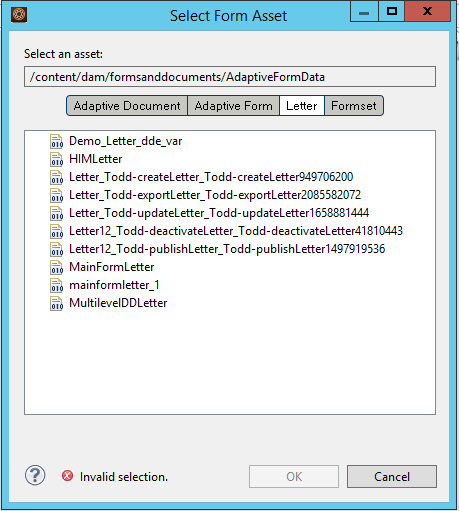
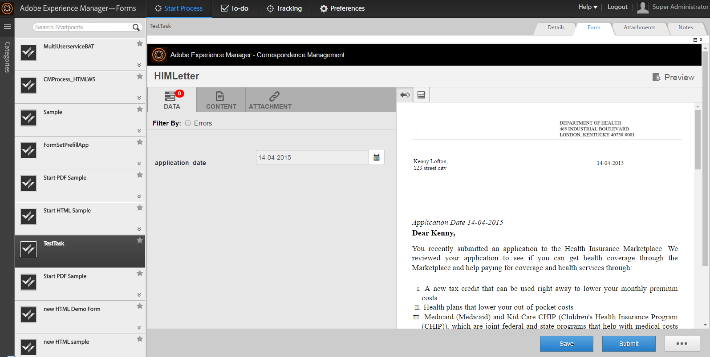

# Integrating third-party applications in AEM Forms workspace{#integrating-third-party-applications-in-aem-forms-workspace}

AEM Forms workspace supports the management of task assignment and completion activities for forms and documents. These forms and documents can be XDP Forms, Flex&reg; forms, or Guides (deprecated) that have been rendered in XDP, PDF, HTML, or Flex formats.

These capabilities are further enhanced. AEM Forms now support collaboration with third-party applications that support functionality similar to the AEM Forms workspace. A common part of this functionality is the workflow of assignment and subsequent approval of a task. AEM Forms provides a single unified experience for AEM Forms enterprise users so that all such task assignments or approvals for the supported applications can be handled through the AEM Forms workspace.

As an example, let us consider Correspondence Management as the sample candidate for integration with AEM Forms workspace. Correspondence Management has the concept of a 'Letter', which can be rendered and allows actions.

## Create Correspondence Management assets {#create-correspondence-management-assets}

Start by creating a sample Correspondence Management template that is rendered in the AEM Forms workspace. For more details, see [Create a letter template](../../forms/using/create-letter.md).

Access the Correspondence Management template at its URL to verify if the Correspondence Management template can be rendered successfully. The URL has a pattern similar to `https://'[server]:[port]'/lc/content/cm/createcorrespondence.html?cmLetterId=encodedLetterId&cmUseTestData=1&cmPreview=0;`

Where `encodedLetterId` is the URL-encoded letter Id. Specify the same letter Id, when defining the render process for workspace task in Workbench.

## Create a task to render and submit a letter in AEM Workspace {#create-a-task-to-render-and-submit-a-letter-in-aem-workspace}

Before executing these steps, ensure that you are a member of the following groups:

* cm-agent-users
* Workspace Users

For more information, see [Add and configure users](/help/forms/using/admin-help/adding-configuring-users.md).

Use the following steps to create a task to render and submit a letter in AEM Workspace:

1. Launch Workbench. Log in to localhost as administrator.
1. Click File > New > Application. In the Application Name field, enter `CMDemoSample` and then click Finish.
1. Select `CMDemoSample/1.0` and right-click `NewProcess`. In the name field, enter `CMRenderer` and then click Finish.
1. Drag the Start Point activity picker and configure it:

    1. In Presentation Data, select Use A CRX Asset.

       

    1. Browse for an asset. In the Select Form Asset dialog, the Letters tab lists all the letters on the server.

       

    1. Select the appropriate letter and click **OK**.

1. Click Manage Action Profiles. The Manage Action Profile dialog appears. Ensure that the Render Process and Submit Process are appropriately selected.
1. To open the letter with a data XML file, browse and select the appropriate data file in the Prepare Data Process.
1. Click OK.
1. Define the variables for Start Point Output and Task Attachments. The defined variables contain Start Point Output and Task Attachments data.
1. (Optional) To add another user in the workflow, drag an activity picker, configure it, and assign it to a user. Write a custom wrapper (sample given below) or download and install the DSC (given below) to extact Letter template, Start Point Output, and task Attachment.

   A sample custom wrapper is as listed below:

   ```javascript
   public LetterInstanceInfo getLetterInstanceInfo(Document dataXML) throws Exception {
   try {
   if(dataXML == null)
   throw new Exception("dataXML is missing");

   CoreService coreService = getRemoteCoreService();
   if (coreService == null)
   throw new Exception("Unable to retrive service. Please verify connection details.");
   Map<String, Object> result = coreService.getLetterInstanceInfo(IOUtils.toString(dataXML.getInputStream(), "UTF-8"));
   LetterInstanceInfo letterInstanceInfo = new LetterInstanceInfo();

   List<Document> attachmentDocs = new ArrayList<Document>();
   List<byte[]> attachments = (List<byte[]>)result.get(CoreService.ATTACHMENT_KEY);
   if (attachments != null){
   for (byte[] attachment : attachments)
   { attachmentDocs.add(new Document(attachment)); }

   }
   letterInstanceInfo.setLetterAttachments(attachmentDocs);

   byte[] updateLayout = (byte[])result.get(CoreService.LAYOUT_TEMPLATE_KEY);
   if (updateLayout != null)
   { letterInstanceInfo.setLetterTemplate(new Document(updateLayout)); }

   else
   { throw new Exception("template bytes missing while getting Letter instance Info."); }

   return letterInstanceInfo;
   } catch (Exception e)
   { throw new Exception(e); }

   }

   ```

   [Get File](assets/dscsample.zip)
   Download DSC: A sample DSC is available in the DSCSample.zip file attached above. Download and unzip the DSCSample.zip file. Before you use the DSC service, you must configure it. See [Configure the DSC Service](../../forms/using/add-action-button-in-create-correspondence-ui.md#p-configure-the-dsc-service-p).

   In the Define Activity dialog, select the appropriate activity such as getLetterInstanceInfo and click **OK**.

1. Deploy the application. If prompted check-in and save the assets.
1. Log in to the AEM forms workspace at https://'[server]:[port]'/lc/content/ws.
1. Open the task that you had added, CMRenderer. The Correspondence Management letter appears.

   

1. Fill in the required data and submit the letter. The window closes. In this process, the task gets assigned to the user specified in the workflow in step 9.

   >[!NOTE]
   >
   >The Submit button is not enabled until all the required variables in the letter are filled in.
