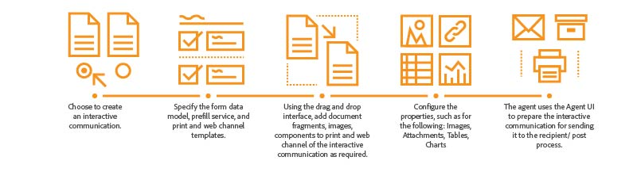

# Interactive Communications Overview {#interactive-communications-overview}

This article includes overview, sample use cases, creation workflow, and differences between Interactive Communication and letter.

Interactive Communications centralizes and manages the creation, assembly, and delivery of secure, personalized, and interactive correspondences such as business correspondence, documents, statements, benefit notices, marketing mails, bills, and welcome kits.

## Key capabilities {#key-capabilities}

Following are the key capabilities of Interactive Communications:

- Out-of-the-box integration with form data model to enable easy and streamlined access to back end databases and other CRM systems, such as MS® Dynamics
- Integrated authoring interface for print and web channels with ability to auto generate web channel from the print channel
- Charts to present information in easily understandable visual formats in print and web
- Document fragments support rule editor and form data model
- Agent user interface displays print and web preview of the Interactive Communication
- Drag-and-drop components to quickly construct print and web channels

## Interactive Communication creation {#interactive-communication-creation}

### Workflow {#workflow}

To create an Interactive Communication, have the [building blocks](#buildingblocks) for Interactive Communication ready and then complete the following steps:

1. Choose to [create an Interactive Communication](/help/forms/using/create-interactive-communication.md).

1. Specify the [form data model](/help/forms/using/data-integration.md), prefill service, and [print and web channel templates](/help/forms/using/web-channel-print-channel.md). You can choose to generate web channel from the print channel.

1. Using the [drag-and-drop interface](/help/forms/using/introduction-interactive-communication-authoring.md), add document fragments, images, components to print and web channel of the Interactive Communication as required.
1. Configure the properties for the components inserted, such as the following:

   1. [Images](/help/forms/using/create-interactive-communication.md#step2)
   1. [Tables](/help/forms/using/create-interactive-communication.md#tables) (Including Layout Fragments)
   1. [Charts](/help/forms/using/chart-component-interactive-communications.md)
   1. [Document fragments](/help/forms/using/create-interactive-communication.md#document-fragment-properties)

1. Preview print and web channels and, if necessary, edit the Interactive Communication.
1. The agent uses the Agent UI to [prepare the Interactive Communication](/help/forms/using/prepare-send-interactive-communication.md) for sending it to the recipient/post process.

### Building blocks {#buildingblocks}

Following are the building blocks required for creating an Interactive Communication:

- [Form data model](/help/forms/using/data-integration.md)
- [Print and web channel templates](/help/forms/using/web-channel-print-channel.md)
- [Document fragments](/help/forms/using/document-fragments.md)
- Images
- [Themes](/help/forms/using/themes.md) for the Web channel

## Interactive Communications Vs Correspondence Management {#interactive-communications-vs-correspondence-management}

Interactive Communication is the default and recommended approach to create customer communications. To continue using the letters creating in AEM 6.3 Forms and AEM 6.2 Forms, you need to [install a compatibility package](/help/forms/using/compatibility-package.md). Following is a comparison between capabilities of Interactive Communication and letter.

<table>
 <tbody>
  <tr>
   <td><strong>Capability</strong></td>
   <td><strong>Interactive Communication</strong></td>
   <td><strong>Letter</strong></td>
  </tr>
  <tr>
   <td>Output</td>
   <td>Print and Web</td>
   <td>Print</td>
  </tr>
  <tr>
   <td>Schema</td>
   <td>Form data model </td>
   <td>Data dictionary </td>
  </tr>
  <tr>
   <td>Localization</td>
   <td>Not supported in form data model</td>
   <td>Supported in data dictionary</td>
  </tr>
  <tr>
   <td>Rule editor</td>
   <td>
    <ul>
     <li>Text and condition support rule editor for creating inline conditions</li>
     <li>Interactive Communication editor supports application of rules on components of the web channel</li>
    </ul> </td>
   <td>No UI for creation of conditional expression</td>
  </tr>
  <tr>
   <td>Authoring</td>
   <td>Drag-and-drop interface for constructing print and web channel</td>
   <td>No drag-and-drop mechanism </td>
  </tr>
  <tr>
   <td>Charts</td>
   <td>Charts supported in print and web channel</td>
   <td>Not supported</td>
  </tr>
  <tr>
   <td>Themes</td>
   <td>Uses themes to style web channel</td>
   <td>Does not support themes</td>
  </tr>
   <tr>
   <td>Drafts</td>
   <td>Supported</td>
   <td>Supported</td>
  </tr>
   <tr>
   <td>Submissions</td>
   <td>Supported</td>
   <td>Supported</td>
  </tr>
  <tr>
  <tr>
   <td>Auditing</td>
   <td>Not Supported</td>
   <td>Supported</td>
  </tr>
   <tr>
   <td>Versioning</td>
   <td>Not Supported</td>
   <td>Supported</td>
  </tr>
   <td>Batch processing</td>
   <td>Supported </td>
   <td>Supported</td>
  </tr>
  <tr>
   <td>Agent signature</td>
   <td>Not supported</td>
   <td>Supported</td>
  </tr>
  <tr>
   <td>Remote functions</td>
   <td>Not supported</td>
   <td>Supported</td>
  </tr>
 </tbody>
</table>
