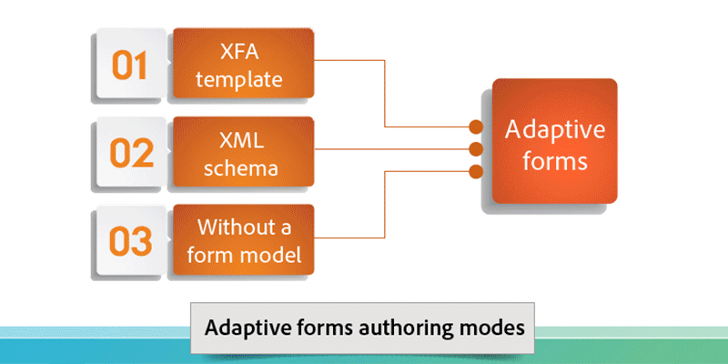

# Introduction to AEM Forms{#introduction-to-aem-forms}

| Version | Article link |
| -------- | ---------------------------- |
| AEM as a Cloud Service |    [Click here](https://experienceleague.adobe.com/docs/experience-manager-cloud-service/content/forms/forms-overview/home.html)                  |
| AEM 6.5     | This article         |

For information about latest features and enhancements in AEM Forms, see [What's new in AEM Forms](../../forms/using/whats-new.md).

## About AEM Forms {#about-aem-forms}

Adobe Experience Manager (AEM) provides an easy-to-use solution to create, manage, publish, and update complex digital forms while integrating with back-end processes, business rules, and data.

AEM Forms combine form authoring, management, and publishing along with correspondence management capabilities, document security, and integrated analytics to create engaging end-to-end experiences. Designed to work across web and mobile channels, AEM Forms can be efficiently integrated into your business processes, reducing paper processes and errors while improving efficiency.

In large enterprises, forms are often created once and reused by copying to a content management system. Keeping a large database of forms up-to-date and making them discoverable can be a considerable challenge. AEM provides a customizable Forms Portal that ensures that customers find and access forms they need across both web and mobile channels.

AEM Forms provides forms management tools that not only lets you manage adaptive form, but XFA forms, PDF forms, and related assets as well. For more information, see [Introduction to managing forms](../../forms/using/introduction-managing-forms.md).

>[!NOTE]
>
>The Adaptive Forms feature, available in [AEM 6.5 QuickStart](https://experienceleague.adobe.com/docs/experience-manager-65/deploying/deploying/deploy.html), is designed for exploration and evaluation purposes only. For production use, it is essential to obtain a valid license for AEM Forms, as Adaptive Forms functionality requires proper licensing.

### Key capabilities {#key-capabilities}

To sum up, AEM Forms provide powerful form management features, like the following, that reduce manual processes and increase customer satisfaction.

* A centralized Forms Portal for designing and deploying dynamic forms, including PDF, HTML5, and adaptive forms
* An easy-to-use graphical user interface to let business users easily import, manage, preview, and publish forms
* A responsive forms directory with powerful search features using keywords, tags, and metadata
* Dynamic detection of a user's device and location to render the form appropriately across web and mobile channels
* Integration with Adobe Analytics to effectively measure form usage metrics
* Integration with Adobe Document Cloud eSign services or Scribble to electronically sign documents containing confidential information
* Automated form-publishing capabilities and the ability to deliver timely, personalized, and consistent communication through multiple channels

## AEM form types {#aem-form-types}

AEM Forms let you extend new and existing forms to create:

* pixel-perfect, paginated HTML and PDF forms that look almost like paper, or
* adaptive forms that automatically render for a user's device and browser.

**PDF forms**

PDF forms can be filled offline, saved locally, and form data sent when you are next online. You can use 2D barcodes to capture form data, and use digital signatures to validate authenticity for users.

**HTML forms**

HTML5 browser-based forms can be viewed on both mobile devices and desktop browsers. You can electronically sign HTML forms using Scribble or eSign services.

**Adaptive forms**

Adaptive forms can dynamically adapt to user responses by adding or removing fields or sections as required. AEM lets you reuse Adobe XML form templates to create adaptive forms.

### Supported features {#supported-features}

All form types support the following features:

* Dynamic layout
* Form field validation
* Context-sensitive Help
* Scripting and XML data handling
* Accessibility design and checking
* Ability to save forms on the server-side
* Support for file attachments
* Integration with HTML Workspace for Data Capture

## Offline data collection {#offline-data-collection}

Once form data is submitted, Adobe Experience Manager connects the form data with existing systems, business rules, and the required people.

AEM Forms provide Forms Workspace, a mobile application that extends your digital business processes to mobile devices. Using Forms Workspace, you can collect and record data even when offline. Forms Workspace uses the capabilities of your mobile device, and lets you capture photos, videos, and collect data such as timestamps and other information. The next time you connect to a network, you can synchronize the collected data.

Capturing data offline and synchronizing it the next time you return online is especially helpful for people on-field. It improves productivity and reduces errors.

**Advantages of using Forms Workspace for offline data collection**

* Easy-to-use HTML workspace application for task assignment and tracking
* Drag-and-drop workflow design environment
* Enterprise content management connectors (ECM)
* Open standards support, including XML and SOAP to connect forms data with enterprise systems
* Out-of-the-box HTML reports monitor backlogs, work queues, and Key Performance Indicators (KPIs)
* Customizable dashboards for real-time insight into business operations
* API for connecting with third-party reporting tools

## Personalized communication {#personalized-communication}

An important component of an efficient self-service digital experience is to communicate timely, personalized information that users can access from anywhere, and on any device. Personalized and timely communications can improve both conversion rates and user satisfaction.

Using AEM Forms, business users can create compelling personalized user experiences by customizing document templates, incorporating information from back-end processes, and including interactive components. An intuitive user interface helps non-technical users develop business rules that decide when to generate a communication based on an inquiry, or initiate a user-generated response.

Personalized documents, like, receipts, welcome kits, and statements can easily be delivered across multiple channels. Organizations can drive traffic to personalized web portals resulting in enrollment or purchase of additional services.

**Key features**

* Correspondence Authoring environment with support for templates, content blocks, business rules, and more
* Document conversion and assembly
* Support for on-demand or batch document delivery through multiple channels, including web, email, and paper
* Audit trails with change history
* Support for digital signatures to validate content integrity and the signer's identity
* Document security add-on for AEM Forms including encryption, usage policies, tracking, and auditing

Streamlined personalized communication workflow

