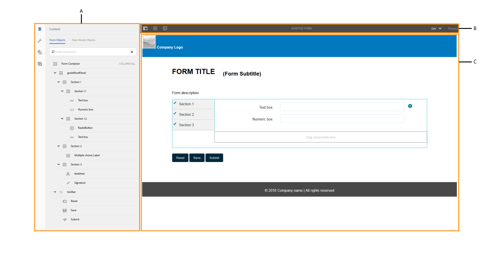

# Introduction to authoring adaptive forms {#introduction-to-authoring-adaptive-forms}

| Version | Article link |
| -------- | ---------------------------- |
| AEM as a Cloud Service |    [Click here](https://experienceleague.adobe.com/docs/experience-manager-cloud-service/content/forms/adaptive-forms-authoring/authoring-adaptive-forms-foundation-components/create-an-adaptive-form-on-forms-cs/introduction-forms-authoring.html)                  |
| AEM 6.5     | This article         |

## Overview {#overview}

Adaptive forms let you create forms that are engaging, responsive, dynamic, and adaptive. AEM Forms provides an intuitive user interface and out-of-the-box components for creating and working with adaptive forms. You can choose to create an adaptive form based on a form model or schema or without a form model. It is important to carefully choose the form model that not only suits your requirements but extends your existing infrastructural investments and assets. You get to choose from the following options to create an adaptive form:

* **Using a form data model**
  [Data integration](../../forms/using/data-integration.md) lets you integrate entities and services from disparate data sources in to a form data model that you can use to create adaptive forms. Choose form data model if the adaptive form you are creating involves fetching and write data from and to multiple data source.

* **Using an XDP Form Template**
  It is an ideal form model if you have investments in XFA-based or XDP forms. It provides a direct way to convert your XFA-based forms into adaptive forms. Any existing XFA rules are retained in the associated adaptive forms. The resulting adaptive forms support XFA constructs, such as validations, events, properties, and patterns.

* **Using an XML Schema Definition (XSD) or a JSON Schema**
  XML and JSON schemas represent the structure in which data is produced or consumed by the back-end system in your organization. You can associate the schema to an adaptive form and use its elements to add dynamic content to the adaptive form. The elements of the schema will be available for use in the Data Model Objects tab of the Content browser when authoring adaptive forms.

* **Using none or without a form model**
  Adaptive forms created with this option do not use any form model. The data XML generated from such forms has flat structure with fields and corresponding values.

For more information about creating an adaptive form, see [Creating an adaptive form](../../forms/using/creating-adaptive-form.md).

## Adaptive form authoring UI {#adaptive-form-authoring-ui}

The touch-optimized UI for authoring adaptive forms is intuitive, and provides:

* Drag-and-drop functionality
* Standard form components
* Integrated repository for assets

When you create or edit an existing adaptive form, you use the following UI elements:

* [Sidebar](#sidebar)
* [Page toolbar](#page-toolbar)
* [Component toolbar](#component-toolbar)
* [Adaptive form page](#af-page)

**A.** Sidebar **B.** Page toolbar **C.** Adaptive form page

### Sidebar {#sidebar}

The Sidebar lets you

* See form content such as panels, components, fields, and layout.
* Edit component properties.
* Search, view, and use assets in your AEM Digital Asset Management (DAM) repository.
* Add components on your form.

**A.** Content browser **B.** Properties browser **C.** Assets browser **D.** Components browser

<!--Click to enlarge

](assets/sidebar-comps-1.png) -->

The sidebar comprises the following browsers:

* **Content browser**
  In the content browser, you can see

    * **Form Objects**
      Shows object hierarchy of the Form. Author can navigate to specific form component by tapping that element in Form Object Tree. Author can search objects and rearrange them from this tree.

    * **Data Model Objects**
      Lets you see the form model hierarchy.
      It lets you drag and drop form-model elements on the adaptive form. The added elements automatically get converted into form components while retaining their original properties. You can see data model objects when your form uses XML schema, JSON schema, or XDP template.

* **Properties browser**

  Lets you edit the properties of a component. Properties change according to a component. To see properties of the adaptive form container:

  Select a component, then select  &gt; **[!UICONTROL Adaptive Form Container]**, and then select .

* **Assets browser**

  Segregates different types content such as images, documents, pages, movies, and so on.

* **Components browser**

  Includes components that you can use to build an adaptive form. You can drag components from onto the adaptive form to add form elements, and configure added element as per the requirements. The following table describes the components listed in components browser.

<table>
 <tbody>
  <tr>
   <th><strong>Component</strong></th>
   <th><strong>Functionality</strong></th>
  </tr>
  <tr>
   <td>Adobe Sign Block</td>
   <td>Adds a block of text with placeholders for fields to be filled while signing using Adobe Sign.</td>
  </tr>
  <tr>
   <td>Button</td>
   <td>Adds a button, which you can configure to perform actions, such as save, reset, go next, go previous, and so on.</td>
  </tr>
  <tr>
   <td>Captcha</td>
   <td>Adds CAPTCHA validation using Google reCAPTCHA service. For details, see <a href="../../forms/using/captcha-adaptive-forms.md" target="_blank">Using CAPTCHA in adaptive forms</a>.</td>
  </tr>
  <tr>
   <td>Chart</td>
   <td>Adds a chart that you can use in adaptive forms and documents for visual representation of two-dimensional data in repeatable panels and table rows.</td>
  </tr>
  <tr>
   <td>Check box</td>
   <td>Adds a check box.</td>
  </tr>
  <tr>
   <td>Date Input Field</td>
   <td>Use Date Input Field component in your form, to let customers fill day, month, and year separately in three boxes. You can customize the look and feel of the component, and change the date format. For example, you can let your customers input dates in MM/DD/YYYY or DD/MM/YYYY format.</td>
  </tr>
  <tr>
   <td>Date picker</td>
   <td>Adds a calendar field to pick a date.</td>
  </tr>
  <tr>
   <td>Document Fragment</td>
   <td>Lets you add reusable components of a correspondence.</td>
  </tr>
  <tr>
   <td>Document Fragment Group</td>
   <td>Lets you add group of related document fragments that you can use in a letter template as a single unit.</td>
  </tr>
  <tr>
   <td>Drop-down list</td>
   <td>Adds a drop-down list - single or multi-select</td>
  </tr>
  <tr>
   <td>Email</td>
   <td>
Adds a field to capture email address. The Email component, by default, validates email addresses using the following regular expression.
 
<code>^[a-zA-Z0-9.!#$%&amp;'*+/=?^_`{|}~-]+@[a-zA-Z0-9-]+(?:.[a-zA-Z0-9-]+)*$</code>
 </td>
  </tr>
  <tr>
   <td>File attachment</td>
   <td>
Adds a button that allows users to browse and attach supporting documents to a form. You can attach multiple files to a File attachment component. You can also specify the **[!UICONTROL Maximum File Size]** and **[!UICONTROL Supported File Types]** for the attachments in the properties browser of the component. 
 
<strong> Note: </strong><ul> <li> The component does not support attaching files with filename starting with characters (.),  containing characters  \ / : * ? " < > | ; % $, or containing special filenames reserved for Windows operating system like nul, prn, con, lpt, or com. </li> <li> To attach multiple files to a file attachment component opened in Apple Safari browser, select and attach files one by one. You cannot select and attach multiple files at once.</li> <li>The File Attachment component supports a pre-defined set of file formats in adaptive forms enabled for Adobe Sign. For more information, see <a href="https://helpx.adobe.com/document-cloud/help/supported-file-formats-fill-sign.html#main-pars_text">Supported file formats</a>. </li></ul>
 </td>
  </tr>
  <tr>
   <td>File attachment listing</td>
   <td>Adds a field that lists all the attachments uploaded using the File Attachment component.</td>
  </tr>
  <tr>
   <td>Header  </td>
   <td>Adds the page header that typically includes logo of a corporation, title of the form, and summary.  </td>
  </tr>
  <tr>
   <td>Footer</td>
   <td>Adds the page footer that typically includes copyright information, and links to other pages. </td>
  </tr>
  <tr>
   <td>Image</td>
   <td>Lets you insert an image.</td>
  </tr>
  <tr>
   <td>Image Choice</td>
   <td>Lets your customers select an image to provide information. You can use the information to provide personalized services to your customers.</td>
  </tr>
  <tr>
   <td>Next Button</td>
   <td>Adds a button to navigate to the next panel in a form.</td>
  </tr>
  <tr>
   <td>Numeric box</td>
   <td>Adds a field for capturing numeric values</td>
  </tr>
  <tr>
   <td>Numeric Stepper</td>
   <td>Use Numeric Stepper in your form to let your customers input a numeric value, which they can increase or decrease based on a predefined step.</td>
  </tr>
  <tr>
   <td>Panel</td>
   <td>
Adds a panel or subpanel.
 
You can also add a panel component from the parent panel toolbar using the Add Child Panel</code> button. Similarly, you can add a panel-specific toolbar using the Add Panel Toolbar</code> button. You can configure the position of the panel toolbar using the Edit Panel dialog.
 </td>
  </tr>
  <tr>
   <td>Password box</td>
   <td>Adds a field for capturing a password.</td>
  </tr>
  <tr>
   <td>Previous button</td>
   <td>Adds a button that users require to go back to the previous page or panel.</td>
  </tr>
  <tr>
   <td>Radio button</td>
   <td>Adds radio buttons.</td>
  </tr>
  <tr>
   <td>Reset button</td>
   <td>Adds a button to reset form fields.</td>
  </tr>
  <tr>
   <td>Save Button</td>
   <td>Adds a button to save form data.</td>
  </tr>
  <tr>
   <td>Scribble signature</td>
   <td>Adds a field for capturing scribble signatures.</td>
  </tr>
  <tr>
   <td>Separator</td>
   <td>Enables visual segregation of panels in your form.</td>
  </tr>
  <tr>
   <td>Signature Step</td>
   <td>Displays the information provided in the form and the signature fields for the user to verify and sign the form.</td>
  </tr>
  <tr>
   <td>Text</td>
   <td>Lets you specify static text.</td>
  </tr>
  <tr>
   <td>Submit Button</td>
   <td>Adds a submit button to submit the form to the configured submit action.</td>
  </tr>
  <tr>
   <td>Summary Step</td>
   <td>Submits the form and displays summary text that authors specifies after the form is submitted. </td>
  </tr>
  <tr>
   <td>Switch</td>
   <td>Adds a switch that performs a toggle or enable/disable action. You cannot add more than two options in the Switch component. Since a switch can have only two values: On or Off, mandatory is not applicable. At-least one value is saved irrespective of the user input.   </td>
  </tr>
  <tr>
   <td>Table</td>
   <td>Adds a table that lets you organize data in rows and columns. </td>
  </tr>
  <tr>
   <td>Telephone</td>
   <td>
Adds a field to capture telephone number. The Telephone component allows authors to configure one of following phone number types. Each type is associated with a default regular expression for validation.

    <ul>
     <li>Type International is validated by <code>^[+][0-9]{0,14}$</code>.</li>
     <li>Type USPhoneNumber is validated by <code>{'+1 ('999') '999-9999}</code>.</li>
     <li>Type UKPhoneNumber is validated by <code>text{'+'99 999 999 9999}</code>.</li>
     <li>Type Custom does not provide a default validation pattern. It takes the value of the last selected phone number type. You can also specify your own custom validation pattern.</li>
    </ul> </td>
  </tr>
  <tr>
   <td>Terms and Conditions  </td>
   <td>Adds a field that authors can use to specify the terms and conditions for users to review before filling the form.</td>
  </tr>
  <tr>
   <td>Text box </td>
   <td>
Adds a text box in which a user can specify the required information. 
 
By default, the Text Box component accepts only plain text. You can enable a Text Box component to accept Rich Text. A Rich Text enabled text component provide options to add headers, change character styles (bold, italicize, underline the characters), create ordered and unordered lists, change text background and text color, and add hyperlinks. To enable rich text for a text box, enable the<strong> Allow Rich Text</strong> option in the component properties.
 </td>
  </tr>
  <tr>
   <td>Title</td>
   <td>Specifies a title for the adaptive form.</td>
  </tr>
  <tr>
   <td>Verify Step</td>
   <td>
Adds a placeholder to display the filled form for verification by user.
 
<strong>Note</strong>: Adaptive form containing the Verify component does not support anonymous users. Also, it is not recommended to use the Verify component in an adaptive form fragment.
 </td>
  </tr>
 </tbody>
</table>

#### Best practices for working with components {#best-practices}

Some best practices and key points to remember when working with adaptive form components are as follows:

* Each component has associated properties that control its appearance and functionality. To configure the properties of a component, select the component and select  to open the component properties in the Properties browser.
* A component is identified with its element name. When you select , you can change the name of the component by changing the **[!UICONTROL Element Name]** field value in the properties browser. The Element Name field accepts letters, numbers, hyphens (-), and underscores (_) only. Other special characters are not allowed, and element name should begin with a letter.

* You can modify the Title property of an adaptive form component inline in the form editor without opening the Properties browser as long as the title is visible on the form. To do so:

    1. Select to select a component that has a **[!UICONTROL Title]** property and whose **[!UICONTROL Hide title]** property is disabled.

    1. Select  to make the title editable.

    1. Modify the title and select the Return key or select anywhere outside the component to save the changes. Select the Esc key to discard the changes.

* Some adaptive form components like Email and Telephone include out-of-the-box validation patterns. However, you can specify custom validation by updating the **[!UICONTROL Validation Pattern]** field under the Patterns accordion in the component properties. See component descriptions in the table above for more information about default validations.

* Adaptive forms fields, such as Numeric Box and Email can be configured to include specialized HTML5 input types. When these fields are in focus on mobile devices and tablets, the keypad displays specific alphabet, numbers, and characters upfront that are commonly used to input information in the fields. It helps users enter information quickly without having to toggle between characters sets on the keypad. To allow specialized input for a component, enable the **[!UICONTROL Use HTML Type Number]** check box in its component properties.

* You can enable a Text Box component to accept Rich Text. To enable rich text for a text box, enable the **[!UICONTROL Allow Rich Text]** check box in the component properties.

* You can enable Text Box, Email, and Telephone components to autofill values for fields like name, address, credit card, telephone, and email from the information stored in browser's autofill settings. To enable this feature, select **[!UICONTROL Enable Autofill]** in the component properties and select an **[!UICONTROL Autofill Attribute]**. When a user fills an adaptive form, the values are suggested from the autofill profile in the browser or based on the values earlier filled by the user. Note that autofill works if autofill settings in user's browser are turned on.

* Specify values for Radio Button and Check Box items in `{value}={text}` format in component properties.
* The File attachment component, by default, allows a user to attach only one file. However, you can configure the component properties to support multiple attachments. In addition, if a user attaches multiple files with the same filename, the attachments can cause some issues. Therefore, it is recommended to associate a unique identifier for each submitted attachment at form submission. To do so:

    1. On your AEM Forms server, navigate to **[!UICONTROL Adobe Experience Manager]** &gt; **[!UICONTROL Tools]** &gt; **[!UICONTROL Operations]** &gt; **[!UICONTROL Web Console]**.
    1. Find and select **[!UICONTROL Adaptive Forms Configuration Service]**.
    1. In the Adaptive Forms Configuration Service dialog, enable **[!UICONTROL Make File Names Unique]**. By default, it is disabled.

* To enable users to attach a PDF using Safari browser, ensure that **application/pdf** is added to the Supported File Types property of the File attachment component. Adaptive forms created with previous AEM Forms version may contain **.pdf** instead of **application/pdf** in the Supported File Types property.

For more best practices around adaptive forms, see [Best practices for working with adaptive forms](/help/forms/using/adaptive-forms-best-practices.md).

>[!NOTE]
>
>Adaptive form components do not support right to left (RTL) languages. For example, Hebrew.

### Page toolbar {#page-toolbar}

The page toolbar on the top provides options that let you preview the form, change form properties, and edit form layout. You can preview the form when you author it, and make changes accordingly. In the page toolbar, you see:

* **Toggle Side Panel** : Lets you show or hide Sidebar.

* **Page information** : Lets you view page properties, publish/unpublish a form, start a form workflow, and open the form in classic UI.

* **Emulator** : Lets you emulate the look of your form for different display sizes such as tablets and phones.

* **Edit**: Lets you select other modes such as: **[!UICONTROL Edit]**, **[!UICONTROL Style]**, **[!UICONTROL Developer]**, and **[!UICONTROL Design]**.

    * **Edit**: Lets you edit the properties of the form and its components. For example, adding a component, dropping an image, and specifying mandatory fields.
    * **Style**: Lets you style the appearance of components of your form. For example, in style mode, you can select a panel and specify its background color.

    * **Developer**: Lets a developer to:

        * Discover what forms are composed of.
        * Debug what is happening where and when, which in turn helps to resolve issues.

    * **Design**. Lets you enable or disable custom components, or out-of-the-box components that are not listed in the Sidebar.

* **Preview**: Lets you preview how the form looks when you publish it.

### Component toolbar {#component-toolbar}

When you select a component, you see a toolbar that lets you work it. You get options to cut, paste, move, and specify properties of the components. Your options are:

A.**Configure**: When you select **[!UICONTROL Configure]**, component properties are visible in the sidebar. Configuring these properties let you customize the data capturing experience. You can change the element name of the component, specify the label text in the Title field of the component. Element name lets you capture values users enter using the component. In the component properties, you specify the behavior of the component, and manage user input. Configure properties in the sidebar to capture user data and use it for further processing. Properties for adaptive form container let you specify Client libraries, Layouts, Themes, Document of Record settings, save settings, submission settings, and metadata settings.

B.**Copy**: You can use the copy option to copy a component and paste it in other places in the form. When you paste a component, the pasted component gets a new element name but retains the properties of the copied component.

C.**Cut**: You can use the cut option to move a component from one place to another in the adaptive form.

D. **Delete**: Lets you delete the component from the form.

E. **Insert**: Lets you insert a component above the selected component.

F. **Paste**: Lets you paste the component you cut or copied using the options described above.

G. **Edit rules**: Lets you open the rule editor. For more information, see [Rule Editor](../../forms/using/rule-editor.md).

H. **Group**: Lets you select multiple components if you want to cut, copy, or paste more than one component together.

I. **Parent**: Lets you select the parent of a component. For example, a text field lies within a sub-section, which resides in a section. The section resides in the guide root panel, and the adaptive form container is the parent of a guide root panel. For a component, you can see all the options with the hierarchy sorted bottoms-up.

For example, if you select **[!UICONTROL Parent]** for a text box, you can see:

* Sub-section
* Section
* guideRootPanel
* Adaptive Form container

J. **Others**: Provides more options to work with the selected component.

* View SOM expression
* Save a panel as fragment (for panels only)
* Add child panel (for panels only)
* Add panel toolbar (for panels only)
* Replace (not for panels)

### Adaptive form page {#af-page}

The adaptive form page is the actual form. It is like any other WCM page modeled as the WCM `cq:Page` component. The following image shows the content structure of a typical adaptive form.

The content structure typically contains the following primary components:

* **guideContainer**: The root of an adaptive form, which is marked as **[!UICONTROL Start of adaptive form]** in the adaptive form UI. In this component, you can specify:

    * *Mobile Layout of the adaptive form*: Defines the appearance of the form on mobile devices.
    * *Thank You page*: Defines the page where the user is redirected after submitting the form.
    * *Submit Action*: Defines how the form is processed on the server once the user submits the form.
    * *Styling*: Specifies the path to the CSS file used to customize the appearance of the form.

* **rootPanel:** The root panel of an adaptive form. It can contain subpanels under the items node. Each panel including the root panel can have a layout associated with it. The layout of the panel dictates how the form is laid out. For example, in the Accordion layout, its items are laid out as Accordion steps.

* **toolbar:** An adaptive form container has an associated global toolbar, which is global to the form. This toolbar can be added using the **[!UICONTROL Add Toolbar]** action in the edit bar, which allows authors to add actions, such as Submit, Save, Reset, and so on.

* **assets:** This node contains additional information used for form authoring. For example, form model details, localization details, and so on).
