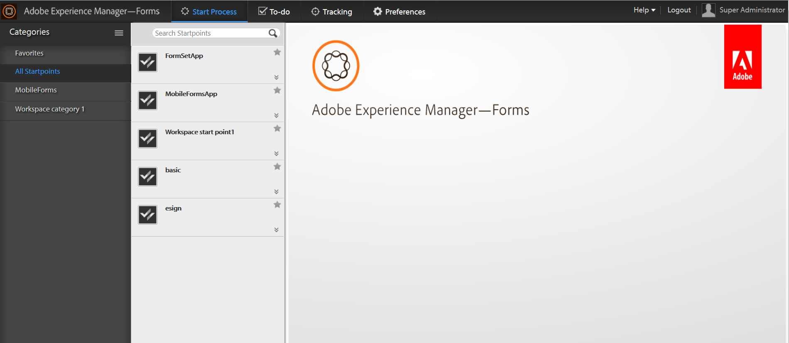

# Introduction to AEM Forms workspace {#introduction-to-aem-forms-workspace}

Forms workflow increases organizational efficiency by automating and providing visibility into critical document and form-related business processes. Using Process Management module you can build streamlined, end-to-end workflows — including people, systems, content, and business rules — that are accessible online or offline.Forms workflow includes the AEM Forms workspace. AEM Forms workspace adds new capabilities to extend and integrate workspace and make it more user-friendly.

AEM Forms workspace is compatible with more devices and form factors. It allows for task management on clients without Flash® Player and Adobe® Reader®. It facilitates rendition of HTML Forms in addition to PDF forms.

**Key capabilities**:

* Engage process participants everywhere with dynamic PDF forms, mobile interfaces, and web applications.
* Easily integrate the workspace components with your web applications. As AEM Forms workspace is a component-based software, it can be easily customized and reused. 
* Extend business processes to both online and offline mobile workers with the AEM Forms workspace app.
* View reports to monitor backlogs, work queues, and key performance indicators (KPIs). You can use APIs to extract data for further analysis using third-party reporting tools.

**[Contact Support](https://www.adobe.com/account/sign-in.supportportal.html)**
