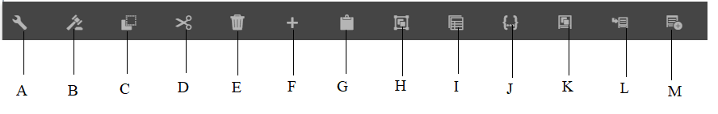

# Introduction to Interactive Communication authoring UI{#introduction-to-interactive-communication-authoring-ui}

The user interface for authoring [Interactive Communication](/help/forms/using/interactive-communications-overview.md) is intuitive and provides the following for authoring print and web channel of the Interactive Communication:

* WYSIWYG drag-and-drop document editor
* Integrated repository for assets - the assets uploaded to and created on the server are available in the Asset browser of Interactive Communication authoring interface

When you [create or edit an existing Interactive Communication](../../forms/using/create-interactive-communication.md), you use the following user interface elements:

* [Sidebar](#sidebar)
* [Page toolbar](#page-toolbar)
* [Component toolbar](#component-toolbar)
* Content Area

**A.** Sidebar **B.** Page toolbar **C.** Content area

## Sidebar {#sidebar}

**A.** Channel browser **B.** Content browser **C.** Properties browser **D.** Asset browser **E.** Components browser **F.** Data Sources browser - Data Model **G.** Data Sources browser - Master Content

<!-- Click to enlarge

-->

The sidebar includes the following:

* **Channel browser**

The Channel browser helps you switch between the print and web channels of the Interactive Communication. Based on the channel you have selected in the channel browser, the browsers, such as Content and Components display the options.

* **Content browser**
  In the content browser, you can see object hierarchy of the document for the selected channel. Author can navigate to specific component by tapping that element in Document Object Tree. Author can search objects in the web channel and rearrange them from this tree.

* **Properties browser**

  Lets you edit the properties of a component. Properties change according to the component. For example, to see properties of the document container:
  Select a component, then select  &gt; **Document Container**, and then select .

* **Assets browser**
  Segregates different types of content such as layout fragments, images, documents, pages, videos. Author can drag-and-drop assets into the Interactive Communication.

* **Components browser**
  Includes components that you can use to build the print and web channels of a document. You can drag components to the Interactive Communication to add elements, and configure added element as per the requirements. The following table describes the components listed in Components browser for print and web channels:

| **Component** |**Print Channel** |**Web Channel** |**Functionality** |
|---|---|---|---|
| Chart |✓ |✓ |Adds a chart that you can use in an Interactive Communication for visual representation of two-dimensional data retrieved from a form data model collection item. |
| Document Fragment |✓ |✓ |Lets you add a reusable component, text, list, or condition, to an Interactive Communication. The reusable component you add to an Interactive Communication could be either form data model-based or without a form data model. |
| Image |✓ |✓ |Lets you insert an image. |
| Panel |-  |✓ |The Panel component is a placeholder for grouping other components together and controls how a group of components are laid out in an Interactive Communication. A panel component also lets you make a group of components repeatable for the end user, such as in multiple entries required for filling in educational credentials. It is also a good practice to use a panel each for a tab of an Interactive Communication with multiple tabs. |
| Table  |&#42; |✓ |Adds a table that lets you organize data in rows and columns.  |
| Target Area |&#42;&#42; |✓ |Inserts a target area in a web channel to organize the web-channel-specific components. |
| Text  |- |✓ |Adds text to the web channel of an Interactive Communication. Text can use form data model objects to make the content dynamic. |

&#42; Use Layout Fragments in the Print channel to add tables.

&#42;&#42; In the Print channel, target areas are predefined in the XDP/print template. You cannot add new target areas using the Interactive Communication authoring UI.

* **Data Sources Browser**
  Data Sources Browser displays the available data sources in the form data model you selected while creating the Interactive Communication.

### Key points for working with components {#key-points-for-working-with-components}

Key points when working with interactive communication components are as follows:

* Each component has associated properties that control its appearance and functionality. To configure the properties of a component, select the component and select  to open the component properties in the Properties browser.
* A component is identified with its element name. When you select , you can change the name of the component by changing the Element Name field value in the properties browser. The Element Name field accepts letters, numbers, hyphens (-), and underscores (_) only. Other special characters are not allowed, and element name should begin with a letter.
* You can modify the Title property of an Interactive Communication component inline in the editor without opening the Properties browser as long as the title is visible on the Interactive Communication. To do so:

    1. Select to select a component that has a Title property and whose Hide title property is disabled.
    1. Select  to make the title editable.

    1. Modify the title and select the Return key or select anywhere outside the component to save the changes. Select the Esc key to discard the changes.

## Component toolbar {#component-toolbar}

When you select a component, you see a toolbar that lets you work with it. You get options to cut, paste, move, and specify properties of the components. Your options are:

A.**Configure**: When you select **Configure**, component properties are visible in the sidebar.

B.**Edit Rules**: When you select Edit Rules, Rule Editor appears in which you can edit and create rules for the selected component. In Rule Editor, you can also select other form objects (components) and edit/create rules for those form objects.

C.**Copy**: You can use the copy option to copy a component and paste it in other places in the Interactive Communication.

D.**Cut**: You can use the cut option to move a component from one place to another in the Interactive Communication.

E. **Delete**: Lets you delete the component from the Interactive Communication.

F. **Insert Component**: Lets you insert a component above the selected component.

G. **Paste**: Lets you paste the component you cut or copied using the options described above.

H. **Group**: Lets you select multiple components if you want to cut, copy, or paste more than one component together.

I. **Parent**: Lets you select the parent of a component.

J. **View SOM Expression:** Lets you view the [SOM expression](../../forms/using/using-som-expressions-adaptive-forms.md) for the component.

K: **Group objects in Panel:** Lets you group the components in a panel to be able to perform operations on those components simultaneously. For details, see [Group objects in Panel](create-interactive-communication.md#groupobjectspanel).

L. **Add Child Panel** (for panels only): Lets you add a child panel to the panel.

M: **Add Panel Toolbar** (for panels only):Lets you add the Toolbar for Panel component. You can then perform further actions on the toolbar.

In addition, the **Replace** option on the toolbar lets you replace the existing component with an alternate component. The option is not available for the Panel component.

## Page toolbar {#page-toolbar}

The Page toolbar on the top provides options that let you preview the Interactive Communication and change its properties. You can preview the Interactive Communication when you author it, and make changes accordingly. In the page toolbar, you see:

* Toggle Side Panel : Lets you show or hide Sidebar.
* Page information : Lets you view page properties.
* Emulator : Lets you emulate the look of your Interactive Communication for different display sizes such as tablets and phones.
* Edit: Lets you select other modes such as: Edit, Style, Developer, and Design.

    * Edit: Lets you edit the properties of the Interactive Communication and its components. For example, adding a component, dropping an image, and specifying mandatory fields.
    * Style: Lets you style the appearance of components of your Interactive Communication. For example, in style mode, you can select a panel and specify its background color.
    * Developer: Lets a developer to:

        * Discover what Interactive Communication is composed of.
        * Debug what is happening where and when, which in turn helps to resolve issues.

    * Target: Lets you enable or disable custom components, or out-of-the-box components that are not listed in the Sidebar.

* Preview: Lets you preview how the Interactive Communication looks when you publish it.
