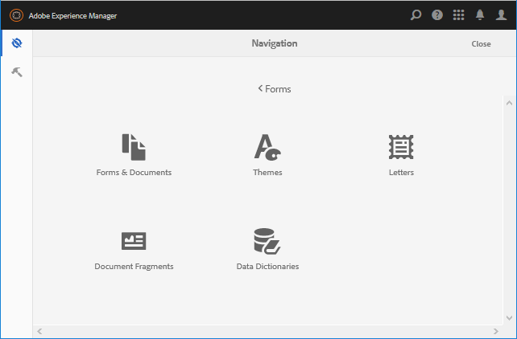
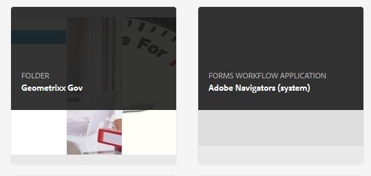
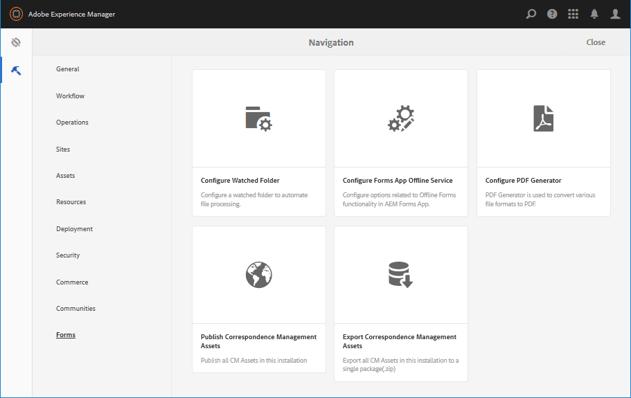
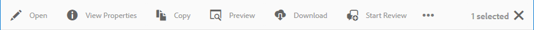

# Introduction to managing forms {#introduction-to-managing-forms}

AEM Forms provides simplified yet powerful user interface to create and manage forms, documents, themes, letters, document fragments, data dictionaries, and related assets. It helps manage the complete lifecycle of forms, documents, and related assets - from a developer's desktop to offering  
it on a portal server for end users. You can use the AEM Forms user interface to:

* Access AEM Forms components  
* Access AEM Forms configurations

>[!NOTE]
>
>For detailed information about other AEM tools and options, see [Working with the Author Environment](/help/sites-authoring/home.md).

## Access AEM Forms components {#access-aem-forms-components}

Along with options to create forms, documents, and related assets, AEM provides options to create sites, assets, manage an AEM instance, and more. You can click the  Experience Manager logo to navigate to all the available tools. Along with links to the consoles of other components, it also contains links for AEM Forms . To navigate to AEM Forms, click the **Experience Manager logo**  &gt; **navigation**  &gt; **Forms**. Links of the following consoles are displayed:

* Forms & Documents  
* Themes  
* Letters
* Document Fragments
* Data Dictionaries

 

### Forms & Documents  {#forms-documents}

Forms & Documents provides options to create an Interactive Communication, adaptive form, adaptive form fragment, and form set. Only for AEM Forms on JEE, Forms & Documents provides an option to import files from local storage and sync AEM Forms assets with Workbench.

The create button is the starting point of the process of creating or uploading AEM Forms asset. It provides you options to create:

* **Interactive Communication**: An Interactive Communication is a personalized, interactive, and device friendly HTML-based digital correspondence, statement, or document. Interactive Communications are responsive in nature and change layout and design automatically based on user device and settings. For detailed information, see [Interactive Communications Overview](/help/forms/using/interactive-communications-overview.md).

* **Adaptive form:** An adaptive form is an engaging and responsive form. You can author an adaptive form to dynamically adapt to user inputs by adding or removing form sections based on user response, device, or work environment. The [Introduction to authoring adaptive forms](/help/forms/using/introduction-forms-authoring.md) article provides detailed information about the adaptive forms.

* **Adaptive form fragment:** While every form is designed for a specific purpose, there are some common segments in most forms, such as to provide personal details like name and address, family details, income details, and so on. You can create an individual asset for such sections. These reusable, stand-alone segments are called adaptive form fragments. For detailed information, see [adaptive form fragments](/help/forms/using/adaptive-form-fragments.md) article.

* **Form set:** A form set is a collection of HTML5 forms grouped together and presented as a single set of forms to end users. When end users start filling a form set, the forms are seamlessly transitioned from one form to another. At the end, a user can submit all forms, as a single entity, in just one click. For detailed information, see [Form set in AEM Forms](/help/forms/using/formset-in-aem-forms.md).

* **Folder:** AEM Forms user interface uses folders to arrange assets. It supports two types of folders:

    * **General Folder:** These folders are used for assets created within AEM Forms user interface. These folders do not have a strict folder structure. You can rename, create subfolders, and store adaptive forms, Interactive Communications, adaptive form fragments, Form Templates (XDPs), PDF Forms, Documents, and related assets in these folders.
    * **Forms Workflow folder:** Forms workflow folders are created when Workbench processes (LiveCycle archives) are migrated and synchronized with AEM Forms user interface. It is not allowed to rename, create a subfolder, create an Interactive Communication, an adaptive form fragment, or an Interactive Communication. It is also not allowed to delete a version folder or create and upload an adaptive form, an adaptive form fragment, or an Interactive Communication in parallel to the version folder.

**A.** General folder **B.** Forms Workflow folder

The Forms and Document panel also provides options to:

* **Import files from local storage:** You can import PDF Forms & Documents, Form templates (XFA forms), and other resource (Image and XML schema for XSDs). For step-by-step instructions, see [Importing and exporting assets to AEM Forms](/help/forms/using/import-export-forms-templates.md).

* **Sync AEM Forms assets with Workbench:** You can use the Files from Workbench option to synchronize assets between AEM Forms user interface and Workbench. It ensures all the assets are available in AEM Forms user interface and Workbench's crx-repository assets selection.

### Themes  {#themes}

A theme contains styling details for components and panels. Themes have an independent identity. So, you can reuse a theme on multiple adaptive forms. You can specify styles for a component, or modify CSS properties for various components used across your forms. Styles include properties such as background colors, state colors, transparency, and size. You can save customizations in a theme, and port them on components of your form as a preset. When you add the theme to your form, the specified style reflects on corresponding components of your form. With AEM 6.2 Forms, you can create themes and apply them to your forms.

For information about creating and using themes, see [Themes in AEM Forms](/help/forms/using/themes.md).

### Letters  {#letters}

An AEM forms letter is a secure, personalized, and interactive correspondence. You can use AEM Forms to quickly assemble letters (also known as correspondences) from both pre-approved and custom-authored content in a streamlined process.

For information about creating and using letters, see [Create Letter](/help/forms/using/create-letter.md).

### Document Fragments {#document-fragments}

Document fragments are reusable parts or components of a correspondence using which you can compose letters. The document fragments are of type text, list, condition, and layout fragment. For information about creating and using document fragments, see [creating document fragments](/help/forms/using/document-fragments.md).

### Data Dictionaries {#data-dictionaries}

Typically, business users do not require knowledge of metadata representations such as XSD (XML schema), and Java classes. However, they usually require access to these data structures and attributes to build solutions. AEM Forms uses data dictionary enables business users to use information from back-end data sources without knowing technical details about their underlying data models.

For information about creating and using data dictionaries, see creating [data dictionary article](/help/forms/using/data-dictionary.md)

## Accessing AEM Forms Configurations {#accessing-aem-forms-configurations}

AEM tools panel contains tools for various components. To navigate to AEM Forms-specific tools, click the **Experience Manager logo**  &gt; **tools**  &gt; **Forms**. Tools to perform the following functions are displayed:

* **Configure Watched Folder:** An administrator can configure a network folder, known as a watched folder, so that when a user places a file (such as a PDF file) in the watched folder, a pre-configured operation is started and manipulates the file. <!-- Fix broken link For detailed information, see Create and Configure a watched folder. -->  

* **Configure Forms App Offline Service:** The AEM Forms app offline service caches the paths or URLs of the resources used in a form. Caching paths or URLs of the resources used in a form improves server-side performance. To configure the server-side offline component of AEM Forms app, see [Working in the offline mode](/help/forms/using/work-offline-mode.md).

* **Configure PDF Generator:** An administrator can configure AEM Forms PDF Generator settings, add user accounts, and import or export configuration to the PDF Generator.
* **Publish Correspondence Management Assets:** AEM Forms lets you publish all the Letters, Document Fragments, and Data Dictionaries and related dependencies from an author instance at once. The published assets include all the Correspondence Management assets and related dependencies. For detailed information, see [Publishing and unpublishing forms & documents](/help/forms/using/publishing-unpublishing-forms.md#publishallthecorrespondencemanagementassets).
* **Export Correspondence Management Assets:** You can download all the Correspondence Management assets and related dependencies as a package from an AEM forms instance. For detailed steps, see [Importing and exporting assets to AEM Forms](/help/forms/using/import-export-forms-templates.md#importandexportassetsincorrespondencemanagement)

## Common elements of user interface {#commonelements}

* **Left rail:** You can click the left rail icon  to reveal Timeline and References capabilities of AEM Forms.

    * **Timeline:** You can add and view comment on an asset that is available for review in the timeline. For detailed instructions, see [Creating and managing reviews for assets in forms](/help/forms/using/create-reviews-forms.md).
    * **References:** An AEM Forms asset can be used in multiple AEM Forms assets. For example, a document fragment can be used in multiple letters. References is a list of assets (other forms or resources) that the selected asset is used in and also the list of other assets that the selected asset is using.

* **Breadcrumbs:** A Breadcrumb represents the title of the current console or folder. You can click the Breadcrumb option to navigate between the level of folders that are higher in hierarchy.
* **View Switcher:** You can click the View Switcher icon  or  to quickly switch between list and card view. For more information about common user interface components, see [Working with the Author Environment](/help/sites-authoring/basic-handling.md).  
* **Search:** The search option  provides capability to quickly find and jump to the content and tools you need. Type the name of content or product capability and select from the suggestions, for example, type "Documents" to quickly find and navigate to Forms & Documents or Document Fragments console. For more information about search, see AEM 6.2 [search](/help/sites-authoring/search.md) article  
* **Actions toolbar**: On selecting an asset, the actions toolbar appears above the list of assets. It contains all the management tools for the selected asset. You can hover over a tool icon to view the tool tip describing its functionality

>[!NOTE]
>
>When a user performs a search any console of Forms & Documents, then the rail contains only **Filters & Options**. You can use Filters & Options to perform advanced search.

* **Actions toolbar**: On selecting an asset, the actions toolbar appears above the list of assets. It contains all the management tools for the selected asset. You can hover over a tool icon to view the tool tip describing its functionality

