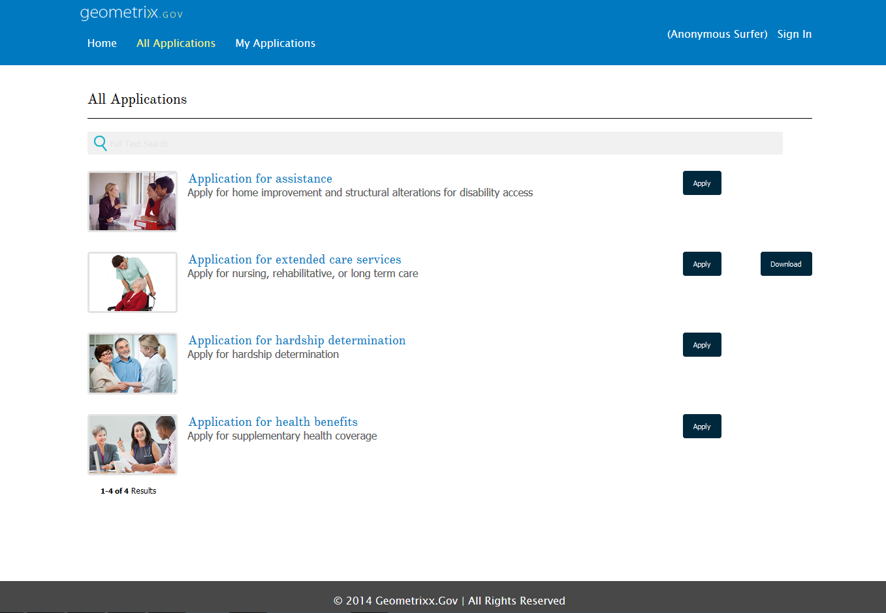

# Introduction to publishing forms on a portal{#introduction-to-publishing-forms-on-a-portal}

| Version | Article link |
| -------- | ---------------------------- |
| AEM as a Cloud Service |    [Click here](https://experienceleague.adobe.com/docs/experience-manager-cloud-service/content/forms/adaptive-forms-authoring/authoring-adaptive-forms-foundation-components/configure-forms-portal.html)                  |
| AEM 6.5     | This article         |

## AEM Forms portal components overview {#aem-forms-portal-components-overview}

In a typical forms-centric portal deployment scenario, forms development and portal development are two disjoint activities. While Form Designers design and store forms in a repository, Web Developers create a web application to list forms and handle submission of forms. Forms are copied over to the web tier as there is no communication between the forms repository and the web application.

Such scenarios often result in management issues and production delays. For example, if there is a newer version of a form available in the repository, you must replace the form on the web tier, modify the web application, and redeploy the form on the public site. Redeploying the web application might cause some server downtime. Typically, the server downtime is a planned activity and therefore the changes cannot be pushed to the public site instantaneously.

AEM Forms provide portal components that reduce management overheads and production delays. The components equip Web Developers to create and customize a Forms Portal on websites authored using Adobe Experience Manager (AEM).

The form portal components let you add the following functionality:

* List forms in customized layouts. Out of the box, List view, Card view, and Panel view layouts are provided. You can create your own custom layouts.
* Lets you display custom metadata and custom actions while listing them.
* List forms published by AEM Forms UI on the publish instance where Forms Portal components are being used.
* Allow end users to render forms in HTML and PDF format.
* Use custom HTML profile to render forms.
* Enable searching of forms based on a various criteria, such as form properties, metadata, and tags.
* Submit form data to a servlet.
* Use custom CSS to customize the look and feel of the portal.
* Create links to forms.
* Lists drafts and submissions related to Adaptive Form created by end user.

## Available AEM Forms Portal components {#available-aem-forms-portal-components}

AEM Forms provide the following portal components out of the box, grouped under **Document Services** and **Document Services Predicates** component groups:

### Search &amp; Lister {#search-amp-lister}

The Search & Lister component lets you list forms from the forms repository onto your portal page and provides configuration options to list forms based on specified criteria. It also lets you specify search criteria to enable your portal users to search across the list of forms.

### Drafts &amp; Submissions {#drafts-amp-submissions}

While Search & Lister component displays forms which are made public by Forms author, the Drafts & Submissions component displays forms that are saved as draft for completing later and submitted forms. This component provides personalized experience to any logged in user.

### Link {#link}

The Link component lets you create a link to a form anywhere on the page. Consider a scenario where you are offering a training program, and you want your users to submit a form to register for the training. On your website, you have posted the program details. Below the details, you want to provide a link to the registration form. The Link component can help you create that link.

## Forms Portal Workflow {#forms-portal-workflow}

Forms Portal lets you list forms from the forms repository onto your portal page. It also lets you specify search criteria to enable your portal users to search across the list of forms. You can also use the Drafts & Submissions component to display forms that are saved as a draft for completing later and submitted forms. You perform a certain set of operations before these functionalities become available on a Sites page. Perform the steps in the listed sequence to make the components and respective functionalities available on a sites page:

1. **Enable Forms Portal components**: Out of the box, Forms Portal components are not available for use. [Enable the components from AEM sidekick](/help/forms/using/enabling-forms-portal-components.md) for an AEM Sites page.
1. **List forms on a page (create Forms Portal page):** You can list forms on both AEM Sites and non-AEM Site pages. The list contains forms available on the publish instance. A user can open forms and start filling those. Whenever a user opens a form, a new instance of the form is created:

    1. **List forms on an AEM Sites page**: Add the **[Search & Lister](../../forms/using/creating-form-portal-page.md)** component to the page and configure the **[List Pane](../../forms/using/creating-form-portal-page.md#p-list-pane-p)** in it, to list forms on a page. Add and configure the **Search Pane** component to the **Search & Lister** component also to add search functionality to the page. The page with Forms Portal component is known as [Forms Portal page](../../forms/using/creating-form-portal-page.md).

    1. **List forms on a non-AEM Sites page:** Use the [Forms Portal search APIs](/help/forms/using/listing-forms-webpage-using-apis.md) to query, retrieve, and list forms on non-AEM Sites pages.

1. **List draft and submitted forms on a Forms Portal page**: Add and configure the Drafts & Submissions component to the Forms Portal page. The component lists all the forms that are in the draft state and the forms that are already submitted.

   To enable a submitted adaptive form to appear in the submissions tab, set the **Submit action** to **[Forms Portal Submit Action](configuring-submit-actions.md).** Alternatively, enable the Forms Portal Submit option. Whenever a user submits the form, the form is added to the submissions tab.

1. **Configure storage for the draft and submitted forms data:** By default, draft and submissions data is stored in the AEM repository. In a production environment, it is recommended not to store draft or submitted form data in AEM repository. [Configure Forms Portal component to save data to a secure location](../../forms/using/draft-submission-component.md#customizing-the-storage).
1. **(Optional) Customizing the Forms Portal components:** [Customize your Forms Portal page templates](../../forms/using/customizing-templates-forms-portal-components.md) to provide a distinctive appearance to the components.
1. **(Optional) Add custom metadata to forms:** [Add custom metadata to forms](../../forms/using/customizing-templates-forms-portal-components.md) to improve listing and search experience.
1. **Publish the Forms Portal page:** Your Forms Portal page is now ready. Publish the page.

## Related articles {#related-articles}

* [Enable Forms Portal components](/help/forms/using/enabling-forms-portal-components.md)
* [Create Forms Portal page](../../forms/using/creating-form-portal-page.md)
* [List forms on a web page using APIs](/help/forms/using/listing-forms-webpage-using-apis.md)
* [Use Drafts and submissions component](../../forms/using/draft-submission-component.md)
* [Customize storage of drafts and submitted forms](../../forms/using/draft-submission-component.md#customizing-the-storage)
* [Sample for integrating drafts & submissions component with database](integrate-draft-submission-database.md)
* [Customizing templates for Forms Portal components](../../forms/using/customizing-templates-forms-portal-components.md)
* [Introduction to publishing forms on a portal](../../forms/using/introduction-publishing-forms.md)
