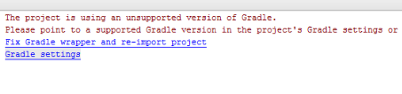
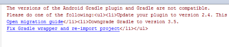

# Troubleshoot AEM Forms app {#troubleshoot-aem-forms-app}

This article describes the error messages that might be displayed while building AEM Forms app and the steps to resolve them.

The sections in this article include:

* [Attachment loss for iOS users](/help/forms/using/issues-aem-forms-app.md#attachment-loss-for-ios-users)
* [HTML5 form drafts submitted by workspace users are not visible on the portal](/help/forms/using/issues-aem-forms-app.md#html-form-drafts-submitted-by-workspace-users-are-not-visible-on-the-portal)
* [HTML5 forms (not cached) fail to load in AEM Forms app](/help/forms/using/issues-aem-forms-app.md#html-forms-not-cached-fail-to-load-in-aem-forms-app)
* [AEM Forms do not sync on Windows](/help/forms/using/issues-aem-forms-app.md#aem-forms-do-not-sync-on-windows)
* [Unsupported version of Gradle](/help/forms/using/issues-aem-forms-app.md#unsupported-version-of-gradle)
* [Gradle and Android Gradle plug-in compatibility issues](/help/forms/using/issues-aem-forms-app.md#gradle-and-android-gradle-plug-in-compatibility-issues)

## Attachment loss for iOS users {#attachment-loss-for-ios-users}

AEM Forms app for iOS configured to sync with AEM Forms on OSGi supports only field-level attachments. All the attachments must have unique names. If multiple attachments have identical name, only one attachment is kept and all other with identical name are lost. Perform the following steps to prevent users on iOS devices from experiencing data loss:

1. On the connected server, navigate to **Adobe Experience Manager &gt; Tools &gt; Operations &gt; Web Console**.
1. Find and click **[!UICONTROL Adaptive Form and Interactive Communication Web Channel Configuration]**.
1. In the [!UICONTROL Adaptive Form and Interactive Communication Web Channel Configuration] dialog, enable **Make File Names Unique**.

   If **Make File Names Unique** setting is disabled, users experience data loss if they try to submit adaptive forms with multiple attachments.

1. Click **Save**.

## HTML5 form drafts submitted by workspace users are not visible on the portal {#html-form-drafts-submitted-by-workspace-users-are-not-visible-on-the-portal}

For HTML5 forms enabled in AEM Forms app with **Save as Draft** HTML Render Profile, the saved drafts are not visible to workspace users. To view saved drafts of HTML5 forms submitted by workspace users on the portal, perform the following steps:

1. Open CRXDE and login with administrator credentials.

   URL: `https://<server>:<port>/lc/crx/de/index.jsp`

1. In the root path of the CRXDE, in the Access Control List under Access Control, click **+**.
1. In the **Add New Entry** dialog, click the group search button in the Principal field.
1. In the Name field of the Select Principal dialog, type `PERM_WORKSPACE_USER` and click **Search**.
1. Select `PERM_WORKSPACE_USER` group in the Select Principal dialog and click **OK**.
1. In the Add New Entry dialog, `PERM_WORKSPACE_USER` group is selected in the Principal field.

   Enable `jcr:read` privileges for the user group.

1. Click **OK**.

## HTML5 forms (not cached) fail to load in AEM Forms app {#html-forms-not-cached-fail-to-load-in-aem-forms-app}

When AEM Forms app is connected to an older version of AEM Forms server, non-cached HTML5 forms fail to load in AEM Forms app.

Perform the following steps to resolve the issue:

1. In author instance, navigate to **Adobe Experience Manager &gt; Tools &gt; Configure Workspace App Offline Service &gt; Configure Now**.
1. In **Workspace App Offline Service** page, click **Manual Resource Cache**.

   URL: https://&lt;server&gt;:&lt;port&gt;/libs/fd/workspace-offline/content/config.html

1. In the **Manual Resource Cache** tab, click the **+** button to add a CRX path.
1. In the **Add a New Resource** field, type: /etc.clientlibs/fd/xfaforms/I18N/en_US.js and click **Add**.
1. Click **Save**.

## AEM Forms do not sync on Windows {#aem-forms-do-not-sync-on-windows}

In the AEM Forms App on Windows, a form does not sync with the connected server if path of the form or any of its resources contains greater than or equal to 256 characters.

Modify the path of the form and its resources to reduce the number of characters to fewer than 256 characters.

## Unsupported version of Gradle {#unsupported-version-of-gradle}

**Error Message:** The project is using an unsupported version of Gradle.

The error message is displayed when you build AEM Forms app in Android Studio. The issue occurs due to unsupported version of Gradle supported on the system.

**Resolution:** Click **Fix Gradle wrapper and re-import project** to resolve the issue.

## Gradle and Android Gradle plug-in compatibility issues {#gradle-and-android-gradle-plug-in-compatibility-issues}

**Error Message:** The versions of the Android Gradle plugin and Gradle are not compatible.

The error message is displayed when you select **Build APK** option from the **Build** menu on the Android Studio user interface.

**Resolution:** Open **Gradle Scripts** &gt; **gradle-wrapper.properties** file and edit the **distributionUrl** property.

For example, the Android Studio console recommends downgrading the Gradle version to 3.5. Edit the version in **distributionUrl **of** gradle-wrapper.properties** file.

Select **Build** &gt; **Build APK** again to resolve the error and generate the .apk file.

