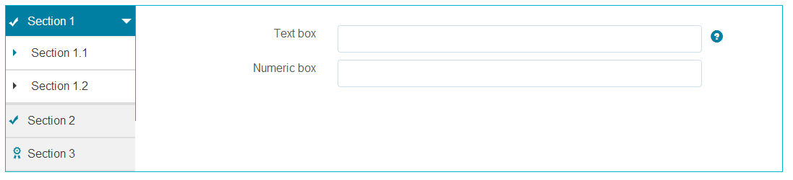
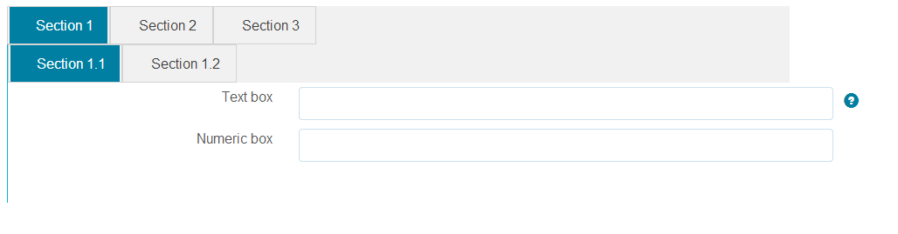
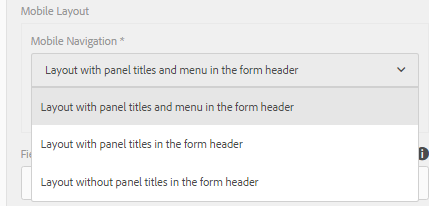
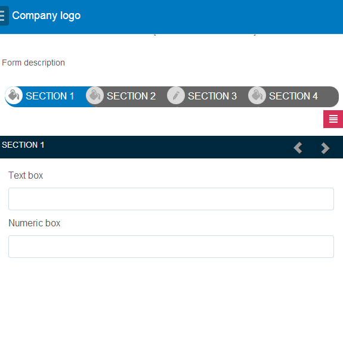
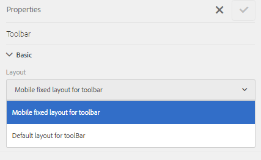

# Layout capabilities of adaptive forms{#layout-capabilities-of-adaptive-forms}

<span class="preview"> Adobe recommends using the modern and extensible data capture [Core Components](https://experienceleague.adobe.com/docs/experience-manager-core-components/using/adaptive-forms/introduction.html) for [creating new Adaptive Forms](/help/forms/using/create-an-adaptive-form-core-components.md) or [adding Adaptive Forms to AEM Sites pages](/help/forms/using/create-or-add-an-adaptive-form-to-aem-sites-page.md). These components represent a significant advancement in Adaptive Forms creation, ensuring impressive user experiences. This article describes older approach to author Adaptive Forms using foundation components. </span>

| Version | Article link |
| -------- | ---------------------------- |
| AEM as a Cloud Service |    [Click here](https://experienceleague.adobe.com/docs/experience-manager-cloud-service/content/forms/adaptive-forms-authoring/authoring-adaptive-forms-foundation-components/configure-layout-of-an-adaptive-form/layout-capabilities-adaptive-forms.html)                  |
| AEM 6.5     | This article         |


Adobe Experience Manager (AEM) lets you create easy-to-use adaptive forms that offer dynamic experiences to end users. The form layout controls how items or components are displayed in an adaptive form.

## Prerequisite knowledge {#prerequisite-knowledge}

Before learning about the different layout capabilities of adaptive forms, read the following articles to know more about adaptive forms.

[Introduction to AEM Forms](../../forms/using/introduction-aem-forms.md)

[Introduction to authoring forms](../../forms/using/introduction-forms-authoring.md)

## Types of layouts {#types-of-layouts}

An adaptive form provides you with the following types of layouts:

**Panel Layout** Controls how items or components inside a panel are displayed on a device.

**Mobile Layout** Controls the navigation of a form on a mobile device. If the device width is 768 pixels or more, the layout is considered a mobile layout and optimized for a mobile device.

**Toolbar Layout** Controls the placement of Action buttons in the toolbar or panel toolbar in a form.

All these panel layouts are defined in the following location:

`/libs/fd/af/layouts`.

>[!NOTE]
>
>To change the layout of an adaptive form, use the Authoring Mode in AEM.


## Panel layout {#panel-layout}

A form author can associate a layout with each panel of an adaptive form, including the root panel.

The Panel layouts are available at `/libs/fd/af/layouts/panel` location.


List of panel layouts in adaptive forms

### Responsive - everything on one page without navigation {#responsive-everything-on-one-page-without-navigation-br}

Use this panel layout to create a responsive layout that adjusts to the screen size of your device without any need for specialized navigation.

Using this layout, you can place multiple **[!UICONTROL Panel adaptive form]** components one after another inside the panel.


A form using responsive layout as seen on a small screen


A form using responsive layout as seen on a large screen

### Wizard - a multi-step form showing one step at a time {#wizard-a-multi-step-form-showing-one-step-at-a-time}

Use this panel layout to provide guided navigation inside a form. For example, use this layout when you want to capture mandatory information in a form while guiding users step by step.

Use the `Panel adaptive form` component to provide step-by-step navigation inside a panel. When you use this layout, a user moves to the next step only after the current step is complete

```javascript
window.guideBridge.validate([], this.panel.navigationContext.currentItem.somExpression)
```


Step completion expression in Wizard layout for a multi-step form


A form using Wizard

### Layout for accordion design {#layout-for-accordion-design}

Using this layout, you can place the `Panel adaptive form` component in a panel with accordion style navigation. Using this layout, you can also create repeatable panels. Repeatable panels enable you to dynamically add or remove panels as needed. You can define the minimum and the maximum number of times a panel repeats. Also, the title of the panel can be determined dynamically, based on the information provided in the panel items.

Summary expression can be used to show the values provided by the end user in the title of the minimized panel.


Repeatable panels created using Accordion layout

### Tabbed layout - tabs appear on the left {#tabbed-layout-tabs-appear-on-the-left}

Using this layout, you can place the `Panel adaptive form` component in a panel with tab navigation. The tabs are placed on the left of the panel content.



Tabs appearing on the left of a panel

### Tabbed layout - tabs appear on the top {#tabbed-layout-tabs-appear-on-the-top}

Using this layout, you can place the `Panel adaptive form` Component in a panel with tab navigation. The tabs are placed on top of the panel content.



Tabs appearing on the top of a panel

## Mobile layouts {#mobile-layouts}

Mobile layouts allow for user-friendly navigation on the mobile devices with relatively smaller screens. Mobile layouts use either tabbed or wizard styles for form navigation. Applying a Mobile Layout provides a single layout for the entire form.

This layout controls navigation using a navigation bar and a navigation menu. The navigation bar shows **&lt;** and **&gt;** icon to indicate **next** and **previous** navigation steps in the form.

The Mobile Layouts are available at `/libs/fd/af/layouts/mobile/` location. The following mobile layouts are available in adaptive forms, by default.



List of Mobile Layouts in adaptive forms

When using a mobile layout, the form menu, to access various form panels, is available by tapping  icon.

### Layout with panel titles in the form header {#layout-with-panel-titles-in-the-form-header}

This layout, as the name suggests, shows panel titles along with the navigation menu and navigation bar. This layout also provides Next and Previous icons for navigation.



Mobile layouts with panel titles in the form headers

### Layout without panel titles in the form header {#layout-without-panel-titles-in-the-form-header}

This layout, as the name suggests, shows only the navigation menu and navigation bar without panel titles. This layout also provides Next and Previous icons for navigation.


Mobile layouts without panel titles in the form headers

## Toolbar layouts {#toolbar-layouts}

A Toolbar Layout controls positioning and display of any action buttons that you add to your adaptive forms. The layout can be added at a form level or at a panel level.



A list of Toolbar Layouts in adaptive forms

Toolbar layouts are available at `/libs/fd/af/layouts/toolbar` location. adaptive forms provide the following Toolbar Layouts, by default.

### Default layout for toolbar {#default-layout-for-toolbar}

This layout is selected as the default layout when you add any action buttons in an adaptive form. Selecting this layout displays the same layout for both, desktop and mobile devices.

Also, you can add multiple toolbars containing action buttons configured with this layout. An action button is associated with a form control. You can configure the toolbars to be before or after a panel.


Default view for toolbar

### Mobile fixed layout for toolbar {#mobile-fixed-layout-for-toolbar}

Select this layout to provide alternate layouts for desktop and mobile devices.

For the desktop layout, you can add Action buttons using some specific labels. Only one toolbar can be configured with this layout. If more than one toolbar are configured with this layout, there is an overlap for mobile devices and only one toolbar is visible. For example, you can have a toolbar at the bottom or the top of the form, or, after or before panels in the form.

For the mobile layout, you can add action buttons using icons.


Mobile fixed layout for toolbar
