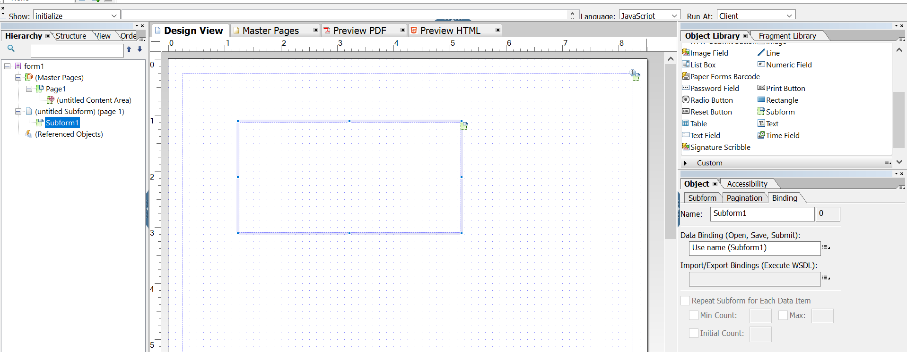
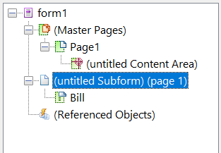

# Layout Design{#layout-design}

XFA form templates or XDPs are the templates for:

* [Letters](/help/forms/using/create-letter.md)
* [Print channel](/help/forms/using/web-channel-print-channel.md#printchannel) of [Interactive Communications](/help/forms/using/interactive-communications-overview.md)

* Layout Fragments

An XDP is designed in Adobe Forms Designer. This article provides details about how to design your XDPs for creating effective correspondences/Interactive Communications such as where to use form fields or target areas and when to use layout fragments.

## Creating a layout for letters or for Interactive Communications' print channel {#creating-a-layout-for-letters-or-for-interactive-communications-print-channel}

A layout defines the graphical layout of a letter/print channel of an Interactive Communication. The layout can contain typical form fields such as "Address" and "Reference Number". It also contains empty subforms that denote target areas. Create the layout in form designer and when completed the Application Specialist uploads it to AEM server. From there, you can select the layout when creating a correspondence template or print channel of an Interactive Communication.

Follow these steps to create layouts for letters/print channel of Interactive Communications:

1. Analyze the layout and determine the content that is being repeated across all pages; usually page header and footer fit into this category. This content is placed on master pages of layout. The remaining content goes to body pages of the layout. In a policy jacket, the logo and company address can be added to master page header and footer. For example, Notice of Cancelation uses the same layout.
1. When designing body pages, divide page content into sections. Each section is designed as a subform embedded in layout itself or as a fragment layout. If section contains table, model the section as a layout fragment.
1. A Layout can be designed as follows:

    1. Make each section as a separate subform containing all elements of the section.
    1. Make each section subform child of same parent subform. Parent subform's layout are set to flow to allow the sections to shift below if there is large data that is merged in previous sections.
    1. Section Primary residence can be reused across other layouts as well. Create it as a fragment layout.
    1. Section Additional interest details contains only two elements placed one below another, can contain large data, and is designed as flowed.
    1. Other sections contain elements at specific positions so they are designed as positioned layout.
    1. Break a section into subforms if the section contains elements at specific positions, and these elements contain large amounts of data. Then arrange the subforms to achieve the desired behavior.
    1. For Primary residence section, add a placeholder target area. This placeholder is bound to fragment Primary residence at the time of letter/Interactive Communication designing.
    1. Upload the layout (and the fragment, if any, that uses the layout) into the AEM Forms server.

### Use subform in an XDP template {#usesubformxdp}

Once you analyze the layout required to create your Interactive Communication, you can create subforms in the XDP template using Forms Designer. Blank subform components used in the XDP template result in the display of target areas in the Print channel of the Interactive Communication.

>[!NOTE]
>
>Add content to the Print channel of the Interactive Communication instead of adding content to the subform component in the XDP template. Add content to the target areas in the Print channel using [document fragments, charts, images](create-interactive-communication.md#step2), and layout fragments.

Perform the following steps to use subform in an XDP template:

1. Open the Forms Designer, select **File** &gt; **New** &gt; **Use a blank form**, select **Next**, and then select **Finish** to open the form for template creation.

   Ensure that the **Object Library** and **Object** options are selected from the **Window** menu.

1. Drag-and-drop the **Subform** component from the **Object Library** to the form.

   

1. Select the subform to display the options for the subform in the **Object** window in the right pane.
1. Select the **Subform** tab and select **Flowed** from the **Content** drop-down list. Drag the left endpoint of the subform to adjust the length.

   

1. In the **Binding** tab:

    1. Specify a name for the subform in the **Name** field.
    1. Select **No data binding** from the **Data Binding** drop-down list.

1. Similarly, select the root subform from the left pane.

   

1. Select the **Subform** tab and select **Flowed** from the **Content** drop-down list. In the **Bindings** tab:

    1. Specify a name for the subform in the **Name** field.
    1. Select **No data binding** from the **Data Binding** drop-down list.

   Repeat steps 2&ndash;5 to add more subforms to the XDP template. Add [text, document fragments, images, and charts](create-interactive-communication.md#step2) to the target areas only while authoring the Interactive Communication.

1. Select **File** &gt; **Save As** to save the file on the local file system:

    1. Navigate to the location to save the file and specify a name for the XDP template.
    1. Select **.xdp** from the **Save as type** drop-down list.

    1. Select **Save**.

### Use Image Field component in an XDP template {#use-image-field-component-in-an-xdp-template}

Use the Image Field or Subform component in the XDP template and add an image while authoring the Interactive Communication.

>[!NOTE]
>
>Add image to the Print channel of the Interactive Communication instead of adding image to the Image Field or Subform component in the XDP template. For more information, see [Adding content to the Interactive Communication](../../forms/using/create-interactive-communication.md#step2).

Perform the following steps to use Image Field component in an XDP template:

1. Drag-and-drop the **Image Field** component from the **Object Library** to the form.
1. Select the subform to display the options for the subform in the **Object** window in the right pane.
1. In the **Binding** tab:

    1. Specify a name for the image field in the **Name** field.
    1. Select **No data binding** from the **Data Binding** drop-down list.

### Create XDP template for layout fragments {#xdplayoutfragments}

Use the Table component in Forms Designer to create layout fragments and then use them to create tables while authoring the Print channel of Interactive Communication. Using layout fragments to create tables ensure that the table content retains the structure when the web channel is auto-generated using the print channel.

>[!NOTE]
>
>Enter text in the table cells or [create binding with the form data model objects](create-interactive-communication.md#step2) only while authoring the Interactive Communication.

Perform the following steps to use the Table component in the XDP template using Forms Designer:

1. Drag-and-drop the **Table** component from the **Object Library** to the form.
1. In the **Insert Table** dialog:

    1. Specify the number of rows and columns for the table.
    1. Select the **Include Header Row in Table** checkbox to include a row for the table header.
    1. Select **OK**.

1. Select **+** in the left pane next to the name of the table, right-click cell names included in the header and other rows, and select **Rename Object** to rename the table cells.
1. Click the table header text fields in the **Design View** and rename them.
1. Drag-and-drop the **Text Field** component from the **Object Library** to each table cell in the **Design View**. Perform this step to be able to bind table cells with the form data model objects while authoring the Interactive Communication.

   

1. Select the name of the row from the left pane and select **Object** &gt; **Binding** &gt; **Repeat Row for Each Data Item**. Perform this step to ensure that if a binding is created between the table cells of this row with form data model objects of collection type, the table row is automatically repeated for each data item available in the database.

   Enter text in the table cells or [create binding with the form data model objects](create-interactive-communication.md#step2) only while authoring the Interactive Communication.

1. Select **File** &gt; **Save As** to save the file on the local file system:

    1. Navigate to the location to save the file and specify the name for the XDP template.
    1. Select **.xdp** from the **Save as type** drop-down list.

    1. Select **Save**.

### Upload XDP template to the AEM Forms server {#uploadxdptemplate}

Once you have created an XDP template using the Forms Designer, you must upload it to AEM Forms server so that the template is available for use while creating the Interactive Communication.

1. Select **Forms** &gt; **Forms & Documents**.
1. Select **Create** &gt; **File Upload**.
1. Navigate to the location of the XDP template on the local file system and select **Open** to import the XDP template to the AEM Forms server.

## Using schema {#using-schema}

You can use a schema in a layout or layout fragment , but it is not required. If you use a schema, ensure the following:

1. Layout and all the fragment layouts used in a letter/Interactive Communication use same schema as the letter/Interactive Communication.
1. All fields required to be populated with data are bound to the schema.

## Creating relatable fields {#creating-relatable-fields}

By default, all fields are considered relatable to various other data sources. If your layout contains any fields that are not relatable to a data source, name the field with an "_int" (internal) suffix; for example, pageCount_int.

A relatable field must:

* be an XFA &lt;field&gt; or &lt;exclGroup&gt;
* have an XFA binding reference
* if it is an &lt;exclGroup&gt;, it must have at least one child radio button field; otherwise, its value type cannot be determined

A relatable field must:

* have a name

A relatable field must not:

* Include an "_int" suffix in its name
* have binding set as "none"
* be a child of an &lt;exclGroup&gt; element

As long as a relatable field meets the criteria described above, it can be in any location and at any nesting depth in the layout. You can use relatable fields within master pages.

Fields are more flexible in their layout configuration than target area subforms; however they are tied to a single value type. You can make a field large, or set it to a fixed width and height, and so on. The resolved module or rule result is pushed into the field.

## Deciding when to use subforms and text&nbsp;fields {#deciding-when-to-use-subforms-and-text-nbsp-fields}

Use a subform if you want to capture multiple module content in a top-down vertical-flow layout (multiple paragraphs or images). Your layout must handle the fact that the subform grows in height to accommodate its contents. If you cannot be certain that the length of the content associated to the subform/target never exceeds the space reserved for the subform in the layout, create the subform as a child within a flowed subform container. This process ensures that layout objects below the subform flows downward as the subform grows.

Use a field if you want to capture module data or data dictionary element data into your layout's schema (because fields are bound to data) or to display module content on a master page. Remember that content in a master page cannot flow with body page content, so you must ensure that the image field is used as a header logo. This table provides more criteria for deciding when to use a subform or a field in a layout.

<table>
 <tbody>
  <tr>
   <td>
<strong>Use a subform when</strong>
 </td>
   <td>
<strong>Use a text field when</strong>
 </td>
  </tr>
  <tr>
   <td>
It contains a combination of elements, such as a Last Name and First Name
 </td>
   <td>
It contains a single element, such as a Policy Number.
 </td>
  </tr>
  <tr>
   <td>
It includes multiple paragraphs
 </td>
   <td>
Text is wrapped and justified
 </td>
  </tr>
  <tr>
   <td>
Repeating, optional, and conditional data groups are bound to subforms, to reduce the risk of design errors that could occur if scripts are used to achieve the same results
 </td>
   <td>
Elements such as your organization's logo and address appear on all pages of a letter/Interactive Communication. In this case, create form fields for those elements and place them on the master page. If you set the field binding to "No Data Binding", the no fields appear as relatable fields in the Letter/Interactive Communication Editor. If you want to relate some type of content to these fields, they must have binding.
 
If your company address contains more than one line of data, use text field with the "Allow Multiple Lines" option to represent the address on the layout.
 
If a text field's data type is set to plain text, the plain text version of the module output is used instead of the rich text version (all formatting is discarded). To preserve the formatting, set the text field's data type to rich text.
 </td>
  </tr>
  <tr>
   <td>
Text is flowed
 </td>
   <td>
Text fields and image fields are used on master pages. Master pages cannot use subforms as target areas.
 </td>
  </tr>
  <tr>
   <td>
Objects are grouped and organized without binding the subform to a data element
 </td>
   <td>
 
 </td>
  </tr>
  <tr>
   <td>
There is a text field inside the subform. The subform can grow and not overwrite other objects below it on the layout.
 </td>
   <td>
You need easy access to its data in the post process.
 </td>
  </tr>
 </tbody>
</table>

## Setting up repetitive elements {#setting-up-repetitive-elements}

When elements such as your organization's logo and address appear on all pages of a letter/Interactive Communication, create form fields for those elements and place them on the master page. Use Name (Field Name) binding for these fields.

## Specify the server render format {#specify-the-server-nbsp-render-format}

Use the layout's server render format to Dynamic XML Form; otherwise, any letters/Interactive Communications based on this layout cannot render correctly. By default, the server render format in Forms Designer is set to Dynamic XML Form. To ensure that you are using the correct format:

* In Designer, click **File** &gt; **Form Properties** &gt; **Defaults**, and ensure that the PDF Render/Format setting is set to Dynamic XML Form.
