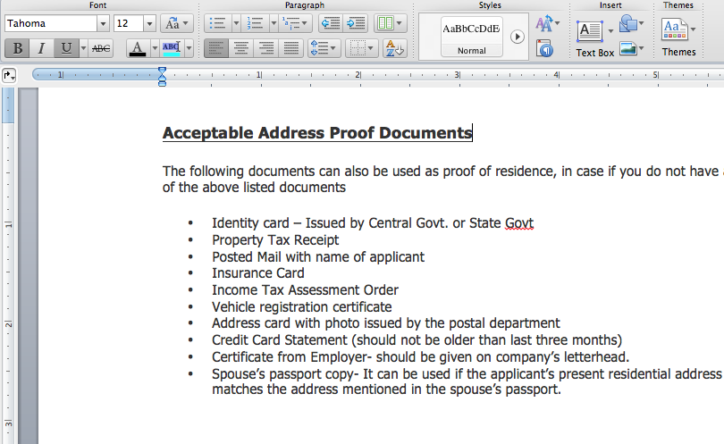
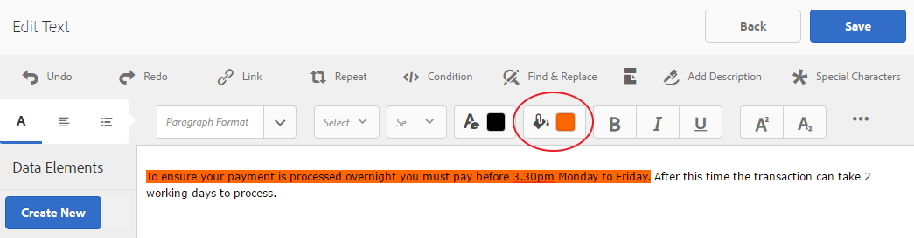
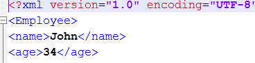
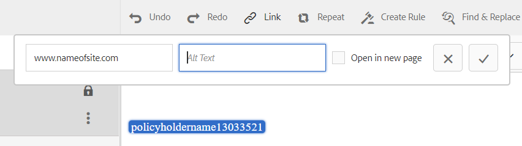
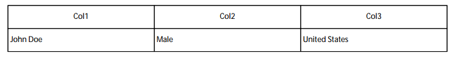

# Document Fragments{#document-fragments}

## Document Fragments {#document-fragments-1}

Document fragments are reusable parts/components of a correspondence using which you can compose letters/correspondence. The document fragments are of the following types:

* **Text**: A text asset is a piece of content that consists of one or more paragraphs of text. A paragraph can be static or dynamic.
* **List**: List is a group of document fragments, including text, lists, conditions, and images. The order of the list elements can be fixed or editable. While creating a letter, you can use some or all the list elements to replicate a reusable pattern of elements.
* **Condition**: Conditions enable you to define what content gets included at correspondence creation time, based on the supplied data. The condition is described in terms of control variables. A control variable can be either a data dictionary element or a placeholder.
* **Layout fragment**: A layout fragment is a layout that can be used within one or more letters. A layout fragment is used to create repeatable patterns, especially dynamic tables. The layout can contain typical form fields such as "Address" and "Reference Number." It also contains empty sub forms that denote target areas. The layouts (XDPs) are created in Designer and then are uploaded to AEM Forms.

## Text {#text}

A text asset is a piece of content that consists of one or more paragraphs of text. A paragraph can be static or dynamic. A dynamic paragraph contains references to data elements, whose values are supplied at runtime. For example, the customer name in a letter salutation could be a dynamic data element, with its value made available at runtime. By changing these values, the same letter template can be used to generate letters for different customers.

The Correspondence Management Solution supports two kinds to dynamic data items (variable data):

* **Data dictionary elements**: These elements are bound to the data dictionary and get their values from the supplied data source. A data dictionary variable can be protected or unprotected. During correspondence creation, the user can modify the default value of unprotected data dictionary variables, but cannot modify protected ones.
* **Placeholders**: These are variables that are not bound to a back end data source. They require the user to fill in a value during correspondence creation. The placeholders are unprotected by default.

>[!NOTE]
>
>The Correspondence Management templates do not force you to create unique names when creating placeholders. If you create two placeholders with the same name, such as a text and a condition, and use them both in a letter template, the values of the placeholder last inserted is used for both placeholders. If two placeholders have the same name, their types are compared. If the types are different, then their type becomes String. Within a module, however, you cannot create multiple placeholders with the same name.

### Create text {#create-text}

1. Select **Forms** &gt; **Document Fragments**.
1. Tap **Create** &gt; **Text** Or select a text asset and tap **Edit**.
1. Specify the following information for the text:

    * **Title: (Optional)** Enter the title for the text asset. Titles need not be unique and can have special characters and non-english characters. Texts are referred by their titles (when available) such as in thumbnails and asset properties.
    * **Name:** The unique name for the text asset. No two assets (text, condition, or list) in any state can exist with the same name. In the Name field, you can enter only English language characters, numbers, and hyphens. The Name field is automatically populated based on the Title field. The special characters, spaces, numbers, and non-English characters entered in the Title field are replaced with hyphens in the Name field. Although the value in the Title field is automatically copied to the Name, you can edit the value.
    * **Description**: Type a description of the asset.
    * **Data Dictionary**: Optionally, select the data dictionary in which to map. This attribute enables you to add references to data dictionary elements in the text asset.
    * **Tags**: Optionally, to create custom tag enter value in text field and press Enter. You can see your tag below text field of tags. When you save this text, the newly added tags also get created.

1. Tap **Next**. Correspondence Management displays the Editor page where you can add text paragraphs and data elements to the text.

   The default spellchecker in your browser checks spelling in the Text editor. To manage the spelling and grammar checking, you can edit your browser's spellchecker settings or install browser plugins/addons to check spelling and grammar.

   You can also use the various keyboard shortcuts in the text editor to manage, edit, and format text. For more information on [Text Editor](/help/forms/using/keyboard-shortcuts.md#p-formatting-p) keyboard shortcuts in Correspondence Management Keyboard Shortcuts.

1. A text editor opens, enter the text. Use the toolbar at the top of the page to format the text, insert conditions, link, and page breaks.

    

    * **Link**: Insert [hypertext](#insert-hyperlink) link in the text.
    * **Repeat**: Repeat prints collection element in Data Dictionary using a delimiter.
    * **Condition**: Tap to insert a condition. Insert text based on condition. If condition is true, then text is visible in letter, otherwise not.
    * **Add Description**: Add annotation to a piece of text. This is metadata visible to the Author but not a part of the letter that is created.
    * **Page Break**: If you set the page break attribute of a text module to false, the text module does not break across pages.

   A text editor opens. Enter the text. The toolbar changes depending on the type of edits you choose to make: Paragraph, Alignment, or Listing:

   

   Select type of toolbar: Paragraph, Alignment, or Listing

   

   Paragraph toolbar
   Alignment toolbar

   

   Listing toolbar (Click to open full-sized image)

1. To reuse one of more paragraphs of text that exist in another application, such as from MS Word or HTML pages, copy and paste the text into the text editor. The formatting of the copied text is retained in the text editor.

   You can copy and paste one or more paragraphs of text in an editable text module. For example, you may have an MS Word document with a bulleted list of acceptable proofs of residence such a following:

   

   You can directly copy and paste the text from the MS Word document to an editable text module. The formatting such as bulleted list, font, and text color is retained in the text module.

   

   >[!NOTE]
   >
   >The formatting of pasted text, however, has some [limitations](https://helpx.adobe.com/aem-forms/kb/cm-copy-paste-text-limitations.html).

1. If required, insert special characters in the document fragment. For example, you can use the Special Characters palette to insert:

    * Currency symbols such as &euro;,￥, and £
    * Mathematical symbols such as ∑, √, ∂, and ^
    * Punctuation symbols such as ‟ and "

   

   Correspondence Management has built in support for 210 special characters. The admin can [add support for more/custom special characters by customization](/help/forms/using/custom-special-characters.md).

1. To highlight\emphasize parts of text in an editable inline module, select the text and tap Highlight Color.

   

   You can either directly tap a basic color `**[A]**` present in the Basic Colors palette or tap **Select** after using the slider `**[B]**` to choose the appropriate shade of the color.

   Optionally, you can also go to the Advanced tab to select the appropriate Hue, Lightness, and Saturation `**[C]**` to create the precise color and then tap Select `**[D]**` to apply the color to highlight the text.

   

1. From the data panel, drag-and-drop data dictionary elements and placeholder elements to the text.

   To:

    * Add a data dictionary element in the text, select a data element from the list, and tap Insert ( ). If you select Protected, the data dictionary element is read-only and appears in the letter editor, but not in Create Correspondence user interface or Correspondence Creator.
    * Add a place holder element in the text, in the Data Elements panel tap Create New, enter the details for the new Data Element, and tap Create to add the new element to the list. The new place holder can be inserted into the text in the same way as data dictionary element. To edit a placeholder, select a placeholder and tap Edit.

   

   Placeholder elements as specified in sample data file of a Data Dictionary

   

   Placeholder element values in the CCR view populated from the Data Dictionary variables as specified in the sample data file

   You can also use the @ symbol to search and add data dictionary and placeholder elements to the text editor. Place the cursor where you want to insert the element. Type @ followed by the search string. The text editor performs the search operation on all data dictionary and placeholder elements available in the text document fragment. The search operation retrieves and displays the elements containing the search string as a drop-down list. Navigate through the search results and click the element that you want to insert at the cursor location. Press Esc to hide the search results.

1. You can use inline conditions and repeat to make your letter highly contextual and well structured. For more information on inline condition and repeat, see [Inline conditions and repeat in letters](/help/forms/using/cm-inline-condition.md).
1. Tap **Save**.

#### Insert hyperlink in a text {#insert-hyperlink}

Execute the following steps to create a hyperlink in a text asset:

1. Select the text or the data model object in the text editor.

2. Tap **[!UICONTROL Link]**. Tap **[!UICONTROL Alt Text]** field to remove the existing data model object name or text.

3. Specify the URL and tap .

#### Searching and replacing text {#searching-and-replacing-text}

When working with text elements containing a large body of text, you need to search for a specific text string. You may also need to replace a specific string of text with an alternative string.

The Find and Replace feature allows you to search for (and replace) any string of text in a text element. The feature also includes a powerful regular expression search.

#### To search text in a text module {#to-search-text-in-a-text-module}

1. Open the text module in the text editor.

1. Tap Find & Replace.
1. Enter the text to search in the Find text box and press Find. The search text is highlighted in the text module.
1. To search for the next instance of the text, press Find again.

   If you continue to press the Find button, the search continues down the page. After the last instance of the text is found, the message **Reached end of module** indicates that no more search results were found.

   However, if no instance of the search text is found in the text module, the message displayed is: **Match Not Found**.

1. If you press Find again, the search continues at the top of the page.

#### Search Options {#search-options}

**Match Case:** The search returns results with the same case only.

**Whole word:** Search returns only whole words.

>[!NOTE]
>
>If you enter any special characters in the Find text box, the Whole Word option is disabled.

**Reg ex:** Search using regular expressions. For example, the following regular expression searches for email addresses in a text module:

`[a-zA-Z0-9._%+-]+@[a-zA-Z0-9.-]+\.[a-zA-Z]{2,4}`

#### To search and replace text in a text module {#to-search-and-replace-text-in-a-text-module}

1. Open the text module in the text editor.
1. Tap Find & Replace.
1. Enter the text to search in the Find text box and the text to replace the find text with and press Replace.
1. If the search text is found, the text is replaced by the Replace text.

    * If another instance of the search text is found, that instance is highlighted in the text module. If you press Replace again, the highlighted instance is replaced and the cursor moves forward, if a third instance is found.
    * If another instance is not found, the cursor stops at the last replaced instance.

1. If you press Find again, the search continues at the top of the page.

   Use the Replace All option to replace all the instances of a text in the text module. When you do us ``, the number of replacements is displayed as a message in the Find and Replace dialog.

#### Best practices/ tips and tricks for text modules {#best-practices-tips-and-tricks-for-text-modules}

* Use a consistent naming convention to avoid duplication.
* Use appropriate data dictionary binding in text modules.
* The following rules apply when using the Text Editor when changing a text asset:

    * **Addition of variable:** Allowed
    * **Removal of variable:** Allowed
    * **Update of properties:** Allowed
    * **Change of data dictionary:** Allowed until data dictionary element is not used. You cannot change the data dictionary on update.

## List {#list}

A list is a group of document fragments, including text, (other) lists, conditions, and images. The order of the list elements can be fixed or editable. While creating a letter, you can use some or all of the list elements to replicate a reusable pattern of elements. Lists basically behave as targets that can be nested within other targets.

### Implementing lists {#implementing-lists}

Implementing lists consists of two steps:

1. Defining core properties such as name, description, data dictionary.
1. Section of content that is part of the list, and then setting properties such as lock order and library access for the list.

### Create a list {#create-a-list}

A list is a group of related content that can be used in a letter template as a single unit. Any kind of content can be added to a list. Lists can also be nested. List modules can be specified as:

* **ORDERED**: The order cannot be changed in the Create Correspondence runtime.
* **Library Access**: Users can add modules to the list. This flag specifies whether library access is enabled. If enabled (open) the user can add modules to the list while previewing the letter.
* When creating a list, you can specify a type, such as:
* **Plain**: No additional style formatting is applied to the list.
* **Bulleted**: A list formatted with a simple bullet.
* **Numbered**: A numeric list with the choice of Standard (1,2,...), Upper Roman (I, II, ...), and Lower Roman (i, ii,...) numerals.
* **Lettered**: An alphabetical list with the choice of lowercase (a,b,...) and uppercase (A,B,...) letters.
* **Custom**: You can create any Numbered/Lettered type and prefix and suffix values of your choice.

1. Select **Forms** &gt; **Document Fragments**.

1. Select **Create** &gt; **List**.

1. Specify the following information for the list:

    * **Title (Optional): Enter** the title for the list. Title needs not be unique and can have special characters and non-english characters. Lists are referred by their titles (when available) such as in thumbnails and asset properties.
    * **Name:** The unique name for the list. No two assets (text, condition, or list) in any state can exist with the same name. In the Name field, you can enter only English language characters, numbers, and hyphens. The Name field is automatically populated with the value in the Title field. The special characters, spaces, numbers, and non-English characters entered in the Title field are replaced with hyphens in the Name field. Although the value in the Title field is automatically copied to the Name, you can edit the value.
    * **Description (Optional)**: Type a description of the asset.
    * **Data Dictionary (Optional)**: Optionally, select the data dictionary to which to connect. Only assets that use the same data dictionary as the list, or assets that have no data dictionary assigned, can be added to the list. Assigning a data dictionary to a list makes it easier for the person creating a letter template to find the appropriate list.
    * **Tags (Optional)**: Select the tags to apply. You can also type in a new tag's name and create it. (The new tag is created when you tap **Save**.)

1. Tap **Next**.
1. Tap **Add Asset**.
1. To add assets to the list, select them in the Select Assets page and tap **Done**.

   

1. The assets are added to the List Items page.
   To change the order of the assets within the list, tap and hold the arrows icon (  ) and drag-and-drop. When the user opens a letter template in the Create Correspondence user interface, the content is assembled in the order you defined here.

   

1. You can select the following options to specify how the list behaves in the CCR user interface:

    * **Library Access**: To enable library access for adding assets, tap Library Access. When Library Access is enabled, the claims adjustor can add more content to the list. Otherwise, the Claims Adjustor is limited to the content you have defined for the list.
    * **Lock Order**: To lock the order of the assets in the list so that the Claims Adjustor cannot change the order, tap Lock Order. If you do not select this option, the Claims Adjustor can change the order of the list items.

    * **Add Bullets**: Use this option to apply a bullet or numbering style to the module. You can use either a predesigned list style or a custom one. You can also specify the text to be displayed before and after each of the list items.
    * **Page Break**: Select this option ( ) to add a page break between the list contents. When this option is not selected ( ), if the contents of the list are overflowing to the next page, the whole list is shifted to the next page instead of breaking in the page between the list.

    * **Assignment Configuration**: Use this option to specify minimum and maximum number of assets that can be added to the list.

1. You can select the following options to specify how each asset in the list behaves at runtime:

    * **Editable:** When this option is selected, the content can be edited in Create Correspondence user interface. (This option is not available for List and Image modules.)
    * **Mandatory:** When this option is selected, the content is required in Create Correspondence user interface.
    * **Selected:** When this option is selected, the content is preselected in Create Correspondence user interface.
    * **Skip Style:** When this option is selected, the content skips bullets and numbering in Create Correspondence user interface. (This option is not available for Image modules. Also, between Skip Style, Compound, and Ignore List Style, only one of the options can be applied to a module. One of these options can be used for a module when you select Add Bullets for a module.)
    * **Indentation:** You can change the indentation level of each module/content selected as part of the List. Indentation is specified in terms of Levels (starting with zero), such that each level of indent corresponds to a padding of 36pts.
    * **Compound:** When selected, the compound numbering is applied as a combination of the outer (parent) List's style and it's own style. The compound numbering on this nested List is based on the order in which this nested List appears in the outer List.
    * **Ignore list style:** If the Compound Numbering option is deselected, then the option to Ignore List Style is enabled. This selection ignores the nested List's own style and the numbering continues from the outer List. Therefore the modules of the nested list are treated as part of the outer list itself, disregarding any styles specified on the nested List. If the Ignore List Style option is deselected for a nested List, the modules that are part of that nested List have their own numbering style.
    * **Keep With Next:** Sets the page break for the assets contained in a list. If you set the Keep With Next property of one asset of a list to **On**, that asset and the next asset stays on the same page. This implies that the contents of the selected asset and the next asset will not break across pages.

1. Tap **Save**.

### Best practices/tips and tricks {#best-practices-tips-and-tricks}

* Use a consistent naming convention to avoid duplication.
* Use appropriate data dictionary binding
* The following rules apply when using the List Editor to change a list:

    * Update of properties: Allowed
    * **Change of data dictionary:** Allowed until no item that uses the data dictionary is associated with it. You cannot change the data dictionary on update.

## Conditions {#conditions}

Conditions enable you to define what content gets included at correspondence/ letter creation time, based on the supplied data. The condition is described in terms of control variables. When you add a condition, you can choose to include an asset based on the value that the control variable has.

Based on the options you choose, either only the first expression that is found to be true, based on current condition variable is evaluated or all the condition. When filling the letter in Create Correspondence (CCR), conditions behave as "white boxes". If a condition results in a list, all the list's mandatory and pre-selected items are output. If any of those items are conditions or lists themselves, their resulting content is output as well, in top-down, depth-first order as a flat list of text and image content. Condition results can be of any type (text, list, condition, or image).

### Implementing conditions {#implementing-conditions}

The Condition Editor comes with an [Expression Builder](/help/forms/using/expression-builder.md) user interface that supports creating expressions using both multiple placeholders and Data Dictionary elements. You can use common operands and local / global functions in such expressions. Each expression can be associated with some content and optionally there could be a default section if none of the expressions evaluates to true. All expressions are evaluated in the sequence in which they are defined and the first expressions returning true is selected and its associated content is returned by that conditional module.

For example, if the terms and conditions text in a letter differs depending which state the customer is in, and the data dictionary contains an element called "state", then you could add the condition as follows:
* state = NY, select T&C_NY text paragraph
* state = NC, select T&C_NC text paragraph

The Condition editor enables you to specify a default condition. If the value of the control variables does not match any of the conditions, then the content associated with the default condition is used. Following the previous example, you could add this condition row:
* Default, select T&C_Rest

### Create a condition {#create-a-condition}

1. Select **Forms** &gt; **Document Fragments**.
1. Select **Create &gt; Condition**.
1. Specify the following information for the list:

    * **Title (Optional):** Enter the title for the condition. Title needs not be unique and can have special characters and non-english characters. Conditions are referred by their titles (when available) such as in thumbnails and asset properties.
    * **Name:** The unique name for the condition. No two assets (text, condition, or list) in any state can exist with the same name. In the Name field, you can enter only English language characters, numbers, and hyphens. The Name field is automatically populated based on the Title field. The special characters, spaces, numbers, and non-English characters entered in the Title field are replaced with hyphens in the Name field. Although the value in the Title field is automatically copied to the Name, you can edit the value.
    * **Description (Optional)** Type a description of the condition.
    * **Data Dictionary (Optional)**: Optionally, select the data dictionary to which to connect. Only assets that use the same data dictionary as the condition, or assets that have no data dictionary assigned, can be added to the list. Assigning a data dictionary to a list makes it easier for the person creating a letter template to find the appropriate condition.
    * **Tags (Optional)**: Optionally, select the tags to apply. You can also type in a new tag's name and create it. (The new tag is created when you tap **Save**.)

1. Tap **Next**.
1. Tap **Add Asset**.
1. To add an asset to the Condition, select it in the Select Assets page and tap **Done**. The assets are added to the Expression pane.
1. You can select the following options to specify how the condition behaves at runtime:

    * **Disable Multiple Results Evaluation\Enable Multiple Results Evaluation**: When this option is enabled (appears as "Enable Multiple…"), all the conditions are evaluated and the result is the sum of all the true conditions. If this option is disabled (appears as "Disable Multiple...") then only the first condition that is found to be true is evaluated and becomes the output of the condition.
    * **Page Break**: Select this option ( ) to add a page break between the modules of the conditions. When this option is not selected ( ), if a condition is overflowing to the next page, the whole condition is shifted to the next page instead of breaking in the page between the condition.

1. To change the order of the assets within the condition, tap and hold the arrows icon (  ) and drag-and-drop. When the user opens a letter template in the Create Correspondence user interface, the content is assembled in the order you defined here.
1. Tap **Delete** to delete the row. If you tap Delete for the default row, only clears the asset information.
1. Tap **Copy** to duplicate a row.
1. Tap **Edit** to change the asset or edit the expression.

   Further:

    * To update the asset, tap the folder icon under Asset column.
    * To open the Expression Builder to insert an expression, tap the folder icon under the Expression column. For more information on Expression Builder, see [Expression Builder](/help/forms/using/expression-builder.md).

### Best practices/tips and tricks {#best-practices-tips-and-tricks-1}

* Use a consistent naming convention for easy search and to avoid duplication.
* Conditions behave like case statements, so order of condition is important. The first match is returned.
* Use appropriate data dictionary binding
* The following rules apply when using the Condition Editor to edit a condition:

    * **Addition of variable:** Allowed
    * **Removal of variable:** Allowed
    * **Update of properties:** Allowed
    * **Change of data dictionary:** Allowed until data dictionary element is not used.

## Layout Fragments {#layoutfragments}

A layout fragment is based on XDPs created in Designer. For creating layout fragments, you need to create the XDPs and [upload them to AEM Forms](/help/forms/using/import-export-forms-templates.md).

One or more layout fragments can form parts of a letter and define the graphical layout of those parts. A layout fragment can contain typical form fields, such as Address and Reference Number, and empty subforms that denote target areas. In addition, layout fragments allow you to create tables and insert them in letters.

A common use case is to locate reusable layout patterns in Letters and create layout fragments for them. For example, the salutation, address, and subject part of the letter, which appears in the same order multiple letters. Another example could be a table similar number of rows and columns used in multiple letters.

You can create a layout fragment based on an existing XDP. A layout fragment can either be made up of fields and target areas or one or more tables. The tables in a layout can be static or dynamic. An XDP is created in Designer and [uploaded to AEM Forms](/help/forms/using/import-export-forms-templates.md). An XDP can form the structure either of a layout fragment or of a letter. More information on [Layout Design](/help/forms/using/layout-design-details.md).

Using fragments that are bound to target areas allows the letter to be changed at the time of authoring. Layout fragment with different dimensions can be created and the appropriate fragment can be bound to the target area. Layout fragments also allow you to customize some of the table properties:

1. You can increase the row and column count.
1. You can specify the header and footer text for more rows and columns.
1. You can define the ratio of table column width. At runtime table columns are resized according to the defined ratio and available space. Sum of the width ratio must be 100. Otherwise it is not applicable.
1. If a table is a place holder (contains only single blank cell), you can define the type (target area/field) of new columns.
1. You can hide header and footer rows.

Before performing this procedure, create an XFA fragment using Designer. The fragment can contain tables for organizing fields and target areas. Designer allows creation of two types of tables: static and dynamic. Static tables contain a fixed number of rows. Static tables can contain target areas and fields. These target area and fields cannot be bound to repeating DDEs. A dynamic table can have a single row also. The data bound to table cells determines the number of rows for dynamic tables. A dynamic table can contain only fields. DDEs can be repeating or non-repeating.

Consider the following points when designing tables:

1. Tables can be customized at the time of layout fragment creation. However customize option is enabled only when table's parent subform is flowed.
1. For dynamic tables all the fields, repeatable row and table use "use name" binding for data to merge properly.
1. For dynamic tables, all the repeating DDEs bound to the table fields are part of same hierarchy. For non-repeating DDEs, there is no such restriction.
1. At the time of merging layout fragment into parent target area tables are resized according to available space, however resizing takes place only when layout fragment does not contain any target area or field directly inside top- level subform. Target area and fields inside table are permitted.
1. You can create place holder tables. Place holder tables have only a single blank cell.

* For placeholder tables, you can customize following properties at the time of fragment creation.

    * row count
    * column count
    * header and footer for each column
    * type (target area/field) of each columns
    * width ratio for each column

* For a non-placeholder table, you can customize following properties:

    * row count
    * column count
    * header and footer for additional column
    * width ratio for each column

You can nest fragments in a letter. This implies that you can add a fragment within a fragment. The Correspondence Management solution supports up to four levels of nesting within a letter: **Letter**-&gt;**Fragment**-&gt;**Fragment**-&gt;**Fragment**-&gt;**Fragment.**

For a detailed example of using static and dynamic tables in layout fragments, see [Example with sample files: using static and dynamic tables in a letter](#examplewithsamplefiles).

### Creating a layout fragment {#creating-a-layout-fragment}

1. Select **Create** &gt; **Layout Fragment**.
1. Correspondence Management displays the available XDPs. Select the XDP on which you want to base your layout fragment and tap **Next**.
1. Specify the following information for the layout:

    * **Title (Optional):** Enter the title for the layout fragment. Title needs not be unique and can have special characters and non-english characters. Layout fragments are referred by their titles (when available) such as in thumbnails and asset properties.
    * **Name:** The unique name for the layout fragment. No two assets (text, condition, or list) in any state can exist with the same name. In the Name field, you can enter only English language characters, numbers, and hyphens. The Name field is automatically populated based on the Title field. The special characters, spaces, numbers, and non-English characters entered in the Title field are replaced with hyphens in the Name field. Although the value in the Title field is automatically copied to the Name, you can edit the value. This name appears in the list in the Manage Assets user interface.
    * **Description (Optional)**: Description that appears in the list in the Manage Assets user interface.
    * **Tags (Optional)**: Optionally, select the tags to apply to the condition. You can also type in a new tag's name and create it.

1. Tap the **Table** tab and specify the following information for the layout:

    * **Configuration for**: Select the table being configured.As a suffix to the table name in the dropdown is (Static) if the table is a static one or (Dynamic) if the table is a dynamic table. Static tables contain a fixed number of rows. Static tables can contain target areas and fields. These target area and fields cannot be bound to repeating DDEs. The data bound to table cells determines the number of rows for dynamic tables.

    * **Rows**: Select the number of rows for the layout. The configured row count must be greater than or equal to the original row count.
    * **Columns**: select the number of columns for the layout. The configured column count must be greater than or equal to the original column count.

   For each column following details are required:

    * **Header**: text to show for the header
    * **Footer**: text to show for the footer
    * **Type**: type of additional column. Field or Target Area. Type is enabled for static place holder tables. Type can be defined at column level and not at cell level. All the cells in an extended column would be of the same type. For a dynamic table, all the columns are of Field type. For non-placeholder tables, you cannot define the type of additional columns. In this case, type of additional cells in extended column is same as the type of last column in that row; and type of cell in additional row is same as type of last cell in that column.
    * **Width ratio:** ratio of the table column widths.

   For a detailed example of using static and dynamic tables in layout fragments, see [Example with sample files: using static and dynamic tables in a letter](#examplewithsamplefiles).

1. Tap **Save**.

### Upload an XDP to Correspondence Management {#upload-an-xdp-to-correspondence-management}

For instructions on uploading/importing an XDP to Correspondence Management, see [Importing and exporting assets to AEM Forms](/help/forms/using/import-export-forms-templates.md).

### Best practices/tips and tricks {#best-practices-tips-and-tricks-2}

#### Set the default subform binding {#set-the-default-subform-binding}

When creating target areas in Designer, it helps to set the default binding for all new subforms to "none".

To set the default binding:

1. In Designer, tap **Tools** &gt; **Options** &gt; **Data Bindings** &gt; **Subform Binding**.

1. In the Default Binding for New Subforms list, select **No Data Binding**.

This ensures that subforms inserted using the Insert &gt; Subform command or by drag-and-drop from the Object Palette has a binding of "none" by default. This means that by default, any new subform is a target area unless you add content to it, change its binding setting, or name the subform with an "_int" suffix.

#### Section 508-compliance {#section-compliance}

If the finished letter created in the Create Correspondence user interface is used for filling in a later workflow. Follow these recommendations related to Section 508 when creating the layout. Otherwise, the letter PDF is for display, and you can disregard these recommendations:

* All target area subforms and all fields in a layout have a tab order.
* Fields with captions are 508-compliant by default. The field's /field/assist/speak@priority attribute is set to "custom" by default, which means that, unless custom screen reader text is supplied, the screen reader reads the field's caption.
* Fields without captions specify a tool tip and indicate that screen readers read the tool tip by setting

`/field/assist/speak@priority="toolTip"` and specifying tool tip text in `/field/assist/toolTip`.

#### Date formats in Designer and Asset Configuration Manager {#date-formats-in-designer-and-asset-configuration-manager}

While designing a layout in Designer, ensure that the formats for date fields match the date formats specified in Data Display Formats in [Correspondence Management Configuration Properties](/help/forms/using/cm-configuration-properties.md). For more information, see "Formatting field values and using patterns" in Designer Help.

#### Capturing date ranges {#capturing-date-ranges}

When dealing with a combination of dates, such as startDate - endDate, use a single subform to ensure correct alignment in the finished letter, and to minimize the number of fields.

#### Setting form-level binding {#setting-form-level-binding}

When a layout contains many fields and target areas that are mapped to single XML elements, use form-level binding and create a separate node for each element. Fields that are bound at the form level are ignored when mapping data in Correspondence Management.

#### Do not use subform target areas in a master page {#do-not-use-subform-target-areas-in-a-master-page}

Subform targets areas in a master page are not visible in the Manage Assets user interface and data cannot be mapped to them.

#### Choosing appropriate positions and types for target areas {#choosing-appropriate-positions-and-types-for-target-areas}

When designing the layout, take care when choosing subforms. If the layout contains a single subform, it can be a flowed type. After you position fields in the subform, you can wrap it in another subform so that the wrapped subform is also flowed and the layout will not be disturbed.

#### Placing fields on master pages {#placing-fields-on-master-pages}

Note the following when you place a field on a master page:

* Set the binding of master page fields to Use global data
* Do not place the field directly under the root PageArea of the master page.
* Wrap the field in a named subform and ensure that the binding of the named subform is set to Use name.

## Creating tables using layout fragments {#creating-tables-using-layout-fragments}

Many letter templates contain tables. Tables can be static, such as a table of terms and conditions, where each row represents one condition and each part is shown in a separate column. Tables can also be dynamic such as account information, which contains information such as customer name, account id, transaction number, and transaction amount.

* **Static Tables**: Tables are sometimes created with rows having a different number of columns, such as for a table of terms & conditions. Where each row represents one condition and each condition can have different subparts. Each part is shown in a separate column.
* **Dynamic Tables**: Layout fragments provide capability of binding a dynamic table's fields to collection DDEs. At the time of letter generation table rows are generated according to the size of collection DDEs.

The DD has a collection element Nominee_details which has a composite element with three primitive elements: Nominee_name, Nominee_address, and Nominee_gender.
The dynamic XDP also has the same headers. So you can map the dynamic XDP fields with the above mentioned fields of DD.

### Example with sample files: Using Static and Dynamic tables in a letter {#examplewithsamplefiles}

This example shows how you can create a dynamic and a static table, bind the dynamic table to DDEs, and then create a letter that includes these two tables. While working with this example, you can either create files from scratch or use the input files given in the steps.

1. Create a Data Dictionary (DD) that you want to use in the example, as represented in the graphic.

   Then select DD and export sample data. The XML file you get contains Employee data and three instances for Nominee_details (by default 3 instances are downloaded. You can add or delete according to your requirement). Update the values and then import test data in DD. The CMP file is the package and it has the DD in it. So, import the DD to Correspondence Management.

   For more information on working with Data Dictionary and test data, see [Data Dictionary](/help/forms/using/data-dictionary.md#p-working-with-test-data-p).

   

   [Get File](assets/exportpackage_1431709897770.cmp.zip)

1. In Designer, create two XDPs (layout fragments): a dynamic table and a static table. For both the layouts:

    * Add subform to the table column. Ensure that you change the layout of table's parent subform to flowed and remove the bindings of the subform in table.
    * Add a subform to the table cell. Ensure that you change the layout of table's parent subform to flowed and remove the bindings of the subform in table.

   Or, use the static and dynamic XDPs attached with this step.

   For more information on working with Layout Fragments, see [Layout Fragments](#layoutfragments).
   For more information on designing layouts, see [Designer Help](https://help.adobe.com/en_US/AEMForms/6.1/DesignerHelp/ ).

   [Get File](assets/static.xdp.zip)

   [Get File](assets/dynamic.xdp.zip)

1. Upload the XDPs to AEM Forms.
1. Create a layout fragment based on the dynamic XDP. The Table tab of the properties displays that the table is dynamic (Configuration For field). The number of rows (1) and columns (3) are derived from the XDP/Layout Fragment.

   This layout's fields are later bound to the imported DD and in the letter, the number of rows are dynamically created based on the number of records in the test data file (the XML data file attached with the DD).

   

   Click to open full-sized image

1. Create a layout fragment based on the static XDP. The Table tab of the properties displays that the table is static (Configuration For field). The number of rows (1) and columns (3) are derived from the XDP/Layout Fragment.

   You can change the number of columns and rows here. According to what you choose in this screen, the number of rows and columns of a static table remain fixed in the letter that is created with this layout.
   

1. Create a letter using both the layout fragments in it. When you insert the dynamic XDP in the letter, set the binding of its fields to the Data Dictionary's collection elements.

   For more information on creating Letters and Letter templates, see [Create Letter](/help/forms/using/create-letter.md).

1. Save the letter and preview it. When you preview the letter, the values from the Data Dictionary show in the letter. For the dynamic table, there are three rows. This is because the test data has three records for these rows.

   For the static table, there are as many rows and columns as you specified while creating the layout fragment.

   

   For the dynamic table, the three rows appear according to the number of records in the test data file. This happened because while adding the layout to the letter, you created a binding between the dynamic table's fields and the data dictionary's collection elements. The Name, Address, and Gender values are populated from the test data file you used.

   

## Create a copy of a document fragment {#create-a-copy-of-a-document-fragment}

To quickly create a document fragment with properties and content similar to an existing document fragment, you can copy and paste it.

1. From the list of document fragments, select one or more document fragments. The UI displays the Copy icon.
1. Tap Copy. The UI displays the Paste icon. You can also choose to go inside a folder before you paste. Different folders can contain assets with same names. For more information on folders, see [Folders and organizing assets](/help/forms/using/import-export-forms-templates.md#folders-and-organizing-assets).
1. Tap Paste. The Paste dialog appears. If you are copying and pasting the document fragments at the same place, the system automatically assigns names and a titles to the new copies of letters, but you can edit the titles and names of the letters.
1. If required, edit the Title and Name with which you want to save the copy of the document fragment.
1. Tap Paste. The copy of the document fragment is created.
