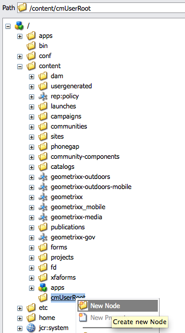
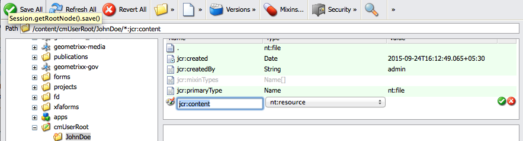
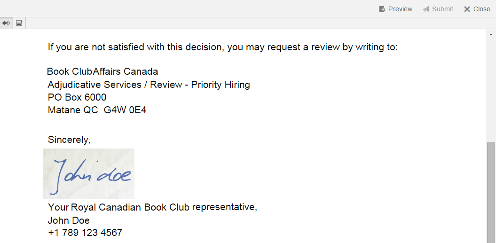

# Manage agent signature images{#manage-agent-signature-images}

## Overview {#overview}

In Correspondence Management, you can use an image to render agent signature in letters. After you set up the agent signature image, while creating a letter, you can render the agent signature image in the letter as the signature of the sender agent.

The agentSignatureImage DDE is a computed DDE representing the agent's signature image. The expression for this computed DDE uses a new custom function exposed by the Expression Manager building block. This custom function takes agentID and agentFolder as input parameters and fetches the image content based on these parameters. The SystemContext system data dictionary gives letters in Correspondence Management access to information in the current system context. The system context includes information about the currently logged in user and active configuration parameters.

You can add images under the cmuserroot folder. In [Correspondence Management Configuration Properties](/help/forms/using/cm-configuration-properties.md), using the CM User Root property you can change the folder from where agent signature image is picked up.

The value of agentFolder DDE is taken from the CMUserRoot configuration parameter for the Correspondence Management configuration properties. By default, this configuration parameter points to/content/cmUserRoot in the CRX repository. You can change the value of the CMUserRoot configuration in the Configuration Properties.
You can also override the default custom function to define your own logic for fetching the user signature image.

## Adding agent signature image {#adding-agent-signature-image}

1. Ensure that the agent signature image has the same name as the user's AEM user name. (Extension is not needed for image filename.)
1. In CRX, create a folder named `cmUserRoot` in the content folder.

    1. Go to `https://'[server]:[port]'/crx/de`. If necessary, log in as Administrator.

    1. Right-click the **content** folder and select **Create** &gt; **Create Folder**.

       

    1. In the Create Folder dialog, enter the name of the folder as `cmUserRoot`. Click **Save All**.

       >[!NOTE]
       >
       >cmUserRoot is the default location where AEM looks for the agent signature image. You can, however, change it by editing the CM User Root property in the [Correspondence Management configuration properties](/help/forms/using/cm-configuration-properties.md).

1. In Content Explorer, navigate to the cmUserRoot folder and add the agent signature image in it.

    1. Go to `https://'[server]:[port]'/crx/explorer/index.jsp`. Log in as Administrator, if necessary.
    1. Click **Content Explorer**. The Content Explorer opens in a new window.
    1. In Content Explorer, navigate to the cmUserRoot folder and select it. Right-click the **cmUserRoot** folder and select **New Node**.

       

       Make the following entries in the row for new node and then click the green check mark.

       **Name:** JohnDoe (or the name of your agent signature file)

       **Type:** nt:file

       Under the `cmUserRoot` folder, a new folder called `JohnDoe` (or the name you have given in the previous step) is created.

    1. Click the new folder you have created (here `JohnDoe`). The Content Explorer displays the folder's contents as dimmed.

    1. Double-click the **jcr:content** property, set its type as **nt:resource**, and then click the green check mark to save the entry.

       If the property is not present, first create a property with name jcr:content.

       

       Among the subproperties of jcr:content is jcr:data, which is dimmed. Double-click jcr:data. The property becomes editable and the Choose File button appears in the entry. Click **Choose File** and select the image file you want to use as a logo. The image file does not need to have an extension.

       

   Click **Save All**.

1. Ensure that the XDP\layout that you use in the letter has an image field at the lower left (or other appropriate place in the layout where you want to render the signature) to render the signature image.
1. While creating the correspondence, in the Data tab select an image field for the signature image using the following steps:

    1. Select System from the Linkage Type pop-up menu in the right pane.

    1. Select the agentSignatureImage DDE from the list in the Data Element panel for the SystemContext DD.

    1. Save the letter.

1. When the letter is rendered, you can see you signature in the letter preview in the image field according to the layout.

   
