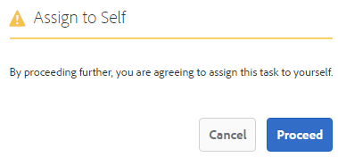
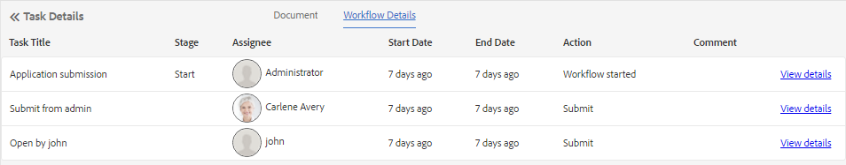

# Manage Forms applications and tasks in AEM Inbox{#manage-forms-applications-and-tasks-in-aem-inbox}

One of the many ways to launch or trigger a Forms-centric workflow is through applications in AEM Inbox. To make a Forms workflow available as application in Inbox, create a workflow application. For more information about workflow application and other ways to launch Forms workflows, see [Launch a Forms-centric workflow on OSGi](../../forms/using/aem-forms-workflow.md#launch).

In addition, AEM Inbox consolidates notifications and tasks from various AEM components, including Forms workflows. When a forms workflow containing an Assign task step is triggered, the associated application is listed as a task in the assignee's Inbox. If the assignee is a group, the task appears in the Inbox of all group members until an individual claims or delegates the task.

The Inbox user interface provides list and calendar views to view tasks. You can also configure the view settings. You can filter tasks based on various parameters. For more information about view and filters, see [Your Inbox](/help/sites-authoring/inbox.md).

In summary, Inbox allows you to create a new application and manage assigned tasks.

>[!NOTE]
>
>You must be a member of the workflow-users group to be able to use AEM Inbox.

## Create application {#create-application}

1. Go to AEM Inbox at https://'[server]:[port]'/aem/inbox.
1. In the Inbox UI, tap **[!UICONTROL Create > Application]**. The Select Application page appears.
1. Select an application and click **[!UICONTROL Create]**. The adaptive form associated with the application opens. Fill up the information in the adaptive form and tap **[!UICONTROL Submit]**. It launches the associated workflow and creates a task in the assignee's Inbox.

## Manage tasks {#manage-tasks}

When a Forms workflow triggers and you are an assignee or part of the assignee group, a task appears in your Inbox. You can view task details and perform available actions on the task from within Inbox.

### Claim or delegate tasks {#claim-or-delegate-tasks}

Tasks that are assigned to a group appear in the Inbox of all group members. Any group member can claim that task or delegate it to another group member. To do so:

1. Tap to select the thumbnail of the task. Options to open or delegate the task appear at the top.

   

1. Do one of the following:

    * To delegate the task, tap **[!UICONTROL Delegate]**. The Delegate Item dialog Opens. Select a user, optionally add a comment, and tap **[!UICONTROL OK]**.

   

    * To claim the task, tap **[!UICONTROL Open]**. The Assign to Self dialog opens. Tap **[!UICONTROL Proceed]** to claim the task. The claimed task appears with you as the assignee in your Inbox.

   

### View details and perform actions on tasks {#view-details-and-perform-actions-on-tasks}

When you open a task, you can view task details and perform available actions. The actions available for a task are defined in the Assign task step of the associated Forms workflow.

1. Tap to select the thumbnail of the task. Options to open or delegate the selected task appear at the top.
1. Tap **Open** to view task details. The detailed task view opens. In this view, you can view task details and work on the task.

   >[!NOTE]
   >
   >If a task is assigned to a group, you must claim it to be able to open it in detailed view.


The detailed task view comprises the following sections:

* Task details
* Form
* Workflow details
* Actions toolbar

#### Task details {#task-details}

The Task Details section displays information about the task. The information displayed depends on the configuration settings of the [Assign task step](/help/sites-developing/workflows-step-ref.md) in the workflow. The above example displays the description, status, start date, and workflow used for the task. It also allows attaching a file to the task.

#### Form {#form}

The Form tab in the main content area displays the submitted form and field-level attachments, if any.

#### Workflow details {#workflow-details}

The Workflow Details tab at the top shows the progress of the task through various stages in the workflow. It shows completed, current, and pending stages for the task. The stages for a workflow are defined in the [Assign task step](/help/sites-developing/workflows-step-ref.md) of the associated workflow.

In addition, the tab displays task history for each completed stage in the workflow. You can tap **[!UICONTROL View Details]** for a completed stage to know details about that stage. It displays comments, form and task attachments, status, start and end dates, and so on, about the task.


#### Actions toolbar {#actions-toolbar}

The Actions toolbar shows all available options for the task. While Save, Reset, and Delegate are default actions, other available actions are configured in [Assign task step](/help/sites-developing/workflows-step-ref.md). In the example above, Approve and Reject are configured in the workflow.

As you work on the task, it proceeds further in the workflow.

### View completed tasks {#view-completed-tasks}

AEM Inbox displays only active tasks. Completed tasks do not appear in the list. However, you can use Inbox filters to filter tasks based on several parameters, such as task type, status, and start and end dates. To view completed tasks:

1. In AEM Inbox, tap  to open the filter selector.
1. Tap **[!UICONTROL Task Status]** accordion and select **[!UICONTROL Complete]**. All your completed tasks appear.

   

1. Tap to select a task and click **[!UICONTROL Open]**.

The task opens to display the document or the adaptive form associated with the task. For adaptive form, the task displays the read-only adaptive form or its PDF document of record as configured in the Form/Document tab of the [Assign Task workflow step](/help/sites-developing/workflows-step-ref.md).

The task details section displays information such as action taken, task status, start date, and end date.


The **[!UICONTROL Workflow Details]** tab shows each step of the workflow. Tap **[!UICONTROL View details]** for a step for detailed information.



## Troubleshooting {#troubleshooting-workflows}

### Unable to view items related to AEM Workflow in AEM inbox {#unable-to-see-aem-worklow-items}

A workflow model owner is unable to view items related to AEM Workflow in AEM inbox. To resolve the issue, add the below listed indices to your AEM repository and rebuild the index. 

1. Use one of the following methods to add indices: 

   * Create the following nodes at in CRX DE at `/oak:index/workflowDataLucene/indexRules/granite:InboxItem/properties` with respective properties as specified in the following table: 

      |Node| Property  | Type  |
      |---|---|---|
      | sharedWith  |  sharedWith | STRING  |
      | locked  |  locked | BOOLEAN  |
      | returned  |  returned | BOOLEAN  |
      | allowInboxSharing  |  allowInboxSharing | BOOLEAN  |
      | allowExplicitSharing  |  allowExplicitSharing | BOOLEAN  |
      

   * Deploy the indices via an AEM package. You can use an [AEM Archetype](https://experienceleague.adobe.com/docs/experience-manager-core-components/using/developing/archetype/using.html?lang=en) project to create a deployable AEM package. Use the following sample code to add indices to an AEM Archetype project:

   ``` Java
      .property("sharedWith", "sharedWith").type(TYPENAME_STRING).propertyIndex()
      .property("locked", "locked").type(TYPENAME_BOOLEAN).propertyIndex()
      .property("returned", "returned").type(TYPENAME_BOOLEAN).propertyIndex()
      .property("allowInboxSharing", "allowInboxSharing").type(TYPENAME_BOOLEAN).propertyIndex()
      .property("allowExplicitSharing", "allowExplicitSharing").type(TYPENAME_BOOLEAN).propertyIndex()
   ``` 

1. [Create a Property Index and set it to true](https://experienceleague.adobe.com/docs/experience-manager-65/deploying/deploying/queries-and-indexing.html#the-property-index). 

1. After configuring indices in CRX DE or deploying via a package, [re-index the repository](https://helpx.adobe.com/in/experience-manager/kb/HowToCheckLuceneIndex.html#Completelyrebuildtheindex).

https://experienceleague.adobe.com/docs/experience-manager-65/deploying/deploying/queries-and-indexing.html
