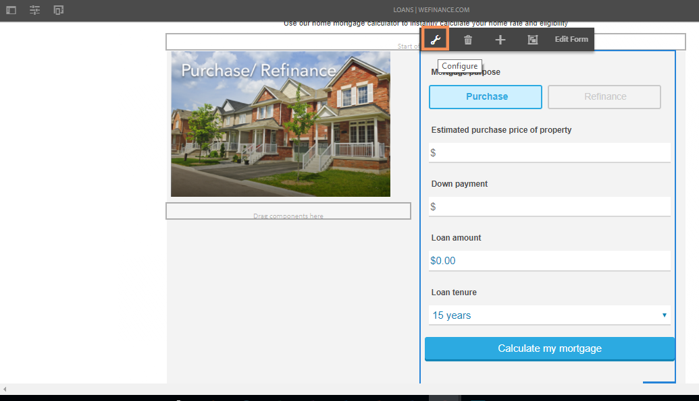
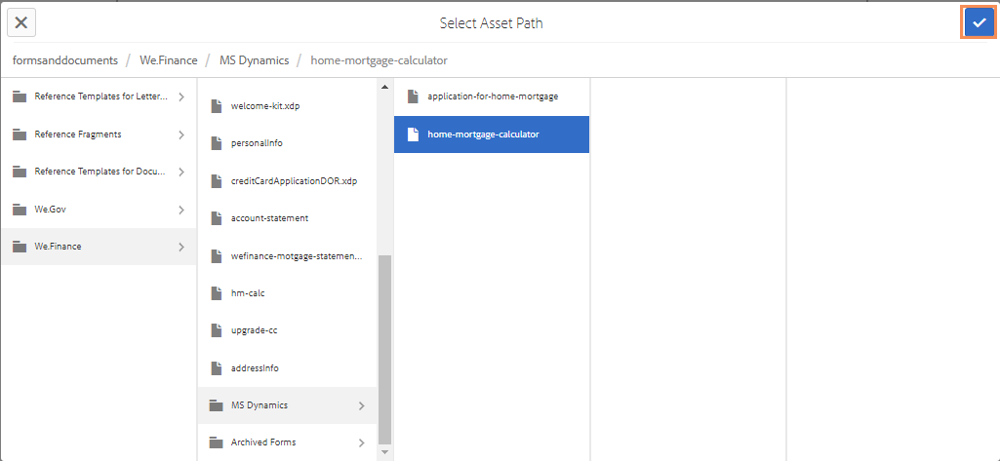

# Configure Microsoft Dynamics 365 for the home mortgage workflow of the We.Finance reference site {#configure-microsoft-dynamics-for-the-home-mortgage-workflow-of-the-we-finance-reference-site}

Learn how to leverage the Microsoft® Dynamics 365 services through adaptive forms for the home mortgage workflow of the We.Finance Reference site

## Overview {#overview}

Microsoft® Dynamics 365 is a Customer Relationship Management (CRM) and Enterprise Resource Planning (ERP) software that provides enterprise solutions for creating and managing customer accounts, contacts, leads, opportunities, and cases.

AEM Forms provides a cloud service to integrate Dynamics 365 with [Forms Data Integration](/help/forms/using/data-integration.md) module. The scenario [Home Mortgage application walkthrough with Microsoft® Dynamics](/help/forms/using/finance-reference-site-walkthrough.md#home-mortgage-application-walkthrough-with-microsoft-dynamics) showcases how a customer uses the We.Finance reference site to apply for a loan when the site is using Microsoft® Dynamics for Forms Data Integration. Before you can use the Home Mortgage application walkthrough with Microsoft® Dynamics scenario, you need to configure Microsoft® Dynamics 365 to be used with the We.Finance reference site.

## Prerequisites {#prerequisites}

Before you begin to set up and configure Dynamics 365, ensure that you have:

* [Set up and configure AEM Forms reference sites](/help/forms/using/setup-reference-sites.md).  

* AEM 6.3 Forms Service Pack 1 and later
* Microsoft® Dynamics 365 account
* Registered application for Dynamics 365 service with Microsoft® Azure Active Directory
* Client ID and client secret for the registered application

## Link the home mortgage calculator with your site home page {#link-the-home-mortgage-calculator-with-your-site-home-page}

1. On the author instance, go to the following page:

   https://[sderver]:[port]/editor.html/content/we-finance/global/en/loan-landing-page.html

1. Scroll down to the Home Mortgage Calculator.
1. Highlight the right column's (calculator's) panel and tap to display the pop-up menu. In the pop-up menu, tap Configure. The Edit AEM Forms Container dialog appears.

   

1. In the Edit AEM Forms Container dialog, browse the asset path and select home-mortgage-calculator at the following path and tap **Confirm**:

   formsanddocuments/We.Finance/MS Dynamics/ 

   

1. Tap **Done**.
1. Publish the edited page.

   >[!NOTE]
   >
   >The binding of the calculator fields with the FDM is preconfigured through the We.Finance reference site package. To view the binding, you can open the form in the authoring mode and see the field bind references.

1. To create a custom entity for storing applicant record for home mortgage application, import the AEMFormsFSIRefsite_1_0.zip solution package to your Microsoft® Dynamics instance:

    1. Download the package from:

       `https://[server]:[port]/content/aemforms-refsite-collaterals/we-finance/home-mortgage/ms-dynamics/AEMFormsFSIRefsite_1_0.zip`
   
    1. Import the solution package to Microsoft® Dynamics instance. In your Microsoft® Dynamics instance, go to **Settings** &gt; **Solutions** and then tap **Import**.

1. To set up user contact details used in the refsite, import the Sarah Rose Contact.CSV package to your Microsoft® Dynamics instance:

    1. Download the package from:

       `https://[server]:[port]/content/aemforms-refsite-collaterals/we-finance/home-mortgage/ms-dynamics/Sarah%20Rose%20Contact.csv`

    1. Import the package to your Microsoft® Dynamics instance. In your Microsoft® Dynamics instance, go to **Sales** &gt; **Contacts** and then tap **Import Data**.

