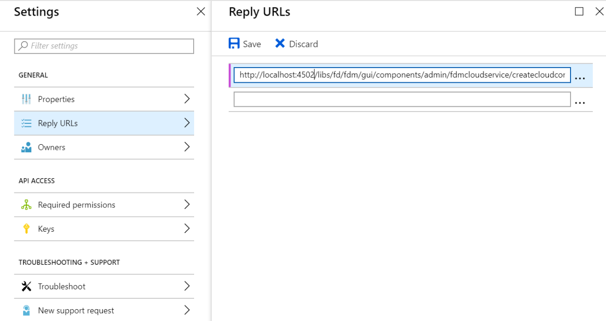

# Microsoft Dynamics OData configuration{#microsoft-dynamics-odata-configuration}

| Version | Article link |
| -------- | ---------------------------- |
| AEM as a Cloud Service |    [Click here](https://experienceleague.adobe.com/docs/experience-manager-cloud-service/content/forms/integrate/use-form-data-model/ms-dynamics-odata-configuration.html)                  |
| AEM 6.5     | This article         |

 

Microsoft Dynamics is a Customer Relationship Management (CRM) and Enterprise Resource Planning (ERP) software that provides enterprise solutions for creating and managing customer accounts, contacts, leads, opportunities, and cases. [AEM Forms Data Integration](../../forms/using/data-integration.md) provides an OData cloud service configuration to integrate Forms with both online and on-premises Microsoft Dynamics server. It enables you to create form data model based on the entities, attributes, and services defined in Microsoft Dynamics service. The form data model can be used to create adaptive forms that interact with Microsoft Dynamics server to enable business workflows. For example:

* Query Microsoft Dynamics server for data and prepopulate adaptive forms
* Write data into Microsoft Dynamics on adaptive form submission
* Write data in Microsoft Dynamics through custom entities defined in form data model and conversely

AEM Forms add-on package also includes reference OData configuration that you can use to quickly integrate Microsoft Dynamics with AEM Forms.

When the package is installed, the following entities and services are available on your AEM Forms instance:

* MS Dynamics OData Cloud Service (OData Service)
* Form data model with preconfigured Microsoft Dynamics entities and services.

Preconfigured Microsoft Dynamics entities and services in a form data model are available on your AEM Forms instance only if the run mode for the AEM instance is set as `samplecontent` (default). MS Dynamics OData Cloud Service (OData Service) is available with other run modes as well. For more information on configuring run modes for an AEM instance, see [Run Modes](/help/sites-deploying/configure-runmodes.md).

## Prerequisites {#prerequisites}

Before you begin to set up and configure Microsoft Dynamics, ensure that you have:

* Installed the [AEM Forms add-on package](../../forms/using/installing-configuring-aem-forms-osgi.md)
* Configured Microsoft Dynamics 365 online or installed an instance of one of the following Microsoft Dynamics versions:

    * Microsoft Dynamics 365 on-premises
    * Microsoft Dynamics 2016 on-premises

* [Registered the application for Microsoft Dynamics online service with Microsoft Azure Active Directory](https://docs.microsoft.com/en-us/dynamics365/customer-engagement/developer/walkthrough-register-dynamics-365-app-azure-active-directory). Take a note of the values for the client ID (also referred to as application ID) and client secret for the registered service. These values are used while [configuring cloud service for your Microsoft Dynamics service](../../forms/using/ms-dynamics-odata-configuration.md#configure-cloud-service-for-your-microsoft-dynamics-service).

## Set Reply URL for registered Microsoft Dynamics application {#set-reply-url-for-registered-microsoft-dynamics-application}

Do the following to set the Reply URL for registered Microsoft Dynamics application:

>[!NOTE]
>
>Use this procedure only while integrating AEM Forms with online Microsoft Dynamics server.

1. Go to Microsoft Azure Active Directory account and add the following cloud service configuration URL in **Reply URLs** settings for your registered application:

   `https://'[server]:[port]'/libs/fd/fdm/gui/components/admin/fdmcloudservice/createcloudconfigwizard/cloudservices.html`

   

1. Save the configuration.

## Configure Microsoft Dynamics for IFD {#configure-microsoft-dynamics-for-ifd}

Microsoft Dynamics uses claims-based authentication to provide access to data on Microsoft Dynamics CRM server to external users. To enable this, do the following to configure Microsoft Dynamics for Internet-facing deployment (IFD) and configure claim settings.

>[!NOTE]
>
>Use this procedure only while integrating AEM Forms with on-premises Microsoft Dynamics server.

1. Configure Microsoft Dynamics on-premises instance for IFD as described in [Configure IFD for Microsoft Dynamics](https://technet.microsoft.com/en-us/library/dn609803.aspx).
1. Run the following commands using Windows PowerShell to configure claim settings on IFD-enabled Microsoft Dynamics:

   ```shell
   Add-PSSnapin Microsoft.Crm.PowerShell
    $ClaimsSettings = Get-CrmSetting -SettingType OAuthClaimsSettings
    $ClaimsSettings.Enabled = $true
    Set-CrmSetting -Setting $ClaimsSettings
   ```

   See [App registration for CRM on-premises (IFD)](https://msdn.microsoft.com/sl-si/library/dn531010(v=crm.7).aspx#bkmk_ifd) for details.

## Configure OAuth client on AD FS machine {#configure-oauth-client-on-ad-fs-machine}

Do the following to register an OAuth client on Active Directory Federation Services (AD FS) machine and grant access on AD FS machine:

>[!NOTE]
>
>Use this procedure only while integrating AEM Forms with on-premises Microsoft Dynamics server.

1. Run the following command:

   `Add-AdfsClient -ClientId "<Client-ID>" -Name "<name>" -RedirectUri "<redirect-uri>" -GenerateClientSecret`

   Where:

    * `Client-ID` is a client ID you can generate using any GUID generator.
    * `redirect-uri` is the URL to the Microsoft Dynamics OData cloud service on AEM Forms. The default cloud service installed with the AEM Forms package is deployed at the following URL:
      `https://'[server]:[port]'/libs/fd/fdm/gui/components/admin/fdmcloudservice/createcloudconfigwizard/cloudservices.html`

1. Run the following command to grant access on AD FS machine:

   `Grant-AdfsApplicationPermission -ClientRoleIdentifier "<Client-ID>" -ServerRoleIdentifier <resource> -ScopeNames openid`

   Where:

    * `resource` is the Microsoft Dynamics organization URL.

1. Microsoft Dynamics uses HTTPS protocol. To invoke AD FS endpoints from Forms server, install Microsoft Dynamics site certificate to Java certificate store using the `keytool` command on the computer running AEM Forms.

## Configure cloud service for your Microsoft Dynamics service {#configure-cloud-service-for-your-microsoft-dynamics-service}

The **MS Dynamics OData Cloud Service (OData Service)** configuration comes with default OData configuration. To configure it to connect with your Microsoft Dynamics service, do the following.

1. Navigate to **[!UICONTROL Tools > Cloud Services > Data Sources]**, and select the `global` configuration folder.
1. Select **MS Dynamics OData Cloud Service (OData Service)** configuration and select **[!UICONTROL Properties]**. The cloud service configuration property dialog opens.

   In the **Authentication Settings** tab:

    1. Enter the value for the **Service Root** field. Go to the Dynamics instance and navigate to **Developer Resources** to view the value for the Service Root field. For example, https://&lt;tenant-name&gt;/api/data/v9.1/

    1. Replace the default values in the **Client Id**(also referred to as **Application ID**), **Client Secret**, **OAuth URL**, **Refresh Token URL**, **Access Token URL**, and **Resource** fields with values from your Microsoft Dynamics service configuration. It is mandatory to specify the dynamics instance URL in the **Resource** field to configure Microsoft Dynamics with a form data model. Use the Service Root URL to derive the dynamics instance URL. For example, [https://org.crm.dynamics.com](https://org.crm.dynamics.com/).

    1. Specify **openid** in the **Authorization Scope** field for authorization process on Microsoft Dynamics.

   

1. Click **[!UICONTROL Connect to OAuth]**. You are redirected to Microsoft Dynamics login page.
1. Log in with your Microsoft Dynamics credentials and accept to allow the cloud service configuration to connect to Microsoft Dynamics service. It is a one-time task to establish connection between the cloud service and the service.

   You are then redirected to the cloud service configuration page, which displays a message that OData configuration is successfully saved.

The MS Dynamics OData Cloud Service (OData Service) cloud service is configured and connected with your Dynamics service.

## Create form data model {#create-form-data-model}

When you install the AEM Forms package, a form data model,**Microsoft Dynamics FDM**, is deployed on your AEM instance. By default, the form data model uses Microsoft Dynamics service configured in the MS Dynamics OData Cloud Service (OData Service) as its data source.

On opening the form data model for the first time, it connects to the configured Microsoft Dynamics service and fetches entities from your Microsoft Dynamics instance. The "contact" and "lead" entities from Microsoft Dynamics are already added in the form data model.

To review the form data model, go to **[!UICONTROL Forms > Data Integrations]**. Select **Microsoft Dynamics FDM** and click **Edit** to open the form data model in edit mode. Alternatively, you can open the form data model directly from the following URL:

`https://'[server]:[port]'/aem/fdm/editor.html/content/dam/formsanddocuments-fdm/ms-dynamics-fdm`


Next, you can create an adaptive form based on the form data model and use it in various adaptive form use cases, such as:

* Prefill adaptive form by querying information from Microsoft Dynamics entities and services
* Invoke Microsoft Dynamics server operations defined in a form data model using adaptive form rules
* Write submitted form data to Microsoft Dynamics entities

It is recommended to create a copy of the form data model provided with the AEM Forms package and configure data models and services to suit your requirements. It will ensure that any future updates to the package do not override your form data model.

For more information about creating and using form data model in business workflows, see [Data Integration](../../forms/using/data-integration.md).
