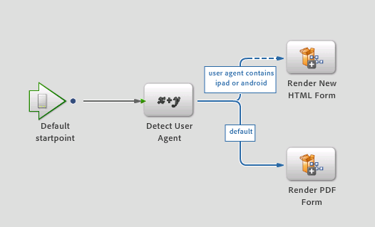

# New render and submit service{#new-render-and-submit-service}

## Introduction {#introduction}

In Workbench, when you define an `AssignTask` operation, specify a particular form (XDP or PDF form). Also, specify a set of Render and Submit services, via action profile.

An XDP can be rendered as a PDF form or an HTML form. The new capabilities include the ability to:

* Render and Submit an XDP form as HTML
* Render and Submit an XDP form as PDF on desktop, and as HTML on mobile devices (for example, an iPad)

### New HTML Forms service {#new-html-forms-service}

The new HTML Forms service uses the new feature in Forms to support rendering of XDP form as HTML. The new HTML Forms service exposes the following methods:

```java
/*
 * Generates a URL (for the HTML Form) to be passed to client, given a TaskContext.
 * The output of this API is something like this - /lc/content/xfaforms/profiles/default.ws.html?ContentRoot=repository://Applications/MyApplication/MyFolder&template=MyForm.xdp
 * @param taskContext task context
 * @param profileName Forms servlet URL.
 * @return form URL string
 */
public String generateFormURL(TaskContext taskContext, String profileName);

/*
 * Render the XDP Form as HTML. Can be used directly for updating the runtimeMap in render.
 * It adds the following keys to the map -
 * hint:new html form = true
 * newHTMLFormURL = the URL returned after calling 'generateFormURL' API.
 * @param TaskContext taskContext
 * @param profileName Forms servlet URL.
 * @param runtimeMap runtime map<string,object> associated with form rendering.
 * return runtimeMap
 */
public Map<String, Object> renderHTMLForm (TaskContext taskContext, String profileName, Map<String,Object> runtimeMap);
```

More information on Mobile Form profiles can be found at [Creating a custom profile](/help/forms/using/custom-profile.md).

## New HTML Form Render &amp; Submit Processes {#new-html-form-render-amp-submit-processes}

For every 'AssignTask' operation, specify a Render and a Submit process with the form. These processes are called by TaskManager `renderForm`and `submitForm`APIs to allow custom handling. Semantics of these processes for New HTML Form:

### Render a new HTML form {#render-a-new-html-form}

The new process to render HTML, like every render process, has the following I/O parameters -

Input - `taskContext`

Output - `runtimeMap`

Output - `outFormDoc`

This method simulates the exact behavior of `renderHTMLForm` API of the NewHTMLFormsService. It calls the `generateFormURL` API to get the URL for HTML rendition of the form. It then populates the runtimeMap with following key or values:

new html form = true

newHTMLFormURL = the URL returned after calling `generateFormURL` API.

### Submit a new HTML form {#submit-a-new-html-form}

This process to submit a new HTML form works with the following I/O parameters -

Input - `taskContext`

Output - `runtimeMap`

Output - `outputDocument`

The process sets the `outputDocument`to the `inputDocument`retrieved from `taskContext`.

## Default Render or Submit processes, and action profiles {#default-render-or-submit-processes-and-action-profiles}

The default Render and Submit services enable support to render PDFs on a desktop, and HTML on mobile devices (iPad).

### Default Render Form {#default-render-form}

This process renders an XDP Form on multiple platforms, seamlessly. The process retrieves the user agent from `taskContext`, and uses the data to call the process to render either HTML or PDF.



### Default Submit Form {#default-submit-form}

This process submits an XDP form on multiple platforms seamlessly. It retrieves the user agent from `taskContext`and uses the data to call the process to submit either HTML or PDF.


## Switch the rendering of mobile forms from PDF to HTML {#switch-the-rendering-of-mobile-forms-from-pdf-to-html}

Browsers are gradually withdrawing support for NPAPI-based plug-ins, including plug-ins for Adobe Acrobat and Adobe Acrobat Reader. You can change rendering of mobile forms from PDF to HTML using the following steps:

1. Log in to Workbench as a valid user.
1. Select **File** &gt; **Get Applications**.

   Get Applications dialog appears.

1. Select the applications for which you want to change the mobile form rendering and click **OK**.
1. Open the process for which you want to change the rendering.
1. Open the targeted startpoint/task, navigate to the Presentation & Data section, and click **Manage Action Profiles**.

   Manage Action Profiles dialog appears.
1. Change Default render profile configurations from PDF to HTML and click **OK**.
1. Check in the process.
1. Repeat the steps to change the rendering for other processes.
1. Deploy the application relevant to the processes you have changed.

### Default Action Profile {#default-action-profile}

The default Action Profile rendered the XDP Form as PDF. This behavior has now been changed to use the Default Render Form and Default Submit Form processes.

Some frequently asked questions about action profiles are as follows:

 **What Render / Submit processes will be available out of the box?**

* Render Guide (Guides is deprecated)
* Render Form Guide
* Render PDF form
* Render HTML form
* Render New HTML form (new)
* Default Render form (new)

And, equivalent Submit processes.

 **What Action Profiles will be available out of the box?**

For XDP Forms:

* Default (render/submit using the new 'Default Render/Submit' processes)

 **What needs to be done by the process designer to enable the form to be rendered in HTML on a device, and in PDF on a desktop?**

Nothing. The default Action Profile is chosen automatically, and the mode of rendering is taken care of too, automatically.

 **What needs to be done to enable the form to be rendered in HTML on a desktop?**

The user must select the HTML radio button for the default profile.

 **Will there be any upgrade impact on changing the default action profile behavior?**

Yes, since the previous render and submit services associated with the default action profile were different, these are treated as a customization of the existing forms. On clicking **Restore Defaults**, the default render and submit services are set instead.

If you had modified the existing Render or Submit PDF Form services or created custom services (say custom1), and now want to use the same functionality for HTML rendition. You need to replicate the new render or submit service (as say custom2) and apply similar customizations to those. Now, modify the action profile for your XDP to start using custom2 services, instead of the custom1 for render or submit.

What needs to be done by the process designer to enable the form to be rendered in HTML on a device, and in PDF on a desktop?
What needs to be done by the process designer to enable the form to be rendered in HTML on a device, and in PDF on a desktop?
