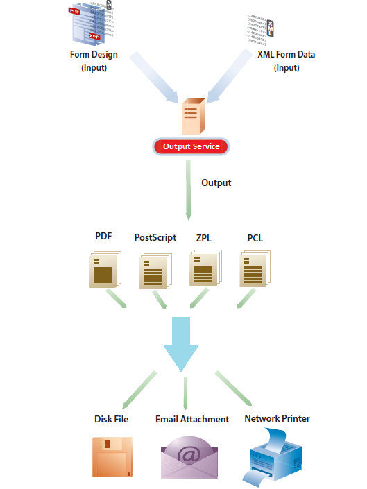

# Output Service{#output-service}

## Overview {#overview}

Output service is an OSGi service that is part of AEM Document Services. Output service supports various output formats and output design features of AEM Forms Designer. Output service can convert XFA templates and XML data to generate print documents in various formats.

Output service enables you to create applications that let you:

* Generate final form documents by populating template files with XML data.
* Generate output forms in various formats, including non-interactive PDF, PostScript, PCL, and ZPL print streams.
* Generate print PDFs from XFA form PDFs.
* Generate PDF, PostScript, PCL and ZPL documents in bulk by merging multiple sets of data with supplied templates.

>[!NOTE]
>
>Output service is a 32-bit application. On Microsoft Windows, a 32-bit application is allowed to use a maximum of 2 GB of memory. The limit applies to the output service also.

## Creating non-interactive form documents {#creating-non-interactive-form-documents}

Typically, you create templates using AEM Forms Designer. The `generatePDFOutput` and `generatePrintedOutput` APIs of the Output service let you directly convert these templates to various formats, including PDF, PostScript, ZPL, and PCL.

The `generatePDFOutput` operation generates PDFs, while the `generatePrintedOutput` operation generates PostScript, ZPL, and PCL formats. The first parameter of both the operations accept either the name of the template file (for example, `ExpenseClaim.xdp`) or a Document object that contains the template. When you specify the name of the template file, also specify the content root as the path to the folder that contains the template. You can specify content root using either the `PDFOutputOptions` or the `PrintedOutputOptions` parameter. See Javadoc for details of other options you can specify using these parameters.

The second parameter accepts an XML document that is merged with the template while generating the output document.

The `generatePDFOutput` operation can also accept an XFA-based PDF form as input and return a non-interactive version of the PDF form as output.

## Generating non-interactive form documents {#generating-non-interactive-form-documents}

Consider a scenario where you have one or more templates and multiple records of XML data for each template.

Use the `generatePDFOutputBatch` and `generatePrintedOutputBatch` operations of the Output service to generate a print document for each record.

You can also combine the records into a single document. Both the operations take four parameters.

The first parameter is a Map that contains an arbitrary string as the key and the name of the template file as value.

The second parameter is a different Map whose value is a Document object that contains XML data. The key is the same as that you specify for the first parameter.

The third parameter for `generatePDFOutputBatch` or `generatePrintedOutputBatch` is of type `PDFOutputOptions` or `PrintedOutputOptions` respectively.

The parameter types are the same as types of the parameters for the `generatePDFOutput` and `generatePrintedOutput` operations and have the same effect.

The fourth parameter is of type `BatchOptions`, which you use to specify whether a separate file can be generated for each record. The default value of this parameter is false.

Both `generatePrintedOutputBatch` and `generatePDFOutputBatch` return a value of type `BatchResult`. The value contains a list of documents generated. It also contains a metadata document in XML format that contains information related to each document that is generated.
