# Prepare and send Interactive Communication using the Agent UI {#prepare-and-send-interactive-communication-using-the-agent-ui}

The Agent UI allows the agents to prepare and send Interactive Communication to the post process. The Agent makes the required modifications as allowed, and submits the Interactive Communication to a post process, such as email or print.

## Overview {#overview}

After an Interactive Communication is created, the Agent can open the Interactive Communication in the Agent UI and prepare a recipient-specific copy by entering data and managing content and attachments. Finally, the Agent can submit the Interactive Communication to a post process.

While preparing the Interactive Communication using the Agent UI, the agent manages the following aspects of the Interactive Communication in the Agent UI before submitting it to a post process:

* **Data**: The Data tab of the Agent UI displays any agent-editable variables and unlocked form data model properties in the Interactive Communication. These variables/properties are created while editing or creating document fragments included in the Interactive Communication. The Data tab also includes any fields that are built in the XDP/print channel template. The Data tab appears only when there are any variables, form data model properties, or fields in the Interactive Communication that are editable by the agent.
* **Content**: In the Content tab, the Agent manages the content such as document fragments and content variables in the Interactive Communication. The Agent can make the changes in the document fragment as allowed while creating the Interactive Communication in the properties of those document fragments. The Agent can also reorder, add/remove a document fragment, and add page breaks, if allowed.
* **Attachments**: The Attachments tab appears in the Agent UI only if the Interactive Communication has any attachments or the Agent has library access. The agent may or may not be allowed to change or edit the attachments.

## Prepare Interactive Communication using the Agent UI {#prepare-interactive-communication-using-the-agent-ui}

1. Select **[!UICONTROL Forms]** > **[!UICONTROL Forms & Documents]**.
1. Select the appropriate Interactive Communication and select **[!UICONTROL Open Agent UI]**.

   >[!NOTE]
   >
   >Agent UI works only if the selected Interactive Communication has a print channel.

   

   Based on the Interactive Communication's content and properties, the agent UI appears with the following three tabs: Data, Content, and Attachment.

   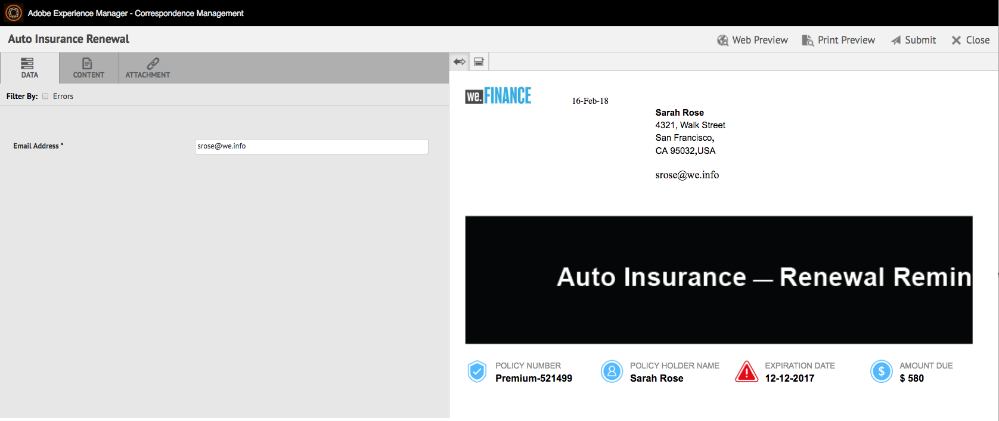

   Proceed to entering data, managing the content, and managing the attachments.

### Enter Data {#enter-data}

1. In the Data tab, enter the data for variables, form data model properties, and print template (XDP) fields, as required. Fill up all the mandatory fields marked with an asterisk (&ast;) to enable the **Submit** button.

   Select a data field value in the Interactive Communication preview to highlight the corresponding data field in the Data tab or conversely.

### Manage Content {#manage-content}

In the Content tab, manage the content such as document fragments and content variables in the Interactive Communication.

1. Select **[!UICONTROL Content]**. The content tab of the Interactive Communication appears.

   

1. Edit the document fragments, as required, in the Content tab. To bring focus to the relevant fragment in the content hierarchy, you can either select the relevant line or paragraph in the Interactive Communication preview or select the fragment directly in the Content hierarchy.

   For example, the document fragment with the line "Make a payment online now ... " is selected in the preview in the below graphic and the same document fragment has got selected in the Content tab.

   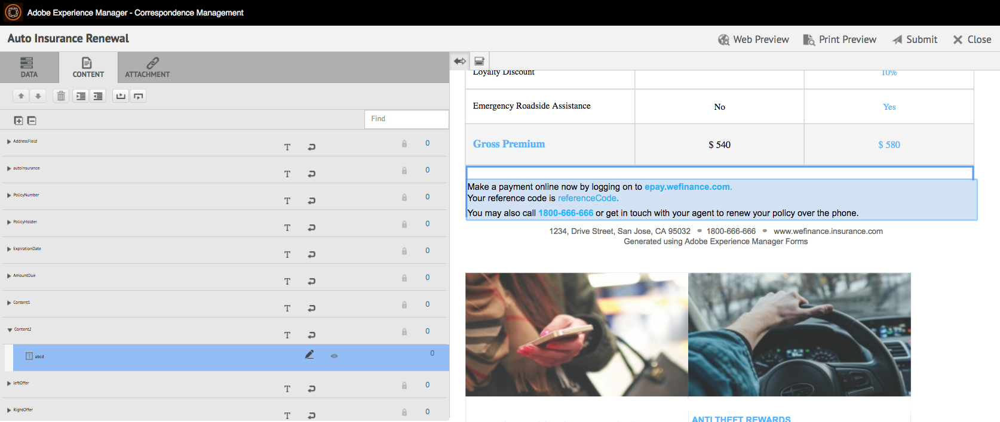

   In the Content or Data tab, by tapping Highlight Selected Modules In Content ( ) on upper left of the preview, you can disable or enable functionality to go to the document fragment when the relevant text, paragraph, or data field is tapped/selected in the preview.

   The fragments that can be edited by the agent while creating the Interactive Communication have the Edit Selected Content ( ) icon. Select the Edit Selected Content icon to launch the fragment in edit mode and make changes in it. Use the following options for formatting and managing text:

    * [Formatting options](#formattingtext)

        * [Copy paste formatted text from other applications](#pasteformattedtext)
        * [Highlight parts of text](#highlightemphasize)

    * [Special characters](#specialcharacters)
    * [Keyboard shortcuts](/help/forms/using/keyboard-shortcuts.md)

   For more information on the actions available for various document fragments in the Agent user interface, see [Actions and info available in the Agent user interface](#actionsagentui).

1. To add a page break to the print output of the Interactive Communication, place the cursor where you want to insert a page break and select Page Break Before or Page Break After ( ).

   An explicit page break placeholder gets inserted in the Interactive Communication. To view how an explicit page break affects the Interactive Communication, see the print preview.

   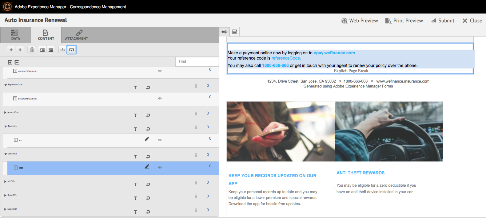

   Proceed to managing the attachments of the Interactive Communication.

### Manage Attachments {#manage-attachments}

1. Select **[!UICONTROL Attachment]**. The Agent UI displays the available attachments as set up while creating the Interactive Communication.

   You can choose not to submit an attachment along with the Interactive Communication by tapping the view icon and you can select the cross in the attachment to delete it (if the agent is allowed to delete or hide the attachment) from the Interactive Communication. For the attachments specified as mandatory while creating the Interactive Communication, the View and Delete icons are disabled.

   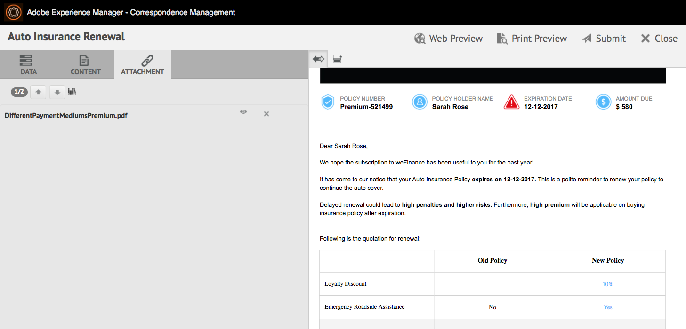

1. Select the Library Access ( ) icon to access Content Library to insert DAM assets as attachments.

   >[!NOTE]
   >
   >Library Access icon is available only if library access was enabled while creating the Interactive Communication (in the Document Container properties of the Print channel).

1. If the order of the attachments was not locked while creating the Interactive Communication, you can reorder the attachments by selecting an attachment and tapping the down and up arrows.
1. Use Web Preview and Print Preview to see if the two outputs are as per your requirement.

   If you find the previews to be satisfactory, select **[!UICONTROL Submit]** to submit/send the Interactive Communication to a post process. Or to make changes, exit the preview to go back to the making changes.

## Formatting text {#formattingtext}

While editing a text fragment in the agent UI, the toolbar changes depending on the type of edits you choose to make: Font, Paragraph, or List:

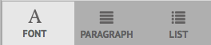 

Font toolbar


Paragraph toolbar


List toolbar

### Highlight/Emphasize parts of text {#highlightemphasize}

To highlight\emphasize parts of text in an editable fragment, select the text and select Highlight Color.

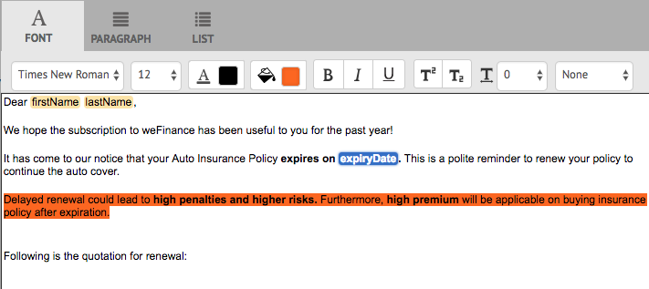

### Paste formatted text {#pasteformattedtext}

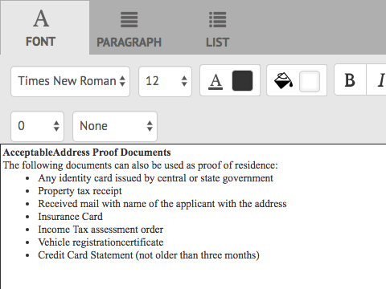

### Insert special characters in text {#specialcharacters}

The Agent UI has built in support for 210 special characters. The admin can [add support for more/custom special characters by customization](/help/forms/using/custom-special-characters.md).

#### Attachment delivery {#attachmentdelivery}

* When the Interactive Communication is rendered using Server-side APIs as an interactive or non-interactive PDF, the rendered PDF contains attachments as PDF attachments.
* When a post process associated with an Interactive Communication is loaded as part of the Submit using Agent UI, attachments are passed as the List&lt;com.adobe.idp.Document&gt; inAttachmentDocs parameter.
* Delivery mechanism workflows, such as email and print, also deliver attachments along with the PDF version of the Interactive Communication.

## Actions and info available in the Agent user interface {#actionsagentui}

### Document fragments {#document-fragments}


* **Up/Down arrows**: Arrows to move document fragments up or down in the Interactive Communication.
* **Delete**: If allowed, delete the document fragment from the Interactive Communication.
* **Page Break Before** (applicable for child fragments of target area): Inserts page break before the document fragment.
* **Indent**: Increase or decrease indent of a document fragment.
* **Page Break After** (applicable for child fragments of target area): Inserts page break after the document fragment.


* Edit (text fragments only): Open rich text editor for editing the text document fragment. For more information, see [Formatting text](#formattingtext).

* Selection (eye icon): Includes\excludes document fragment from the Interactive Communication.
* Unfilled Values (info): Indicates the number of unfilled variables in the document fragment.

### List document fragments {#list-document-fragments}


* Insert Blank Line: Inserts new blank line.
* Selection (eye icon): Includes\excludes document fragment from the Interactive Communication.
* Skip Bullets/Numberings: Enable if you want to skip bullets/numbering in the list document fragment.
* Unfilled Values (info): Indicates the number of unfilled variables in the document fragment.

## Save Interactive Communications as a draft {#save-as-draft}

You can use the Agent UI to save one or more drafts for each Interactive Communication and retrieve the draft later to continue working on it. You can specify a different name for each draft to identify it.

Adobe recommends executing these instructions in sequence to successfully save an Interactive Communication as a draft.

### Enable the Save as a Draft feature {#before-save-as-draft}

The Save as a Draft feature is not enabled, by default. Perform the following steps to enable the feature:

1. Implement the [ccrDocumentInstance](https://helpx.adobe.com/experience-manager/6-5/forms/javadocs/com/adobe/fd/ccm/ccr/ccrDocumentInstance/api/services/CCRDocumentInstanceService.html) Service Provider Interface (SPI).

   The SPI enables you to save the draft version of the Interactive Communication to the database with a draft ID as the unique identifier. These instructions assume that you have prior knowledge on how to build an OSGi bundle using a Maven project.

   For sample SPI implementation, see [Sample ccrDocumentInstance SPI implementation](#sample-ccrDocumentInstance-spi).
1. Open `http://<hostname>:<port>/ system/console/bundles` and select **[!UICONTROL Install/Update]** to upload the OSGi bundle. Verify that the status of the uploaded package displays as **Active**. Restart the server if the status of the package does not display as **Active**.
1. Go to `https://'[server]:[port]'/system/console/configMgr`.
1. Select **[!UICONTROL Create Correspondence Configuration]**.
1. Select **[!UICONTROL Enable Save Using CCRDocumentInstanceService]** and select **[!UICONTROL Save]**.

### Save an Interactive Communication as draft {#save-as-draft-agent-ui}

Perform the following steps to save an Interactive Communication as a draft:

1. Select an Interactive Communication in Forms Manager and select **[!UICONTROL Open Agent UI]**.

1. Make appropriate changes in the Agent UI and select **[!UICONTROL Save as Draft]**.

1. Specify the name of the Draft in the **[!UICONTROL Name]** field and select **[!UICONTROL Done]**.

Once you save the Interactive Communication as a draft, select **[!UICONTROL Save Changes]** to save any further changes to the draft.

### Retrieve the draft of an Interactive Communication {#retrieve-draft}

After saving an Interactive Communication as a draft, you can retrieve it to continue working on it. Retrieve the Interactive Communication using:

`https://server:port/aem/forms/createcorrespondence.hmtl?draftid=[draftid]`

[draftid] refers to the unique identifier for the draft version that gets generated after saving an Interactive Communication as a draft.

### Sample ccrDocumentInstance SPI implementation {#sample-ccrDocumentInstance-spi}

Implement the `ccrDocumentInstance` SPI to save an Interactive Communication as a draft. The following is a sample implementation of the `ccrDocumentInstance` SPI.

```javascript
package Implementation;

import com.adobe.fd.ccm.ccr.ccrDocumentInstance.api.exception.CCRDocumentException;
import com.adobe.fd.ccm.ccr.ccrDocumentInstance.api.model.CCRDocumentInstance;
import com.adobe.fd.ccm.ccr.ccrDocumentInstance.api.services.CCRDocumentInstanceService;
import org.apache.commons.lang3.StringUtils;
import org.osgi.service.component.annotations.Component;
import org.slf4j.Logger;
import org.slf4j.LoggerFactory;

import java.util.*;


@Component(service = CCRDocumentInstanceService.class, immediate = true)
public class CCRDraftService implements CCRDocumentInstanceService {

    private static final Logger logger = LoggerFactory.getLogger(CCRDraftService.class);

    private HashMap<String, Object> draftDataMap = new HashMap<>();

    @Override
    public String save(CCRDocumentInstance ccrDocumentInstance) throws CCRDocumentException {
        String documentInstanceName = ccrDocumentInstance.getName();
        if (StringUtils.isNotEmpty(documentInstanceName)) {
            logger.info("Saving ccrData with name : {}", ccrDocumentInstance.getName());
            if (!CCRDocumentInstance.Status.SUBMIT.equals(ccrDocumentInstance.getStatus())) {
                ccrDocumentInstance = mySQLDataBaseServiceCRUD(ccrDocumentInstance,null, "SAVE");
            }
        } else {
            logger.error("Could not save data as draft name is empty");
        }
        return ccrDocumentInstance.getId();
    }

    @Override
    public void update(CCRDocumentInstance ccrDocumentInstance) throws CCRDocumentException {
        String documentInstanceName = ccrDocumentInstance.getName();
        if (StringUtils.isNotEmpty(documentInstanceName)) {
            logger.info("Saving ccrData with name : {}", documentInstanceName);
            mySQLDataBaseServiceCRUD(ccrDocumentInstance, ccrDocumentInstance.getId(), "UPDATE");
        } else {
            logger.error("Could not save data as draft Name is empty");
        }
    }

    @Override
    public CCRDocumentInstance get(String id) throws CCRDocumentException {
        CCRDocumentInstance cCRDocumentInstance;
        if (StringUtils.isEmpty(id)) {
            logger.error("Could not retrieve data as draftId is empty");
            cCRDocumentInstance = null;
        } else {
            cCRDocumentInstance = mySQLDataBaseServiceCRUD(null, id,"GET");
        }
        return cCRDocumentInstance;
    }

    @Override
    public List<CCRDocumentInstance> getAll(String userId, Date creationTime, Date updateTime,
                                            Map<String, Object> optionsParams) throws CCRDocumentException {
        List<CCRDocumentInstance> ccrDocumentInstancesList = new ArrayList<>();

        HashMap<String, Object> allSavedDraft = mySQLGetALLData();
        for (String key : allSavedDraft.keySet()) {
            ccrDocumentInstancesList.add((CCRDocumentInstance) allSavedDraft.get(key));
        }
        return ccrDocumentInstancesList;
    }

    //The APIs call the service in the database using the following section.
    private CCRDocumentInstance mySQLDataBaseServiceCRUD(CCRDocumentInstance ccrDocumentInstance,String draftId, String method){
        if(method.equals("SAVE")){

            String autoGenerateId = draftDataMap.size() + 1 +"";
            ccrDocumentInstance.setId(autoGenerateId);
            draftDataMap.put(autoGenerateId, ccrDocumentInstance);
            return ccrDocumentInstance;

        }else if (method.equals("UPDATE")){

            draftDataMap.put(ccrDocumentInstance.getId(), ccrDocumentInstance);
            return ccrDocumentInstance;

        }else if(method.equals("GET")){

            return (CCRDocumentInstance) draftDataMap.get(draftId);

        }
        return null;
    }

    private HashMap<String, Object> mySQLGetALLData(){
        return draftDataMap;
    }
}
```

The `save`, `update`, `get`, and `getAll` operations call the database service to save an Interactive Communication as a draft, update an Interactive Communication, retrieve data from the database, and retrieve data for all Interactive Communications available in the database. This sample uses `mySQLDataBaseServiceCRUD` as the name of the database service.

The following table explains the sample `ccrDocumentInstance` SPI implementation. It demonstrates how the `save`, `update`, `get`, and `getAll` operations call the database service in the sample implementation.

<table> 
 <tbody>
 <tr>
  <td><p><strong>Operation</strong></p></td>
  <td><p><strong>Database service examples</strong></p></td> 
   </tr>
  <tr>
   <td><p>You can either create a draft for an Interactive Communication or submit it directly. The API for the save operation checks if the Interactive Communication is submitted as a draft and it includes a draft name. The API then calls the mySQLDataBaseServiceCRUD service with Save as the input method.</p></br>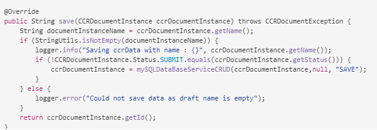</td>
   <td><p>The mySQLDataBaseServiceCRUD service verifies Save as the input method and generates an autogenerated draft ID and returns it to AEM. The logic to generate a draft ID can vary based on the database.</p></br>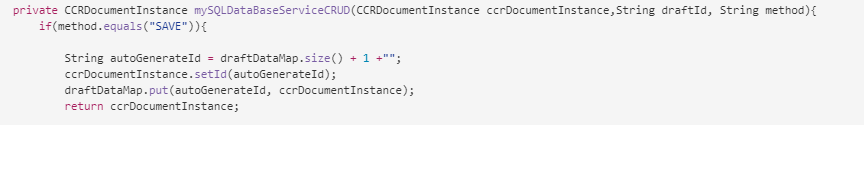</td>
   </tr>
  <tr>
   <td><p>The API for the update operation retrieves the status of Interactive Communication draft and checks if the Interactive Communication includes a draft name. The API calls the mySQLDataBaseServiceCRUD service to update that status in Database.</p></br>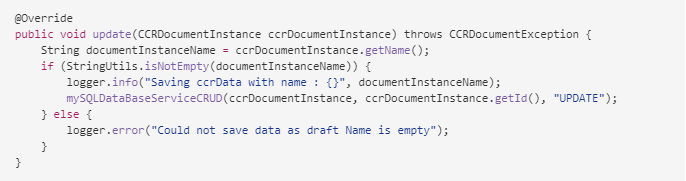</td>
   <td><p>The mySQLDataBaseServiceCRUD service verifies Update as the input method and saves the status of Interactive Communication draft in the database.</br></p></td>
   </tr>
   <tr>
   <td><p>The API for the get operation checks if the Interactive Communication includes a draft ID. The API then calls the mySQLDataBaseServiceCRUD service with Get as the input method to retrieve the data for the Interactive Communication.</br></p>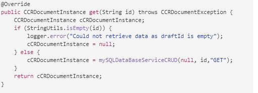</td>
   <td><p>The mySQLDataBaseServiceCRUD service verifies Get as the input method and retrieves the data for the Interactive Communication based on the draft ID.</p></br>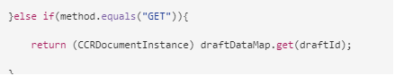</td>
   </tr>
   <tr>
   <td><p>The API for the getAll operation calls the mySQLGetALLData service to retrieve data for all Interactive Communications saved in the database.</br></p>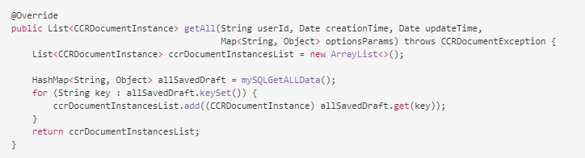</td>
   <td><p>The mySQLGetALLData service retrieves data for all Interactive Communications saved in the database.</p></br>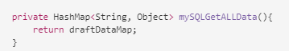</td>
   </tr>
  </tbody>
</table>

The following is an example of the `pom.xml` file that is part of the implementation:

```xml

<?xml version="1.0" encoding="UTF-8"?>
<project xmlns="https://maven.apache.org/POM/4.0.0"
         xmlns:xsi="https://www.w3.org/2001/XMLSchema-instance"
         xsi:schemaLocation="https://maven.apache.org/POM/4.0.0 https://maven.apache.org/xsd/maven-4.0.0.xsd">
    <modelVersion>4.0.0</modelVersion>

    <groupId>com.adobe.livecycle</groupId>
    <artifactId>draft-sample</artifactId>
    <version>2.0.0-SNAPSHOT</version>

    <name>Interact</name>
    <packaging>bundle</packaging>

    <dependencies>
        <dependency>
            <groupId>com.adobe.aemfd</groupId>
            <artifactId>aemfd-client-sdk</artifactId>
            <version>6.0.160</version>
        </dependency>
    </dependencies>


    <!-- ====================================================================== -->
    <!-- B U I L D D E F I N I T I O N -->
    <!-- ====================================================================== -->
    <build>
        <plugins>
            <plugin>
                <groupId>org.apache.felix</groupId>
                <artifactId>maven-bundle-plugin</artifactId>
                <version>3.3.0</version>
                <extensions>true</extensions>
                <executions>
                    <!--Configure extra execution of 'manifest' in process-classes phase to make sure SCR metadata is generated before unit test runs-->
                    <execution>
                        <id>scr-metadata</id>
                        <goals>
                            <goal>manifest</goal>
                        </goals>
                    </execution>
                </executions>
                <configuration>
                    <exportScr>true</exportScr>
                    <instructions>
                        <!-- Enable processing of OSGI DS component annotations -->
                        <_dsannotations>*</_dsannotations>
                        <!-- Enable processing of OSGI metatype annotations -->
                        <_metatypeannotations>*</_metatypeannotations>
                        <Bundle-SymbolicName>${project.groupId}-${project.artifactId}</Bundle-SymbolicName>
                    </instructions>
                </configuration>
            </plugin>
            <plugin>
                <groupId>org.apache.maven.plugins</groupId>
                <artifactId>maven-surefire-plugin</artifactId>
            </plugin>
            <plugin>
                <groupId>org.apache.maven.plugins</groupId>
                <artifactId>maven-compiler-plugin</artifactId>
                <configuration>
                    <source>8</source>
                    <target>8</target>
                </configuration>
            </plugin>
        </plugins>
    </build>
    <profiles>
        <profile>
            <id>autoInstall</id>
            <build>
                <plugins>
                    <plugin>
                        <groupId>org.apache.sling</groupId>
                        <artifactId>maven-sling-plugin</artifactId>
                        <executions>
                            <execution>
                                <id>install-bundle</id>
                                <phase>install</phase>
                                <goals>
                                    <goal>install</goal>
                                </goals>
                            </execution>
                        </executions>
                    </plugin>
                </plugins>
            </build>
        </profile>
    </profiles>

</project>
```

>[!NOTE]
>
>Ensure that you update the `aemfd-client-sdk` dependency to 6.0.160 in the `pom.xml` file.
