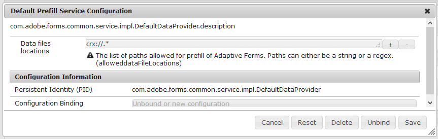

# Prefill adaptive form fields{#prefill-adaptive-form-fields}

<span class="preview"> Adobe recommends using the modern and extensible data capture [Core Components](https://experienceleague.adobe.com/docs/experience-manager-core-components/using/adaptive-forms/introduction.html) for [creating new Adaptive Forms](/help/forms/using/create-an-adaptive-form-core-components.md) or [adding Adaptive Forms to AEM Sites pages](/help/forms/using/create-or-add-an-adaptive-form-to-aem-sites-page.md). These components represent a significant advancement in Adaptive Forms creation, ensuring impressive user experiences. This article describes older approach to author Adaptive Forms using foundation components. </span>

| Version | Article link |
| -------- | ---------------------------- |
| AEM as a Cloud Service |    [Click here](https://experienceleague.adobe.com/docs/experience-manager-cloud-service/content/forms/adaptive-forms-authoring/authoring-adaptive-forms-foundation-components/prepopulate-adaptive-form-fields.html)                  |
| AEM 6.5     | This article         |

## Introduction {#introduction}

You can prefill the fields of an adaptive form using existing data. When a user opens a form, the values for those fields are prefilled. To prefill data in an adaptive form, make the user data available as a prefill XML / JSON in the format that adheres to prefill data structure of adaptive forms.

## Structure of prefill data {#the-prefill-structure}

An adaptive form can have mix of bound and unbound fields. Bound fields are fields which are dragged from the Content Finder tab and contain non-empty `bindRef` property value in the field edit dialog. Unbound fields are dragged directly from the component browser of Sidekick and have an empty `bindRef` value.

You can prefill both bound and unbound fields of an adaptive form. The prefill data contains the afBoundData and afUnBoundData sections to prefill both bound and unbound fields of an adaptive form. The `afBoundData` section contains the prefill data for bound fields and panels. This data must be compliant with the associated form model schema:

* For adaptive forms using the [XFA form template](../../forms/using/prepopulate-adaptive-form-fields.md), use the prefill XML compliant with the data schema of the XFA template.
* For adaptive forms using [XML schema](#xml-schema-af), use the prefill XML compliant with the XML schema structure.
* For adaptive forms using [JSON schema](#json-schema-based-adaptive-forms), use the prefill JSON compliant with the JSON schema.
* For adaptive forms using FDM schema, use the prefill JSON compliant with FDM schema.
* For adaptive forms with [no form model](#adaptive-form-with-no-form-model), there is no bound data. Every field is an unbound field and is prefilled using the unbound XML.

### Sample Prefill XML structure {#sample-prefill-xml-structure}

```xml
<?xml version="1.0" encoding="UTF-8"?>
<afData>
  <afBoundData>
     <employeeData>
        .
     </employeeData>
  </afBoundData>

  <afUnboundData>
    <data>
      <textbox>Hello World</textbox>
         .
         .
      <numericbox>12</numericbox>
         . 
         .              
    </data>
  </afUnboundData>
</afData>
```

### Sample Prefill JSON structure {#sample-prefill-json-structure}

```javascript
{
   "afBoundData": {
      "employeeData": { }
   },
   "afUnboundData": {
      "data": {
         "textbox": "Hello World",
         "numericbox": "12"
      }
   }
}
```

For bound fields with same bindref or unbound fields with same name, data specified in the XML tag or JSON object is filled in all the fields. For example, two fields in a form are mapped to the name `textbox` in the prefill data. During runtime, if the first text box field contains "A", then "A" is automatically filled in the second text box. This linking is called live linking of adaptive form fields.

### Adaptive form using XFA form template {#xfa-based-af}

The structure of prefill XML and the submitted XML for XFA-based adaptive forms is as follows:

* **Prefill XML Structure**: The prefill XML for XFA-based adaptive form must be compliant with the data schema of the XFA form template. To prefill unbound fields, wrap the prefill XML structure into `/afData/afBoundData` tag.

* **Submitted XML Structure**: When no prefill XML is used, the submitted XML contains data for both bound and unbound fields in `afData` wrapper tag. If a prefill XML is used, the submitted XML has the same structure as the prefill XML. If the prefill XML starts with the `afData` root tag, the output XML also has the same format. If the prefill XML does not have `afData/afBoundData`wrapper and instead starts directly from the schema root tag like `employeeData`, the submitted XML also starts with the `employeeData` tag.

Prefill-Submit-Data-ContentPackage.zip

[Get File](assets/prefill-submit-data-contentpackage.zip)
Sample containing prefill data and submitted data

### XML schema-based adaptive forms&nbsp; {#xml-schema-af}

The structure of prefill XML and submitted XML for adaptive forms based on XML schema is as follows:

* **Prefill XML structure**: The prefill XML must be compliant to associated XML Schema. To prefill unbound fields, wrap the prefill XML structure into /afData/afBoundData tag.
* **Submitted XML structure**: if no prefill XML is used, the submitted XML contains data for both bound and unbound fields in `afData` wrapper tag. If the prefill XML is used, the submitted XML has the same structure as the prefill XML. If the prefill XML starts with the `afData` root tag, the output XML has the same format. If the prefill XML does not have `afData/afBoundData` wrapper and instead start directly from the schema root tag like `employeeData`, the submitted XML also starts with the `employeeData` tag.

```xml
<?xml version="1.0" encoding="utf-8" ?> 
<xs:schema targetNamespace="https://adobe.com/sample.xsd"
            xmlns="https://adobe.com/sample.xsd"
            xmlns:xs="https://www.w3.org/2001/XMLSchema">
 
    <xs:element name="sample" type="SampleType"/>
         
    <xs:complexType name="SampleType">
        <xs:sequence>
            <xs:element name="noOfProjectsAssigned" type="xs:string"/>
        </xs:sequence>
    </xs:complexType>
</xs:schema>
```

For fields whose model is XML schema, the data is prefilled in the `afBoundData` tag as shown in the sample XML below. It can be used for prefilling an adaptive form with one or more unbound text fields.

```xml
<?xml version="1.0" encoding="UTF-8"?><afData>
  <afUnboundData>
    <data>
      <textbox>Ignorance is bliss :) </textbox>
    </data>
  </afUnboundData>
  <afBoundData>
    <data>
      <noOfProjectsAssigned>twelve</noOfProjectsAssigned>
    </data>
  </afBoundData>
</afData>

```

>[!NOTE]
>
>It is recommended not to use unbound fields in bound panels (panels with non-empty `bindRef` that has been created by dragging components from Sidekick or Data Sources tab). It may cause loss of data of these unbound fields. Also, it is recommended that the names of the fields are unique across the form, specially for unbound fields.

#### An example without afData and afBoundData wrapper {#an-example-without-afdata-and-afbounddata-wrapper}

```xml
<?xml version="1.0" encoding="UTF-8"?><config>
 <assignmentDetails descriptionOfAssignment="Some Science Project" durationOfAssignment="34" financeRelatedProject="1" name="Lisa" numberOfMentees="1"/>
 <assignmentDetails descriptionOfAssignment="Kidding, right?" durationOfAssignment="4" financeRelatedProject="1" name="House" numberOfMentees="3"/>
</config>

```

### JSON schema-based adaptive forms {#json-schema-based-adaptive-forms}

For adaptive forms based on JSON schema, the structure of prefill JSON and submitted JSON is described below. For more information, see [Creating adaptive forms using JSON schema](../../forms/using/adaptive-form-json-schema-form-model.md).

* **Prefill JSON structure**: The prefill JSON must be compliant with the associated JSON Schema. Optionally, it can be wrapped into the /afData/afBoundData Object if you want to prefill unbound fields as well.
* **Submitted JSON structure**: if no prefill JSON is used, the submitted JSON contains data for both bound and unbound fields in afData wrapper tag. If the prefill JSON is used, the submitted JSON has the same structure as the prefill JSON. If the prefill JSON starts with the afData root object, the output JSON has the same format. If the prefill JSON does not have afData/afBoundData wrapper and instead starts directly from the schema root object such as user, the submitted JSON also starts with the user object.

```json
{
    "id": "https://some.site.somewhere/entry-schema#",
    "$schema": "https://json-schema.org/draft-04/schema#",
    "type": "object",
    "properties": {
        "address": {
            "type": "object",
            "properties": { 
    "name": {
     "type": "string"
    },
    "age": {
     "type": "integer"
}}}}}
```

For fields which use JSON schema model, the data is prefilled in the afBoundData object as shown in the sample JSON below. It can be used for prefilling an adaptive form with one or more unbound text fields. Below is an example of data with `afData/afBoundData` wrapper:

```json
{
  "afData": {
    "afUnboundData": {
      "data": { "textbox": "Ignorance is bliss :) " }
    },
    "afBoundData": {
      "data": { {
   "user": {
    "address": {
     "city": "Noida",
     "country": "India"
}}}}}}}
```

Below is an example without `afData/afBoundData` wrapper:

```json
{
 "user": {
  "address": {
   "city": "Noida",
   "country": "India"
}}}
```

>[!NOTE]
>
>Using unbound fields in bound panels (panels with non-empty bindRef that have been created by dragging components from the Sidekick or Data Sources tab) is **not** recommended as it might cause loss of data of the unbound fields. It is recommended to have unique field names across the form, especially for unbound fields.

### Adaptive Form with no form model {#adaptive-form-with-no-form-model}

For adaptive forms with no form model, the data for all the fields is under the `<data>` tag of `<afUnboundData> tag`.

Also, take note of the following:

The XML tags for the user data submitted for various fields are generated using the name of the fields. Therefore, the field names must be unique.

```xml
<?xml version="1.0" encoding="UTF-8"?><afData>
  <afUnboundData>
    <data>
      <radiobutton>2</radiobutton>
      <repeatable_panel_no_form_model>
        <numericbox>12</numericbox>
      </repeatable_panel_no_form_model>
      <repeatable_panel_no_form_model>
        <numericbox>21</numericbox>
      </repeatable_panel_no_form_model>
      <checkbox>2</checkbox>
      <textbox>Nopes</textbox>
    </data>
  </afUnboundData>
  <afBoundData/>
</afData>

```

## Configuring prefill service using Configuration Manager {#configuring-prefill-service-using-configuration-manager}

To enable prefill service, specify the Default Prefill Service Configuration in the AEM Web Console Configuration. Use the following steps to configure the Prefill service:

>[!NOTE]
>
>Prefill Service Configuration is applicable for adaptive forms, HTML5 forms, and HTML5 form sets.

1. Open **[!UICONTROL Adobe Experience Manager Web Console Configuration]** by using the URL:   
   https://&lt;server&gt;:&lt;port&gt;/system/console/configMgr
1. Search and open **[!UICONTROL Default Prefill Service Configuration]**. 

   

1. Enter the data location or a regex (regular expression) for the **Data files locations**. Examples of valid Data files locations are:

    * file:///C:/Users/public/Document/Prefill/.&#42;
    * https://localhost:8000/somesamplexmlfile.xml

   >[!NOTE]
   >
   >By default, prefill is allowed through crx files for all types of Adaptive Forms (XSD, XDP, JSON, FDM, and no Form Model based). Prefill is allowed only with JSON and XML files.

1. The prefill service is now configured for your form.

   >[!NOTE]
   >
   >The crx protocol takes care of prefilled data security and hence, is allowed by default. Prefilling via other protocols using generic regex might cause vulnerability. In the configuration, specify a secure URL configuration for protecting your data.

## The curious case of repeatable panels {#the-curious-case-of-repeatable-panels}

Generally, bound (form schema) and unbound fields are authored in the same adaptive form, but the following are a few exceptions in case the bound are repeatable:

* Unbound repeatable panels are not supported for adaptive forms using the XFA form template, XSD, JSON schema, or FDM schema.
* Do not use unbound fields in bound repeatable panels.

>[!NOTE]
>
>As a rule of thumb, do not mix bound and unbound fields if they are intersected in data filled by the end user in unbound fields. If possible, you should modify the schema or the XFA form template and add an entry for unbound fields, so that it also becomes bound and its data is available like other fields in submitted data.

## Supported protocols for prefilling user data {#supported-protocols-for-prefilling-user-data}

Adaptive forms can be prefilled with user data in prefill data format via the following protocols when configured with valid regex:

### The crx:// protocol {#the-crx-protocol}

```http
https://localhost:4502/content/forms/af/xml.html?wcmmode=disabled&dataRef=crx:///tmp/fd/af/myassets/sample.xml
```

The specified node must have a property called `jcr:data` and hold the data.

### The file:// protocol&nbsp; {#the-file-protocol-nbsp}

```http
https://localhost:4502/content/forms/af/someAF.html?wcmmode=disabled&dataRef=file:///C:/Users/form-user/Downloads/somesamplexml.xml

```

The referred file must be on the same server.

### The https:// protocol {#the-http-protocol}

```http
https://localhost:4502/content/forms/af/xml.html?wcmmode=disabled&dataRef=https://localhost:8000/somesamplexmlfile.xml
```

### The service:// protocol {#the-service-protocol}

```http
https://localhost:4502/content/forms/af/abc.html?wcmmode=disabled&dataRef=service://[SERVICE_NAME]/[IDENTIFIER]
```

* SERVICE_NAME refers to the name of the OSGI prefill service. Refer [Create and run a prefill service](../../forms/using/prepopulate-adaptive-form-fields.md#create-and-run-a-prefill-service).
* IDENTIFIER refers to any metadata required by the OSGI prefill service to fetch the prefill data. An identifier to the logged-in user is an example of metadata that could be used.

>[!NOTE]
>
>Passing authentication parameters is not supported.

### Setting data attribute in slingRequest {#setting-data-attribute-in-slingrequest}

You can also set the `data` attribute in `slingRequest`, where the `data` attribute is a string containing XML or JSON, as shown in the sample code below (Example is for XML):

```javascript
<%
           String dataXML="<afData>" +
                            "<afUnboundData>" +
                                "<data>" +
                                    "<first_name>"+ "Tyler" + "</first_name>" +
                                    "<last_name>"+ "Durden " + "</last_name>" +
                                    "<gender>"+ "Male" + "</gender>" +
                                    "<location>"+ "Texas" + "</location>" +
                                    "</data>" +
                            "</afUnboundData>" +
                        "</afData>";
        slingRequest.setAttribute("data", dataXML);
%>
```

You can write a simple XML or JSON string containing all your data and set it in slingRequest. This can easily be done in your renderer JSP for any component, which you want to include in the page where you can set the slingRequest data attribute.

For example, where you want a specific design for your page with a specific type of header. To achieve this, you can write your own `header.jsp`, which you can include in your page component and set the `data` attribute.

Another good example is a use case where you would like to prefill data on login through social accounts like Facebook, Twitter, or LinkedIn. In this case, you can include a simple JSP in `header.jsp`, which fetches data from the user account and sets the data parameter.

prefill-page component.zip

[Get File](assets/prefill-page-component.zip)
Sample prefill.jsp in page component

## AEM Forms custom prefill service {#aem-forms-custom-prefill-service}

You can use custom prefill service for the scenarios, where you constantly read data from a pre-defined source. The prefill service reads data from defined data sources and prefills the fields of the adaptive form with the content of the prefill data file. It also helps you permanently associate prefilled data with an adaptive form.

### Create and run a prefill service {#create-and-run-a-prefill-service}

The prefill service is an OSGi service and is packaged through OSGi bundle. You create the OSGi bundle, upload, and install it to AEM Forms bundles. Before you get started with creating the bundle:

* [Download the AEM Forms Client SDK](https://helpx.adobe.com/aem-forms/kb/aem-forms-releases.html)
* Download the boilerplate package

* Place the data (prefill data) file in the crx-repository. You can place the file at any location in the \contents folder of crx-repository.

[Get File](assets/prefill-sumbit-xmlsandcontentpackage.zip)

#### Create a prefill service {#create-a-prefill-service}

The boilerplate package (sample prefill service package) contains sample implementation of AEM Forms prefill service. Open the boilerplate package in a code editor. For example, open the boilerplate project in Eclipse for editing. After you open the boilerplate package in a code editor, perform the following steps to create the service.

1. Open the src\main\java\com\adobe\test\Prefill.java file for editing.
1. In the code, set value of:

    * `nodePath:` The node path variable pointing to crx-repository location contains path of the data (prefill) file. For example, /content/prefilldata.xml
    * `label:` The label parameter specifies display name of the service. For example, Default Prefill Service

1. Save and close the `Prefill.java` file.
1. Add the `AEM Forms Client SDK` package to the build path of the boilerplate project.
1. Compile the project and create the .jar for the bundle.

#### Start and use the prefill service {#start-and-use-the-prefill-service}

To start the prefill service, upload the JAR file to AEM Forms Web Console, and activate the service. Now, the service starts appearing in adaptive forms editor. To associate a prefill service to an adaptive form:

1. Open the adaptive form in Forms Editor and open the Properties panel for the Form Container.
1. In the Properties console, navigate to AEM Forms container &gt; Basic &gt; Prefill Service.
1. Select the Default Prefill Service and click **[!UICONTROL Save]**. The service is associated to the form.

## Prepopulate data at client {#prefill-at-client}
 
When you prefill an adaptive form, the AEM Forms server merges data with an adaptive form and delivers the filled form to you. By default, the data merge action takes place at the server.

You can configure the AEM Forms server to perform the data merge action at the client instead of the server. It significantly reduces the time required to prefill and render adaptive forms. By default, the feature is disabled. You can enable it from the Configuration Manager or command line.

* To enable or disable from configuration manager:
  1. Open AEM Configuration Manager.
  1. Locate and open the Adaptive Form and Interactive Communication Web Channel Configuration
  1. Enable the Configuration.af.clientside.datamerge.enabled.name option
* To enable or disable from the command line:
  * To enable, run the following cURL command:
    `curl -u admin:admin -X POST -d apply=true \ -d propertylist=af.clientside.datamerge.enabled \ -d af.clientside.datamerge.enabled=true \ http://${crx.host}:${crx.port}/system/console/configMgr/Adaptive%20Form%20and%20Interactive%20Communication%20Web%20Channel%20Configuration`

  * To disable, run the following cURL command:
    `curl -u admin:admin -X POST -d apply=true \ -d propertylist=af.clientside.datamerge.enabled \ -d af.clientside.datamerge.enabled=false \ http://${crx.host}:${crx.port}/system/console/configMgr/Adaptive%20Form%20and%20Interactive%20Communication%20Web%20Channel%20Configuration`

   To take full advantage of the prepopulate data at client option, update your prefill service to return [FileAttachmentMap](https://helpx.adobe.com/experience-manager/6-5/forms/javadocs/com/adobe/forms/common/service/PrefillData.html) and [CustomContext](https://helpx.adobe.com/experience-manager/6-5/forms/javadocs/com/adobe/forms/common/service/PrefillData.html)
