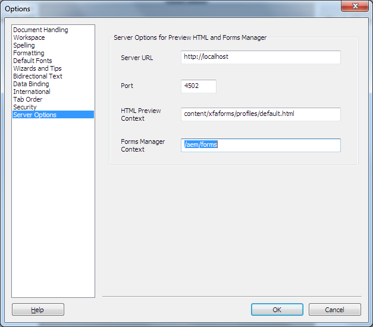

# Generate HTML5 preview of an XDP form{#generate-html-preview-of-an-xdp-form}

While designing a form in AEM Forms Designer, besides previewing the PDF rendition of a form, you can also preview an HTML5 rendition of it. You can use the **Preview HTML** tab to preview a form as it would appear in a browser.

## Enable HTML Preview for XDP forms in Designer {#html-preview-of-forms-in-forms-designer}

To enable Designer to generate HTML preview of XDP forms, perform the following configurations:

* Configure Apache Sling Authentication Service
* Disable protected mode
* Provide details of AEM Forms server

### Configure Apache Sling Authentication Service {#configure-apache-sling-authentication-service}

1. Go to `https://'[server]:[port]'/system/console/configMgr` on AEM Forms running on OSGi or
   `https://'[server]:[port]'/lc/system/console/configMgr` on AEM Forms running on JEE.
1. Locate and click **Apache Sling Authentication Service** configuration to open it in edit mode.

1. Depending on whether you are running AEM Forms on OSGi or JEE, add the following in the **Authentication Requirements** field:

    * AEM Forms on JEE

        * -/content/xfaforms
        * -/etc/clientlibs

    * AEM Forms on OSGi

        * -/content/xfaforms
        * -/etc/clientlibs/fd/xfaforms

   >[!NOTE]
   >
   >Do not copy-paste the specified value in the Authentication Requirements field as it may corrupt the special characters in the value. Instead, type the specified value in the field.

1. Specify a user name and password in **[!UICONTROL Anonymous User Name]** and **[!UICONTROL Anonymous User Password]** fields, respectively. The specified credentials are used to handle anonymous authentication and allow access to anonymous users.
1. Click **Save** to save the configuration.

### Disable protected mode {#disable-protected-mode}

The [protected mode](../../forms/using/get-xdp-pdf-documents-aem.md) is on, by default. Keep it enabled for the production environments. You can disable it for a development environment to preview HTML5 Forms in desinger. Perform the following steps to disable it:

1. Log in to AEM Web Console as an administrator.

    * URL for AEM Forms on OSGi is `https://'[server]:[port]'/system/console/configMgr`
    * URL for AEM Forms on JEE is `https://'[server]:[port]'/lc/system/console/configMgr`

1. Open **[!UICONTROL Mobile Forms Configurations]** for editing.
1. Deselect the **[!UICONTROL Protected Mode]** option and click **[!UICONTROL Save]**.

### Provide details of AEM Forms server {#provide-details-of-aem-forms-server}

1. In Designer, go to **Tools** &gt; **Options**.
1. In the Options window, select **Server Options** page, provide the following details, and click **OK**.

    * **Server URL**: AEM Forms server URL.

    * **HTTP port number**: AEM server port. The default value is 4502.
    * **HTML Preview Context:** Path of the profile for rendering XFA forms. The following default profiles are used to preview the form in Designer. However, you can also specify path to a custom profile.

        * `/content/xfaforms/profiles/default.html` (AEM Forms on OSGi)

        * `/lc/content/xfaforms/profiles/default.html` (AEM Forms on JEE)

    * **Forms Manager Context:** Context path at which Forms Manager UI is deployed. The default values are:

        * `/aem/forms` (AEM Forms on OSGi)
        * `/lc/forms` (AEM Forms on JEE)

    >[!NOTE]
    >
    >Ensure that AEM Forms server is up and running. The HTML preview connects to the CRX server to *generate* a preview.   

   

   AEM Forms Designer options

1. To preview a form in HTML, click the **Preview HTML** tab.

   >[!NOTE]
   >
   >
   >
   >
   >    * If HTML Preview tab is closed, Press F4 to open the Preview HTML tab. You can also select Preview HTML from View menu to open the Preview HTML tab.
   >    * The HTML preview does not support PDF documents, the HTML preview is only for XDP documents.
   >
   >

   >[!CAUTION]
   >
   >To test the real end-user experience, preview your forms in external browsers (Google Chrome, Microsoft Edge, Mozilla Firefox, and more) also. Every browser uses separate engine to render HTML, so there may be some differences in the way a form previews in Designer and external browser.

## To preview a form using sample data {#to-preview-a-form-using-sample-data}

Designer lets you preview and test your form by using sample XML data. It is recommended that you frequently test your form with sample data to ensure that the form renders correctly.

If you do not have sample data, Designer can create it, or you can create it yourself. (See [To automatically generate sample data to preview your form](https://help.adobe.com/en_US/AEMForms/6.1/DesignerHelp/WS107c29ade9134a2c136ae6f212a1f379c94-8000.2.html#WS92d06802c76abadb-728f46ac129b395660c-7efe.2) and [To create sample data to preview your form](https://help.adobe.com/en_US/AEMForms/6.1/DesignerHelp/WS107c29ade9134a2c136ae6f212a1f379c94-8000.2.html#WS92d06802c76abadb-728f46ac129b395660c-7eff.2).)

Testing your form by using a sample data source ensures that the data and fields are mapped and that repeating subforms repeat as you expected. You can create a balanced form layout that provides the appropriate space for each object to display the merged data.

1. Select **File &gt; Form Properties**.

1. Click the **Preview** tab and, in the Data File box, type the full path to your test data file. You can also use the Browse button to navigate to the file.

1. Click **OK**. The next time you preview the form in the **Preview HTML** tab, the data values from the sample XML file will appear in the respective objects.

## Preview forms in a repository {#html-preview-of-forms-in-forms-manager}

In AEM Forms, you can preview forms and documents in a repository. Preview helps to know exactly how the forms look and behave are used end users.
