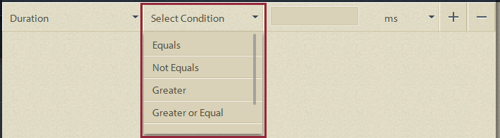
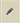
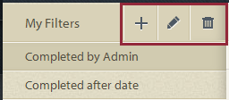
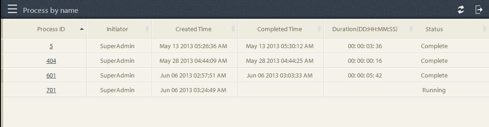
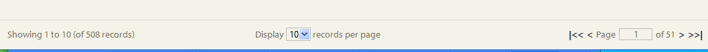
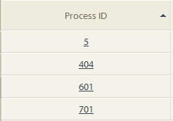
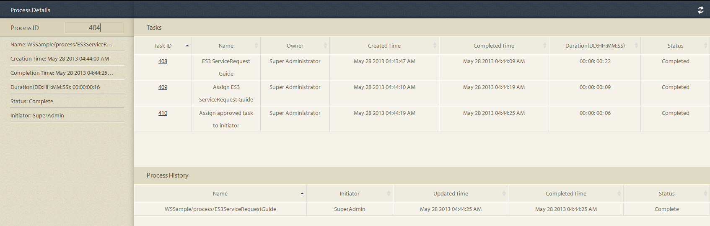

# Ad-hoc Queries in Process Reporting{#ad-hoc-queries-in-process-reporting}

## Ad-hoc queries in Process Reporting {#ad-hoc-queries-in-process-reporting-1}

Ad-hoc queries in Process Reporting let you create custom queries that you can use to search for process and task details of the AEM Forms process instances defiend in your AEM Forms environment.

Also, ad hoc queries can be defined using process and task property filters. These filters can then be saved and used to run the reports later.

[**Process Search**](/help/forms/using/process-reporting/adhoc-queries-in-process-reporting.md#p-process-task-search-p): Search for process instances with a user-defined search filter based on process attributes.

[**Process Details**](/help/forms/using/process-reporting/adhoc-queries-in-process-reporting.md#p-process-task-details-p): View details of a process instance by specifying the process ID.

**Task Search**: Search for task instances with a user-defined search filter based on task attributes.

**Task Details**: View details of a task instance by specifying the task ID.

### Processes and Tasks {#processes-and-tasks}

The steps that you follow to create filters and run queries for process details are the same as that for tasks.

This means that the user interfaces for the Process Search and Task Search differs only in the fields that you can search by and the fields returned in the search results. This is simply because, while many of the fields are identical, certain fields are specific to processes and certain fields are specific to tasks.

This article, details the descriptions of the Process/Task Search and Process/Task Details sections. At appropriate locations, any specific differences will be called-out specifically.

## Process/Task Search {#process-task-search}

You use Process/Task Search to define filters for querying process/task instances.

### To create a Process/Task Search query {#to-create-a-process-task-search-query}

1. To view the saved Process/Task Search queries or to create a query, click **Adhoc Queries** and then click **Process/Task Search**.

   

   The **My Filters** panel is displayed to the right of the tree view.

   In the **My Filters** panel, you can create new ad-hoc queries and click to execute previously saved queries.

   

1. To execute an existing query, you simply click the query in the **My Filters** panel.
1. To create a query, click **Add** (+).

   The **Create Filter** panel displays.

   

   A query consists of one or more query filters. To create a filter, add a filter row to the query. By default, one filter row is added to the query.

   **To define a filter**

    1. Select a field.

       

       >[!NOTE]
       >
       >The field list contains the fields that are specific to AEM Forms process/task.

    1. Select a condition.

       

       >[!NOTE]
       >
       >The conditions listed depend on the attribute that is selected for filtering.

    1. Enter a value.

       

    1. To add another filter to the query, click **Add (+)** on the right of the filter row.

       To remove a filter from the query, click **Delete (-)** on the right of the filter row.

       

After you create a query, use the options in the upper right corner of the **Create Filter** panel to:

* **Cancel**: Cancel the changes and go back to the **My Filters** panel.
* **Run**: Execute the current query to see and / or verify the results. In this case, you do not need to save the query before executing the query. You can verify the results, make changes if necessary, and then save the query when you are satisfied with the output.
* **Save**: Save the filter. The filter can then be viewed and executed from the **My Filters** panel.

### Options in My Filters panel {#options-in-my-filters-panel}

Use the options in the **My Filters** panel to **Add** , **Edit** , or **Delete** an ad-hoc query.

### To execute a Search query {#to-execute-a-search-query}

1. To execute a query, click the filter in the **My Filters** panel or click the **Run** button if you are creating or editing a filter.
1. The results of the query display in the **Report** panel of the **Process Reporting** window.

   

   You can paginate the search results with the help of the pagination panel displayed at the bottom of the report.

   

   In the **Display** drop-down list, choose the number of results to be displayed per page.

   In the **Page** text box, enter a page number to go directly to that page.

1. The following fields are displayed in a Process Search result:

    * **Process ID**: The ID of the process. The field is hyperlinked. If you click a process ID in this field, you are redirected to the **[!UICONTROL Process Details]** panel for the process.
    * **Initiator**: The AEM Forms user who started the process instance
    * **Created Time**: The date and time when the process instance started
    * **Completed Time**: The date and time when the process instance completed
    * **Duration**: The duration from start to completion of the process instance
    * **Status**: The current status of the process instance.

   By default, the result is sorted by Process ID. However, to sort the result by any of the fields, click the field title.

   Since the sorting is a toggle operation, click a column header to sort the result ascending and click it again to sort descending.

   Similarly, the following fields are displayed in a Task Search result:

    * **Task ID**: The ID of the task. The field is hyperlinked. If you click a task ID in this field, you are redirected to the **[!UICONTROL Task Details]** panel for the task.
    * **Initiator**: The AEM Forms user who started the process instance
    * **Created Time**: The date and time when the process instance started
    * **Completed Time**: The date and time when the process instance completed
    * **Duration**: The duration from start to completion of the process instance
    * **Status**: The current status of the process instance.

   By default, the result is sorted by Task ID. However, to sort the result by any of the fields, click the field title. The result is sorted by the column that is indicated by a darkened arrow next to the column header.

   Since the sorting is a toggle operation, click a field header to sort the result ascending and click it again to sort descending. The current sort order (ascending / descending) is indicated by the direction of darkened arrow next to the column header.

   

1. Click the rail button  on the upper-left to collapse the **My Filters** pane and expands the space available for the **Report** panel.
1. Use the options in the upper right corner of the **Report **panel to perform operations on the query result.

    * **Refresh**: Refreshes the report with latest data lying in the storage

    * **Export to CSV**: Export the report data to a comma-separated file.

   >[!NOTE]
   >
   >When you export a report, the entire result from the search is exported to a CSV file and not just the current page

## Process/Task Details {#process-task-details}

You use the **Process Details** panel to view the details of a specific process.

Similarly, you use the **Task Details** panel to view the details of a specific task.

### To view Process/Task Details {#to-view-process-task-details}

You can view the details of a specific AEM Forms process/task:

* **From a Process/Task Search result**
* **By entering the Process/Task ID in the Process/Task Details panel**

#### From a Process/Task Search result {#from-a-process-task-search-result}

1. Execute a process/task search. For details, see [To execute a Process Search query](#to-execute-a-search-query).

   Notice that the process IDs displayed returned in the result, are hyperlinked.

   

1. Click on a process ID in the list to view the details of this process in the **Process Details** panel.

   The **Process/Task Details** query result displays details of the tasks/forms contained in the process/task.

   By default, the result is sorted by Task/Form ID. However, to sort the result by any of the fields, click the field title. The column by which the result is sorted is indicated by a darkened arrow next to the column header.

   Since the sorting is a toggle operation, click a field header to sort the result ascending and click it again to sort descending. The current sort order (ascending / descending) is indicated by the direction of darkened arrow next to the column header.

   **Process Details result**

   

   **Left panel:** Displays the following details of the selected process:

    * Name of process
    * Process creation date time
    * Process completion date time
    * Process duration
    * Process status
    * Process initiator

   **Upper-Right panel:** Displays the following details of the tasks that make up selected process:

    * Task ID
    * Task name
    * Task owner
    * Task creation date time
    * Task update date time
    * Task completion date time
    * Task duration
    * Task status

   **Lower-Right panel:** Displays the following details of the process history of the selected process:

    * Process name
    * Process initiator
    * Process update date time
    * Process completion date time
    * Process status

   **Task Details result**

   

   **Left panel:** Displays the following details of the selected task:

    * Task Name
    * ID of process to which this task belongs
    * Task description
    * Task creation date time
    * Task completion date time
    * Task duration
    * Task status
    * Selected route of task

   **Upper-Right panel:** Displays the following details of the forms that make up selected task:

    * Foprm ID
    * Form creation date time
    * Form update date time
    * Form template Url

   **Lower-Right panel:** Displays the following details of the process history of the selected task:

    * Task assignment type
    * Task owner
    * Task assignment creation date time
    * Task update date time

1. Click **Back to Process/Task Search** to go back to the search result from which the process/task details were drilled down.

   

   However, if the process/task details were found by entering a specific process/task ID, clicking Back to Process/Task Search takes you back to **Process/Task Search**, without displaying any search result.

#### By entering the Process/Task ID in the Process/Task Details panel {#by-entering-the-process-task-id-in-the-process-task-details-panel-br}

1. Go to the **Process/Task Details** panel.

   

1. In the Process/Task ID text box, enter the process/task ID.

   

   The fields in the **Process/Task Details** query result are fields specific to an AEM Forms process/task.

   For a process, the query result displays the details of the tasks contained in the process.

   For a task, the query result displays the details the forms contained in the task.
