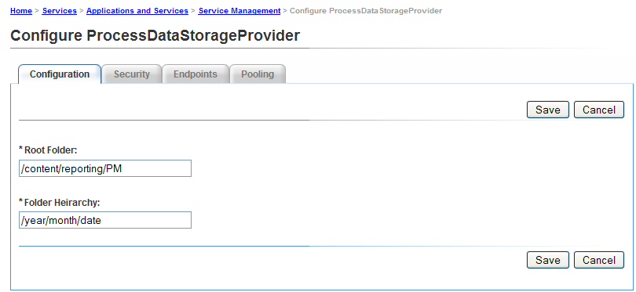
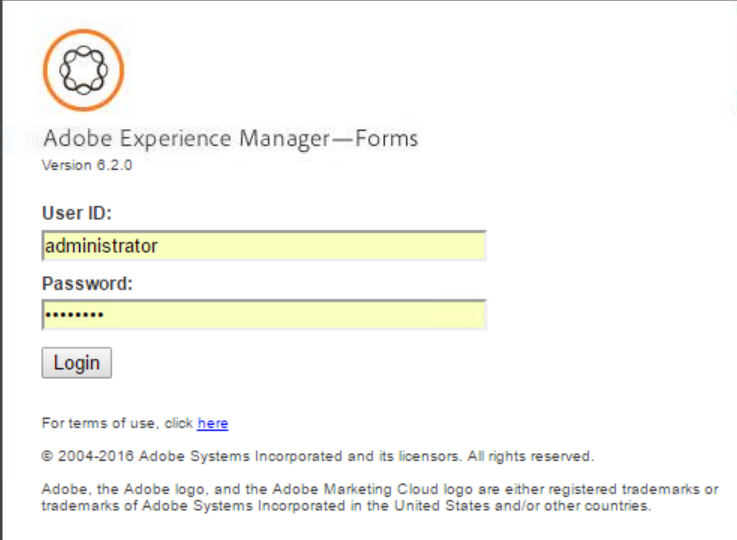
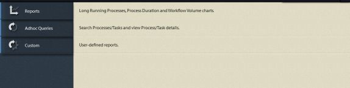

# Getting Started with Process Reporting{#getting-started-with-process-reporting}

Process Reporting gives AEM Forms users the ability to query information about AEM Forms processes that are currently defined in the AEM Forms implementation. However, Process Reporting does not access data directly from the AEM Forms repository. The data is first published to the Process Reporting repository on a scheduled basis (*by the ProcessDataPublisher & ProcessDataStorage service*s). The reports and queries in Process Reporting are then generated out of the Process Reporting data published to the repository. Process Reporting is installed as part of the Forms Workflow module.

This article details the steps to enable the publishing of AEM Forms data to the Process Reporting repository. After which, you will be able to use Process Reporting to run reports and queries. The article also covers the options available to configure the Process Reporting services.

## Process Reporting Pre-requisites {#process-reporting-pre-requisites}

### Purge non-essential processes {#purge-non-essential-processes}

If you are currently using Forms Workflow, the AEM Forms database can potentially contain a large amount of data

The Process Reporting publishing services publishes all AEM Forms data currently available in the database. It implies that if the database contains legacy data on which you do not want to run reports and queries, all of that data would also be published to the repository even though it is not required for reporting. You are recommended to purge this data before you run the services to publish the data to the Process Reporting repository. Doing so improves the performance of both the publisher service and the service that queries the data for reporting.

For details on purging AEM Forms process data, see [Purging Process Data](/help/forms/using/admin-help/purging-process-data.md).

>[!NOTE]
>
>For the tips and tricks of Purge Utility, see Adobe Developer Connection article on [Purging processes and jobs](/help/forms/using/admin-help/purging-process-data.md).

## Configuring Process Reporting services {#configuring-process-reporting-services}

### Schedule process data publishing {#schedule-process-data-publishing}

The Process Reporting services publish data from the AEM Forms database to the Process Reporting repository on a scheduled basis.

This operation can be resource-intensive and can impact the performance of the AEM Forms servers. You are recommended to schedule this outside your AEM Forms Server busy time-slots.

By default, the publishing of data is schedule to run every day at 2:00 am.

To change the publishing schedule, perform the following steps:

>[!NOTE]
>
>If you are running your AEM Forms implementation on a cluster, perform the following steps on each node of the cluster.

1. Stop the AEM Forms Server instance.
1. &#x200B;

   * (For Windows) Open the `[JBoss root]/bin/run.conf.bat` file in an editor.
   * (For Linux&reg;, AIX&reg; and Solaris&trade;) `[JBoss root]/bin/run.conf.sh` file in an editor.

1. Add the JVM argument `-Dreporting.publisher.cron = <expression>.`

   Example: The following cron expression causes Process Reporting to publish AEM Forms data to the Process Reporting repository every five hours:

    * `-Dreporting.publisher.cron = 0_0_0/5_*_*_?`

1. Save and close the `run.conf.bat` file.

1. Restart the AEM Forms Server instance.

1. Stop the AEM Forms Server instance.
1. Log in to the WebSphere&reg; Administrative Console. In the navigation tree, click **Servers** &gt; **Application servers** and then, in the right pane, click the server name.

1. Under Server Infrastructure, click **Java&trade; and Process Management** &gt; **Process Definition**.

1. Under Additional Properties, click **Java&trade; Virtual Machine**.

   In the Generic JVM arguments box, add the argument `-Dreporting.publisher.cron = <expression>.`

   **Example**: The following cron expression causes Process Reporting to publish AEM Forms data to the Process Reporting repository every five hours:

    * `-Dreporting.publisher.cron = 0_0_0/5_*_*_?`

1. Click **Apply**, click OK, and then click **Save directly to the master configuration**.
1. Restart the AEM Forms Server instance.
1. Stop the AEM Forms Server instance.
1. Log in to the WebLogic Administration Console. The default address of WebLogic Administration Console is `https://[hostname]:[port]/console`.
1. Under Change Center, click **Lock & Edit**.
1. Under Domain Structure, click **Environment** &gt; **Servers** and, in the right pane, click the managed server name.
1. On the next screen, click the **Configuration** tab &gt; **Server Start** tab.
1. In the Arguments box, add the JVM argument `-Dreporting.publisher.cron = <expression>`.

   **Example**: The following cron expression causes Process Reporting to publish AEM Forms data to the Process Reporting repository every five hours:

   `-Dreporting.publisher.cron = 0_0_0/5_*_*_?`

1. Click **Save** and then click **Activate Changes**.
1. Restart the AEM Forms Server instance.

### ProcessDataStorage service {#processdatastorage-service}

The ProcessDataStorageProvider service receives process data from the ProcessDataPublisher service and saves the data to the Process Reporting repository.

At each publishing cycle, the data is saved to subfolders of a pre-defined root folder.

You can use the Administration console to configure the root (**default**: `/content/reporting/pm`) location and subfolder (**default**: `/yyyy/mm/dd/hh/mi/ss`) hierarchy format where the process data would be stored.

#### To configure the Process Reporting repository locations {#to-configure-the-process-reporting-repository-locations}

1. Log in to **Administration Console** with administrator credentials. The default URL of Administration Console is `https://'[server]:[port]'/adminui`
1. Navigate to **Home** &gt; **Services** &gt; **Applications and Services** &gt;**Service Management** and open the **ProcessDataStorageProvider** service.

   

   **RootFolder**

   The CRX location inside which the process data would be stored for reporting.

   `Default`: `/content/reporting/pm`

   **Folder Hierarchy**

   The folder hierarchy inside which the process data would be stored based on the process creation time.

   `Default`: `/yyyy/mm/dd/hh/mi/ss`

1. Click **Save**.

### ReportConfiguration service {#reportconfiguration-service}

The ReportConfiguration service is used by Process Reporting for configuring the process reporting query service.

#### To configure the ReportingConfiguration service {#to-configure-the-reportingconfiguration-service}

1. Log in to **Configuration Manager** with CRX administrator credentials. The default URL of Configuration Manager is `https://'[server]:[port]'/lc/system/console/configMgr`
1. Open the **ReportingConfiguration** service.
1. **Number of Records**

   When running a query on the repository, a result can potentially contain many records. If the resultset is large, the query execution can consume server resources.

   To handle large resultsets, the ReportConfiguration service splits the query processing into batches of records. Doing so reduces the system load.

   `Default`: `1000`

   **CRX Storage Path**

   The CRX location inside which the process data is to be stored for reporting.

   `Default`: `/content/reporting/pm`

   >[!NOTE]
   >
   >This location is the same as specified in the ProcessDataStorage configuration option **Root Folder**.
   >
   >
   >If you update the Root Folder option in the ProcessDataStorage configuration, you must update the CRX Storage Path location in the ReportConfiguration service.

1. Click **Save** and close **CQ Configuration Manager**.

### ProcessDataPublisher service {#processdatapublisher-service}

The ProcessDataPublisher service imports process data from the AEM Forms database and publishes the data to the ProcessDataStorageProvider service for storage.

#### To configure ProcessDataPublisher service &nbsp; {#to-configure-processdatapublisher-service-nbsp}

1. Log in to **Administration Console** with administrator credentials.

   The default URL is `https://'server':port]/adminui/`.

1. Navigate to **Home** &gt; **Services** &gt; **Applications and Services** &gt;**Service Management** and open the **ProcessDataPublisher** service.

**Publish Data**

Enable this option to start publishing process data. By default, the option is disabled.

Enable Process Reporting only when all the configurations related to Process Reporting components are set up appropriately.

Alternatively, use this option to disable process data publishing when it is no longer required.

`Default`: `Off`

**Batch Interval (sec)**

Each time the ProcessDataPublisher service runs, the service first splits the time since the last run of the service by the Batch Interval. The service then processes each interval of AEM Forms data separately to help control the size of data the publisher processes end-to-end during each run (batch) within a cycle.

For example, if the publisher runs every day, then instead of processing the entire data for one day in a single run, by default, it splits the processing into 24 batches of one hour each.

`Default`: `3600`

`Unit`: `Seconds`

**Lock Timeout (sec)**

The publisher service acquires a lock when it starts processing data so that multiple instances of the publisher do not start running and processing data simultaneously.

If a publisher service that has acquired a lock, is idle for the number of seconds defined by the Lock Timeout value, then its lock is released so that other publisher service instances can continue processing.

`Default`: `3600`

`Unit`: `Seconds`

**Publish Data From**

AEM Forms environment contains data from the time that the environment was set up.

By default, the ProcessDataPublisher service imports all data from the AEM Forms database.

Depending on your reporting needs, if you plan to run reports and queries on data after a certain date and time, it is recommended that you specify the date and time. The publishing service then publishes the date from that time onwards.

`Default`: `01-01-1970 00:00:00`

`Format`: `dd-MM-yyyy HH:mm:ss`

## Accessing the Process Reporting user interface {#accessing-the-process-reporting-user-interface}

The user interface for Process Reporting is browser-based.

After you have set up Process Reporting, you can start working with Process Reporting at the following location in your AEM Forms installation:

`https://<server>:<port>/lc/pr`

### Log in to Process Reporting {#log-in-to-process-reporting}

When you navigate to the Process Reporting URL (https://&lt;server&gt;:&lt;port&gt;/lc/pr), the login screen is displayed.

To log on to the Process Reporting module, specify your credentials.

>[!NOTE]
>
>To log in to the Process Reporting user interface, you need the following AEM Forms permission:
>
>`PERM_PROCESS_REPORTING_USER`

When you log in to Process Reporting, the **[!UICONTROL Home]** screen displays.

### Process Reporting Home screen {#process-reporting-home-screen}

**Process Reporting tree view:** The tree view on the left side of the Home screen contains the items for the Process Reporting modules.

The tree view consists of the following top-level items:

**Reports:** This item contains the out-of-the-box reports that ship with Process Reporting.

For details on the pre-defined reports, see [Pre-defined Reports in Process Reporting](/help/forms/using/process-reporting/pre-defined-reports-in-process-reporting.md).

**Adhoc Queries:** This item contains options to perform filter-based search for processes and tasks.

For details on ad-hoc queries, see [Ad-hoc Queries in Process Reporting](/help/forms/using/process-reporting/adhoc-queries-in-process-reporting.md).

**Custom:** The Custom node displays custom reports that you create.

For the procedure to create and display custom reports, see [Custom Reports in Process Reporting](/help/forms/using/process-reporting/process-reporting-custom-reports.md).

**Process Reporting title bar:** The Process Reporting title bar contains some generic options that you can use when working in the user interface.

**Process Reporting title:** The Process Reporting title displays on the left corner of the title bar.

Click the title at any time to go back to the Home screen.

**Last Update Time:** The process data is published from the AEM Forms database to the Process Reporting repository on a scheduled basis.

The Last Update Time displays the last date and time up to which the data updates were pushed to the Process Reporting repository.

For details on the data publishing service and how to schedule this service, see [Schedule process data publishing](/help/forms/using/process-reporting/install-start-process-reporting.md#p-schedule-process-data-publishing-p) in the article Getting Started with Process Reporting.

**Process Reporting user:** The logged in user name displays to the right of the Last Update time.

**Procces Reporting title bar drop-down list:** The drop-down list at the right corner of the Process Reporting title bar contains the following options:

* **[!UICONTROL Sync]**: Synchronize the embedded Process Reporting repository with the AEM Forms database.
* **[!UICONTROL Help]**: View the Help documentation on Process Reporting.
* **[!UICONTROL Logout]**: Log out of Process Reporting
