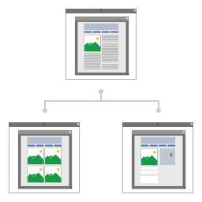
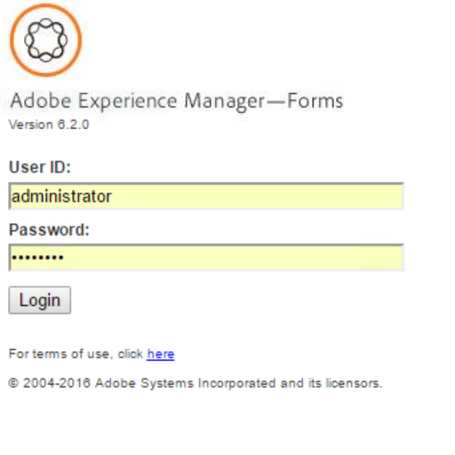

# Introduction to Process Reporting {#introduction-to-process-reporting}

 

Process Reporting is a browser-based tool that you use to create and view reports on AEM Forms processes and tasks.

Process Reporting provides a set of out-of-the-box reports that allow you to filter, view infromation on long running processes, process duration, and workflow volume.

Additionaly Process Reporting provides an interface to run adhoc queries and to integrate custom report views into the Process Reporting user interface.

For the list of supported browsers, see [AEM Forms Supported Platforms](/help/forms/using/aem-forms-jee-supported-platforms.md).

Process Reporting is built on modules that:

* Read process data from AEM Forms Database
* Publish process data to an embedded Process Reporting repository
* Provides a browser-based user interface to view reports

## Key Capabilities {#key-capabilities}

### Always-on Reporting {#always-on-reporting}

View the list of long running processes, process duration charts, and run custom queries using filters.

Process Reporting also provides the option to export the report and query data in CSV format.

### Adhoc Reports {#adhoc-reports}

Use filters to get a specific view of your data.

You can search processes or tasks by ID, duration, start and end dates, process initiator etc..

You can combine multiple filters to create specific reports.

You can then save the report filters to be run at a later date or time.

### Process/Task History {#process-task-history}

AEM Forms servers run numerous processes in parallel. These processes keep on transitioning from one state to another. By publishing Forms data to the Process Reporting repository at regular intervals, Process Reporting retains the transitioning information about the processes running in AEM Forms.

### Access Control {#access-control-br}

Process Reporing provides permission-based access to the user interface.

This means only users with reporting permissions have access to the Process Reporting user interface.

[Contact Support](https://www.adobe.com/account/sign-in.supportportal.html)
