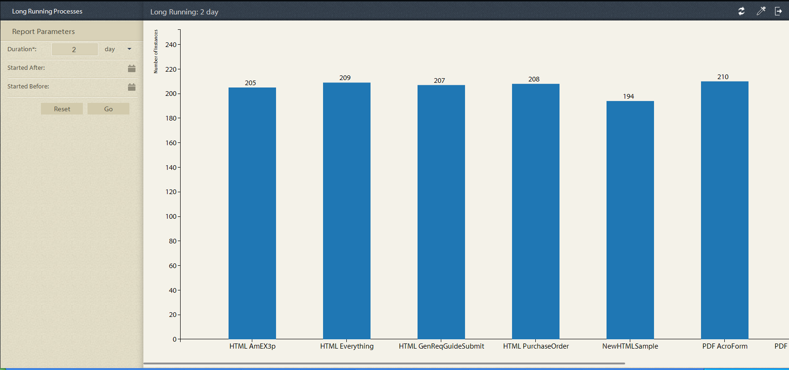
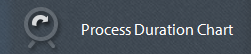
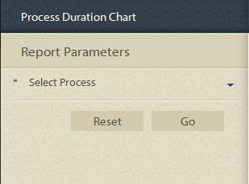
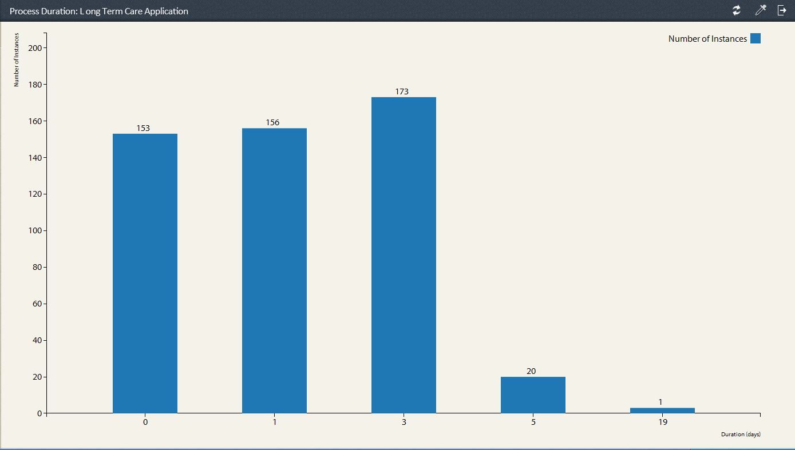
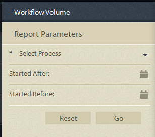
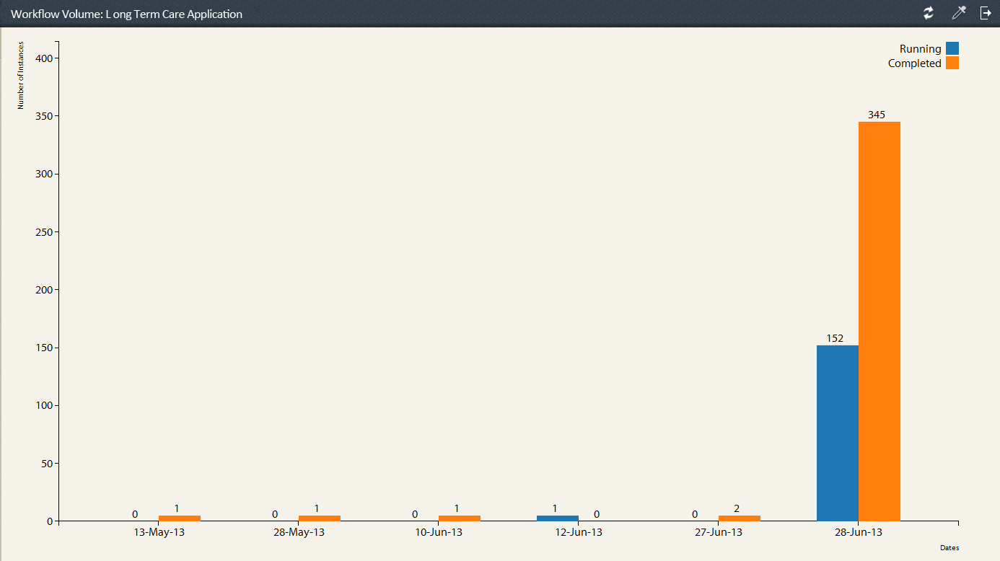

# Pre-defined reports in Process Reporting {#pre-defined-reports-in-process-reporting}

## Pre-defined Reports in Process Reporting {#pre-defined-reports-in-process-reporting-1}

AEM Forms Process Reporting ships with the following *out-of-the-box* reports:

* **[Long Running Processes](#long-running-processes)**: A report of all AEM Forms processes that took more than a specified time to complete
* **[Process Duration Chart](#process-duration-report)**: A report of a specified AEM Forms process by duration
* **[Workflow Volume](#workflow-volume-report)**: A report of the running and completed instances of specified process by date

## Long Running Processes {#long-running-processes}

The Long Running Processes report displays the AEM Forms processes that have taken more than a specified time to complete.

### To execute a Long Running Process report {#to-execute-a-long-running-process-report}

1. To view the list of pre-defined reports in Process Reporting, on the **Process Reporting** tree view, click the **Reports** node.
1. Click the **Long Running Processes** report node.

   

   When you select a report, the **Report Parameters** panel is displayed to the right of the tree view.

   

   Parameters:

    * **Duration** (*mandatory*): Specify a duration and unit of time. Display all AEM Forms processes that have run for more than the specified duration.
    * **Started After** (*optional*): Select a date. Filter the report to display process instances that started after the specified date.
    * **Started Before** (*optional*): Select a date. Filter the report to display process instances that started before the specified date.

1. Click **Go** to execute the report.

   The report displays in the **Report** panel on the right of the **Process Reporting** window.

   

   Use the options in the upper right corner of the **Report** panel to perform the following operations on the report.

    * **Refresh**: Refreshes the report with latest data lying in the storage
    * **Change legend color**: Select and change the color of the report legend
    * **Export to CSV**: Export and download the data from the report to a comma-separated file

## Process Duration report  {#process-duration-report}

The Process Duration report displays the number of instances of a Forms process by number of days that each instance has run.

### To execute a Process Duration report {#to-execute-a-process-duration-report}

1. To view the pre-defined reports in Process Reporting, on the **Process Reporting** tree view, click the **Reports** node.
1. Click the **Processes Duration** report node.

   

   When you select a report, the **Report Parameters** panel is displayed to the right of the tree view.

   

   Parameters:

    * **Select Process** (*mandatory*): Select an AEM Forms process.

1. Click **Go** to execute the report.

   The report displays in the **Report** panel on the right of the Process Reporting window.

   

   Use the options in the upper right corner of the **Report** panel to perform the following operations on the report.

    * **Refresh**: Refreshes the report with latest data lying in the storage
    * **Change legend color**: Select and change the color of the report legend
    * **Export to CSV**: Export and download the data from the report to a comma-separated file

## Workflow Volume report {#workflow-volume-report}

The Workflow Volume report displays the number of currently running and completed instances of an AEM Forms process by calendar day.

### To execute a Workflow Volume report {#to-execute-a-workflow-volume-report}

1. To view the pre-defined reports in Process Reporting, on the **Process Reporting** tree view, click the **Reports** node.
1. Click the **Workflow Volume** report node.

   

   When you select a report, the **Report Parameters** panel is displayed to the right of the tree view.

   

   Parameters:

    * **Select Process** (*mandatory*): Select an AEM Forms process.

    * **Started After** (*optional*): Select a date. Filters the report to display process instances that started after the specified date.

    * **Started Before** (*optional*): Select a date. Filters the report to display process instances that started before the specified date.

1. Click **Go** to execute the report.

   The report displays in the **Report** panel on the right of the **Process Reporting** window.

   

   Use the options in the upper right corner of the **Report** panel to perform the following operations on the report.

    * **Refresh**: Refreshes the report with latest data lying in the storage
    * **Change legend color**: Select and change the color of the report legend
    * **Export to CSV**: Export and download the data from the report to a comma-separated file
