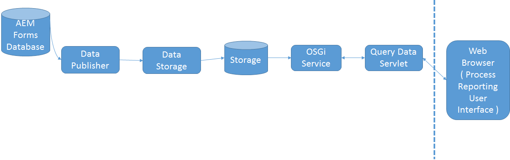

# How Process Reporting Works{#how-process-reporting-works}

Process Reporting is the reporting module of the AEM Forms on JEE.

Process Reporting lets you run reports on AEM Forms processes and tasks.

Process Reporting uses the embedded Process Reporting repository to publish Forms data. It then uses that data to run reports.

Process Reporting consists of the following modules:

* [ProcessDataPublisher service](#processdatapublisher-service-br-p)
* [ProcessDataStorage service](#processdatastorageprovider-service-br-p)
* [OSGi service](#osgi-service-br-p)
* [Query Data servlet](#querydataservlet-service-br-p)
* [Process Reporting user interface](#process-reporting-user-interface-br-p)

## Process Reporting architecture {#process-reporting-architecture-br}

## Process Reporting modules {#process-reporting-modules}

### ProcessDataPublisher service {#processdatapublisher-service-br}

The ProcessDataPublisher server runs periodically on the AEM Forms database and extracts the data that has changed since the last run of the service. It then publishes the data to the Process Data Storage service.

For details on configuring the service, see [Configure ProcessDataPublisher service](/help/forms/using/process-reporting/install-start-process-reporting.md#p-reportconfiguration-service-p).

### ProcessDataStorageProvider service {#processdatastorageprovider-service-br}

The ProcessDataStorageProvider service receives process data from the ProcessDataPublisher service and saves the data to the Process Reporting repository.

For details on configuring the service, see [Configure ProcessDataStorageProvider service](/help/forms/using/process-reporting/install-start-process-reporting.md#p-to-configure-the-process-reporting-repository-locations-p).

### OSGi service {#osgi-service-br}

The QueryDataServlet uses this service to obtain the reporting data from the Process Reporting repository.

### QueryDataServlet service {#querydataservlet-service-br}

The QueryDataServlet service accepts queries from Process Reporting user interface.

The service then uses OSGi services to obtain the relevant reporting data, processes the data, and returns the data to the user interface.

### Process Reporting user interface {#process-reporting-user-interface-br}

The Process Reporting user interface is a Web browser-based interface. You use this interface to view process and task information that is published from the AEM Forms database.

For an introduction to the Process Reporting user interface, see [Process Reporting user interface](/help/forms/using/process-reporting/introduction-process-reporting.md).

### QueryDataServlet service {#querydataservlet-service-br-1}

The QueryDataServlet service accepts queries from Process Reporting user interface.

The service then uses OSGi services to obtain the relevant reporting data, processes the data, and returns the data to the user interface.

### Custom Reports {#custom-reports-br}

You can create your own custom reports and display these reports in the Custom Reports tab of the Process Reporting user interface.

For the steps to create a custom report, see To create a custom report in the article [Custom Reports in Process Reporting](/help/forms/using/process-reporting/process-reporting-custom-reports.md).
