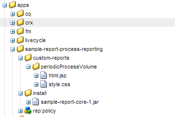
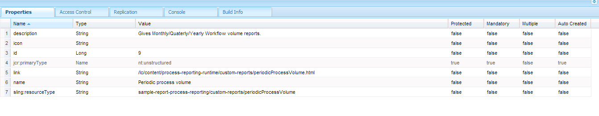
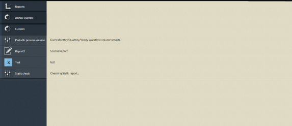
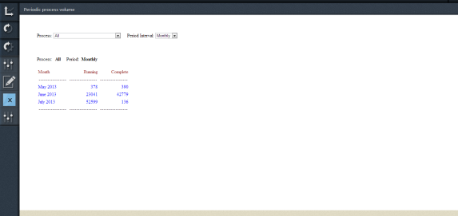

# Custom Reports in Process Reporting{#custom-reports-in-process-reporting}

You can use REST interface of QueryBuilder or create an OSGi service using QueryBuilder API to create a custom report.

## Generic steps to build a custom report {#generic-steps-to-build-a-custom-report}

Before adding any custom report, perform the following template procedure:

1. Data used in custom reports must be available in Process Reporting. To ensure the availability of data, schedule a cron job or use **[Sync](https://helpx.adobe.com/livecycle/help/process-reporting/install-start-process-reporting.html#Process%20Reporting%20Home%20screen)** option on the Process Reporting UI.
1. The URL request (encapsulating the desired query) must return an appropriate query result object. To create a query, you can use REST interface of [QueryBuilder](https://experienceleague.adobe.com/docs/experience-manager-cloud-service/content/implementing/developing/full-stack/search/query-builder-api.html?lang=en) to create an OSGi service using QueryBuilder API. You can create dynamic or static queries.

1. Create a custom user interface to display the results. You can create a stand-alone user interface or integrate result with existing Process Reporting UI.

## Using the REST interface of the QueryBuilder {#using-the-rest-interface-of-the-querybuilder}

CRX QueryBuilder REST interface exposes the functionality of the Asset Share Query Builder through a Java API and a REST API. Learn how to use [CRX QueryBuilder REST interface](https://experienceleague.adobe.com/docs/experience-manager-cloud-service/content/implementing/developing/full-stack/search/query-builder-api.html?lang=en), before performing the following steps:

1. Browse to the URL `https://'[server]:[port]'/lc/bin/querybuilder.json`
1. Create a query based on the Process Reporting storage node structure and node properties.

   You can specify optional parameters to specify offset, limit, hits, and properties. You can hardcode the arguments for static reports and fetch the parameters from UI for dynamic reports.

   To fetch all the process names, the query is:

   `https://'[server]:[port]'/lc/bin/querybuilder.json?exact=false&p.hits=selective&p.properties=pmProcessTitle&path=%2fcontent%2freporting%2fpm&property=pmNodeType&property.operation=equals&property.value=ProcessType&type=sling%3aFolder`

   >[!NOTE]
   >
   >In every query, the path parameter points to the crx storage location and the characters are escaped according to the URL standard.

## Creating a Service using Query Builder API&nbsp; {#creating-a-service-using-query-builder-api-nbsp}

The prerequisite to creating a service using Query builder API are [creating and deploying CQ OSGI bundle](https://experienceleague.adobe.com/docs/experience-manager-release-information/aem-release-updates/previous-updates/aem-previous-versions.html?lang=en) and [using Query Builder API](https://experienceleague.adobe.com/docs/experience-manager-cloud-service/content/implementing/developing/full-stack/search/query-builder-api.html?lang=en).

1. Create an OSGi service with appropriate annotations. To access the QueryBuilder use:

   ```java
   @Reference(referenceInterface = QueryBuilder.class)
    private QueryBuilder queryBuilder;
   ```

1. Create a predicate group. Code to create a predicate group is:

   ```java
   PredicateGroup predicateGroup = new PredicateGroup();
    predicateGroup.setAllRequired(true);
   ```

1. Add predicates to the newly created predicateGroup. A few useful predicate constructs are [JcrBoolPropertyPredicateEvaluator in 5.3](https://experienceleague.adobe.com/docs/experience-manager-release-information/aem-release-updates/previous-updates/aem-previous-versions.html?lang=en), [JcrPropertyPredicateEvaluator in 5.3](https://experienceleague.adobe.com/docs/experience-manager-release-information/aem-release-updates/previous-updates/aem-previous-versions.html?lang=en), [RangePropertyPredicateEvaluator in 5.3](https://experienceleague.adobe.com/docs/experience-manager-release-information/aem-release-updates/previous-updates/aem-previous-versions.html?lang=en), [DateRangePredicateEvaluator in 5.3](https://experienceleague.adobe.com/docs/experience-manager-release-information/aem-release-updates/previous-updates/aem-previous-versions.html?lang=en), and [TypePredicateEvaluator in 5.3](https://experienceleague.adobe.com/docs/experience-manager-release-information/aem-release-updates/previous-updates/aem-previous-versions.html?lang=en).

   For static reports hardcode the predicates, whereas for dynamic reports, fetch the predicates from the request.

   Sample code to get all the instances of a process is:

   ```java
   Predicate predicate;

     //Add the path Constraint
     predicate = new Predicate(PathPredicateEvaluator.PATH);
     predicate.set(PathPredicateEvaluator.PATH, "/content/reporting/pm"); // should point to the crx path being used to store data
     predicate.set(PathPredicateEvaluator.EXACT, "false");
     predicateGroup.add(predicate);

     //type nt:unstructured
     predicate = new Predicate(TypePredicateEvaluator.TYPE);
     predicate.set(TypePredicateEvaluator.TYPE, "nt:unstructured");
     predicateGroup.add(predicate);

     //NodeType: Process Instance
     predicate = new Predicate(JcrPropertyPredicateEvaluator.PROPERTY);
     predicate.set(JcrPropertyPredicateEvaluator.PROPERTY, "pmNodeType");
     predicate.set(JcrPropertyPredicateEvaluator.OPERATION, JcrPropertyPredicateEvaluator.OP_EQUALS);
     predicate.set(JcrPropertyPredicateEvaluator.VALUE, "ProcessInstance");
     predicateGroup.add(predicate);

     //processName
     predicate = new Predicate(JcrPropertyPredicateEvaluator.PROPERTY);
     predicate.set(JcrPropertyPredicateEvaluator.PROPERTY, "pmProcessName");
     predicate.set(JcrPropertyPredicateEvaluator.OPERATION, JcrPropertyPredicateEvaluator.OP_EQUALS);
     predicate.set(JcrPropertyPredicateEvaluator.VALUE, processName); //processName variable stores the name of the process whose instances need to be searched
     predicateGroup.add(predicate);
   ```

1. Define the Query using the predicateGroup.

   `Query query = queryBuilder.createQuery(predicateGroup, session);`

1. Obtain the result of the query.

   ```java
   query.setStart(offset); // hardcode or fetch from request
           if(hits == -1)         // hardcode or fetch from request
               hits = 0;
           query.setHitsPerPage(hits);
           SearchResult searchResult = query.getResult();
   ```

1. Iterate on the result and transform the results to desired format. Code to send the results in CSV format is:

   ```java
   Iterator<Node> iter = searchResult.getNodes();
                   while(iter.hasNext()) {
                       Node node = iter.next();
                       row = new StringBuilder();
                       for (String property : includeProperties) { // the properties of the node which needs to be returned, or one can return all the properties too.
                           try {
                               row.append(node.getProperties(property).nextProperty().getString() + COMMA_SEPARATOR);
                           } catch (NoSuchElementException e) {
                               //Adding separator for no value
                               row.append(COMMA_SEPARATOR);
                           } catch (RepositoryException e) {
                               e.printStackTrace();
                           }
                       }
                       row.deleteCharAt(row.lastIndexOf(COMMA_SEPARATOR));
                       row.append(NEW_LINE);
                       out.write(row.toString().getBytes());

   ```

1. Use the `org.apache.felix maven-bundle-plugin` to create an OSGi bundle for the servlet.

1. Deploy the bundle on the CRX server.

### Service Example {#service-example}

The following service example counts instances of a process that is in **RUNNING** and **COMPLETE** state at end of every month, quarter, and year.

```java
package custom.reporting.service;

import java.text.DateFormatSymbols;
import java.util.Calendar;
import java.util.HashMap;
import java.util.Iterator;
import java.util.LinkedHashMap;
import java.util.Map;
import java.util.SortedSet;
import java.util.TreeSet;

import javax.jcr.Node;
import javax.jcr.Session;

import org.apache.felix.scr.annotations.Component;
import org.apache.felix.scr.annotations.Reference;
import org.apache.felix.scr.annotations.Service;

import com.day.cq.search.Predicate;
import com.day.cq.search.PredicateGroup;
import com.day.cq.search.Query;
import com.day.cq.search.QueryBuilder;
import com.day.cq.search.eval.JcrPropertyPredicateEvaluator;
import com.day.cq.search.eval.PathPredicateEvaluator;
import com.day.cq.search.eval.TypePredicateEvaluator;
import com.day.cq.search.result.SearchResult;

@Component(metatype = true, immediate = true, label = "PeriodicProcessVolume", description = "Service for supporting cutom reports pluggable to Process Reporting.")
@Service(value = PeriodicProcessVolume.class)
public class PeriodicProcessVolume {

    private static String[] monthNameList = new DateFormatSymbols().getMonths();
    private static String[] quaterNameList = { "I", "II", "III", "IV" };

    private final Map<Integer, Map<Integer, Long[]>> monthly = new HashMap<Integer, Map<Integer, Long[]>>();
    private final Map<Integer, Map<Integer, Long[]>> quaterly = new HashMap<Integer, Map<Integer, Long[]>>();
    private final Map<Integer, Long[]> yearly = new HashMap<Integer, Long[]>();

    @Reference(referenceInterface = QueryBuilder.class)
    private QueryBuilder queryBuilder;

    private void addConstraints(PredicateGroup predicateGroup, String processName) {
        Predicate predicate;

        //Add the path Constraint
        predicate = new Predicate(PathPredicateEvaluator.PATH);
        predicate.set(PathPredicateEvaluator.PATH, "/content/reporting/pm");
        predicate.set(PathPredicateEvaluator.EXACT, "false");
        predicateGroup.add(predicate);

        //type nt:unstructured
        predicate = new Predicate(TypePredicateEvaluator.TYPE);
        predicate.set(TypePredicateEvaluator.TYPE, "nt:unstructured");
        predicateGroup.add(predicate);

        //NodeType: Process Instance
        predicate = new Predicate(JcrPropertyPredicateEvaluator.PROPERTY);
        predicate.set(JcrPropertyPredicateEvaluator.PROPERTY, "pmNodeType");
        predicate.set(JcrPropertyPredicateEvaluator.OPERATION, JcrPropertyPredicateEvaluator.OP_EQUALS);
        predicate.set(JcrPropertyPredicateEvaluator.VALUE, "ProcessInstance");
        predicateGroup.add(predicate);

        //processName
        if (processName != null) {
            predicate = new Predicate(JcrPropertyPredicateEvaluator.PROPERTY);
            predicate.set(JcrPropertyPredicateEvaluator.PROPERTY, "pmProcessName");
            predicate.set(JcrPropertyPredicateEvaluator.OPERATION, JcrPropertyPredicateEvaluator.OP_EQUALS);
            predicate.set(JcrPropertyPredicateEvaluator.VALUE, processName);
            predicateGroup.add(predicate);
        }
    }

    private Long[] setFrequency(Long[] frequency, int index) {
        if (frequency == null) {
            frequency = new Long[2];
            frequency[0] = 0L;
            frequency[1] = 0L;
        }
        frequency[index] = frequency[index] + 1L;
        return frequency;
    }

    public void populateValues(Session session, String processName) {
        PredicateGroup predicateGroup = new PredicateGroup();
        predicateGroup.setAllRequired(true);
        try {
            addConstraints(predicateGroup, processName);

            long batchSize = 10000L;
            long start = 0l;

            while (true) {
                Query query = queryBuilder.createQuery(predicateGroup, session);
                query.setStart(start);
                query.setHitsPerPage(batchSize);
                SearchResult searchResult = query.getResult();
                Iterator<Node> itr = searchResult.getNodes();
                long length = 0;
                while (itr.hasNext()) {
                    length++;
                    Node n = itr.next();
                    Calendar calender = n.getProperty("pmCreateTime").getDate();
                    String status = n.getProperty("pmStatus").getString();
                    int index = 0;
                    if ("COMPLETE".equals(status)) {
                        index = 1;
                    } else if ("RUNNING".equals(status)) {
                        index = 0;
                    } else {
                        continue;
                    }
                    int month = calender.get(Calendar.MONTH);
                    int year = calender.get(Calendar.YEAR);
                    int quater;
                    if (month < 3) {
                        quater = 1;
                    } else if (month < 6) {
                        quater = 2;
                    } else if (month < 9) {
                        quater = 3;
                    } else {
                        quater = 4;
                    }

                    Long frequency[];
                    Map<Integer, Long[]> yearMonthMap = this.monthly.get(year);
                    if (yearMonthMap == null) {
                        yearMonthMap = new HashMap<Integer, Long[]>();
                    }
                    frequency = yearMonthMap.get(month);
                    frequency = setFrequency(frequency, index);
                    yearMonthMap.put(month, frequency);
                    this.monthly.put(year, yearMonthMap);

                    Map<Integer, Long[]> yearQuaterMap = this.quaterly.get(year);
                    if (yearQuaterMap == null) {
                        yearQuaterMap = new HashMap<Integer, Long[]>();
                    }
                    frequency = yearQuaterMap.get(quater);
                    frequency = setFrequency(frequency, index);
                    yearQuaterMap.put(quater, frequency);
                    this.quaterly.put(year, yearQuaterMap);

                    frequency = this.yearly.get(year);
                    frequency = setFrequency(frequency, index);
                    this.yearly.put(year, frequency);
                }

                if (length < batchSize) {
                    break;
                } else {
                    start = start + batchSize;
                }
            }
        } catch (Exception e) {
            e.printStackTrace();
        }

    }

    public Map<String, Long[]> getMonthly() {
        Map<String, Long[]> result = new LinkedHashMap<String, Long[]>();
        SortedSet<Integer> years = new TreeSet<Integer>(monthly.keySet());
        for (Integer year : years) {
            Map<Integer, Long[]> yearMonthMap = monthly.get(year);
            SortedSet<Integer> months = new TreeSet<Integer>(yearMonthMap.keySet());
            for (Integer month : months) {
                String str = monthNameList[month] + " " + year;
                result.put(str, yearMonthMap.get(month));
            }
        }
        return result;
    }

    public Map<String, Long[]> getQuaterly() {
        Map<String, Long[]> result = new LinkedHashMap<String, Long[]>();
        SortedSet<Integer> years = new TreeSet<Integer>(quaterly.keySet());
        for (Integer year : years) {
            Map<Integer, Long[]> quaterMonthMap = quaterly.get(year);
            SortedSet<Integer> quaters = new TreeSet<Integer>(quaterMonthMap.keySet());
            for (Integer quater : quaters) {
                String str = quaterNameList[quater - 1] + " " + year;
                result.put(str, quaterMonthMap.get(quater));
            }
        }
        return result;
    }

    public Map<Integer, Long[]> getYearly() {
        return yearly;
    }

}
```

The sample `pom.xml`file to build above the service is:

```xml
<project xmlns="https://maven.apache.org/POM/4.0.0" xmlns:xsi="https://www.w3.org/2001/XMLSchema-instance" xsi:schemaLocation="https://maven.apache.org/POM/4.0.0 https://maven.apache.org/maven-v4_0_0.xsd">
    <modelVersion>4.0.0</modelVersion>

    <!-- ====================================================================== -->
    <!-- P R O J E C T  D E S C R I P T I O N                                   -->
    <!-- ====================================================================== -->
    <groupId>com.custom</groupId>
    <artifactId>sample-report-core</artifactId>
    <packaging>bundle</packaging>
    <name>PR Sample Report</name>
    <description>Bundle providing support for a custom report pluggable to process reporting.</description>
    <version>1</version>

    <!-- ====================================================================== -->
    <!-- B U I L D   D E F I N I T I O N                                        -->
    <!-- ====================================================================== -->
    <build>
        <plugins>
          <plugin>
              <groupId>org.apache.felix</groupId>
              <artifactId>maven-bundle-plugin</artifactId>
              <version>2.3.7</version>
              <extensions>true</extensions>
              <configuration>
                    <instructions>
                        <Bundle-Category>sample-report</Bundle-Category>
                        <Export-Package>
                            custom.reporting.service.*;
                        </Export-Package>
                     </instructions>
              </configuration>
          </plugin>
          <plugin>
                <groupId>org.apache.felix</groupId>
                <artifactId>maven-scr-plugin</artifactId>
                <version>1.11.0</version>
                <executions>
                    <execution>
                        <id>generate-scr-scrdescriptor</id>
                        <goals>
                            <goal>scr</goal>
                        </goals>
                        <configuration>
                            <!-- Private service properties for all services. -->
                            <properties>
                                <service.vendor>Sample Report</service.vendor>
                            </properties>
                        </configuration>
                    </execution>
                </executions>
            </plugin>
        </plugins>
    </build>

    <!-- ====================================================================== -->
    <!-- D E P E N D E N C I E S                                                -->
    <!-- ====================================================================== -->
    <dependencies>
        <dependency>
          <groupId>com.day.cq</groupId>
          <artifactId>cq-search</artifactId>
          <version>5.6.4</version>
        </dependency>

        <dependency>
          <groupId>javax.jcr</groupId>
          <artifactId>jcr</artifactId>
          <version>2.0</version>
        </dependency>

        <dependency>
          <groupId>org.apache.felix</groupId>
          <artifactId>org.apache.felix.scr.annotations</artifactId>
          <version>1.9.0</version>
        </dependency>
    </dependencies>
</project>
```

## Creating a separate UI&nbsp; {#creating-a-separate-ui-nbsp}

The prerequisites to creating a separate UI for displaying results are [Sling Basics in 5.6.1](https://experienceleague.adobe.com/docs/experience-manager-release-information/aem-release-updates/previous-updates/aem-previous-versions.html?lang=en), [Creating a CRX Node](https://experienceleague.adobe.com/docs/experience-manager-release-information/aem-release-updates/previous-updates/aem-previous-versions.html?lang=en) and providing appropriate [access privileges](https://experienceleague.adobe.com/docs/experience-manager-release-information/aem-release-updates/previous-updates/aem-previous-versions.html?lang=en).

1. Create a CRX Node at the `/apps` node and grant appropriate access permissions. (PERM_PROCESS_REPORTING_USER)
1. Define the renderer at the `/content` node.
1. Add JSP or HTML files to the node created in Step 1. You can also add CSS files.

   

   A sample node with JSP and CSS files

1. AddJavaScript code to start an Ajax call to querybuilder REST API or to your service. Also, add appropriate arguments.

1. Add an appropriate success handler to Ajax call to parse and display the result. You can parse the result in multiple formats (json/csv/user defined), and display it in a tabular or in other forms.

1. (Optional) Add an appropriate error handler to the Ajax call.

A sample JSP code which uses both OSGi Service and QueryBuilder API is:

```html
<%@taglib prefix="sling" uri="https://sling.apache.org/taglibs/sling/1.0"%>
<%request.setAttribute("silentAuthor", new Boolean(true));%>
<%@include file="/libs/foundation/global.jsp"%>
<%@ page import="java.util.Map,
java.util.Set,
com.adobe.idp.dsc.registry.service.ServiceRegistry,
javax.jcr.Session,
org.apache.sling.api.resource.ResourceResolver,
custom.reporting.service.PeriodicProcessVolume"%>
<%
response.setContentType("text/html");
response.setCharacterEncoding("utf-8");
%><!DOCTYPE HTML>
<html>
    <head>
        <meta charset="UTF-8">

        <link rel="stylesheet" href="/lc/apps/sample-report-process-reporting/custom-reports/periodicProcessVolume/style.css">
        <title>REPORT Monthly / Qaterly / Yearly</title>
        <script type="text/javascript">

            <%
                slingResponse.setCharacterEncoding("utf-8");
                ResourceResolver resolver = slingRequest.getResourceResolver();
                String processName = slingRequest.getParameter("processName");
                Session session = resolver.adaptTo(Session.class);
                custom.reporting.service.PeriodicProcessVolume periodicProcessVolume = sling.getService(custom.reporting.service.PeriodicProcessVolume.class);
                periodicProcessVolume.populateValues(session, processName);
                if (processName == null) {
                    processName = "All";
                }
            %>
            var lineSeprator = "<td class='seprator'>----------------</td>";
            var tableEnder = "<tr>" + lineSeprator + lineSeprator + lineSeprator + "</tr>";

            var tableColHeader = "<td class='colHead colNum'>Running</td>";
            tableColHeader += "<td class='colHead  colNum'>Complete</td></tr>";
            tableColHeader += tableEnder;

            var monthly = "<table><tr><td class='colHead colStr'>Month</td>";
            monthly += tableColHeader;

            <%
                Map<String, Long[]> monthlyMap = periodicProcessVolume.getMonthly();
                Set<String> monthKeys = monthlyMap.keySet();
                for (String key: monthKeys) {
                    Long[] frequencies = monthlyMap.get(key);
            %>

            monthly += "<tr><td class='colStr'> <%= key %> </td>";
            monthly += "<td class='colNum'> <%= frequencies[0] %> </td>";
            monthly += "<td class='colNum'> <%= frequencies[1] %> </td></tr>";
            <%
                }
            %>

            monthly += tableEnder;

            var quaterly = "<table><tr><td class='colHead colStr'>Quater</td>";
            quaterly += tableColHeader;

            <%
                Map<String, Long[]> quaterMap = periodicProcessVolume.getQuaterly();
                Set<String> quaterKeys = quaterMap.keySet();
                for (String key: quaterKeys) {
                    Long[] frequencies = quaterMap.get(key);
            %>

            quaterly += "<tr><td class='colStr'> <%= key %> </td>";
            quaterly += "<td class='colNum'> <%= frequencies[0] %> </td>";
            quaterly += "<td class='colNum'> <%= frequencies[1] %> </td></tr>";
            <%
                }
            %>

            quaterly += tableEnder;

            var yearly = "<table><tr><td class='colHead colStr'>Year</td>";
            yearly += tableColHeader;

            <%
                Map<Integer, Long[]> yearMap = periodicProcessVolume.getYearly();
                Set<Integer> yearKeys = yearMap.keySet();
                for (Integer key: yearKeys) {
                    Long[] frequencies = yearMap.get(key);
            %>

            yearly += "<tr><td class='colStr'> <%= key %> </td>";
            yearly += "<td class='colNum'> <%= frequencies[0] %> </td>";
            yearly += "<td class='colNum'> <%= frequencies[1] %> </td></tr>";
            <%
                }
            %>

            yearly += tableEnder;

            function reloadFrame(value) {
                if (value === '-1') {
                    window.location = "/lc/content/process-reporting-runtime/custom-reports/periodicProcessVolume.html";
                } else {
                    window.location = "/lc/content/process-reporting-runtime/custom-reports/periodicProcessVolume.html?processName=" + value;
                }
            }

            function populateTable(selection) {
                if (selection === 0) {
                    document.getElementById('tableHeading').innerHTML = 'Monthly';
                    document.getElementById('volumeTable').innerHTML = monthly;
                } else if (selection === 1) {
                    document.getElementById('tableHeading').innerHTML = 'Quaterly';
                    document.getElementById('volumeTable').innerHTML = quaterly;
                } else {
                    document.getElementById('tableHeading').innerHTML = 'Yearly';
                    document.getElementById('volumeTable').innerHTML = yearly;
                }
            }

            function fetchProcesses() {
                var xmlhttp = new XMLHttpRequest(),
                    request = '';
                xmlhttp.onreadystatechange = function() {
                   if (xmlhttp.readyState === 4 && xmlhttp.status === 200) {
                       var responseText,
                           response,
                           items,
                           hits = [],
                           responseSize = 0,
                           processName,
                           selectedIndex = 0,
                           comboBox;
                       responseText = xmlhttp.responseText;
                       if (responseText !== undefined && responseText !== null) {
                           response = JSON.parse(responseText);
                           responseSize = response.results;
                           hits = response.hits;
                       }

                       items = "<option value='-1'>All</option>";

                       for(var i = 0; i < responseSize; i++) {
                           processName = hits[i].pmProcessTitle;
                           if (processName === '<%= processName %>') {
                               selectedIndex = i + 1;
                           }
                           items += "<option value='" + processName + "'>" + processName + "</option>"
                       }

                       comboBox = document.getElementById('processSelection');
                       comboBox.innerHTML = items;
                       comboBox.selectedIndex = selectedIndex;
                   }
               };
               request = "/lc/bin/querybuilder.json?";
               request += "exact=false&";
               request += "p.hits=selective&";
               request += "p.properties=pmProcessTitle&";
               request += "path=%2fcontent%2freporting%2fpm&";
               request += "property=pmNodeType&";
               request += "property.operation=equals&";
               request += "property.value=ProcessType&";
               request += "type=sling%3aFolder";

               xmlhttp.open("POST", request, true);
               xmlhttp.setRequestHeader("Content-type","application/json");
               xmlhttp.send();
            }

        </script>
    </head>
    <body onLoad="fetchProcesses();populateTable(0);">
        Process:
        <select id="processSelection" onchange="reloadFrame(this.value);"></select>
        &nbsp &nbsp Period Interval:
        <select name="periodSelection" onchange="populateTable(this.selectedIndex);">
            <option value="1">Monthly</option>
            <option value="2">Quaterly</option>
            <option value="3">Yearly</option>
        </select>
        <br> <br> <br> <br>
        <div class="inline"> Process: &nbsp <b><%= processName %></b> &nbsp &nbsp Period: &nbsp </div> <b> <div id="tableHeading" class="inline"> </div> </b>
        <br><br>
        <div id="volumeTable"> </div>

    </body>
</html>
```

## Integrating report UI in existing Process Reporting UI&nbsp; {#integrating-report-ui-in-existing-process-reporting-ui-nbsp}

The prerequisites to creating a separate UI for displaying results are [Sling Basics](https://wem.help.adobe.com/enterprise/en_US/10-0/wem/developing/the_basics.html), [Creating a CRX Node](/help/sites-developing/developing-with-crxde-lite.md#creating-a-node) and providing appropriate [access privileges](/help/sites-developing/developing-with-crxde-lite.md#access-control).

1. Create a separate UI.
1. Create a child `nt:unstructured` node at the `/content/process-reporting-runtime/custom-reports` node for every pluggable report.

    * **id**- Specifies unique identification number of the report.
    * **name**- Specifies the name of the report. The name is displayed in the UI.
    * **link**- Specifies relative link to the renderer of the separate UI. The link is created Step 1.
    * **description**- Specifies the one line description the report. You can leave the description field empty.
    * **icon**- Specifies the image to pictorially represent the report. You can leave the icon field empty.

   

   Properties of node

1. The report UI is integrated to the Process Reporting UI. After you integrate the UI, the updated UI looks similar to the following images:

   

   User Interface of newly added custom reports

   

   Results screen of the custom reports

## Sample Package {#sample-package}

Import the `sample-report-pkg-1.zip` package to integrate custom reports and UI discussed in the article to the Process management UI.

[Get File](assets/sample-report-pkg-1.zip)
