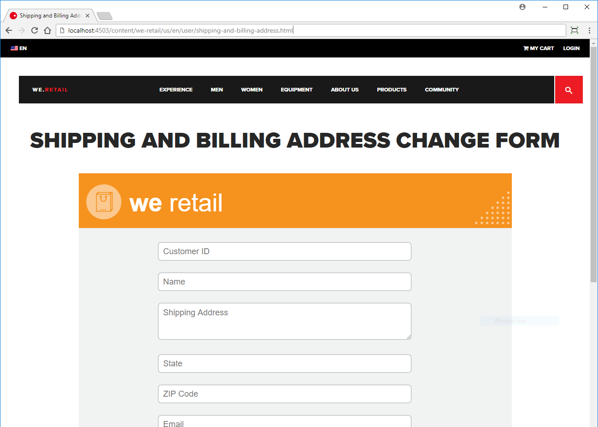

# Tutorial: Publish your adaptive form {#tutorial-publish-your-adaptive-form}

 

This tutorial is a step in the [Create Your First Adaptive Form](https://helpx.adobe.com/experience-manager/6-3/forms/using/create-your-first-adaptive-form.html) series. It is recommended to follow the series in chronological sequence to understand, perform, and demonstrate the complete tutorial use case.

After the adaptive form is ready, you can publish the form to make it available for end users. The end users can open the published form on any device and internet browser. When an adaptive form is published, the form and related content are copied from an AEM author instance to an AEM publish instance. The form is made available to the end user through the publish instance.

You have the following methods to publish an adaptive form:

* [Publish the adaptive form as an AEM Page](../../forms/using/publish-your-adaptive-form.md#publish-the-adaptive-form-as-an-aem-page)
* [Embed the adaptive form in an AEM Sites Page](#embed-the-adaptive-form-in-an-aem-sites-page)
* [Embed the adaptive form in an external webpage (a non-AEM webpage hosted outside AEM)](../../forms/using/publish-your-adaptive-form.md)

## Before you start {#before-you-start}

* **[Set up an AEM Forms publish instance](https://helpx.adobe.com/experience-manager/6-3/forms/using/installing-configuring-aem-forms-osgi.html)**: The publish instance is a public facing instance of AEM [!DNL Forms] running in publish mode. In a production environment, the publish instance is outside of the organization's firewall.
* **[Set up replication and reverse replication](https://helpx.adobe.com/experience-manager/6-3/help/sites-deploying/replication.html)**: Replication copies content from the author instance to a publish instance and returns user input (for example, form input) from the publish instance to the author instance.

## Publish the adaptive form as an AEM Page {#publish-the-adaptive-form-as-an-aem-page}

When the adaptive form is published as an AEM Page, then the entire web page contains only published form. You can use the URL of the adaptive form to link it from another web page. To publish the **shipping-address-add-update-form** adaptive form as an AEM Page:

1. Log in to AEM [!DNL Forms] author instance and locate the shipping-address-add-update-form adaptive form in the AEM [!DNL Forms] UI.
   `https://localhost:4502/aem/forms.html/content/dam/formsanddocuments`
1. Select the shipping-address-add-update-form adaptive form and select **[!UICONTROL Publish]**. A dialog containing assets related to the adaptive form is displayed. Select **[!UICONTROL Publish]**. The adaptive form is published and a success dialog appears.
1. Open the form on the publish instance. The form is available for end user to fill and submit.
   `https://localhost:4503/content/forms/af/shipping-address-add-update-form.html`

## Embed the adaptive form in an AEM Sites Page {#embed-the-adaptive-form-in-an-aem-sites-page}

AEM [!DNL Forms] allows form developers to seamlessly embed adaptive forms in an AEM [!DNL Sites] page. The embedded adaptive form is fully functional and users can fill and submit the form without leaving the page. It helps user remain in the context of other elements on the web page and simultaneously interact with the form.

AEM [!DNL Forms] provide a component, AEM [!DNL Forms] Container, to embed an adaptive form to an AEM [!DNL Sites] page. By default, the component is not visible in AEM [!DNL Sites] container. Perform the following steps to enable the AEM [!DNL Forms] Container component and to embed the adaptive form in an AEM [!DNL Sites] Page:

1. Create and open a page in the We.Retail site for editing. For example, [https://localhost:4502/editor.html/content/we-retail/us/en/user/shipping-and-billing-address.html](https://localhost:4502/editor.html/content/we-retail/us/en/user/shipping-and-billing-address.html). The adaptive form is embedded to the [!DNL Sites] page.

   You can also embed the adaptive form in an existing We.Retail [!DNL Site's] page. For example, the ABOUT US page [https://localhost:4502/editor.html/content/we-retail/us/en/about-us.html](https://localhost:4502/editor.html/content/we-retail/us/en/about-us.html). It saves you the time to create a page. The steps below use the newly created page.

   The We.Retail site is shipped with AEM. If you do not have the We.Retail site installed, see to [We.Retail Reference Implementation](https://helpx.adobe.com/experience-manager/6-3/help/sites-developing/we-retail.html) install the site.

1. Select  page information and select the **[!UICONTROL Edit Template]** option in the newly created We.Retail site page. The template of the page opens in a new tab of the browser.
1. Select inside the **[!UICONTROL layout container]** box and select . In the **[!UICONTROL Allowed Components]** tab, expand the **[!UICONTROL General]** accordion, select the **[!UICONTROL AEM Form]** option, and select . The AEM [!DNL Forms] Container component is enabled for the page.

1. Open the browser tab containing AEM [!DNL Sites] page opened in step 1. Select the **[!UICONTROL Drag components here]** box and select **+.** In the **[!UICONTROL Insert New Component]** box, select **[!UICONTROL AEM Form]**. The **[!UICONTROL AEM Forms Container]** component is added to the page.
1. Select the **[!UICONTROL AEM Forms container]** component and select . A dialog box with properties of AEM [!DNL Forms] Container appears. In the **[!UICONTROL Asset Path]** field, browse and select the shipping-address-add-update-form adaptive form. Select . The adaptive form is embedded in the page.
1. Publish both the adaptive form and [!DNL Sites] page. Here are a few points to consider:

    * If you publish the AEM [!DNL Sites] page for the first time and it includes an embedded form, publish the [!DNL Sites] page and the embedded form.
    * If you modify only the embedded form in a published site page, publish the original form and the changes reflect in the published site page. The published site page includes a reference to the form and does not require republishing the page.
    * If you modify the [!DNL Sites] page and the embedded form, republish the [!DNL Sites] page and the form.

      

   Shipping and Billing Address Change form added to an AEM [!DNL Sites] page.

## Embed the adaptive form in an external webpage {#embed-the-adaptive-form-in-an-external-webpage}

You can embed an adaptive form to an external web page (a non-AEM webpage hosted outside AEM) by inserting a few lines of JavaScript in the external web page. The JavaScript code sends an HTTP request to the AEM [!DNL Forms] server for the adaptive form and related resources and adds the adaptive form to the web page. For detailed steps, see [embed the adaptive form to an external web page](/help/forms/using/embed-adaptive-form-external-web-page.md).
