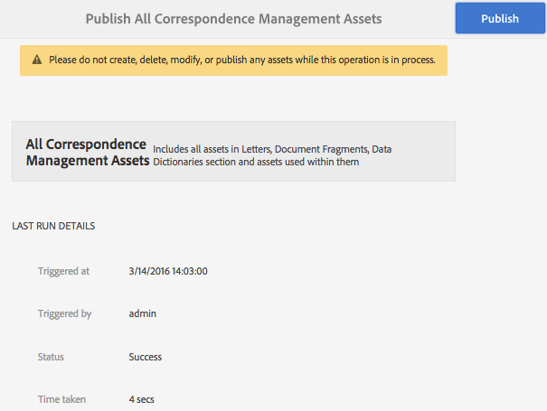

# Publishing and unpublishing forms and documents{#publishing-and-unpublishing-forms-and-documents}

AEM Forms let you create, publish, and unpublish forms easily. For more information about AEM Forms, see [Introduction to managing forms](../../forms/using/introduction-managing-forms.md).

The AEM Forms server provides two instances: Author and Publish. Author instance is for creating and managing form assets and resources. Publish instance is for keeping assets and related resources that are available for end users. You can import XDP and PDF forms in the Author mode. For more information, see [Getting XDP and PDF documents in AEM Forms](../../forms/using/get-xdp-pdf-documents-aem.md).

## Supported assets &nbsp; {#supported-assets-nbsp}

AEM Forms support the following types of assets:

* Adaptive forms
* Adaptive documents  
* Adaptive form fragments
* Themes
* Form templates (XFA forms)
* PDF forms
* Document (Flat PDF documents)
* Form Sets
* Resource (Images, Schemas, and Stylesheets)

Initially, all the assets are available only in the Author instance. An administrator or form author can publish all the assets except resources.

When you select a form and publish it, its related assets and resources are also published. However, dependent assets are not published. In this context, related assets and resources are assets that a published asset uses or refers to. Dependent assets are assets that refer to a published asset.

Your Adaptive Forms may utilize some configutaions, settings, and customizations that are not automatically published. It is recommended that you publish or activate these resources before you publish an adaptive form.

* Editable Adaptive Form Templates
* Cloud Service configutaions for Adobe Sign, Typekit, reCAPTCHA, and Form Data Models
* Other Cloud services configations are only activated if the user has admin permissions.
* Customizations. These include but are not limited to:

    * Custom layouts
    * Custom appearances
    * CSS File - taken as input in Adaptive Form container properties dialog
    * Client Library Category - taken as input in Adaptive Form container properties dialog
    * Ay other client library which may been included as part of Adaptive Form template.
    * Design Paths

## Asset states {#asset-states}

An asset can have the following states:

* **Unpublished:** An asset that has never been published (The unpublished state is applicable only to Forms assets. Correspondence Management assets do not have an Unpublished state.) 
* **Published**: An asset that has been published and is available on the Publish instance
* **Modified**: An asset that is modified after being published

## Publish an asset {#publish-an-asset}

1. Log in to the AEM Forms server. 
1. Use one of the following to select and publish an asset.

    1. Move the pointer over an asset and select **[!UICONTROL Publish]** .
    1. Do one of following and then select Publish:

        * If you are in the card view, select **[!UICONTROL Enter Selection]** , and select the asset. The asset is selected.
        * If you are in the list view, select the checkbox of an asset. The asset is selected.  
        * Select an asset to display its details.
        * Display an asset's properties by tapping View Properties .

       >[!NOTE]
       >
       >Do not select multiple assets. Publishing multiple assets at once is not supported.

1. When the Publish process starts, a confirmation dialog appears listing all the related assets and resources. In the dialog box that contains related assets, select **[!UICONTROL Publish]**. The asset is published and the Publish Assets Success dialog appears.

   >[!NOTE]
   >
   >For the Adaptive forms, along with the related assets, the Adaptive Form page name is also displayed.

   

   A confirmation dialog with all the related assets and resources.

   >[!NOTE]
   >
   >For Forms Manager, if the user does not have permission to publish the listed assets, the Publish action is disabled. An asset that requires extra permissions is shown in red.

   After an asset is published, metadata properties of the asset are copied to the Publish instance and the status of the asset is changed to Published. The status of dependent assets that are published is also changed to Published.

   After publishing an asset, you can use the Forms Portal to display all the assets on a web page. For more information, see [Introduction to publishing forms on a portal](../../forms/using/introduction-publishing-forms.md).

## Publish all the Correspondence Management Assets {#publish-all-the-correspondence-management-assets}

AEM Forms lets you publish all Correspondence Management assets on a server in one go. The published assets include all the Correspondence Management assets and related dependencies.

Complete the following steps to publish all the Correspondence Management assets on a server:

1. Log in to the AEM Forms server. 
1. Select **Adobe Experience Manager** in the global navigation bar.
1. Select , and then select **Forms**.
1. Select **Publish Correspondence Management Assets**. 

   

   The Publish All Correspondence Management Assets page appears and displays the information about the last time the Publish Correspondence Management Assets process was attempted.

   

1. Select **Publish** and, in the confirm message, select **OK**.

   After a batch process is complete, you can view the last run details. This includes information such as the Administrator login and if the batch run successfully or failed.

   >[!NOTE]
   >
   >The Publish process cannot be canceled once initiated. Also, while the Publish operation is in process, do not create, delete, modify, or publish any assets or initiate Export All Correspondence Management Assets operation.

## Automate publishing and unpublishing for Forms &amp; Documents {#automate-publishing-and-unpublishing-for-forms-amp-documents}

AEM Forms let you schedule asset publishing and unpublishing for Forms & Documents. You can specify the schedule in the Metadata Editor. For more information about managing form metadata, see [Managing form metadata.](../../forms/using/manage-form-metadata.md)

Follow these steps to schedule the date and time of publishing and unpublishing Forms & Documents assets:

1. Select an asset and select **[!UICONTROL View Properties]**. The Metadata Properties page opens.
1. In the Metadata Properties page, select **[!UICONTROL Advanced]**, and then select **[!UICONTROL Edit]** .
1. In the **[!UICONTROL Publish On Time]** and **[!UICONTROL Publish Off Time]** fields, select the date and time.  
   Select **[!UICONTROL Done]** .

## Unpublish an asset {#unpublish-an-asset}

1. Select an asset that is published and select **[!UICONTROL Unpublish]** .
1. Use one of the following to select and unpublish an asset.

    1. Move the pointer over an asset and select **[!UICONTROL Unpublish]** .
    1. Do one of following and then select unpublish:

        * If you are in the card view, select **[!UICONTROL Enter Selection]** , and select the asset. The asset is selected.
        
        * If you are in the list view, hover over an asset and select  . The asset is selected.  
        
        * Select an asset to display its details.
        * Display an asset's properties by tapping View Properties .

1. When the Unpublish process starts, a confirmation dialog appears. Select **[!UICONTROL Unpublish]**.

   >[!NOTE]
   >
   >Only the selected asset is unpublished, and its child and referenced assets, if any, are not unpublished.

## Revert an asset or letter to the previously published version {#revert-an-asset-or-letter-to-the-previously-published-version}

Everytime you publish an asset or letter after editing it, a version of the asset or letter is created. You can revert an asset or letter to a previously published version. You may need to do so if something goes wrong with the current version of the asset or document.

>[!NOTE]
>
>Do not revert a letter to a last published state if any dependent asset used in that published letter is deleted from the system.

1. Select an asset and select **[!UICONTROL Revert to Previously Published Version]** .
1. Before the asset is reverted, a confirmation dialog appears. Select **[!UICONTROL Revert]**.

   The asset or letter is rolled back to its previously published version.

## Delete an asset {#delete-an-asset}

>[!NOTE]
>
>Deleting an asset removes it from the publish instance. Deleting an assets also removes its version history except the base version.

1. Select an asset and select **[!UICONTROL Delete]** .

   >[!NOTE]
   >
   >The Delete option is also available when you display asset details by tapping an asset or you display an asset's properties by tapping View Properties .

1. Before the asset is deleted, a confirmation dialog appears. Select **[!UICONTROL Delete]**.

   >[!NOTE]
   >
   >Only the selected asset is deleted, and the dependent assets and are not deleted. To check references of an asset, select  and then select an asset. 
   >
   >
   >If the asset you are attempting to delete is child asset of another asset, it is not deleted. To delete such an asset, remove references of this asset from other assets and then retry.

## Protected adaptive forms {#protected-adaptive-forms}

You can enable authentication for forms you want selected users to access. When you enable authentication for your forms, users see a login screen before accessing them. Only users with credentials that are authorized can access the forms.

To enable authentication for your forms:

1. In your browser, open configMgr in the publish instance.  
   URL: `https://<hostname>:<PublishPort>/system/console/configMgr`

1. In the Adobe Experience Manager Web Console Configuration, click **Apache Sling Authentication Service** to configure it.
1. In the Apache Sling Authentication Service dialog that appears, use the **+** button to add paths.  
   When you add a path, the authentication service is enabled for forms in that path.
