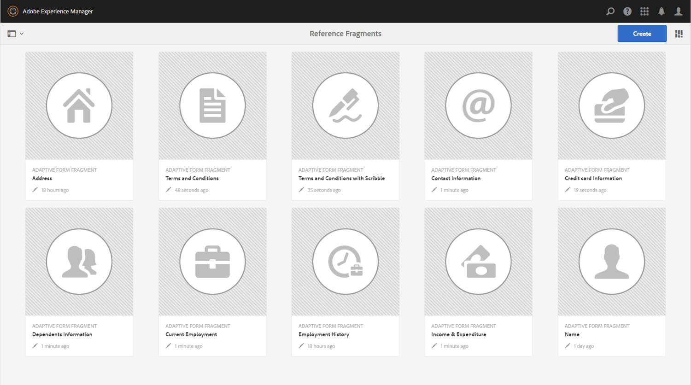
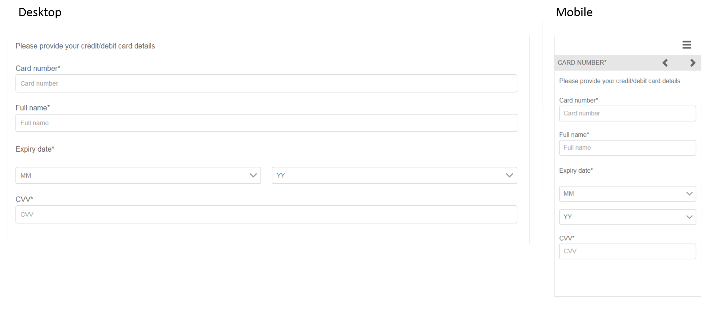
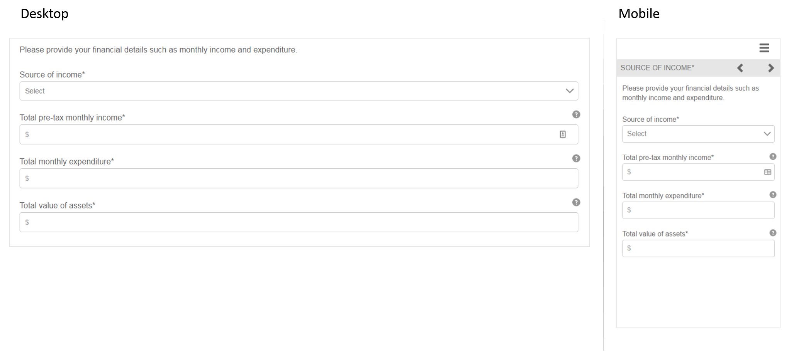

# Reference adaptive form fragments{#reference-adaptive-form-fragments}

[Adaptive form fragment](../../forms/using/adaptive-form-fragments.md) is a group of fields, or a panel containing a group of fields that you can use when you create a form. It lets you create a form easily and quickly. You can drag-drop an adaptive form fragment into a form using the assets browser in sidebar, and you can edit it in the form editor.

For adaptive forms authors, reference fragments are provided in the [AEM Forms add-on package](https://experienceleague.adobe.com/docs/experience-manager-release-information/aem-release-updates/forms-updates/aem-forms-releases.html?lang=en). It includes the following fragments:

* Address
* Contact Information
* Credit card Information  
* Current Employment
* Dependents Information  
* Employment History
* Income & Expenditure
* Name  
* Terms & Conditions
* Terms & Conditions with Scribble

When you install the package, a Reference Fragments folder containing reference fragments is created under Forms & Documents. For installing a package, see [How to Work With Packages](/help/sites-administering/package-manager.md).

## Address {#address}

Includes fields to specify mailing address. The available fields are street address, ZIP code, city, state, and country. It also includes a preconfigured web service that populates the city and state for a specified US zip code.

<!--[Click to enlarge

](assets/address-1.png)-->

## Contact Information {#contact-information}

Includes fields to capture phone number and email address.

<!--[Click to enlarge

](assets/contact-info-1.png)-->

## Credit Card Information {#credit-card-information}

Includes fields to capture credit card information that can be used to process payments.

## Current Employment {#current-employment}

Includes fields to capture current employment details like employment status, field of employment, designation, organization, and date of joining. 

<!--[Click to enlarge

](assets/current-emp-1.png)-->

## Dependents Information {#dependents-information}

Includes fields to specify information about one or more dependents, such as their name, relationship, and age in a tabular format.

<!--[Click to enlarge

](assets/dependents-info-1.png)-->

## Employment History {#employment-history}

Includes fields to capture employment history. It allows adding multiple organizations.

<!--[Click to enlarge

](assets/emp-history-1.png)-->

## Income & Expenditure {#income-expenditure}

Includes fields to capture monthly cash flow and expenses. Forms that require users to provide financial details can use this fragment to capture income and expenditure.

<!--[Click to enlarge

](assets/income-1.png)-->

## Name {#name}

Includes fields to specify title, first name, middle name, and last name.

<!--[Click to enlarge

](assets/name-1.png)-->

## Terms & Conditions {#terms-conditions}

Specifies terms and conditions for users to accept before submitting a form.

<!--[Click to enlarge

](assets/tnc-1.png)-->

## Terms & Conditions with Scribble {#terms-conditions-with-scribble}

Specifies terms and conditions for users to accept and sign before submitting a form.

<!--[Click to enlarge

](assets/tnc-scribble-1.png)-->
