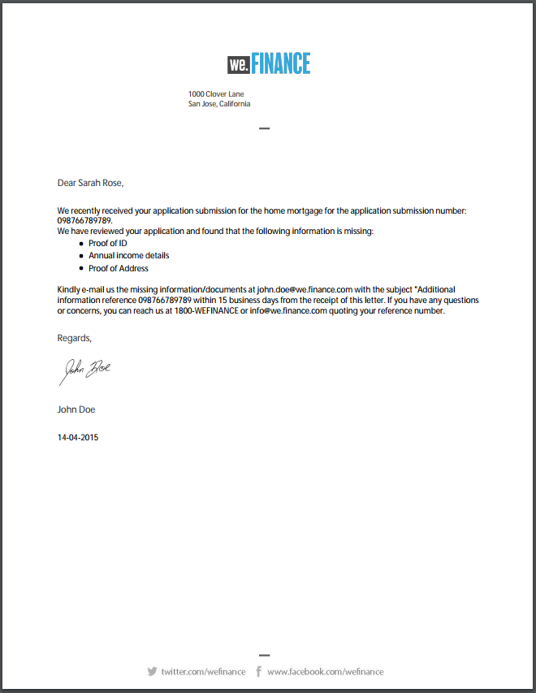
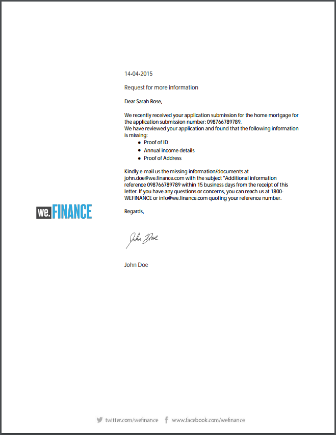
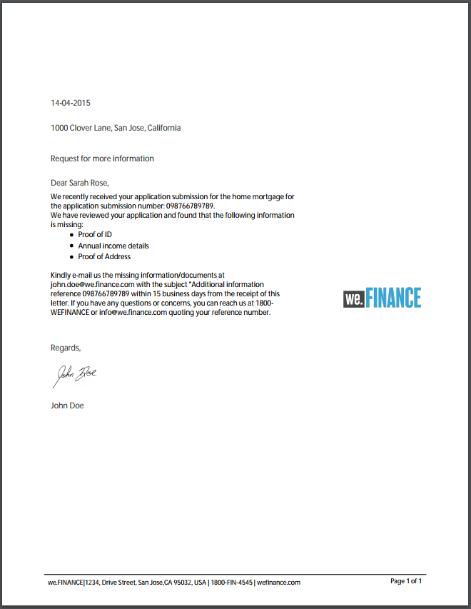
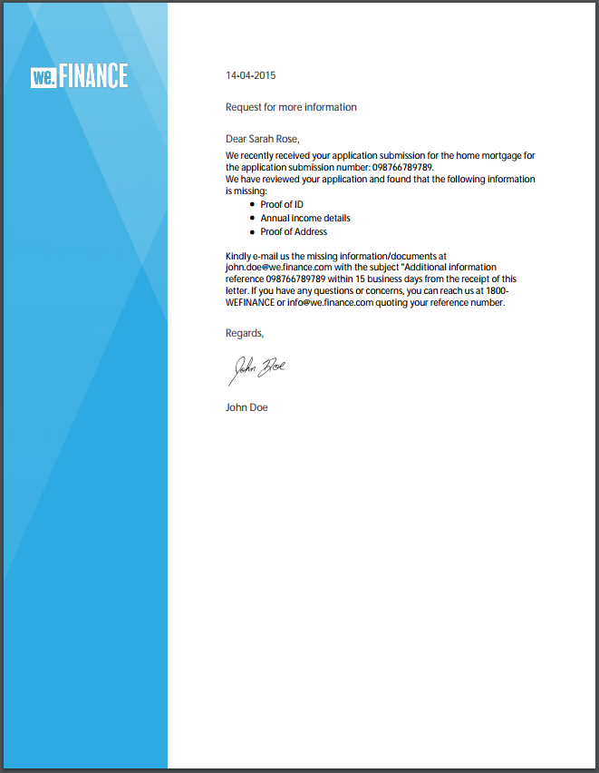
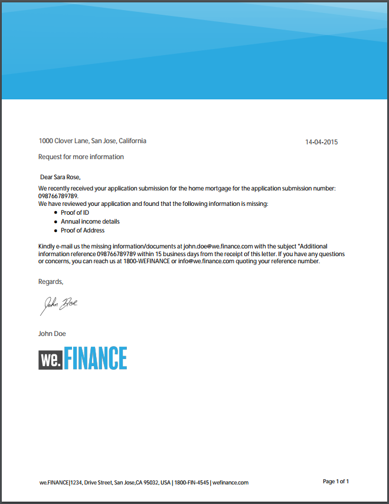
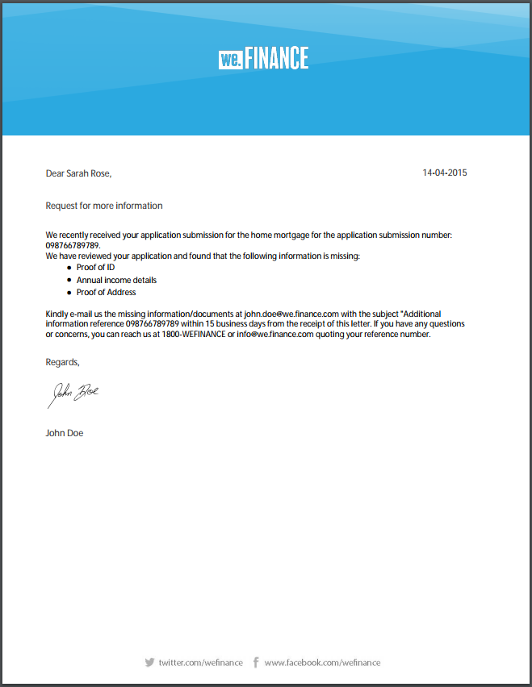

# Reference letter templates {#reference-letter-templates}

In Correspondence Management, a letter template contains typical form fields, layout features such as a header and footer, and empty "target areas" for the placement of content.

Correspondence Management provides letter templates in the [AEM Forms add-on package](https://experienceleague.adobe.com/docs/experience-manager-release-information/aem-release-updates/forms-updates/aem-forms-releases.html?lang=en). You can customize the templates in Designer according to your branding and business needs. The package includes the following templates:

* Classic
* Classic Simple
* Balanced Left
* Balanced Right
* Visual Left
* Visual Top
* Visual Top - Classic

After you install the package, the layout templates (XDPs) are listed in templates-folder at the following location:

`https://'[server]:[port]'/[context-root]/aem/forms.html/content/dam/formsanddocuments/templates-folder`

Following are the common fields in all the templates in this package:

* Date
* Salutation
* Closing Text
* Signature Text

After installing the AEM-FORMS-6.3-REFERENCE-LAYOUT-TEMPLATES package, the templates are listed in templates-folder

## Classic {#classic}

With a logo on top, Classic template is suitable for a plain professional letter. 

PDF preview of a letter created using the Classic template

## Classic Simple {#classic-simple}

Includes fields to capture phone number and email address. A Classic Simple template is similar to the Classic template except that it does not have fields where you could enter the address of the recipient. 

PDF preview of a letter created using the Classic Simple template

## Balanced Left {#balanced-left}

The Balanced Left template includes logo on the left of the letter.

PDF preview of a letter created using the Balanced Left template

## Balanced Right {#balanced-right}

Balanced Right template has the company logo on the left and provides space for entering recipients address on the letter itself. Balanced Right template also includes a footer that reflows when your letter has multiple pages.

PDF preview of a letter created using the Balanced Right template

## Visual Left {#visual-left}

The Visual Left template has a side head on the left of the page with the company logo placed over the side head. Visual Left template has a subject field but no footer.

PDF preview of a letter created using the Visual Left template

## Visual Top {#visual-top}

Visual Top template has visual margin on the top. The Visual Top template has a field for entering recipient's address on the page itself. The Visual Top template has the subject field and a footer that reflows for letters that extend to multiple pages.

PDF preview of a letter created using the Visual Top template

## Visual Top - Classic {#visual-top-classic}

The Visual Top - Classic template has a header on top of the page with the company logo. The Visual Top - Classic template has a field to enter a subject but no footer.

PDF preview of a letter created using the Visual Top - Classic template
