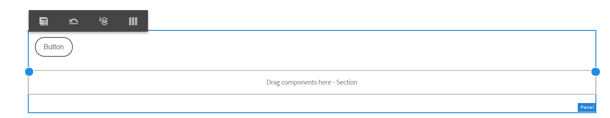

# Use Layout mode to resize components {#use-layout-mode-to-resize-components}

The Interactive Communication Web channel authoring interface enables you to resize components using the Layout mode. Drag-and-drop blue dots within columns to define the start and end points to position components. The blue dots display after tapping the component within the responsive grid. The responsive grid consists of 12 equal columns. The white and blue color shading in alternate columns differentiates one column from the other.

You can use the Layout mode to resize components for all device types such as desktop, tablet, phone, and other smaller devices. The tablet automatically derives the layout configuration from the desktop version and the smaller devices derive layout configuration from phone. However, you can override the automatically derived configurations to define a different configuration for each device type.

>[!NOTE]
>
>If you are creating the Web channel using [Print channel as master](../../forms/using/create-interactive-communication.md) for an Interactive Communication, the components available for resizing also include the sub-forms and fields that are auto-generated in Web channel using Print channel. The Web channel retains the layout for the Print channel elements in Layout mode.

## Access Layout mode {#access-layout-mode}

Select **Layout** from the drop-down list that appears at the top of the Interactive Communication authoring interface next to the **Preview** option. The form displays in the Layout mode.

1. Log in to the AEM author instance and navigate to **Adobe Experience Manager** &gt; **Forms** &gt; **Forms & Documents**.
1. Create an [Interactive Communication](../../forms/using/create-interactive-communication.md) or open an existing one.
1. Select **Layout** from the drop-down list that appears at the top next to the **Preview** option. The form displays in the Layout mode.

   

## Resize components {#resize-components}

1. In Layout mode, select the component to resize. The blue dots display at the start and end of the responsive grid.
1. Drag-and drop the blue dots to define the position of the component in the responsive grid.

   

   The toolbar that displays after tapping components consists of the following options:

    * **Parent:** Select the parent of a component.
    * **Float to new line:** Shift the component to the next line if there are multiple components within the same line.

   You can undo all resizing changes and apply default layout to the panel containing resized components using the **[!UICONTROL Revert breakpoint layout]** ( ) option. Select the parent of the resized component to view the option.

   >[!NOTE]
   >
   >You cannot resize table column, toolbar, toolbar button, and target area components using the Layout mode. Use Style mode to resize these components.

### Example {#example}

**Objective:** You want to insert a table component and an Image component and position them parallel to each other in an Interactive Communication.

1. Insert the table and image components using Edit mode in the Web channel of an Interactive Communication. The image component display after the table component.
1. Switch to Layout mode and select the Table component. The blue dots to resize the component display at column 1 and 12.
1. Drag-and-drop the blue dot at column 12 to column 6 of the responsive grid.

   

1. Similarly, select the Image component and drag-and-drop the blue dot at column 1 to column 7 of the responsive grid. The table and image components display parallel to each other.

   

   You can select the Image component and select the **Float to new line** option available in the toolbar to shift the Image component to the next line.

## Resize panels {#resize-panels-layout-mode}

Execute the following steps if you want to resize the entire panel instead of individual components:

1. Select any of the components in the panel that you want to resize, select , and select the first option in the drop-down list, if the panel is the immediate parent of the component.

   The blue dots display at the start and end of the responsive grid. 

1. Drag-and drop the blue dots to define the position of the panel in the responsive grid.
   You can repeat steps 1 and 2 and select  to shift the resized panel to the next line.

## Define multi-column layout for a panel

Execute the following steps to define the number of columns for a panel:

1. In **[!UICONTROL Edit]** mode, select the panel, select , and select **[!UICONTROL Responsive - everything on the page without navigation]** option from the **[!UICONTROL Panel Layout]** drop-down list.

1. Select  to save the properties.

1. In the **[!UICONTROL Layout]** mode, select any of the components in the panel, select , and select the panel.

1. Select  and select the number of columns from the drop-down list. The number of columns can range from 1 to 12. The panel gets divided into a multi-column layout.

## Disable Layout mode for forms with old responsive layout {#disable-layout-mode-for-forms-with-old-responsive-layout}

You can disable the Layout mode for forms with old responsive layout by editing properties for the template used in the form.

Perform the following steps to disable the Layout mode:

1. Select **[!UICONTROL Tools]** > **[!UICONTROL General]** > **[!UICONTROL Templates]** and open the template used in the form in **[!UICONTROL Edit]** mode.
1. Select the Document Container in the left pane and select **[!UICONTROL Policy.]**

   

1. Select the **[!UICONTROL Layout Settings]** tab and select **[!UICONTROL Disable Layout Mode]**. 
1. Select  to save the template properties.
