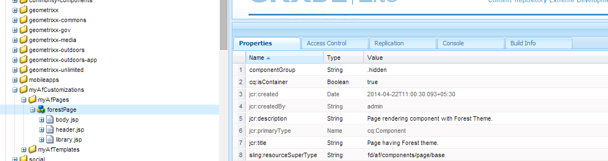
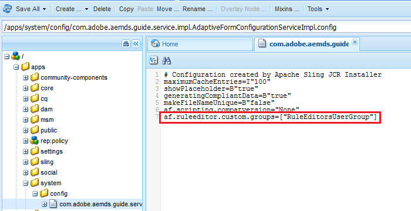

# Grant rule editor access to select user groups{#grant-rule-editor-access-to-select-user-groups}

 Adobe recommends using the modern and extensible data capture [Core Components](https://experienceleague.adobe.com/docs/experience-manager-core-components/using/adaptive-forms/introduction.html) for [creating new Adaptive Forms](/help/forms/using/create-an-adaptive-form-core-components.md) or [adding Adaptive Forms to AEM Sites pages](/help/forms/using/create-or-add-an-adaptive-form-to-aem-sites-page.md). These components represent a significant advancement in Adaptive Forms creation, ensuring impressive user experiences. This article describes an older approach to authoring Adaptive Forms using foundation components. 

## Overview {#overview}

You may have different types of users with varied skills that work with Adaptive Forms. While expert users may have the right knowledge to work with scripts and complex rules, there may be basic-level users who need to work only with the layout and basic properties of adaptive forms.

AEM Forms lets you limit rule editor access to users based on their role or function. In the Adaptive Forms Configuration Service settings, you can specify the [user groups](/help/sites-administering/security.md) that can view and access the rule editor.

## Specify user groups that can access rule editor {#specify-user-groups-that-can-access-rule-editor}

1. Log in to AEM Forms as an administrator.
1. In the author instance, click Adobe Experience Manager &gt; Tools  &gt; Operations &gt; Web Console. The Web Console opens in a new window.

   

1. In the Web Console window, locate and click **[!UICONTROL Adaptive Form and Interactive Communication Web Channel Configuration]**. **[!UICONTROL Adaptive Form and Interactive Communication Web Channel Configuration]** dialog box appears. Do not change any value and click **Save**.

   It creates a file /apps/system/config/com.adobe.aemds.guide.service.impl.AdaptiveFormConfigurationServiceImpl.config in the CRX-repository.

1. Log in to CRXDE as an administrator. Open file /apps/system/config/com.adobe.aemds.guide.service.impl.AdaptiveFormConfigurationServiceImpl.config for editing.
1. Use the following property to specify the name of a group that can access rule editor (For example, RuleEditorsUserGroup) and click **Save All**.

   `af.ruleeditor.custom.groups=["RuleEditorsUserGroup"]`

   To enable access for multiple groups, specify a list of comma-separated values:

   `af.ruleeditor.custom.groups=["RuleEditorsUserGroup", "PermittedUserGroup"]`

   

   Now, when a user that is not a part of the specified user group (here RuleEditorsUserGroup) taps a field, the Edit Rule icon ( ) is not available for them in the components toolbar:

   

   Components toolbar as visible to a user with rule editor access

   

   Components toolbar as visible to a user without rule editor access

   For instructions on adding users to groups, see [User Administration and Security](/help/sites-administering/security.md).
