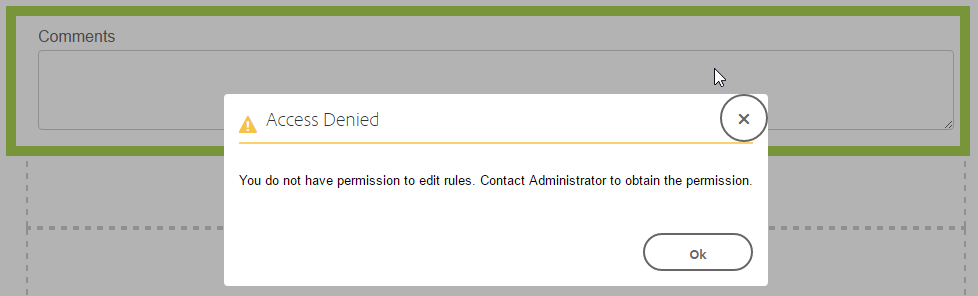

# Grant rule editor access to select user groups{#grant-rule-editor-access-to-select-user-groups}

## Overview {#overview}

You may have different types of users with varied skills that work with Adaptive Forms. While expert users may have the right knowledge to work with scripts and complex rules, there may be basic-level users who need to work only with the layout and basic properties of adaptive forms.

AEM Forms allows you to limit rule editor access to users based on their role or function. In the Adaptive Forms Configuration Service settings, you can specify the [user groups](../../sites/administering/using/security.md) that can view and access rule editor.

## Specify user groups that can access rule editor {#specify-user-groups-that-can-access-rule-editor}

1. Log in to AEM Forms as an administrator.
1. In the author instance, click ** Adobe Experience Manager &gt; Tools  &gt; Operations &gt; Web Console. **The Web Console opens in a new window.

   

1. In Web Console Window, locate and click **Adaptive Form Configuration** **Service**. **Adaptive Form Configuration Service **dialog appears. Do not change any value and click **Save**.

   It creates a file /apps/system/config/com.adobe.aemds.guide.service.impl.AdaptiveFormConfigurationServiceImpl.config in CRX-repository.

1. Log in to CRXDE as an administrator. Open file /apps/system/config/com.adobe.aemds.guide.service.impl.AdaptiveFormConfigurationServiceImpl.config for editing.
1. Use the following property to specify the name of a group that can access rule editor (For example, RuleEditorsUserGroup) and click **Save All**.

   `af.ruleeditor.custom.groups=["RuleEditorsUserGroup"]`

   To enable access for mutiple groups, specify a list of comma seperated values:

   `af.ruleeditor.custom.groups=["RuleEditorsUserGroup", "PermittedUserGroup"]`

   

   Now, when a user that is not a part of the a specified user group (here RuleEditorsUserGroup) taps a field, the Edit Rule icon ( ) is not available for her in the components toolbar:

   <!--
   Comment Type: draft

   <note>
   
AEM Forms has two default user groups for two different aspects of adaptive forms:

   <ul>
   <li><strong>forms-users</strong> have access to forms authoring</li>
   <li><strong>template-authors</strong> have access to forms template authoring</li>
   </ul>
   
When you limit rule editor access by specifying a custom user group, such as RuleEditorsUsers, ensure that the users in both the default user groups that need to work with the respective Rule Editor UIs are added to the RuleEditorsUserGroup group.

   
Alternatively, to limit rule editor access only for forms-user and to allow all template-authors to access rule editor, add the following two values to User Groups With Rule Editor Access:

   <ul>
   <li>RuleEditorUsersGroup: Gives access to a select subset of forms-users group</li>
   <li>template-authors: Gives access to all the users in the template-authors group</li>
   </ul>
   </note>
   -->

   <!--
   Comment Type: draft

   
By default, all the user groups have access to rule editor. To grant access to rule editor to all the user groups on your server, ensure that the User Groups With Rule Editor field is empty.

   -->

   <!--
   Comment Type: draft

   <table border="1" cellpadding="1" cellspacing="0" width="100%">
   <tbody>
   <tr>
   <td><strong>Value in the field User Groups With Rule Editor Access</strong></td>
   <td><strong>Grants access to Rule Editor in Adaptive Forms UI</strong></td>
   <td><strong>Grants access to Rule Editor in Forms Templates UI</strong></td>
   </tr>
   <tr>
   <td>no value</td>
   <td> </td>
   <td> </td>
   </tr>
   </tbody>
   </table>
   -->

   

   Components toolbar as visible to a user with rule editor access

   

   Components toolbar as visible to a user without rule editor access

   <!--
   Comment Type: draft

   
   -->

   For instructions on adding users to groups, see [User Administration and Security](../../sites/administering/using/security.md).

<!--
<related-links>
<a href="../../forms/using/rule-editor.md" target="_blank">Rule Editor</a>
<a href="../../forms/using/creating-accessible-adaptive-forms.md" target="_blank">Creating accessible adaptive forms</a>
</related-links>
-->

