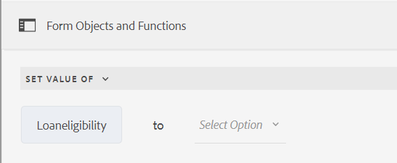

# Add rules to an Adaptive Form Core Components {#adaptive-forms-rule-editor}

<span class="preview"> This article contains content for some pre-release features. These pre-release features are accessible only through our [pre-release channel](https://experienceleague.adobe.com/en/docs/experience-manager-65/content/release-notes/release-notes#forms). The features under the pre-release program are:
* Support for implementing nested conditions with When-then-else functionality
* Validate or reset panels and forms, including fields 
* Support for modern JavaScript features such as let and arrow functions (ES10 support) within custom functions.
</span>

The Rule Editor feature facilitates forms business users and developers to write rules on Adaptive Form objects. These rules define actions to trigger on form objects based on the preset conditions, user inputs, and user actions on the form. It helps further streamline the form filling experience ensuring accuracy and speed.

The rule editor provides an intuitive and simplified user interface to write rules. Rule editor offers a visual editor for all the users.<!-- In addition, only for forms power users, rule editor provides a code editor to write rules and scripts. --> Some of the key actions that you perform on Adaptive Form objects using Rules are:

* Show or hide an object
* Enable or disable an object
* Set a value for an object
* Validate the value of an object
* Execute functions to compute the value of an object
* Invoke a Form Data Model (FDM) service and perform an operation
* Set property of an object

<!-- Rule editor replaces the scripting capabilities in [!DNL Experience Manager 6.1 Forms] and earlier releases. However, your existing scripts are preserved in the new rule editor. For more information about working with existing scripts in the rule editor, see [Impact of rule editor on existing scripts](rule-editor.md#p-impact-of-rule-editor-on-existing-scripts-p). -->

Users added to the `forms-power-users` group can create the scripts and edit the existing ones. Users in the `forms-users group` can use the scripts but not create or edit the scripts.

## Understanding a rule {#understanding-a-rule}

A rule is a combination of actions and conditions. In rule editor, actions include activities such as hide, show, enable, disable, or compute the value of an object in a form. Conditions are Boolean expressions that are evaluated by performing checks and operations on the state, value, or property of a form object. Actions are performed based on the value ( `True` or `False`) returned by evaluating a condition.

The rule editor provides a set of predefined rule types, such as When, Show, Hide, Enable, Disable, Set Value Of, and Validate, to help you write rules. Each rule type lets you define conditions and actions in a rule. The document further explains each rule type in detail.

A rule typically follows one of the following constructs:

**Condition-Action** In this construct, a rule first defines a condition followed by an action to trigger. The construct is comparable to `if-then statement` in the programming languages.

In rule editor, the **When** rule type enforces the condition-action construct.

**Action-Condition** In this construct, a rule first defines an action to trigger followed by conditions for evaluation. Another variation of this construct is action-condition-alternate action, which also defines an alternate action to trigger if the condition returns False.

The Show, Hide, Enable, Disable, Set Value Of, and Validate rule types in the Rule Editor enforce the `action-condition` rule construct. By default, the alternate action for Show is Hide and for Enable is Disable, and the opposite way. You cannot change the default alternate action.

>[!NOTE]
>
>The available rule types, including conditions and actions that you define in rule editor, also depend on the type of form object on which you are creating a rule. The rule editor displays only valid rule types and options for writing condition and action statements for a particular form object type. For example, you do not see Validate and Set Value Of types for a panel object.

For more information about rule types available in the rule editor, see [Available rule types in rule editor](rule-editor.md#p-available-rule-types-in-rule-editor-p).

### Guidelines for choosing a rule construct {#guidelines-for-choosing-a-rule-construct}

While you can achieve most of the use cases by using any rule construct, here are some guidelines to choose one construct over another. For more information about the available rules in rule editor, see [Available rule types in rule editor](rule-editor.md#p-available-rule-types-in-rule-editor-p).

* A typical rule of the thumb when creating a rule is to think about it in the context of the object on which you are writing a rule. Consider that you want to hide or show a field B based on the value a user specifies in the field A. In this case, you are evaluating a condition on field A, and based on the value it returns, you are triggering an action on field B.

  Therefore, if you are writing a rule on field B (the object on which you are evaluating a condition), use the `condition-action` construct or the `When` rule type. Similarly, use the `action-condition` construct or `Show or Hide` rule type on field A.

* At times, you must perform multiple actions based on one condition. In such cases, it is recommended to use the `condition-action` construct. In this construct, you can evaluate a condition once and specify multiple action statements.

  For example, to hide fields B, C, and D based on the condition that checks for the value a user specifies in field A, write one rule with condition-action construct or When rule type on field A and specify actions to control the visibility of fields B, C, and D. Otherwise, you need three separate rules on fields B, C, and D, where each rule checks the condition and shows or hides the respective field. In this example, it is more efficient to write the When rule type on one object rather than Show or Hide rule type on three objects.

* To trigger an action based on multiple conditions, it is recommended to use action-condition construct. For example, to show and hide field A by evaluating conditions on fields B, C, and D, use Show or Hide rule type on field A.
* Use condition-action or action condition construct if the rule contains one action for one condition.
* If a rule checks for a condition and performs an action immediately on providing a value in a field or exiting a field, it is recommended to write a rule with condition-action construct or the When rule type on the field on which the condition is evaluated.
* The condition in the When rule is evaluated when a user changes the value of the object on which the When rule is applied. However, if you want the action to trigger when the value changes on the server side, like for prepopulating the value, it is recommended to write a When rule that triggers the action when the field is initialized.
* When writing rules for drop-downs, radio buttons, or check boxes objects, the options or values of these form objects in the form are pre-populated in the rule editor.

## Available operator types and events in rule editor {#available-operator-types-and-events-in-rule-editor}

The rule editor provides the following logical operators and events using which you can create rules.

* **Is Equal To**
* **Is Not Equal To**
* **Starts With**
* **Ends With**
* **Contains**
* **Does not contain**
* **Is Empty**
* **Is Not Empty**
* **Has Selected:** Returns true when the user selects a particular option for a checkbox, drop-down, or a radio button.
* **Is Initialized (event):** Returns true when a form object renders in the browser.
* **Is Changed (event):** Returns true when the user changes the entered value or selected option for a form object.

<!--
* **Navigation(event):** Returns true when the user clicks a navigation object. Navigation objects are used to move between panels. 
* **Step Completion(event):** Returns true when a step of a rule completes.
* **Successful Submission(event):** Returns true on successful submission of data to a form data model.
* **Error in Submission(event):**  Returns true on unsuccessful submission of data to a form data model. -->

## Available rule types in rule editor {#available-rule-types-in-rule-editor}

The rule editor provides a set of predefined rule types that you can use to write rules. Let's look at each rule type in detail. For more information about writing rules in rule editor, see [Write rules](rule-editor.md#p-write-rules-p).

### [!UICONTROL When] {#whenruletype}

The **[!UICONTROL When]** rule type follows the **condition-action-alternate action** rule construct, or sometimes, just the **condition-action** construct. In this rule type, you first specify a condition for evaluation followed by an action to trigger if the condition is satisfied ( `True`). While using the When rule type, you can use multiple AND and OR operators to create [nested expressions](#nestedexpressions).

Using the When rule type, you can evaluate a condition on a form object and perform actions on one or more objects.

In plain words, a typical When rule is structured as follows:

`When on Object A:`

`(Condition 1 AND Condition 2 OR Condition 3) is TRUE;`

`Then, do the following:`

`Action 2 on Object B;`
`AND`
`Action 3 on Object C`;

`Else, do the following:`

`Action 2 on Object C;`
_

When you have a multi-value component, such as radio buttons or list, while creating a rule for that component the options are automatically retrieved and made available to the rule creator. You need not type the option values again.

For example, a list has four options: Red, Blue, Green, and Yellow. While creating the rule, the options (radio buttons) are automatically retrieved and made available to the rule creator as following:


While writing a When rule, you can trigger the Clear Value Of action. `Clear Value Of` action clears the value of the specified object. Having `Clear Value of` as an option in the When statement lets you create complex conditions with multiple fields. You can add the Else statement to add further conditions.


>[!NOTE]
>
> When rule type only supports single-level then-else statements.

#### Allowed Multiple fields in [!UICONTROL When] {#allowed-multiple-fields}

In the **When** condition, you have the option to add other fields apart from the field to which the rule is applied. 

For example, using the When rule type, you can evaluate a condition on different form objects and perform the action:

`When:`

`(Object A Condition 1)`

`AND/OR`

`(Object B Condtion 2)`

`Then, do the following:`

`Action 1 on Object A`

_


##### Considerations while using Allowed Multiple fields in When condition feature

* Ensure that the [core component and specification version is set to the latest version](https://github.com/adobe/aem-core-forms-components/tree/release/650) to use this feature in the rule editor.
* If rules are applied to different fields within the When condition, the rule triggers even if only one of those fields is changed.


<!--
* It is not possible to add multiple fields in the When condition while applying rules to a button.

##### To enable Allowed Multiple fields in When condition feature

Allowed Multiple fields in When condition feature is disabled by default. To enable this feature, add a custom property at the template policy:

1. Open the corresponding template associated with an Adaptive Form in the template editor.
1. Select the existing policy as **formcontainer-policy**.
1. Navigate to the **[!UICONTROL Structure]**  view and, from the **[!UICONTROL Allowed Components]** list, open the **[!UICONTROL Adaptive Forms Container]** policy.
1. Go to the **[!UICONTROL Custom Properties]** tab and to add a custom property, click **[!UICONTROL Add]**.
1. Specify the **Group Name** of your choice. For example, in our case, we added the group name as **allowedfeature**.
1. Add the **key** and **value** pair as follows:
   * key: fd:changeEventBehaviour
   * value: deps
1. Click **[!UICONTROL Done]**. -->

If the allowed multiple fields in the When condition feature encounter any issues, follow the troubleshooting steps as:

1. Open the form in edit mode.
1. Open the Content browser and select the **[!UICONTROL Guide Container]** component of your Adaptive Form.
1. Click the Guide Container properties  icon. The Adaptive Form Container dialog box opens.
1. Click Done and save the dialog again.

**[!UICONTROL Hide]** Hides the specified object.

**[!UICONTROL Show]** Shows the specified object.

**[!UICONTROL Enable]** Enables the specified object.

**[!UICONTROL Disable]** Disables the specified object.

**[!UICONTROL Invoke service]** Invokes a service configured in a form data model (FDM). When you choose the Invoke Service operation, a field appears. On tapping the field, it displays all services configured in all form data model (FDM) on your [!DNL Experience Manager] instance. On choosing a Form Data Model service, more fields appear where you can map form objects with input and output parameters for the specified service. See example rule for invoking Form Data Model (FDM) services.

In addition to Form Data Model service, you can specify a direct WSDL URL to invoke a web service. However, a Form Data Model service has many benefits and the recommended approach to invoke a service.

For more information about configuring services in form data model (FDM), see [[!DNL Experience Manager Forms] Data Integration](data-integration.md).

**[!UICONTROL Set value of]** Computes and sets the value of the specified object. You can set the object value to a string, the value of another object, the computed value using mathematical expression or function, the value of a property of an object, or the output value from a configured Form Data Model service. When you choose the web service option, it displays all services configured in all form data model (FDM) on your [!DNL Experience Manager] instance. On choosing a Form Data Model service, more fields appear where you can map form objects with input and output parameters for the specified service.

For more information about configuring services in form data model (FDM), see [[!DNL Experience Manager Forms] Data Integration](data-integration.md).

The **[!UICONTROL Set Property]** rule type lets you set the value of a property of the specified object based on a condition action. You can set property to one of the following:
* visible (Boolean)
* label.value (String)
* label.visible (Boolean)
* description (String)
* enabled (Boolean)
* readOnly (Boolean)
* required (Boolean)
* screenReaderText (String)
* valid (Boolean)
* errorMessage (String)
* default (Number, String, Date)
* enumNames (String[])
* chartType (String)

For example, it enables you to define rules to show textbox when a button is clicked. You can use custom function, a form object, object property, or an service output to define a rule.


To define a rule based on a custom function, select **[!UICONTROL Function Output]** from the drop-down list, and drag-and-drop a custom function from the **[!UICONTROL Functions]** tab. If the condition action is met, the text input box gets visible.

To define a rule based on a form object, select **[!UICONTROL Form Object]** from the drop-down list, and drag-and-drop a form object from the **[!UICONTROL Form Objects]** tab. If the condition action is met, the text input box gets visible in the Adaptive Form.

A Set Property rule based on an object property lets you to make the text input box visible in an Adaptive Form based on another object property that is included in the Adaptive Form.

The following figure depicts an example of dynamically enabling the checkbox based on the hiding or showing of textbox in an Adaptive Form:


**[!UICONTROL Clear Value Of]** Clears the value of the specified object.

**[!UICONTROL Set Focus]** Sets focus on the specified object.

**[!UICONTROL Submit Form]** Submits the form.

**[!UICONTROL Reset]** Resets the form or specified object.

**[!UICONTROL Validate]** Validates the form or specified object.

**[!UICONTROL Add Instance]** Adds an instance of the specified repeatable panel or table row.

**[!UICONTROL Remove Instance]** Removes an instance of the specified repeatable panel or table row.

**[!UICONTROL Function Output]** Defines a rule based on  predefined functions or custom functions.

**[!UICONTROL Navigate to]** Navigates to other <!--Interactive Communications,--> Adaptive Forms, other assets such as images or document fragments, or an external URL. <!-- For more information, see [Add button to the Interactive Communication](create-interactive-communication.md#addbuttontothewebchannel). -->

**[!UICONTROL Dispatch Event]** Triggers the specific actions or behaviors based on predefined conditions or events.


### [!UICONTROL Set Value of] {#set-value-of}

The **[!UICONTROL Set Value of]** rule type lets you set the value of a form object depending on whether the specified condition is satisfied or not. The value can be set to a value of another object, a literal string, a value derived from a mathematical expression or a function, a value of a property of another object, or the output of a Form Data Model service. Similarly, you can check for a condition on a component, string, property, or values derived from a function or mathematical expression.

The **Set Value Of** rule type is not available for all form objects, such as panels and toolbar buttons. A standard Set Value Of rule has the following structure:

Set value of Object A to:

(string ABC) OR
(object property X of Object C) OR
(value from a function) OR
(value from a mathematical expression) OR
(output value of a data model service);

When (optional):

(Condition 1 AND Condition 2 AND Condition 3) is TRUE;

Following example selects the value of `Question2` as `True` and sets the value of `Result` as `correct`.


Example of Set Value rule using Form Data Model service.

### [!UICONTROL Show] {#show}

Using the **[!UICONTROL Show]** rule type, you can write a rule to show or hide a form object based on whether a condition is satisfied or not. The Show rule type also triggers the Hide action in case the condition is not satisfied or returns `False`.

A typical Show rule is structured as follows:

`Show Object A;`

`When:`

`(Condition 1 OR Condition 2 OR Condition 3) is TRUE;`

`Else:`

`Hide Object A;`

### [!UICONTROL Hide] {#hide}

Similar to the Show rule type, you can use the **[!UICONTROL Hide]** rule type to show or hide a form object based on whether a condition is satisfied or not. The Hide rule type also triggers the Show action in case the condition is not satisfied or returns `False`.

A typical Hide rule is structured as follows:

`Hide Object A;`

`When:`

`(Condition 1 AND Condition 2 AND Condition 3) is TRUE;`

`Else:`

`Show Object A;`

### [!UICONTROL Enable] {#enable}

The **[!UICONTROL Enable]** rule type lets you enable or disable a form object based on whether a condition is satisfied or not. The Enable rule type also triggers the Disable action in case the condition is not satisfied or returns `False`.

A typical Enable rule is structured as follows:

`Enable Object A;`

`When:`

`(Condition 1 AND Condition 2 AND Condition 3) is TRUE;`

`Else:`

`Disable Object A;`

### [!UICONTROL Disable] {#disable}

Similar to the Enable rule type, the **[!UICONTROL Disable]** rule type lets you enable or disable a form object based on whether a condition is satisfied or not. The Disable rule type also triggers the Enable action in case the condition is not satisfied or returns `False`.

A typical Disable rule is structured as follows:

`Disable Object A;`

`When:`

`(Condition 1 OR Condition 2 OR Condition 3) is TRUE;`

`Else:`

`Enable Object A;`

### [!UICONTROL Validate] {#validate}

The **[!UICONTROL Validate]** rule type validates the value in a field using an expression. For example, you can write an expression to check that the text box for specifying name does not contain special characters or numbers.

A typical Validate rule is structured as follows:

`Validate Object A;`

`Using:`

`(Expression 1 AND Expression 2 AND Expression 3) is TRUE;`

>[!NOTE]
>
>If the specified value does not comply with the Validate rule, you can display a validation message to the user. You can specify the message in the **[!UICONTROL Script validation message]** field in the component properties in the sidebar.


<!--
### [!UICONTROL Set Options Of] {#setoptionsof}

The **[!UICONTROL Set Options Of]** rule type enables you to define rules to add check boxes dynamically to the Adaptive Form. You can use a Form Data Model or a custom function to define the rule.

To define a rule based on a custom function, select **[!UICONTROL Function Output]** from the drop-down list, and drag-and-drop a custom function from the **[!UICONTROL Functions]** tab. The number of checkboxes defined in the custom function are added to the Adaptive Form.


To create a custom function, see [custom functions in rule editor](#custom-functions).

To define a rule based on a form data model:

1. Select **[!UICONTROL Service Output]** from the drop-down list.
1. Select the data model object.
1. Select a data model object property from the **[!UICONTROL Display Value]** drop-down list. The number of checkboxes in the Adaptive Form is derived from the number of instances defined for that property in the database.
1. Select a data model object property from the **[!UICONTROL Save Value]** drop-down list.

 -->

## Understanding the rule editor user interface {#understanding-the-rule-editor-user-interface}

Rule editor provides a comprehensive yet simple user interface to write and manage rules. You can launch the rule editor user interface from within an Adaptive Form in authoring mode.

To launch the rule editor user interface:

1. Open an Adaptive Form in authoring mode.
1. Select the form object for which you want to write a rule, and in Component Toolbar select . The rule editor user interface appears.

   

   Any existing rules on the selected form objects are listed in this view. For information about managing existing rules, see [Manage rules](rule-editor.md#p-manage-rules-p).

1. Select **[!UICONTROL Create]** to write a new rule. The visual editor of the rule editor user interface opens by default when you launch the rule editor the first time.

   

Let's look at each component of the rule editor UI in detail.

### A. Component-rule display {#a-component-rule-display}

Displays the title of the Adaptive Form object through which you launched the rule editor and the rule type currently selected. In the above example, the rule editor is launched from an Adaptive Form object titled Question 1 and the rule type selected is When.

### B. Form objects and functions {#b-form-objects-and-functions-br}

The pane on the left in the rule editor user interface includes two tabs — **[!UICONTROL Forms Objects]** and **[!UICONTROL Functions]**.

The Form Objects tab shows a hierarchical view of all objects contained in the Adaptive Form. It displays the title and type of the objects. When writing a rule, you can drag-drop form objects onto the rule editor. While creating or editing a rule when you drag-and-drop an object or function into a placeholder, the placeholder automatically takes the appropriate value type.

The form objects that have one or more valid rules applied are marked with a Green dot. If any of the rules applied to a form object are invalid, the form object is marked with a Yellow dot.

The Functions tab includes a set of built-in functions, such as Sum Of, Min Of, Max Of, Average Of, Number Of, and Validate Form. You can use these functions to compute values in repeatable panels and table rows and use them in action and condition statements when writing rules. You can, however, create custom functions too.

Some of the list of functions are displayed in the figure:


>[!NOTE]
>
>You can perform text search on objects and functions names and titles in Forms Objects and Functions tabs.

In the left tree of the form objects, you can select the form objects to display the rules applied to each of the objects. Not only you can navigate through the rules of the various form objects, you can also copy-paste rules between the form objects. For more information, see [Copy-paste rules](rule-editor.md#p-copy-paste-rules-p).

### C. Form objects and functions toggle {#c-form-objects-and-functions-toggle-br}

The toggle button, when tapped, toggles the form objects and functions pane.

### D. Visual rule editor {#visual-rule-editor}

Visual rule editor is the area in the visual editor mode of the rule editor user interface where you write rules. It lets you select a rule type and accordingly define conditions and actions. When defining conditions and actions in a rule, you can drag-drop form objects and functions from the Form Objects and Functions pane.

For more information about using visual rule editor, see [Write rules](rule-editor.md#p-write-rules-p).
<!-- 
### E. Visual-code editors switcher {#e-visual-code-editors-switcher}

Users in the forms-power-users group can access code editor. For other users, code editor is not available. If you have the rights, you can switch from visual editor mode to code editor mode of the rule editor, and conversely, using the switcher right above the rule editor. When you launch rule editor the first time, it opens in the visual editor mode. You can write rules in the visual editor mode or switch to the code editor mode to write a rule script. However, note that if you modify a rule or write a rule in code editor, you cannot switch back to the visual editor for that rule unless you clear the code editor.

[!DNL Experience Manager Forms] tracks the rule editor mode you used last to write a rule. When you launch the rule editor next time, it opens in that mode. However, you can also configure a default mode to open the rule editor in the specified mode. To do so:

1. Go to [!DNL Experience Manager] web console at `https://[host]:[port]/system/console/configMgr`.
1. Click to edit **[!UICONTROL Adaptive Form Configuration Service]**.
1. choose **[!UICONTROL Visual Editor]** or **[!UICONTROL Code Editor]** from the **[!UICONTROL Default Mode for Rule Editor]** drop-down

1. Click **[!UICONTROL Save]**.
-->

### E. Done and cancel buttons {#done-and-cancel-buttons}

The **[!UICONTROL Done]** button is used to save a rule. You can save an incomplete rule. However, incomplete are invalid and do not run. Saved rules on a form object are listed when you launch the rule editor next time from the same form object. You can manage existing rules in that view. For more information, see [Manage rules](rule-editor.md#p-manage-rules-p).

The **[!UICONTROL Cancel]** button discards any changes you made to a rule and closes the rule editor.

## Write rules {#write-rules}

You can write rules using the visual rule editor <!-- or the code editor. When you launch the rule editor the first time, it opens in the visual editor mode. You can switch to the code editor mode and write rules. However, if you write or modify a rule in code editor, you cannot switch to the visual editor for that rule unless you clear the code editor. When you launch the rule editor next time, it opens in the mode that you used last to create rule. -->

Let's first look at how to write rules using visual editor.

### Using visual editor {#using-visual-editor}

Let's understand how to create a rule in visual editor using the following example form.


The Loan Requirements section in the example loan application form requires applicants to specify their marital status, salary, and if married, their spouse's salary. Based on the user inputs, the rule computes the loan eligibility amount and displays in the Loan Eligibility field. Apply the following rules to implement the scenario:

* The Spouse's Salary field is shown only when the Marital Status is Married.
* The loan eligibility amount is 50% of the total salary.

To write rules, perform the following steps:

1. First, write the rule to control the visibility of the Spouse Salary field based on the option user selects for the Marital Status radio button.

   Open the loan application form in authoring mode. Select the **[!UICONTROL Marital Status]** component and select . Next, select **[!UICONTROL Create]** to launch the rule editor.

   

   When you launch the rule editor, the When rule is selected by default. Also, the form object (in this case, Marital Status) from where you launched the rule editor is specified in the When statement.

   While you cannot change or modify the selected object, you can use the rule drop-down, as shown below, to select another rule type. If you want to create a rule on another object, select Cancel to exit the rule editor and launch it again from the desired form object.

1. Select **[!UICONTROL Select State]** drop-down and select **[!UICONTROL is equal to]**. The **[!UICONTROL Enter a String]** field appears.

   

  <!--  In the Marital Status radio button, **[!UICONTROL Married]** and **[!UICONTROL Single]** options are assigned **0** and **1** values, respectively. You can verify assigned values in the Title tab of the Edit radio button dialog as shown below.

   -->

1. In the **[!UICONTROL Enter a String]** field in the rule, select **Married** from drop-down menu.

   

   You have defined the condition as `When Marital Status is equal to Married`. Next, define the action to perform if this condition is True.

1. In the Then statement, select **[!UICONTROL Show]** from the **[!UICONTROL Select Action]** drop-down.

   

1. Drag-drop the **[!UICONTROL Spouse Salary]** field from the Form Objects tab on the **[!UICONTROL Drop object or select here]** field. Alternatively, select the **[!UICONTROL Drop object or select here]** field and select the **[!UICONTROL Spouse Salary]** field from the pop-up menu, which lists all form objects in the form.

   

   Next, define the action to perform if this condition is False. 
1. Click **[!UICONTROL Add Else Section]** to add another condition for the **[!UICONTROL Spouse Salary]** field, in case you select Marital Status as single. 

   

1. In the Else statement, select **[!UICONTROL Hide]** from the **[!UICONTROL Select Action]** drop-down.
    

1. Drag-drop the **[!UICONTROL Spouse Salary]** field from the Form Objects tab on the **[!UICONTROL Drop object or select here]** field. Alternatively, select the **[!UICONTROL Drop object or select here]** field and select the **[!UICONTROL Spouse Salary]** field from the pop-up menu, which lists all form objects in the form.
     

   The rule appears as follows in the rule editor.

   


1. Select **[!UICONTROL Done]** to save the rule.

<!--
1. Repeat steps 1 through 5 to define another rule to hide the Spouse Salary field if the marital Status is Single. The rule appears as follows in the rule editor.

    -->

   >[!NOTE]
   >
   > Alternatively, you can write a Show rule on the Spouse Salary field, instead of a When rules on the Marital Status field, to implement the same behavior.

   

1. Next, write a rule to compute the loan eligibility amount, which is 50% of the total salary, and display it in the Loan Eligibility field. To achieve this outcome, create **[!UICONTROL Set value Of]** rules on Loan Eligibility field.

   In authoring mode, select the **[!UICONTROL Loan Eligibility]** field and select . Next, select **[!UICONTROL Create]** to launch the rule editor.

1. Select **[!UICONTROL Set Value Of]** rule from the rule drop-down.

   

1. Select **[!UICONTROL Select Option]** and select **[!UICONTROL Mathematical Expression]**. A field to write mathematical expression opens.

   

1. In the expression field:

    * Select or drag-drop from the Forms Object tab the **[!UICONTROL Salary]** field in the first **[!UICONTROL Drop object or select here]** field.

    * Select **[!UICONTROL Plus]** from the **[!UICONTROL Select Operator]** field.

    * Select or drag-drop from the Forms Object tab the **[!UICONTROL Spouse Salary]** field in the other **[!UICONTROL Drop object or select here]** field.

   

1. Next, select in the highlighted area around the expression field and select **[!UICONTROL Extend Expression]**.

   

   In the extended expression field, select **[!UICONTROL divided by]** from the **[!UICONTROL Select Operator]** field and **[!UICONTROL Number]** from the **[!UICONTROL Select Option]** field. Then, specify **[!UICONTROL 2]** in the number field.

   

   >[!NOTE]
   >
   >You can create complex expressions by using components, functions, mathematical expressions, and property values from the Select Option field.

   Next, create a condition, which when returns True, the expression executes.

1. Select **[!UICONTROL Add Condition]** to add a When statement.

   

   In the When statement:

    * Select or drag-drop from the Forms Object tab the **[!UICONTROL Marital Status]** field in the first **[!UICONTROL Drop object or select here]** field.

    * Select **[!UICONTROL is equal to]** from the **[!UICONTROL Select Operator]** field.

    * Select String in the other **[!UICONTROL Drop object or select here]** field and specify **[!UICONTROL Married]** in the **[!UICONTROL Enter a String]** field.

   The rule finally appears as follows in the rule editor.  

1. Select **[!UICONTROL Done]**. It saves the rule.

1. Repeat steps 7 through 14 to define another rule to compute the loan eligibility if the marital Status is Single. The rule appears as follows in the rule editor.

   

Alternatively, you can use the Set Value Of rule to compute the loan eligibility in the When rule that you created to show-hide the Spouse Salary field. The resultant combined rule when Marital Status is Single appears as follows in the rule editor.


You can write a combined rule to control visibility of the Spouse Salary field and compute loan eligibility when the Marital Status is Married using the Else condition.


<!-- ### Using code editor {#using-code-editor}

Users added to the forms-power-users group can use code editor. The rule editor auto generates the JavaScript code for any rule you create using visual editor. You can switch from visual editor to the code editor to view the generated code. However, if you modify the rule code in the code editor, you cannot switch back to the visual editor. If you prefer writing rules in code editor rather than visual editor, you can write rules afresh in the code editor. The visual-code editors switcher helps you switch between the two modes.

The code editor JavaScript is the expression language of Adaptive Forms. All the expressions are valid JavaScript expressions and use Adaptive Forms scripting model APIs. These expressions return values of certain types. For the complete list of Adaptive Forms classes, events, objects, and public APIs, see [JavaScript Library API reference for Adaptive Forms](https://helpx.adobe.com/experience-manager/6-5/forms/javascript-api/index.html).

For more information about guidelines to write rules in the code editor, see [Adaptive Form Expressions](adaptive-form-expressions.md).

While writing JavaScript code in the rule editor, the following visual cues help you with the structure and syntax:

* Syntax highlights

* Auto Indentation

* Hints and suggestions for Form objects, functions, and their properties

* Auto completion of form component names and common JavaScript functions


-->

#### Custom functions in rule editor {#custom-functions}

Apart from the out-of-the-box functions like *Sum of* that are listed under **Functions Output**, you can also use custom functions in your rule editor. Rule editor supports JavaScript ECMAScript 2019 syntax for scripts and custom functions. For instructions on creating custom functions, refer to the article [Custom Functions in Adaptive Forms](/help/forms/using/create-and-use-custom-functions-core-components.md)

<!--

Ensure that the function you write is accompanied by the `jsdoc` above it. Adaptive Form supports the various [JavaScript annotations for custom functions](/help/forms/create-and-use-custom-functions.md#js-annotations).

For more information, see [jsdoc.app](https://jsdoc.app/).

Accompanying `jsdoc` is required:

* If you want custom configuration and description
* Because there are multiple ways to declare a function in `JavaScript,` and comments let you keep a track of the functions.

Supported `jsdoc` tags:

* **Private**
  Syntax: `@private`
  A private function is not included as a custom function.

* **Name**
  Syntax: `@name funcName <Function Name>`
  Alternatively `,` you can use: `@function funcName <Function Name>` **or** `@func` `funcName <Function Name>`.
  `funcName` is the name of the function (no spaces allowed).
  `<Function Name>` is the display name of the function.

* **Parameter**
  Syntax: `@param {type} name <Parameter Description>`
  Alternatively, you can use: `@argument` `{type} name <Parameter Description>` **or** `@arg` `{type}` `name <Parameter Description>`.
  Shows parameters used by the function. A function can have multiple parameter tags, one tag for each parameter in the order of occurrence.
  `{type}` represents parameter type. Allowed parameter types are:

    1. string
    2. number
    3. boolean
    4. scope
    5. string[]
    6. number[]
    7. boolean[]
    8. date
    9. date[]
    10. array
    11. object

   `scope` refers to a special globals object which is provided by forms runtime. It must be the last parameter and is not be visible to the user in the rule editor. You can use scope to access readable form and field proxy object to read properties, event which triggered the rule and a set of functions to manipulate the form.

   `object` type is used to pass readable field object in parameter to a custom function instead of passing the value.

   All parameter types are categorized under one of the above. None is not supported. Ensure that you select one of the types above. Types are not case-sensitive. Spaces are not allowed in the parameter name.  Parameter description can have multiple words.

* **Optional Parameter**
Syntax: `@param {type=} name <Parameter Description>` 
Alternatively, you can use: `@param {type} [name] <Parameter Description>`
By default all parameters are mandatory. You can mark a parameter optional by adding `=` in type of the parameter or by putting param name in square brackets.
   
   For example, let us declare `Input1` as optional parameter:
    * `@param {type=} Input1`
    * `@param {type} [Input1]`

* **Return Type**
  Syntax: `@return {type}`
  Alternatively, you can use `@returns {type}`.
  Adds information about the function, such as its objective.
  {type} represents the return type of the function. Allowed return types are:

    1. string
    2. number
    3. boolean
    4. string[]
    5. number[]
    6. boolean[]
    7. date
    8. date[]
    9. array
    10. object

  All other return types are categorized under one of the above. None is not supported. Ensure that you select one of the types above. Return types are not case-sensitive.

**Adding a custom function**

For example, you want to add a custom function which calculates area of a square. Side length is the user input to the custom function, which is accepted using a numeric box in your form. The calculated output is displayed in another numeric box in your form. To add a custom function, you have to first create a client library, and then add it to the CRX repository.

To create a client library and add it in the CRX repository, perform the following steps:

1. Create a client library. For more information, see [Using Client-Side Libraries](https://experienceleague.adobe.com/docs/experience-manager-cloud-service/implementing/developing/full-stack/clientlibs.html#developing).
2. In CRXDE, add a property `categories`with string type value as `customfunction` to the `clientlib` folder.

   >[!NOTE]
   >
   >`customfunction`is an example category. You can choose any name for the category you create in the `clientlib`folder.

After you have added your client library in the CRX repository, use it in your Adaptive Form. It lets you use your custom function as a rule in your form. To add the client library in your Adaptive Form, perform the following steps:

1. Open your form in edit mode.
   To open a form in edit mode, select a form and select **[!UICONTROL Open]**.
1. In the edit mode, select a component, then select  &gt; **[!UICONTROL Adaptive Form Container]**, and then select .
1. In the sidebar, under Name of Client Library, add your client library. ( `customfunction` in the example.)

   

1. Select the input numeric box, and select  to open the rule editor.
1. Select **[!UICONTROL Create Rule]**. Using options shown below, create a rule to save the squared value of the input in the Output field of your form.

   [](assets/add-custom-rule.png)
  
1. Select **[!UICONTROL Done]**. Your custom function is added.

   >[!NOTE]
   >
   > To invoke a form data model from rule editor using custom functions, [see here](/help/forms/using-form-data-model.md#invoke-services-in-adaptive-forms-using-rules-invoke-services). 

#### Function declaration supported types {#function-declaration-supported-types}

**Function Statement**

```javascript
function area(len) {
    return len*len;
}
```

This function is included without `jsdoc` comments.

**Function Expression**

```javascript
var area;
//Some codes later
/** */
area = function(len) {
    return len*len;
};
```

**Function Expression and Statement**

```javascript
var b={};
/** */
b.area = function(len) {
    return len*len;
}
```

**Function Declaration as Variable**

```javascript
/** */
var x1,
    area = function(len) {
        return len*len;
    },
    x2 =5, x3 =true;
```

Limitation: custom function picks only the first function declaration from the variable list, if together. You can use function expression for every function declared.

**Function Declaration as Object**

```javascript
var c = {
    b : {
        /** */
        area : function(len) {
            return len*len;
        }
    }
};
```

>[!NOTE]
>
>Ensure that you use `jsdoc` for every custom function. Although `jsdoc`comments are encouraged, include an empty `jsdoc`comment to mark your function as custom function. It enables default handling of your custom function.
-->

## Manage rules {#manage-rules}

Any existing rules on a form object are listed when you select the object and select . You can view the title and a preview the rule summary. Furthermore, the UI lets you expand and view the complete rule summary, change the order of rules, edit rules, and delete rules.


You can perform the following actions on rules:

* **Expand/Collapse**: The Content column in the rule list displays the rule content. If the entire rule content is not visible in the default view, select  to expand it.

* **Reorder**: Any new rule you create is stacked at the bottom of the rule list. The rules are executed from top to bottom. The rule at the top executes first followed by other rules of the same type. For example, if you have When, Show, Enable, and When rules at first, second, third, and fourth positions from top, respectively, the When rule at the top gets executed first followed by the When rule at the fourth position. Then, the Show and Enable rules are executed.
  You can change the order of a rule by tapping  against it or drag-drop it to the desired order in the list.

* **Edit**: To edit a rule, select the check box next to the rule title. Options to edit and delete the rule appear. Select **[!UICONTROL Edit]** to open the selected rule in the rule editor <!-- in visual  or code editor mode depending on the mode used to create the rule -->.

* **Delete**: To delete a rule, select the rule and select **[!UICONTROL Delete]**.

* **Enable/Disable**: When you must suspend usage of a rule temporarily, you can select one or more rules and select **[!UICONTROL Disable]** in the Actions toolbar to disable them. If a rule is disabled, it does not execute at the runtime. To enable a rule that is disabled, you can select it and select Enable in the actions toolbar. The status column of the rule displays whether the rule is enabled or disabled.


## Copy-paste rules {#copy-paste-rules}

You can copy-paste a rule from one field to other similar fields to save time.

To copy-paste rules, do the following:

1. Select the form object from which you want to copy a rule, and in the component toolbar select . The rule editor user interface appears with the form object selected and the existing rules appear.

   

   For information about managing existing rules, see [Manage rules](rule-editor.md#p-manage-rules-p).

1. Select the check box next to the rule title, options to manage the rule appear. Select **[!UICONTROL Copy]**.

   

1. Select another form object to which you want to paste the rule and select **[!UICONTROL Paste]**. Further, you can edit the rule to make changes in it.

   >[!NOTE]
   >
   >You can paste a rule to another form object only if that form object supports the copied rule's event. For example, a button supports the click event. You can paste a rule with a click event to a button but not to a check box.

1. Select **[!UICONTROL Done]** to save the rule.

## Nested expressions {#nestedexpressions}

Rule editor lets you use multiple AND and OR operators to create nested rules. You can mix multiple AND and OR operators in rules.

Following is an example of a nested rule that displays a message to the user about eligibility for a child's custody when the required conditions are met.


You can also drag-and-drop conditions within a rule to edit it. Select and hover over the handle ( ) before a condition. Once the pointer turns into the hand symbol as shown below, drag and drop the condition anywhere within the rule. The rule structure changes.


## Date expression conditions {#dateexpression}

Rule editor lets you use date comparisons to create conditions.

Following is an example condition that displays a static text object if the mortgage on the house is already taken, which the user signifies by filling up the date field.

When the date of mortgage of the property as filled in by the user is in the past, the Adaptive Form displays a note about the income calculation. The following rule compares the date filled in by the user with the current date and if the date filled in by the user is earlier than the current date, the form displays the text message (named Income).


When filled date is earlier than the current date, the form displays the text message (Income) as following:


## Number comparison conditions {#number-comparison-conditions}

Rule editor lets you create conditions that compare two numbers.

Following is an example condition that displays a static text object if the number of months an applicant is staying at current address is less than 36.


When the user signifies living at the present residential address for less than 36 months, the form displays a notification that more proof of residence can be requested.


<!-- ## Impact of rule editor on existing scripts {#impact-of-rule-editor-on-existing-scripts}

In [!DNL Experience Manager Forms] versions prior to [!DNL Experience Manager 6.1 Forms] feature pack 1, form authors and developers used to write expressions in the Scripts tab of the Edit component dialog to add dynamic behavior to Adaptive Forms. The Scripts tab is now replaced by the rule editor.

Any scripts or expressions that you must have written in the Scripts tab are available in the rule editor. While you cannot view or edit them in visual editor, if you are a part of the forms-power-users group you can edit scripts in code editor. -->

## Example rules {#example}

### Invoke Form Data Model service {#invoke}

Consider a web service `GetInterestRates` that takes loan amount, tenure, and applicant's credit score as input and returns a loan plan including EMI amount and rate of interest. You create a Form Data Model (FDM) using the web service as a data source. You add data model objects and a `get` service to the form model. The service appears in the Services tab of the form data model (FDM). Then, create an Adaptive Form that includes fields from data model objects to capture user inputs for loan amount, tenure, and credit score. Add a button that triggers the web service to fetch plan details. The output is populated in appropriate fields.

The following rule shows how you configure the Invoke service action to accomplish the example scenario.


>[!NOTE]
>
>If the input is of array type, the fields that support arrays are visible under the Output drop-down section.

### Triggering multiple actions using the When rule {#triggering-multiple-actions-using-the-when-rule}

In a loan application form, you want to capture whether the loan applicant is an existing customer or not. Based on the information user provides, the customer ID field should show or hide. Also, you want to set focus on the customer ID field if the user is an existing customer. The loan application form has the following components:

* A radio button, **[!UICONTROL Are you an existing Geometrixx customer?]**, which provides [!UICONTROL Yes] and [!UICONTROL No] options. The value for Yes is **0** and No is **1**.

* A text field, **[!UICONTROL Geometrixx customer ID]**, to specify the customer ID.

When you write a When rule on the radio button to implement this behavior, the rule appears as follows in the visual rule editor.  


Rule in the visual editor

In the example rule, the statement in the When section is the condition, which when returns True, executes the actions specified in the Then section.

<!-- The rule appears as follows in the code editor.

 

Rule in the code editor -->

### Using a function output in a rule {#using-a-function-output-in-a-rule}

In a purchase order form, you have the following table, in which users fill in their orders. In this table:

* The first row is repeatable, so users can order multiple products and specify different quantities. Its element name is `Row1`.
* The title of the cell in Product Quantity column of the repeatable row is Quantity. The element name for this cell is `productquantity`.
* The second row in the table is non-repeatable and the title of the cell in Product Quantity column in this row is Total Quantity.


**A.** Row1 **B.** Quantity **C.** Total Quantity

Now, you want to add specified quantities in the Product Quantity column for all products and display the sum in the Total Quantity cell. You can achieve this sum by writing a Set Value Of rule on the Total Quantity cell as shown below.


Rule in the visual editor

<!-- he rule appears as follows in the code editor.


Rule in the code editor -->

### Validating a field value using expression {#validating-a-field-value-using-expression}

In the purchase order form explained in the previous example, you want to restrict user from ordering more than one quantity of any product that is priced more that 10000. To do this validation, you can write a Validate rule as shown below.


Rule in the visual editor

<!-- The rule appears as follows in the code editor.


Rule in the code editor -->
