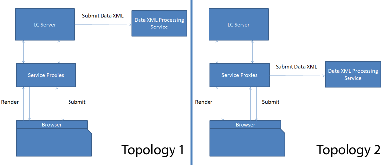

# HTML5 forms service proxy{#html-forms-service-proxy}

HTML5 forms Service Proxy is a configuration to register a proxy for the submission service. To configure Service Proxy, specify the URL of submission service through request parameter *submissionServiceProxy*.

## Benefits of Service Proxy {#benefits-of-service-proxy-br}

The service proxy eliminates following:

* HTML5 forms workflow requires opening up of the submission service "/content/xfaforms/submission/default" for the HTML5 forms users. It exposes AEM servers to a wider unintended audience.
* The service URL is embedded in the runtime model of the form. It is not possible to change service URL path.
* The submission is two-step process. To submit the form data, submission requires at least two journeys to server. Thus, increases load on the server.
* HTML5 forms send data in the POST request instead of PDF request. For workflow involving both PDF and HTML5 forms, two different methods of processing the submissions are required.

### Topologies {#topologies-br}

HTML5 forms can use following topologies to connect to the AEM servers.

* A topology where AEM Server or HTML5 forms send data via POST to the server.
* A topology where proxy server sends POST data to the server.

HTML5 forms service proxy topologies

HTML5 forms connect to the AEM servers to run server-sided scripts, web-services, and submissions. The XFA runtime of the HTML5 forms uses Ajax calls on "/bin/xfaforms/submitaction" end point with various parameters to connect to the AEM servers. HTML5 forms connect AEM servers to perform following operations:

#### Execute Server-sided scripts and Web Services {#execute-server-sided-scripts-and-web-services}

The scripts marked to run on the server are known as server-sided scripts. The following table lists all the parameters used in Server-sided scripts and Web Services.

<table>
 <tbody>
  <tr>
   <td>
<strong>Parameter</strong>
 </td>
   <td>
<strong>Description</strong>
 </td>
  </tr>
  <tr>
   <td>
activity
 </td>
   <td>
Activity contains the events that trigger the request. Such as click, exit or change
 </td>
  </tr>
  <tr>
   <td>
contextSom
 </td>
   <td>
contextSom contains SOM expression of the object where events are executed.
 </td>
  </tr>
  <tr>
   <td>
Template
 </td>
   <td>
Template contains the template used to render the form.
 </td>
  </tr>
  <tr>
   <td>
contentRoot
 </td>
   <td>
contentRoot contains the template root directory used to render the form.
 </td>
  </tr>
  <tr>
   <td>
Data
 </td>
   <td>
Data contains bata bytes used to render the form.
 </td>
  </tr>
  <tr>
   <td>
formDom
 </td>
   <td>
formDom contains DOM of the HTML5 form in JSON format.
 </td>
  </tr>
  <tr>
   <td>
packet
 </td>
   <td>
packet is specified as form.
 </td>
  </tr>
  <tr>
   <td>
debugDir
 </td>
   <td>
debugDir contains the debug directory used to render the form.
 </td>
  </tr>
 </tbody>
</table>

#### Submit data {#submit-data}

On clicking the submit button, HTML5 forms send data to the server. The following table lists all the parameters that HTML5 forms send to server.

<table>
 <tbody>
  <tr>
   <td>
<strong>Parameter</strong>
 </td>
   <td>
<strong>Description</strong>
 </td>
  </tr>
  <tr>
   <td>
Template
 </td>
   <td>
Template used to render the form.
 </td>
  </tr>
  <tr>
   <td>
contentRoot
 </td>
   <td>
template root directory used to render the form.
 </td>
  </tr>
  <tr>
   <td>
Data
 </td>
   <td>
bata bytes used to render the form.
 </td>
  </tr>
  <tr>
   <td>
formDom
 </td>
   <td>
DOM of the HTML5 form in JSON format.
 </td>
  </tr>
  <tr>
   <td>
submiturl
 </td>
   <td>
The URL where data XML is posted.
 </td>
  </tr>
  <tr>
   <td>
debugDir
 </td>
   <td>
The debug directory used to render the form.
 </td>
  </tr>
 </tbody>
</table>

#### How&nbsp;the&nbsp;submit proxy works? {#how-nbsp-the-nbsp-submit-proxy-works}

The submit service proxy acts as a pass through if the submiturl is not present in the request parameter. It acts as a pass-through. It sends the request to the /bin/xfaforms/submitaction end point and sends the response to the XFA runtime.

The submit service proxy selects a topology if the submiturl is present in the request parameter.

* If AEM servers post the data, proxy service acts as a pass-through. It sends the request to the /bin/xfaforms/submitaction end point and sends the response to the XFA runtime.
* If proxy posts the data, the proxy service passes all the parameters except submitUrl to the */bin/xfaforms/submitaction* end point and receives xml bytes in response stream. Then, the proxy service posts the data xml bytes to the submitUrl for processing.

* Before sending data (POST request) to a server, HTML5 forms verify connectivity and availability of the server. To verify connectivity and availability, HTML forms send an empty head request to the server. If the server is available, HTML5 form sends data (POST request) to the server. If the server is not available, an error message, *Could’t connect to the server,* is displayed. The advance detection prevents users from the hassle of refilling the form. The proxy servlet handles head request and does not throw exception.
