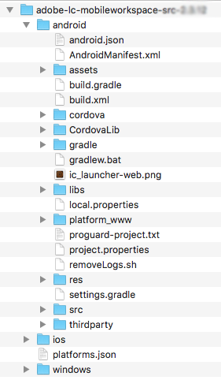
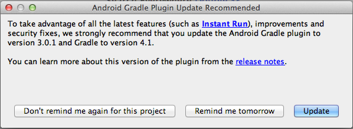
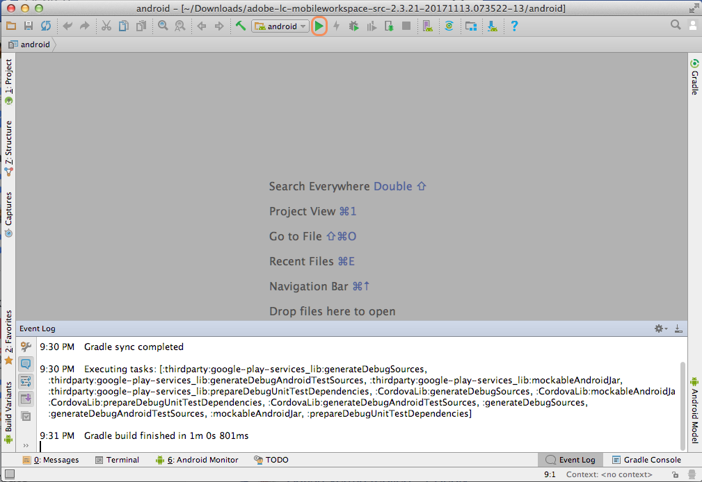
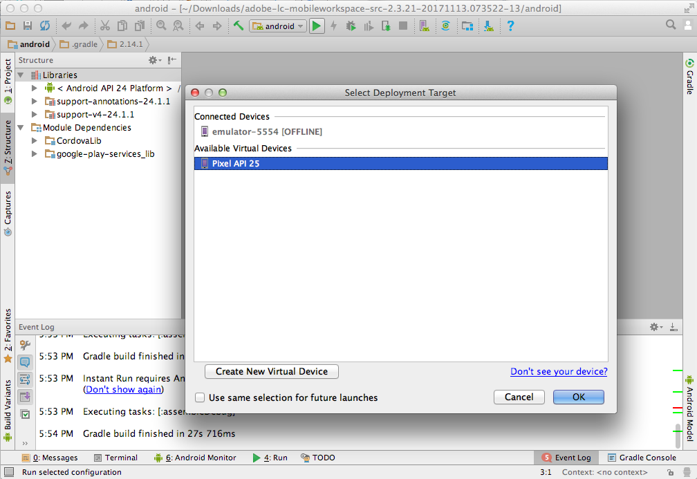

# Set up the Android&trade; studio project and build the Android&trade; app {#set-up-the-android-studio-project-and-build-the-android-app}

This article is for building the AEM Forms App 6.3.1.1 and later versions. For building an app from source code of the AEM Forms App 6.3, see [Set up the Eclipse project and build the Android&trade; app](/help/forms/using/setup-eclipse-project-build-installer.md). 

AEM Forms provide the complete source code of the AEM Forms app. The source contains all components to build a custom AEM Forms app. The source code archive, `adobe-lc-mobileworkspace-src-<version>.zip` is a part of the `adobe-aemfd-forms-app-src-pkg-<version>.zip` package on Software Distribution.

To get the AEM Forms app source, perform the following steps:

1. Open [Software Distribution](https://experience.adobe.com/downloads). You require an Adobe ID to log in to the Software Distribution.
1. Select **[!UICONTROL Adobe Experience Manager]** available in the header menu.
1. In the **[!UICONTROL Filters]** section:
   1. Select **[!UICONTROL Forms]** from the **[!UICONTROL Solution]** drop-down list.
   2. Select the version and type for the package. You can also use the **[!UICONTROL Search Downloads]** option to filter the results.
1. Select the package name applicable to your operating system, select **[!UICONTROL Accept EULA Terms]**, and select **[!UICONTROL Download]**.
1. Open [Package Manager](https://experienceleague.adobe.com/docs/experience-manager-65/administering/contentmanagement/package-manager.html)  and click **[!UICONTROL Upload Package]** to upload the package.
1. Select the package and click **[!UICONTROL Install]**.

The following image displays the extracted contents of the `adobe-lc-mobileworkspace-src-<version>.zip`.

The following image displays the directory structure of the `android`folder in the `src`folder.

## Build standard AEM Forms app {#set-up-the-xcode-project}

1. Perform the following steps to set up a project in Android&trade; Studio and provide a signing identity:

   Log in to a machine that has Android&trade; Studio installed and configured.

1. Copy the downloaded `adobe-lc-mobileworkspace-src-<version>.zip` archive to:

   **For Mac users**: `[User_Home]/Projects`

   **For Windows&reg; users**: `%HOMEPATH%\Projects`

   >[!NOTE]
   >
   >For Windows&reg;, it is recommended that you keep the Android&trade; project in the system drive.

1. Extract the archive in the following directory:

   **For Mac users**: `[User_Home]/Projects/[your-project]`

   **For Windows&reg; users**: `%HOMEPATH%\Projects\[your-project]`

   >[!NOTE]
   >
   >It is recommended, that you keep the extracted Android project in the system drive before importing the project into Android&trade; Studio.

1. Launch Android&trade; Studio.

   **For Mac users**: Update the `local.properties` file present in the `[User_Home]/Projects/[your-project]/android` folder and point the `sdk.dir` variable to `SDK` location on your desktop.

   **For Windows&reg; users**: Update the `local.properties` file present in the `%HOMEPATH%\Projects\[your-project]\android` folder and point the `sdk.dir` variable to `SDK` location on your desktop.

1. Click **[!UICONTROL Finish]** to build the project.

   The project is available in the ADT Project Explorer.

   

1. In Android&trade; Studio, select **[!UICONTROL Import Project (Eclipse ADT, Gradle, Etc.)]**.
1. In the project explorer, select the root directory of the project that you want to build in the **Root Directory** text box:

   **For Mac users:** [User_Home]/Projects/MobileWorkspace/src/android

   **For Windows&reg; users:** %HOMEPATH%\Projects\MobileWorkspace\src\android

1. After the project is imported, a pop-up appears with option to update the Android&trade; plugin Gradle. Click the appropriate button depending on your requirement.

   

1. After successful gradle build, the following screen appears. Connect the appropriate device or emulator with the system and click **[!UICONTROL Run Android&trade;]**.  

   

1. Android&trade; Studio displays the connected devices and available emulators. Select the device on which you want to run the application and then click **OK**.  

   

After you have built the project, you can choose to install the app using Android&trade; Debug Bridge or Android&trade; Studio.

### Using Android&trade; Debug Bridge {#andriod-debug-bridge}

You can install the application on an Android&trade; device by way of the [Android&trade; Debug Bridge](https://developer.android.com/tools/adb) with the following command:

**For Mac users**: `adb install [User_Home]/Projects/[your-project]/adobe-lc-mobileworkspace-src-[version]/android/build/outputs/apk/android-debug.apk`

**For Windows&reg; users**: `adb install %HOMEPATH%\Projects\[your-project]\adobe-lc-mobileworkspace-src-[version]\android\build\outputs\apk\android-debug.apk`
