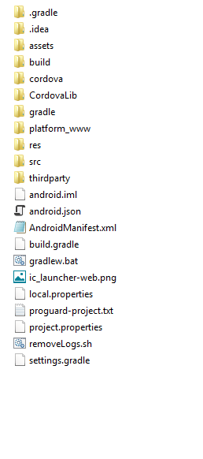
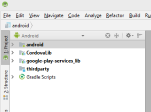

# Build the AEM Forms Android app {#build-the-aem-forms-android-app}

To build the Android app for AEM Forms, perform the following steps in the recommended sequence.

1. [Download the AEM Forms App Source Code Package](#download-android-zip)
1. [Set the environment variables](#set-environment-variable-android)
1. [Build a standard AEM Forms app](#set-up-the-xcode-project)

## Download the AEM Forms App Source Code Package {#download-android-zip}

AEM Forms App Source Code Package refers to the `adobe-lc-mobileworkspace-src-<version>.zip` archive. This archive includes the source code required to build a custom AEM Forms app. The archive is included in the `adobe-aemfd-forms-app-src-pkg-<version>.zip`package available on the Software Distribution.

To download the `adobe-aemfd-forms-app-src-pkg-<version>.zip` file, perform the following steps:

1. Open [Software Distribution](https://experience.adobe.com/downloads). You require an Adobe ID to log in to the Software Distribution.
1. Select **[!UICONTROL Adobe Experience Manager]** available in the header menu.
1. In the **[!UICONTROL Filters]** section:
   1. Select **[!UICONTROL Forms]** from the **[!UICONTROL Solution]** drop-down list.
   2. Select the version and type for the package. You can also use the **[!UICONTROL Search Downloads]** option to filter the results.
1. Select the package name applicable to your operating system, select **[!UICONTROL Accept EULA Terms]**, and select **[!UICONTROL Download]**.
1. Open [Package Manager](https://experienceleague.adobe.com/docs/experience-manager-65/administering/contentmanagement/package-manager.html)  and click **[!UICONTROL Upload Package]** to upload the package.
1. Select the package and click **[!UICONTROL Install]**.
1. To download the source-code archive, open **https://&lt;server&gt;:&lt;port&gt;/crx/de/content/forms/mobileapps/src/adobe-lc-mobileworkspace-src-&lt;version&gt;.zip** in your browser. The Android app .zip file is downloaded on your device.
1. Extract the contents of the .zip file to a folder on your local file system. For example, *C:\<Folder Structure&gt;\adobe-lc-mobileworkspace-src-2.4.20*

The following image displays the structure of the `adobe-lc-mobileworkspace-src-<version>.zip\android`folder.

## Set the environment variables {#set-environment-variable-android}

Set the following environment variables before starting the build process for the AEM Forms app:

* Set the JAVA_HOME environment variable to the location of JDK software on the local file system. For example, C:\Program Files\Java\jdk1.8.0_181
* Set the `ANDROID_SDK_ROOT` system environment variable to the SDK location for Android. For example, C:\Users\&lt;username&gt;\AppData\Local\Android\Sdk
* Set the `Path` system environment variable to include the platform-tools and tools folder locations for Android. For example, C:\Users\&lt;username&gt;\AppData\Local\Android\Sdk\platform-tools and C:\Users\&lt;username&gt;\AppData\Local\Android\Sdk\tools.

## Build a standard AEM Forms app {#set-up-the-xcode-project}

After you have saved the adobe-lc-mobileworkspace-src-&lt;version&gt;.zip file on the local file system and set the environment variables, build a standard AEM Forms Android app using any of the following options:

* [Build AEM Forms app using Android Studio](#using-android-studio)
* [Generate .apk file using Android Studio](#generate-apk-android-studio)

### Build AEM Forms app using Android Studio {#using-android-studio}

To build an AEM Forms app using Android Studio, perform the following steps:

1. Launch the Android Studio application on your machine.
1. Click **Open an existing Android Studio project**. If the dialog box to open an existing project does not appear automatically, select **File** &gt; **Open**.
1. Navigate to *adobe-lc-mobileworkspace-src-&lt;version&gt;.zip/android* on the local file system and click **OK**.

   The **android** option is displayed in the left pane.

   

1. Select **android** from the left pane and click **Run** &gt; **Run 'android'**.
1. Select the Android device from the Connected Devices section on the Select Deployment Target dialog box and click OK.

   Once you have built the development environment successfully, you can now apply customizations on the app. Use the following articles to customize the app:

    * [Branding Customization](/help/forms/using/branding-customization.md)
    * [Theme Customization](/help/forms/using/theme-customization.md)
    * [Gesture Customization](/help/forms/using/gesture-customization.md)

   After applying appropriate customizations to your app, you can generate the .apk file for distribution.

### Generate .apk file using Android Studio {#generate-apk-android-studio}

To generate the .apk file using Android Studio, do the following:

1. Launch the Android Studio application on your machine.
1. Select **Open an existing Android Studio project**. If the dialog box to open an existing project does not appear automatically, select **File** &gt; **Open**.
1. Navigate to *adobe-lc-mobileworkspace-src-&lt;version&gt;.zip/android* on the local file system and click **OK**.

   The android option is displayed in the left pane.

1. To generate the .apk file, select **Build** &gt; **Build APK**.

   Optionally, Select **Build** &gt; **Generate Signed APK** to generate a [signed version](https://developer.android.com/studio/publish/app-signing) of the .apk file.

## Use Android Debug Bridge {#build-android-debug-bridge}

Once the .apk file has been generated, execute the following command to install the application on an Android device using the [Android Debug Bridge](https://developer.android.com/tools/adb).

**Windows users:** `adb install %HOMEPATH%\Projects\[your-project]\adobe-lc-mobileworkspace-src-[version]\android\build\outputs\apk\android-debug.apk`

**Mac users:** `adb install [User_Home]/Projects/[your-project]/adobe-lc-mobileworkspace-src-[version]/android/build/outputs/apk/android-debug.apk`
