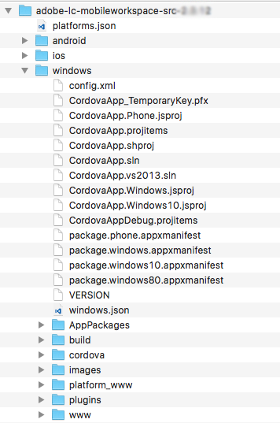
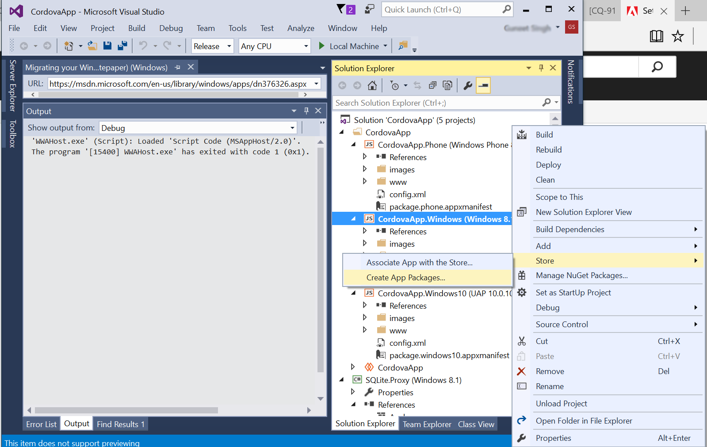
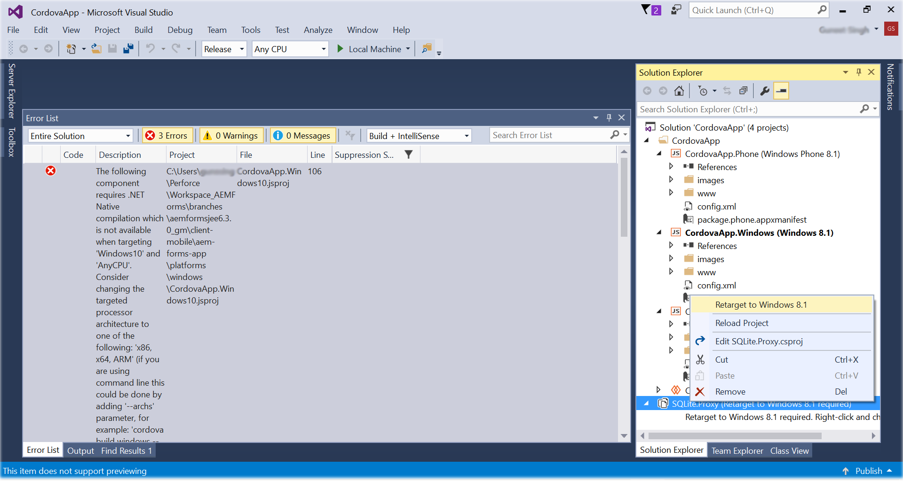

# Set up the Visual Studio project and build the Windows app{#set-up-the-visual-studio-project-and-build-the-windows-app}

AEM Forms provides the complete source code of the AEM Forms app. The source contains all components to build a custom workspace application. The source code archive, `adobe-lc-mobileworkspace-src-<version>.zip`is a part of the `adobe-aemfd-forms-app-src-pkg-<version>.zip` package on Software Distribution.

To get the AEM Forms app source, perform the following steps:

1. Open [Software Distribution](https://experience.adobe.com/downloads). You require an Adobe ID to log in to the Software Distribution.
1. Select **[!UICONTROL Adobe Experience Manager]** available in the header menu.
1. In the **[!UICONTROL Filters]** section:
   1. Select **[!UICONTROL Forms]** from the **[!UICONTROL Solution]** drop-down list.
   2. Select the version and type for the package. You can also use the **[!UICONTROL Search Downloads]** option to filter the results.
1. Select the package name applicable to your operating system, select **[!UICONTROL Accept EULA Terms]**, and select **[!UICONTROL Download]**.
1. Open [Package Manager](https://experienceleague.adobe.com/docs/experience-manager-65/administering/contentmanagement/package-manager.html)  and click **[!UICONTROL Upload Package]** to upload the package.
1. Select the package and click **[!UICONTROL Install]**.

1. To download the source code archive, open `https://<server>:<port>/crx/de/content/forms/mobileapps/src/adobe-lc-mobileworkspace-src-<version>.zip` in your browser.   
   The source package is downloaded on your device.

The following image displays the extracted contents of the `adobe-lc-mobileworkspace-src-<version>.zip`.

The following image displays the directory structure of the `windows` folder in the `src` folder.

 

## Setting up the environment {#setting-up-the-environment}

For Windows devices, you need:

* Microsoft Windows 8.1 or Windows 10
* Microsoft Visual Studio 2015
* Microsoft Visual Studio Tools for Apache Cordova

## Setting up Visual Studio Project for AEM Forms app {#setting-up-visual-studio-project-for-aem-forms-app}

Perform the following steps to set up the AEM Forms app project in Visual Studio.

1. Copy the `adobe-lc-mobileworkspace-src-<version>.zip` archive to `%HOMEPATH%\Projects` folder in the Windows 8.1 or Windows 10 device with Visual Studio 2015 installed and configured.
1. Extract the archive in the `%HOMEPATH%\Projects\MobileWorkspace` directory.
1. Navigate to the `%HOMEPATH%\Projects\MobileWorkspace\adobe-lc-mobileworkspace-src-[versionsrc]\windows` directory.
1. Open the `CordovaApp.sln` file using Visual Studio 2015 and proceed to building the AEM Forms app.

## Build AEM Forms app {#build-aem-forms-app}

Perform the following steps to build and deploy AEM Forms app.

>[!NOTE]
>
>Data stored on Windows file system for AEM Forms app is not encrypted. It is recommended that you use a third-party tool like Windows BitLocker Drive Encryption to encrypt disk data.

1. In the Visual Studio Standard Toolbar, select **Release** from the drop-down for build mode.  

1. Select Windows-AnyCPU, Windows-x64, or Windows-x86 based on your platform. Windows-AnyCPU is recommended.
1. In the Visual Studio Solution Explorer, right-click the project **CordovaApp.Windows** and select **Store &gt; Create AppPackages**.

   

   The Create App Packages wizard appears.

   The CordovaApp.Windows_3.0.2.0_anycpu.appx installer file is created in the platforms\windows\AppPackages\CordovaApp.Windows_3.0.2.0_anycpu_Test directory.

   If you encounter the error `Retarget to windows 8.1 required`, right-click the error and in the pop-up menu, select **Retarget To Windows 8.1**. 

   

1. In the Create App Packages wizard, select weather or not you want to upload your app to the windows store and then click **Next**.

   

1. Make the changes in the parameters, such as the version and output location of the app build, as required.

   

1. After the project is built, you can install the app using:

    * Windows PowerShell
    * Visual Studio

   The `.appx` package requires the following items to install successfully:

    1. WinJS library
    1. Ensure that the package comes with a self-signed certificate, or a trusted authority signed public certificate such as VeriSign.
    1. Developer license

   The directory Platforms\windows\AppPackages\CordovaApp.Windows_3.0.2.0_anycpu_Test contains the four main components in it:

    1. `.appx` file 
    1. Certificate (Currently it is a self-signed certificate by Apache Cordova) 
    1. Dependency folder
    1. PowerShell file (.ps1 extension)

## Deploying an app using Windows PowerShell {#deploying-an-app-using-windows-powershell}

There are two ways to install the application on a Windows device.

### By acquiring the developer license {#by-acquiring-the-developer-license}

1. Right-click the PowerShell file ( `Add-AppDevPackage.ps1)`, and choose **Run with PowerShell**.

1. The setup prompts you to get a developer license. Use Microsoft account credentials to acquire developer license.  
   This license is valid for 30 days, and you can renew it for free.
1. When you acquire the developer license, the setup installs the self-signed certificate on the system and application installs successfully.

### By using enterprise owned devices {#by-using-enterprise-owned-devices}

For enterprise owned devices that are joined to the domain of the enterprise, acquiring a developer license is not required.

Enterprise owned devices use Professional and Enterprise editions of Windows.

Microsoft recommends that you install a trusted authority issued public certificate such as VeriSign.

To deploy the app:

* Ensure that the device is joined to the domain of the enterprise.   
* Enable group policy setting.

**To enable group policy setting:**

1. In your device, run `gpedit.msc`.
1. Navigate to **Computer Configuration &gt; Administrative Templates &gt; Windows Component &gt; App Package Deployment**.
1. Right-click **Allow all trusted apps to install**.
1. Click **Edit** and select **Enabled**.

1. Click **OK**.

Edit the Visual Studio generated PowerShell script to stop it from acquiring developer license.

In the PowerShell script, set the variable: `$NeedDeveloperLicense = $false`.

For devices that are not domain-joined, side-loading product activation key is required. You can purchase it from a Windows reseller.

For Windows 8.1 Home edition, there is no group policy, the enterprise side-loading is not allowed, and you cannot join it with the enterprise domain. Deploy the app on a Windows 8.1 Home Edition device using developer license.

For more information, click [here](https://blogs.msdn.com/b/mvpawardprogram/archive/2014/03/24/side-loading-deployment-of-windows-store-apps-in-enterprises-step-by-step.aspx).

## Deploying an app using Visual Studio {#deploying-an-app-using-visual-studio}

To install the app on Windows using Visual Studio:

1. Connect the device using remote debugger.  
   For more information, see [Run Windows Store apps on a remote machine](https://docs.microsoft.com/en-us/visualstudio/debugger/run-windows-store-apps-on-a-remote-machine).

1. With your app open in Visual Studio, choose Windows-x64, Windows-x86, or Windows-AnyCPU from the Solution Platforms list, and select **Remote Machine**.
1. Your app is deployed on the remote machine.
