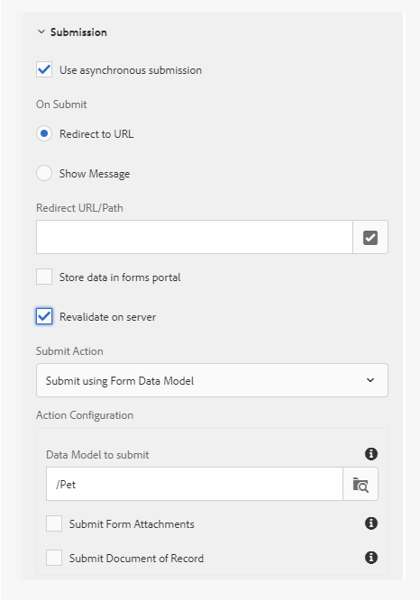

# Standard validation error messages for adaptive forms {#standard-validation-error-messages}

| Version | Article link |
| -------- | ---------------------------- |
| AEM 6.5  |   This article                |
| AEM as a Cloud Service     | [Click here](https://experienceleague.adobe.com/docs/experience-manager-cloud-service/content/forms/adaptive-forms-authoring/authoring-adaptive-forms-foundation-components/add-rules-and-use-expressions-in-an-adaptive-form/add-custom-error-handler-adaptive-forms.html)         |

Adaptive forms validate the inputs that you provide in fields based on a pre-set validation criteria. The validation criteria refers to the acceptable input values for fields in an adaptive form. You can set the validation criteria based on the data source that you use with the adaptive form. For example, if you use RESTful web services as the data source, you can define the validation criteria in a Swagger definition file.

If the input values meet the validation criteria, the values are submitted to the data source. Else, the adaptive form displays an error message.

Similar to this approach, adaptive forms can now integrate with custom services to perform data validations. If the input values do not meet the validation criteria and the validation error message that the server returns is in the standard message format, the error messages display at field-level in the form.

If the input values do not meet the validation criteria and the server validation error message is not in the standard message format, the adaptive forms provide a mechanism to transform the validation error messages into a standard format so that they display at field-level in the form. You can transform the error message into the standard format using any of the following two methods:

* Add custom error handler on adaptive form submission
* Add custom handler to Invoke Service action using Rule Editor

This article describes the standard format for the validation error messages and the instructions to transform the error messages from a custom to the standard format.

## Standard validation error message format {#standard-validation-message-format}

The adaptive forms display the errors at field-level if the server validation error messages are in the following standard format:

```javascript
   {
    errorCausedBy : "SERVER_SIDE_VALIDATION/SERVICE_INVOCATION_FAILURE"
    errors : [
        {
             somExpression  : <somexpr>
             errorMessage / errorMessages : <validationMsg> / [<validationMsg>, <validationMsg>]

        }
    ]
    originCode : <target error Code>
    originMessage : <unstructured error message returned by service>
}
```

Where:

* `errorCausedBy` describes the reason for failure
* `errors` mention the SOM expression of the fields that failed the validation criteria along with the validation error message
* `originCode` contains the error code returned by the external service
* `originMessage` contains the raw error data returned by the external service

## Configure adaptive form submission to add custom handlers {#configure-adaptive-form-submission}

If the server validation error message does not display in the standard format, you can enable asynchronous submission and add a custom error handler on adaptive form submission to convert the message into a standard format.

### Configure asynchronous adaptive form submission {#configure-asynchronous-adaptive-form-submission}

Before adding custom handler, you must configure the adaptive form for asynchronous submission. Execute the following steps:

1. In adaptive form authoring mode, select the Form Container object and tap  to open its properties.
1. In the **[!UICONTROL Submission]** properties section, enable **[!UICONTROL Use asynchronous submission]**.
1. Select **[!UICONTROL Revalidate on server]** to validate the input field values on server before submission.
1. Select the Submit Action:

    * Select **[!UICONTROL Submit using Form Data Model]** and select the appropriate data model, if you are using RESTful web service based [form data model](work-with-form-data-model.md) as the data source.
    * Select **[!UICONTROL Submit to REST endpoint]** and specify the **[!UICONTROL Redirect URL/Path]**, if you are using RESTful web services as the data source.

    

1. Tap  to save the properties.

### Add custom error handler on adaptive form submission {#add-custom-error-handler-af-submission}

AEM Forms provides out-of-the-box success and error handlers for form submissions. Handlers are client-side functions that execute based on the server response. When a form is submitted, the data is transmitted to the server for validation, which returns a response to the client with information about the success or error event for the submission. The information is passed as parameters to the relevant handler to execute the function.

Execute the following steps to add custom error handler on adaptive form submission:

1. Open the adaptive form in authoring mode, select any form object, and tap <!----> to open the rule editor.
1. Select **[!UICONTROL Form]** in the Form Objects tree and tap **[!UICONTROL Create]**.
1. Select **[!UICONTROL Error in Submission]** from the Event drop-down list.
1. Write a rule to convert custom error structure to the standard error structure and tap **[!UICONTROL Done]** to save the rule.

The following is a sample code to convert a custom error structure to the standard error structure:

```javascript
var data = $event.data;
var som_map = {
    "id": "guide[0].guide1[0].guideRootPanel[0].Pet[0].id_1[0]",
    "name": "guide[0].guide1[0].guideRootPanel[0].Pet[0].name_2[0]",
    "status": "guide[0].guide1[0].guideRootPanel[0].Pet[0].status[0]"
};

var errorJson = {};
errorJson.errors = [];

if (data) {
    if (data.originMessage) {
        var errorData;
        try {
            errorData = JSON.parse(data.originMessage);
        } catch (err) {
            // not in json format
        }

        if (errorData) {
            Object.keys(errorData).forEach(function(key) {
                var som_key = som_map[key];
                if (som_key) {
                    var error = {};
                    error.somExpression = som_key;
                    error.errorMessage = errorData[key];
                    errorJson.errors.push(error);
                }
            });
        }
        window.guideBridge.handleServerValidationError(errorJson);
    } else {
        window.guideBridge.handleServerValidationError(data);
    }
}
```

The `var som_map` lists the SOM expression of the adaptive form fields that you want to transform into the standard format. You can view the SOM expression of any field in an adaptive form by tapping the field and selecting **[!UICONTROL View SOM Expression]**.

Using this custom error handler, the adaptive form converts the fields listed in `var som_map` to standard error message format. As a result, the validation error messages display at field-level in the adaptive form.

## Add custom handler using Invoke Service action

Execute the following steps to add error handler to convert a custom error structure into the standard error structure using [Rule Editor's](rule-editor.md) Invoke Service action:

1. Open the adaptive form in authoring mode, select any form object, and tap  to open the rule editor.
1. Tap **[!UICONTROL Create]**.
1. Create a condition in the **[!UICONTROL When]** section of the rule. For example, When[Name of field] is changed. Select **[!UICONTROL is changed]** from the **[!UICONTROL Select State]** drop-down list to achieve this condition.
1. In the **[!UICONTROL Then]** section, select **[!UICONTROL Invoke Service]** from the **[!UICONTROL Select Action]** drop-down list.
1. Select a Post service and its corresponding data bindings from the **[!UICONTROL Input]** section. For example, if you want to validate **Name**, **ID**, and **Status** fields in the adaptive form, select a Post service (pet) and select pet.name, pet.id, and pet.status in the **[!UICONTROL Input]** section.

As a result of this rule, the values that you enter for **Name**, **ID**, and **Status** fields get validated, as soon as the field defined in step 2 is changed and you tab out of the field in the form.

1. Select **[!UICONTROL Code Editor]** from the mode selection drop-down list.
1. Tap **[!UICONTROL Edit Code]**.
1. Delete the following line from the existing code:

    ```javascript
    guidelib.dataIntegrationUtils.executeOperation(operationInfo, inputs, outputs);
    ```

1. Write a rule to convert custom error structure to the standard error structure and tap **[!UICONTROL Done]** to save the rule.
    For example, add the following sample code at the end to convert a custom error structure to the standard error structure:

    ```javascript
    var errorHandler = function(jqXHR, data) {
    var som_map = {
        "id": "guide[0].guide1[0].guideRootPanel[0].Pet[0].id_1[0]",
        "name": "guide[0].guide1[0].guideRootPanel[0].Pet[0].name_2[0]",
        "status": "guide[0].guide1[0].guideRootPanel[0].Pet[0].status[0]"
    };


    var errorJson = {};
    errorJson.errors = [];

    if (data) {
        if (data.originMessage) {
            var errorData;
            try {
                errorData = JSON.parse(data.originMessage);
            } catch (err) {
                // not in json format
            }

            if (errorData) {
                Object.keys(errorData).forEach(function(key) {
                    var som_key = som_map[key];
                    if (som_key) {
                        var error = {};
                        error.somExpression = som_key;
                        error.errorMessage = errorData[key];
                        errorJson.errors.push(error);
                    }
                });
            }
            window.guideBridge.handleServerValidationError(errorJson);
        } else {
            window.guideBridge.handleServerValidationError(data);
        }
      }
    };

    guidelib.dataIntegrationUtils.executeOperation(operationInfo, inputs, outputs, null, errorHandler);
    ```

    The `var som_map` lists the SOM expression of the adaptive form fields that you want to transform into the standard format. You can view the SOM expression of any field in an adaptive form by tapping the field and selecting **[!UICONTROL View SOM Expression]** from **[!UICONTROL More Opions]** (...) menu.

    Ensure that you copy the following line of the sample code to the custom error handler:

    ```javascript
    guidelib.dataIntegrationUtils.executeOperation(operationInfo, inputs, outputs, null, errorHandler);
    ```

    The executeOperation API includes the `null` and `errorHandler` parameters based on the new custom error handler.

    Using this custom error handler, the adaptive form converts the fields listed in `var som_map` to standard error message format. As a result, the validation error messages display at field-level in the adaptive form.
