# Style your adaptive form {#do-not-publish-style-your-adaptive-form}

Learn to create a custom theme, style individual components, and use Web Fonts in a theme. 

 

This tutorial is a step in the [Create Your First Adaptive Form](https://helpx.adobe.com/experience-manager/6-3/forms/using/create-your-first-adaptive-form.html) series. Adobe recommends that you follow the series in chronological sequence to understand, perform, and demonstrate the complete tutorial use case.

## About the tutorial  {#about-the-tutorial}

You can use themes to provide a unique appearance and style to an adaptive form. You can apply out-of-the-box themes provided with the adaptive forms editor or create custom themes of your own. AEM [!DNL Forms] provide a [theme editor](https://helpx.adobe.com/experience-manager/6-3/forms/using/themes.html) to create custom themes. A single theme can provide the different appearance to the same adaptive form opened on mobile, tablet, or desktop. Any prior knowledge of CSS or LESS is not required to use the theme editor, but it is desired.

By the end of the tutorial, you should be able to do the following:

* Apply an out of the box theme to an adaptive form
* Create a theme for adaptive form using the theme editor
* Style individual components
* Bonus Section: Use Web Fonts in a custom theme

Your form should look similar to the following after you complete the tutorial:

 

## Before you start {#before-you-start}

Download the header-style and logo images, given below, on your local machine. The header of the `shipping-address-add-update-form` adaptive form uses the header-style and logo images. The header-style image appears on the right side of the header.

[Get File](assets/header-style.png)

[Get File](assets/logo-1.png)

## Step 1: Apply a theme to your adaptive form {#step-apply-a-theme-to-your-adaptive-form}

Adaptive forms editor provides multiple out-of-the-box themes. If you plan not to use a custom style for your adaptive form, you can also publish your adaptive forms with an out-of-the-box theme. Themes are independent of adaptive forms. You can apply the same theme to multiple adaptive forms. 

**To apply a theme to your adaptive form:**

1. Open the adaptive form for editing.

   [http://localhost:4502/editor.html/content/forms/af/shipping-address-add-update-form.html](http://localhost:4502/editor.html/content/forms/af/shipping-address-add-update-form.html) 

1. Open properties of **[!UICONTROL Adaptive Form container]**. In the properties browser, navigate to **[!UICONTROL Basic]** &gt; **[!UICONTROL Adaptive Form Theme]**. The **[!UICONTROL Adaptive Form Theme]** field lists all the out-of-the-box and custom themes. By default, the Canvas theme is applied.
1. Select a theme from the **[!UICONTROL Adaptive Form Theme]** field. For example, **Survey theme**. Select  so you can apply the selected theme.

   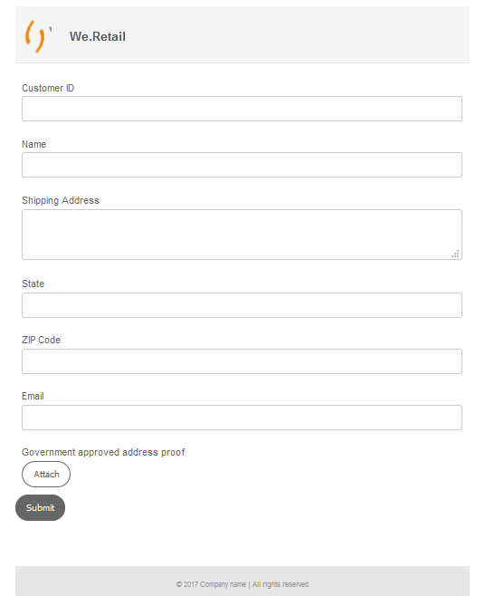

   **Figure:** *Adaptive form with the default theme*

   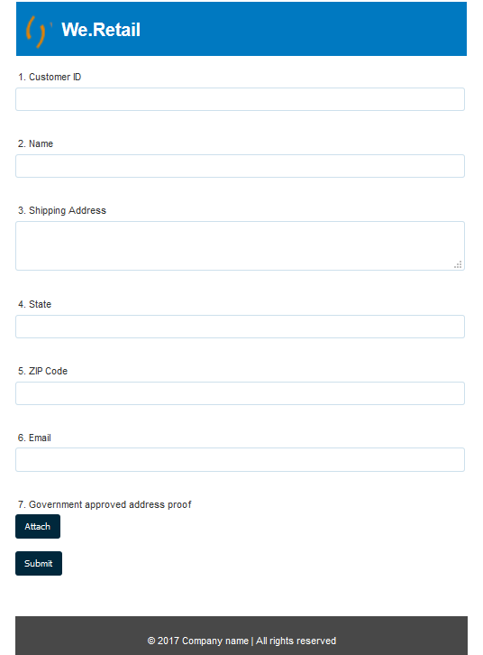

   **Figure:** *Adaptive form with the Survey theme*

## Step 2: Update your adaptive form {#step-update-your-adaptive-form}

The design displayed above requires changes in placeholder text and logo of your existing adaptive form. 

**To update your adaptive form:**

1. Change the existing logo and text of the header. To remove the logo:

    1. Open the form in the form editor.

       [http://localhost:4502/editor.html/content/forms/af/shipping-address-add-update-form.html](http://localhost:4502/editor.html/content/forms/af/shipping-address-add-update-form.html)
    
    1. Select logo image in the [!UICONTROL header] component and select  **[!UICONTROL properties]**. In the [!UICONTROL image] property, select X to remove the existing logo image.
    1. Select **[!UICONTROL upload]**, select the logo.png, and select  to save the changes. The image was downloaded in the [Before you start](/help/forms/using/style-your-adaptive-form.md#before-you-start) section. 
    1. Select header text, `We.Retail`, and select  **[!UICONTROL edit]**. Change header text to `we retail`. Apply bold formatting only to `we`in `we retail`.

       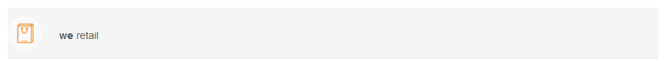

1. Remove title and add placeholder text:

    1. Select the Customer ID field and select  properties.
    1. Copy the content of the **[!UICONTROL Title]** field to the **[!UICONTROL Placeholder Text]** field.
    1. Delete the content of the **[!UICONTROL Title]** field and select .
    1. Repeat the previous three steps for all the text boxes, numeric box, and email field in the form.

       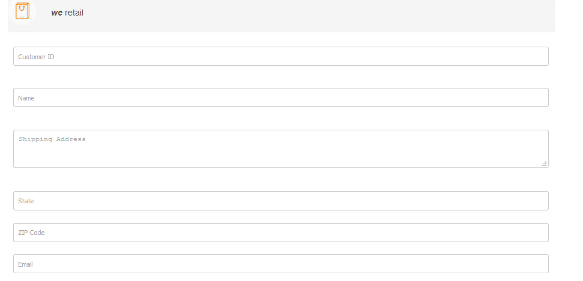

## Step 3: Create a custom theme for your adaptive form {#step-create-a-custom-theme-for-your-adaptive-form}

You can use the [theme editor](/help/forms/using/themes.md) to create custom themes. The theme editor is an all-powerful WYSIWYG editor. It is a visual method to apply CSS to various components of an adaptive form. It provides finer controls to style components and panels of an adaptive form.

A theme is a separate entity like adaptive forms. It contains styles (CSS) for the components and panels of an adaptive form. Styles include CSS properties such as background colors, state colors, transparency, alignment, and size. When you apply a theme, the specified style is applied to the corresponding components of an adaptive form.

In this tutorial, you style header and footer, text and numeric components, attachment component, and buttons. Let's start with creating a theme:

### Create a theme {#create-a-theme}

1. Log in to the AEM author instance and navigate to **[!UICONTROL Adobe Experience Manager]** &gt; **[!UICONTROL Forms]** &gt; **[!UICONTROL Themes]**. The default URL is [http://localhost:4502/aem/forms.html/content/dam/formsanddocuments-themes](http://localhost:4502/aem/forms.html/content/dam/formsanddocuments-themes). 
1. Select **[!UICONTROL Create]** and select **[!UICONTROL Theme]**. The [!UICONTROL Create Theme] page with the fields required to create a theme appears. The **[!UICONTROL Title]** and **[!UICONTROL Name]** fields are mandatory:

    * **Title:** Specify a title of the theme. For example, **Global Theme.** The title helps you identify the theme from the list of themes.
    * **Name:** Specify the name of the theme. For example, **Global-Theme.** A node with the specified name is created in the repository. As you start typing a title, the value for the name field is automatically generated. You can change the suggested value. The name field can include only alphanumeric characters, hyphens, and underscores. All the invalid inputs are replaced with a hyphen.

1. Select **[!UICONTROL Create]**. A theme is created and a dialog to open the form for editing appears. Select **[!UICONTROL Open]** to open the newly created theme in a new tab. The theme opens in the theme editor. For styling, the theme editor uses an out-of-the-box adaptive form shipped with AEM [!DNL Forms].

   For information about using the theme editor UI, see [About the theme editor](/help/forms/using/themes.md#aboutthethemeeditor).

1. Select **[!UICONTROL Theme Options]**  > **[!UICONTROL Configure]**. In the **[!UICONTROL Preview Form]** field, select the **shipping-address-add-update-form** adaptive form, select , select **[!UICONTROL Save]**. Now, the theme editor is configured to use your own adaptive form instead of the default adaptive form. Select **[!UICONTROL Cancel]** to return to the theme editor.

   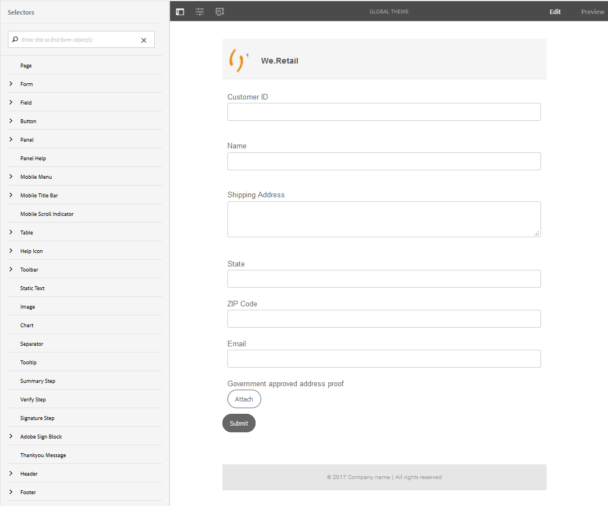

   **Figure:** *Theme editor with the shipping-address-add-update-form adaptive form*

   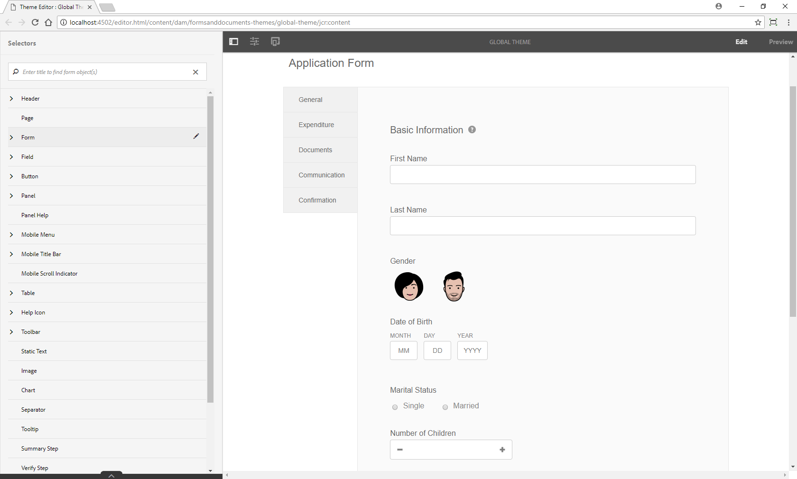

   **Figure:** *Adaptive form with the default form*

### Style header and footer {#style-header-and-footer}

Header and footer provide a consistent and distinctive look to an adaptive form. Generally, the header contains the logo and name of the organization, the footer contains copyright information, and these remain identical across multiple forms of an organization. To style the header and footer of the shipping-address-add-update-form adaptive form:

1. Navigate the **[!UICONTROL Header]** &gt; **[!UICONTROL Text]** option in the Selectors panel. The Selectors panel is on the left of the theme editor. If the panel is not visible, select  Toggle Side Panel.  

1. Set the following properties in the **[!UICONTROL Text]** accordion and select . 

   | Property |Value |
   |---|---|
   | Font Family |Arial&reg; |
   | Font Color |FFFFFF |
   | Font Size |54 px |

1. Select the [!UICONTROL header] widget and select **[!UICONTROL Header]**. The options to style the Header widget appear on the left. Expand the **[!UICONTROL Dimensions & Position]** accordion, set the **[!UICONTROL Height]** to `120px`, and select .
1. Expand the **[!UICONTROL Background]** accordion of the header widget, set the **[!UICONTROL Background Color]** to `F6921E.`

   Hover over **[!UICONTROL Image & Gradient]** &gt; **[!UICONTROL + Add]**, select **[!UICONTROL Image]**. Set the following properties and select .

   | Property |Value |
   |---|---|
   | image |Upload the header-style.png. The image was downloaded in the [Before you start](/help/forms/using/style-your-adaptive-form.md#before-you-start) section. |
   | Position |Right Bottom |
   | Tiling |No Repeat |

1. In the theme editor, select the logo in the header and select **[!UICONTROL Header Logo]**. Expand the Dimensions & Position accordion, set the following properties and select .

   <table> 
    <tbody> 
     <tr> 
      <td><b>Margin</b></td> 
      <td><b>Value</b></td> 
     </tr> 
     <tr> 
      <td>Margin</td> 
      <td> 
       <ul> 
        <li>Top: 1.5rem</li> 
        <li>Bottom: -35px</li> 
        <li>Left: 1rem<strong>  </strong></li> 
       </ul> 
<strong>Tip:</strong> Select the  link icon to provide a different value to each field.  
 </td> 
     </tr> 
     <tr> 
      <td>Height</td> 
      <td>4.75rem</td> 
     </tr> 
    </tbody> 
   </table>

1. Select the footer widget and select **[!UICONTROL Footer]**. Expand the **[!UICONTROL Background]** accordion, set the **[!UICONTROL Background Color]** to `F6921E`, and select .

### Style the data capture component and apply a background to the adaptive form {#style-the-data-capture-component-and-apply-a-background-to-the-adaptive-form}

You can use multiple components in an adaptive form to capture data. For example, text box and numeric box. You can provide an identical style to all the data capture components or a separate style for each component. In this tutorial, an identical style is applied to numeric boxes (Customer ID, ZIP Code) and text boxes (Customer ID, Name, Shipping Address, State, Email). To style the data capture components:

1. Select the **[!UICONTROL Customer ID]** field and select the **[!UICONTROL Field Widget]** option. Set the following properties and select .

   <table> 
    <tbody> 
     <tr> 
      <td><b>Accordion</b></td> 
      <td><b>Property</b></td> 
      <td><b>Value</b></td> 
     </tr> 
     <tr> 
      <td>Border</td> 
      <td>Border Color</td> 
      <td>A7A9AC</td> 
     </tr> 
     <tr> 
      <td>Border</td> 
      <td>Border Radius </td> 
      <td> 
       <ul> 
        <li>Top: 7 px  </li> 
        <li>Right: 7 px  </li> 
        <li>Bottom: 7 px  </li> 
        <li>Left: 7 px  </li> 
       </ul> </td> 
     </tr> 
     <tr> 
      <td>Text</td> 
      <td>Font Family</td> 
      <td>Arial&reg;</td> 
     </tr> 
     <tr> 
      <td>Text</td> 
      <td>Font Color</td> 
      <td>939598  </td> 
     </tr> 
     <tr> 
      <td>Text</td> 
      <td>Font Size</td> 
      <td>18 px</td> 
     </tr> 
     <tr> 
      <td>Dimensions and Position</td> 
      <td>Width</td> 
      <td>60%</td> 
     </tr> 
     <tr> 
      <td>Dimensions and Position</td> 
      <td>Margin</td> 
      <td> 
       <ul> 
        <li>Left: 10 rem</li> 
       </ul> </td> 
     </tr> 
    </tbody> 
    </table>

1. Select the empty area above the **[!UICONTROL Customer ID]** field and select **[!UICONTROL Responsive Panel Container]**. Set the **[!UICONTROL Background]** &gt; **[!UICONTROL Background Color]** to F1F2F2. Select .

   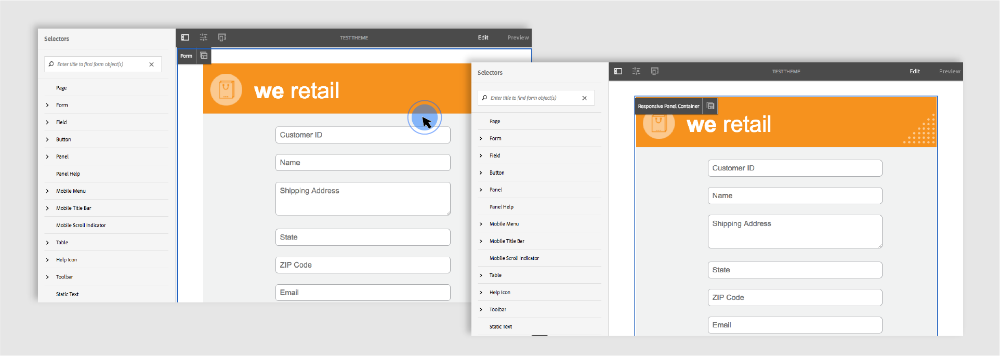

### Style the buttons {#style-the-buttons}

You can use a custom theme to apply an identical style to all the buttons of the adaptive form and [inline styling](/help/forms/using/inline-style-adaptive-forms.md) to apply a style to a specific button. To style the buttons:

1. Select the **[!UICONTROL Submit]** button and select the **[!UICONTROL Button]** option. Set the following properties and select .

   <table> 
    <tbody> 
     <tr> 
      <td><b>Accordion</b></td> 
      <td><b>Property</b></td> 
      <td><b>Value</b></td> 
     </tr> 
     <tr> 
      <td>Background</td> 
      <td>Background Color</td> 
      <td>F6921E</td> 
     </tr> 
     <tr> 
      <td>Border  </td> 
      <td>Border Color</td> 
      <td>F6921E</td> 
     </tr> 
     <tr> 
      <td>Border</td> 
      <td>Border Radius </td> 
      <td> 
       <ul> 
        <li>Top: 7 px  </li> 
        <li>Right: 7 px  </li> 
        <li>Bottom: 7 px  </li> 
        <li>Left: 7 px</li> 
       </ul> </td> 
     </tr> 
     <tr> 
      <td>Text  </td> 
      <td>Font Family</td> 
      <td>Arial&reg;</td> 
     </tr> 
     <tr> 
      <td>Text</td> 
      <td>Font Color</td> 
      <td>FFFFFF</td> 
     </tr> 
     <tr> 
      <td>Text</td> 
      <td>Font Size</td> 
      <td>18 px</td> 
     </tr> 
    </tbody> 
   </table>

1. [Apply the custom theme](/help/forms/using/style-your-adaptive-form.md#step-apply-a-theme-to-your-adaptive-form), Global Theme, to your adaptive form. If the style does not reflect on the adaptive form, clean the browser cache and try again.

   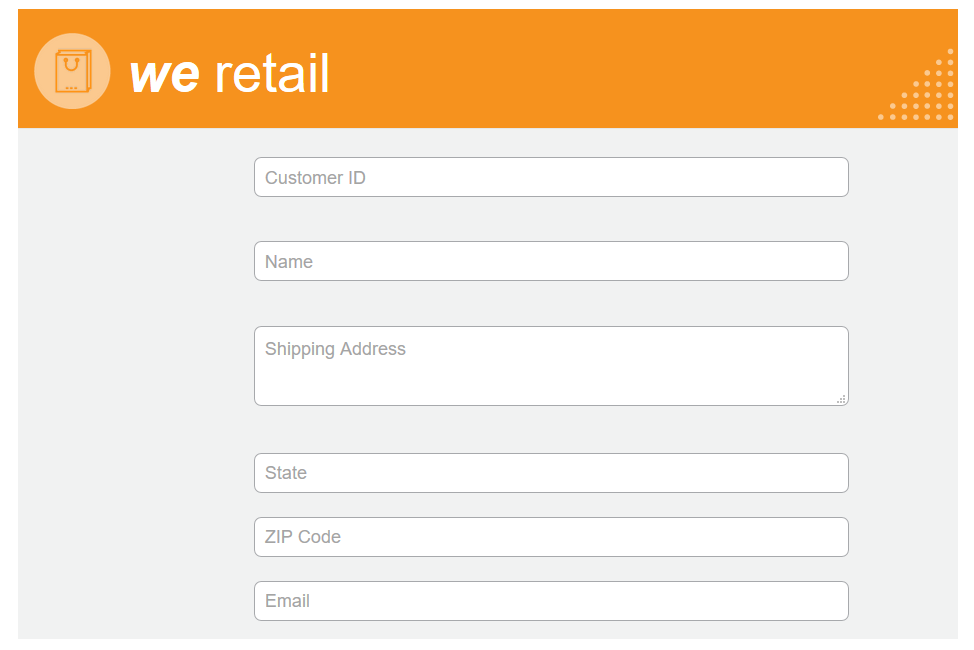

## Step 4: Style individual components {#step-style-individual-components}

Some styles apply to only a specific component. Such components are styled in adaptive forms editor.

1. Open the adaptive form for editing. [http://localhost:4502/editor.html/content/forms/af/shipping-address-add-update-form.html](http://localhost:4502/editor.html/content/forms/af/change-billing-shipping-address.html)
1. On the top bar, select the **[!UICONTROL Style]** option.

   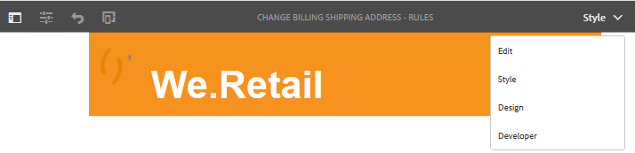

1. Select the **[!UICONTROL Attach]** button and select the icon. Set the following properties in the **[!UICONTROL Dimensions and Position]** accordion:

   | Property |Value |
   |---|---|
   | Float |Left |
   | Width |10% |

1. Select the **[!UICONTROL Government approved address proof]** option and select the icon. Set the following properties:

   <table> 
    <tbody> 
     <tr> 
      <td><b>Accordion</b></td> 
      <td><b>Property</b></td> 
      <td><b>Value</b></td> 
     </tr> 
     <tr> 
      <td>Dimensions &amp; Position</td> 
      <td>Float</td> 
      <td>Left</td> 
     </tr> 
     <tr> 
      <td>Dimensions &amp; Position</td> 
      <td>Width</td> 
      <td>73%</td> 
     </tr> 
     <tr> 
      <td>Dimensions &amp; Position</td> 
      <td>Padding</td> 
      <td> 
       <ul> 
        <li>Left: 10 px</li> 
       </ul> </td> 
     </tr> 
     <tr> 
      <td>Dimensions &amp; Position</td> 
      <td>Height</td> 
      <td>40 px</td> 
     </tr> 
     <tr> 
      <td>Dimensions &amp; Position  </td> 
      <td>Margin</td> 
      <td>  
       <ul> 
        <li>Right: 2 rem</li> 
        <li>Left: 10 rem </li> 
       </ul> </td> 
     </tr> 
     <tr> 
      <td>Background</td> 
      <td>Background Color</td> 
      <td>FFFFFF</td> 
     </tr> 
     <tr> 
      <td>Border</td> 
      <td>Border Width</td> 
      <td>1 px</td> 
     </tr> 
     <tr> 
      <td>Border</td> 
      <td>Border Style</td> 
      <td>Solid</td> 
     </tr> 
     <tr> 
      <td>Border</td> 
      <td>Border Color</td> 
      <td>A7A9AC</td> 
     </tr> 
     <tr> 
      <td>Border</td> 
      <td>Border Radius</td> 
      <td>7 px</td> 
     </tr> 
     <tr> 
      <td>Text</td> 
      <td>Font Family</td> 
      <td>Arial&reg;</td> 
     </tr> 
     <tr> 
      <td>Text</td> 
      <td>Font Color</td> 
      <td>BCBEC0</td> 
     </tr> 
     <tr> 
      <td>Text</td> 
      <td>Font Size</td> 
      <td>18 px</td> 
     </tr> 
     <tr> 
      <td>Text</td> 
      <td>Line Height</td> 
      <td>2</td> 
     </tr> 
     </tr> 
    </tbody> 
   </table>

1. Select the **[!UICONTROL Submit]** button and select the  icon. Set the following properties:

     <table> 
    <tbody> 
     <tr> 
      <td><b>Accordion</b></td> 
      <td><b>Property</b></td> 
      <td><b>Value</b></td> 
     </tr> 
     <tr> 
      <td>Dimensions and Position</td> 
      <td>Float</td> 
      <td>Right</td> 
     </tr> 
     <tr> 
      <td>Dimensions and Position</td> 
      <td>Margin</td> 
      <td> 
       <ul> 
        <li>Top: 5 rem</li> 
        <li>Right: 14 rem</li> 
        <li>Bottom: 20 px</li> 
        <li>Left: 20 px  </li> 
       </ul> </td> 
     </tr> 
     <tr> 
      <td>Background</td> 
      <td>Background Color</td> 
      <td>F6921E</td> 
     </tr> 
     <tr> 
      <td>Border</td> 
      <td>Border Color</td> 
      <td>F6921E</td> 
     </tr> 
    </tbody> 
   </table>

   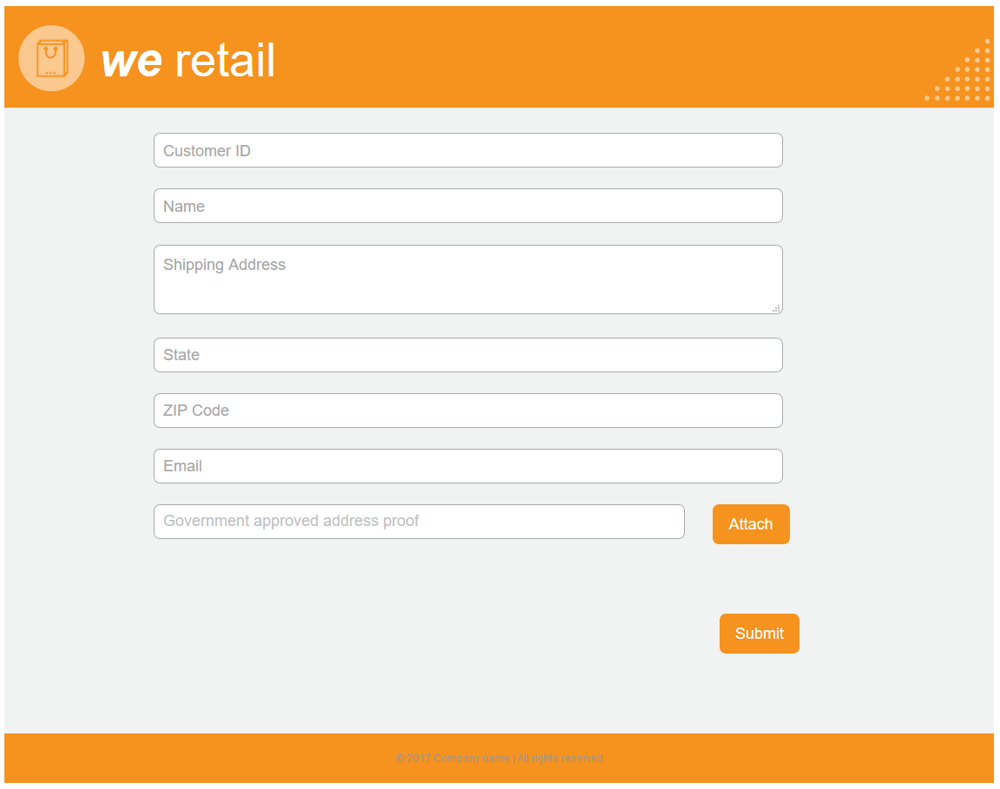

## Step 5: Bonus Section: Using Web Fonts in a custom theme {#step-bonus-section-using-web-fonts-in-a-custom-theme}

You can use various fonts to design an adaptive form. All the devices that the adaptive form is viewed on may not have the fonts used to design the adaptive form. You can use a web font service to deliver the required fonts to the target device.

[!DNL Adobe Fonts] is a Web Fonts service. You can configure and use the service with adaptive forms. To use [!DNL Adobe Fonts] in an adaptive form:
1. Browse the [library of Adobe fonts](https://fonts.adobe.com/) and choose font to style your form. 
<!--
>[!NOTE]
>
> [!DNL Typekit] is now called Adobe Fonts and is included with Creative Cloud and other subscriptions. [Learn more](https://fonts.adobe.com/).-->

   >[!NOTE]
   >
   > You can add tags or filters to refine the list of fonts.

1. Click the </> button to add the family to a web project, in case you find a font you like.

   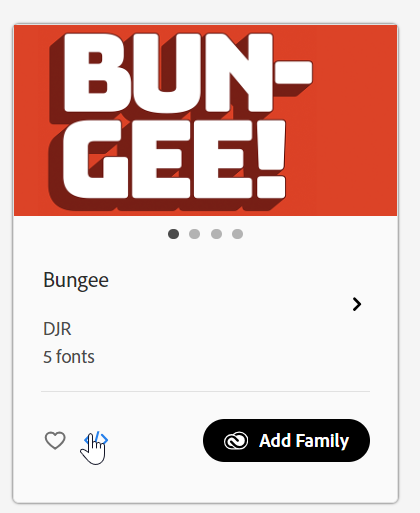

   Add fonts to a web project dialog screen appears.

   >[!NOTE]
   >
   > You can only add fonts to your web project if they have the </> button available. 

2. Name your web project.
3. Select the checkboxes to select the font weights and styles you want to include.

    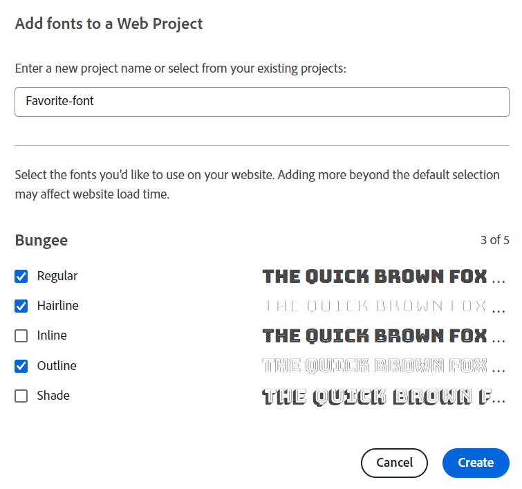

4. Select **Click** to create the project.
5. Copy the embed code and the URL from the screen.
      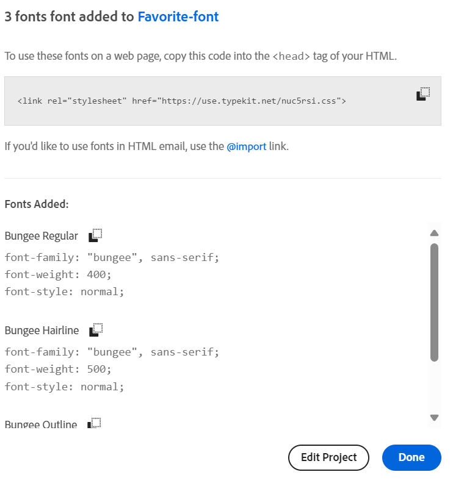

6. Click **Done** to close the web project window.
7. Log into your AEM instance and go to URL `http://server:port/crx/de/index.jsp#`
8. Create a folder structure in CRXDE, for example `/apps/[fontslibrary]/[customlibrary(clientlibrary)]`. 
9. Go to the newly created `clientlibs` folder and add the `allowProxy` and `categories` properties.
10. Navigate to `/apps/[fontslibrary]/[customlibrary(clientlibrary)]` and create a css folder.
11. Go to the created CSS folder and create a file. For example, create a file as `fonts.css` and paste the embed code along with the URL.
   
12. Save the changes.

>[!NOTE]
>
> To use the added custom fonts in an Adaptive Form, ensure that the client library name in the **[!UICONTROL Client Library Category]** aligns with the name specified in the categories option of the clientlib folder.

The included fonts are now accessible to the Adaptive Form through the following custom font client library.

<!--
Create Adobe Fonts Configuration

1. To create a API Token, go to **login** > **API Token** > **Make me a new API token**.

   

2. Once, you click **Make me a new API token**, a new token is generated. 
3. Copy the generated token for future use.
4. Now login to your AEM  author instance. On the author instance, go to **[!UICONTROL Tools]**>**[!UICONTROL Cloud Services]**> **[!UICONTROL Adobe Fonts]**.
5. Select the configuration container and click **Create**. **[UICONTROL Create Adobe Fonts Configuration]** screen appears.
    

6. Spceify the name and paste the API token in the **[!UICONTROL Kit ID]** textbox.
7. Click **Create**.

The fonts added to the **[!UICONTROL Adobe Fonts]** are available for selection in the **[!UICONTROL Text]** accordion of all the components.
1. In the theme editor, navigate to **[!UICONTROL Theme Options]**  > **[!UICONTROL Configure]**. 
2. In the **[!UICONTROL Adobe Fonts Configuration]** field, select the kit, and click **[!UICONTROL Save]**.

1. Create an [Adobe Fonts](https://fonts.adobe.com/?ref=tk.com) account, create a kit, add font Myriad Pro to the kit, publish the kit, and obtain the Kit ID. It is required to use [!DNL Adobe Fonts] (Web Fonts) in an adaptive form. 
1. In the AEM [!DNL Forms] Server, navigate to  **[!UICONTROL Adobe Experience Manager]** > **[!UICONTROL Tools]**  > **[!UICONTROL Adobe Fonts]**. Now, open a configuration folder. If a configuration is already available, click the **[!UICONTROL Create]** button to create an instance.

   On the Create Configuration dialog, specify a **Title** for the configuration, and click **[!UICONTROL Create]**. You are redirected to the configuration page. In the [!UICONTROL Edit Component] dialog that appears, provide your **Kit ID** and click **[!UICONTROL OK]**. -->

