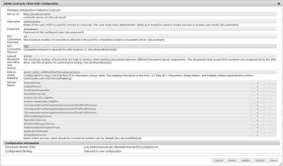

# Configuring AEM Forms to submit form data to an AEM Forms on JEE process{#configuring-aem-forms-to-submit-form-data-to-an-aem-forms-on-jee-process}

Adaptive forms supports submitting data to an AEM Forms on JEE process for further processing. It allows you to trigger an AEM Forms on JEE process with the data available from the submitted form. Perform the following steps to enable your AEM Forms instance to submit an adaptive form to AEM Forms on JEE process:

## Configure your AEM Forms server {#configure-your-aem-forms-server}

Perform the following steps to enable your AEM forms server to submit data to an AEM Forms on JEE server:

1. Go to AEM web configuration console at https://[*host*]:[*port*]/system/console/configMgr.

1. Locate and click the **Adobe LiveCycle Client SDK Configuration** component.
1. Click to edit the configuration server URL, username, and password for the AEM Forms on JEE server.
1. Review the settings and click **Save**.

## Map data with process fields {#map-data-with-process-fields}

Once your AEM Forms is configured, map the data XML and attachments from the submitted form to the fields in the AEM Forms on JEE process. To do this:

1. In the AEM web configuration console, click to edit the **Guide LiveCycle Process Locator and Invoker** configuration.
1. Specify the following parameters:

    * **Name of the data xml parameter** (mandatory): Specify the XML property file of the AEM Forms on JEE process that needs to process the submitted data. The default value is **dataxml**.
    
    * **Name of the file attachments parameter** (optional): Specify the list of document objects that the AEM Forms on JEE process needs to process. The default value is **fileAttachmentsList**.

1. Review the settings and click **Save**.

Once configured, the Submit to Forms Workflow submit action lists the AEM Forms on JEE server processes containing the specified data xml parameter.
