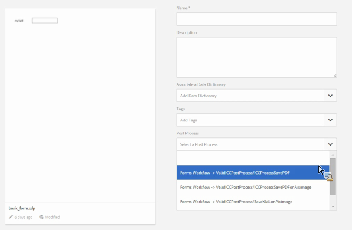

# Post processing of letters and interactive communications{#post-processing-of-letters-and-interactive-communications}

## Post Processing {#post-processing}

Agents can associate and execute post processing workflows on letters and intreactive communications. Post process to be executed can be selected in the Properties view of the Letter template. You can set up post processes to email, print, fax, or archive your final letters.

To associate post processes with letters or interactive communications, you first need to set up the post processes. Two types of workflows can be executed on submitted letters:

1. **Forms Workflow:** These are the AEM Forms on JEE process management workflows. Instructions for setting up [Forms Workflow](#formsworkflow).

1. **AEM Workflow:** AEM workflows can also be used as post processes for submitted letters. Instructions for setting up [AEM Workflow](../../forms/using/aem-forms-workflow.md).

## Forms Workflow {#formsworkflow}

1. In AEM, open Adobe Experience Manager Web Console Configuration for your server using the following URL: `https://<server>:<port>/<contextpath>/system/console/configMgr`

   

1. On this page, locate AEM Forms Client SDK Configuration and expand it by clicking it.
1. In Server URL, enter the name of your AEM Forms on JEE server, login details, and then click **Save**.

   

1. Specify the username and password.
1. Ensure that sun.util.calendar is added to Deserialization Firewall Configuration.

   Go to Deserialization Firewall Configuration and under Allowlisted classes of package prefixes, add sun.util.calendar.

1. Now your servers are mapped and the post processes in AEM Forms on JEE are available in the AEM user interface while creating letters.

   

1. To authenticate a process/service, copy the name of a process and go back to the Adobe Experience Manager Web Console Configurations page &gt; AEM Forms Client SDK Configuration and add the process as a new service.

   For example, if the drop-down in Properties page of letter displays name of the process as Forms Workflow -> ValidCCPostProcess/SaveXML, add a Service Name as `ValidCCPostProcess/SaveXML`.

1. To use AEM Forms on JEE workflows for post processing, set up the necessary parameters and outputs. Default values of the parameters are indicated below.

   Go to the Adobe Experience Manager Web Console Configurations page > **[!UICONTROL Correspondence Management Configurations]** and set up the following parameters:

    1. **inPDFDoc (PDF document parameter):** A PDF document as input. This input contains the rendered letter as input. The parameter names indicated are configurable. They can be configured from Correspondence Management configurations from configuration.
    1. **inXMLDoc (XML data parameter):** An XML document as input. This input contains data entered by user in the form of XML.
    1. **inXDPDoc (XDP document parameter):** An XML document as input. This input contains underlying layout (XDP).
    1. **inAttachmentDocs (Attachment Documents parameter):** A list input parameter. This input contains all the attachments as input.
    1. **redirectURL (Redirect URL Output):** An output type indicating the url to redirect to.

   Your forms workflow must have either PDF document parameter or XML data parameter as input with the same name as specified in **[!UICONTROL Correspondence Management Configurations]**. This is required for the process to be listed in the Post Process dropdown.

## Settings on the Publish instance {#settings-on-the-publish-instance}

1. login to `https://localhost:publishport/aem/forms`.
1. Navigate to **[!UICONTROL Letters]** to view the published letter that is available on the publish instance.
1. Configure the AEM DS Settings. See [Configuring AEM DS settings](../../forms/using/configuring-the-processing-server-url.md).

>[!NOTE]
>
>While using either Forms or AEM workflows, before you make any submission from the publish server, it is necessary to configure the DS settings service. Otherwise, the Form submission shall fail.

## Letter Instances Retrieval {#letter-instances-retrieval}

Saved letter instances can be manipulated further, such as retrieval of letter instances and deletion of letter instances, by using the following APIs defined in LetterInstanceService.

<table>
 <tbody>
  <tr>
   <td><strong>Server-side API</strong></td>
   <td><strong>Operation name</strong></td>
   <td><strong>Description</strong></td>
  </tr>
  <tr>
   <td>
Public LetterInstanceVO
 
getLetterInstance(String letterInstanceId)
 
Throws ICCException; 
 </td>
   <td>getLetterInstance</td>
   <td>Fetch the specified letter instance </td>
  </tr>
  <tr>
   <td>Public void deleteLetterInstance(String letterInstanceId) throws ICCException; </td>
   <td>deleteLetterInstance </td>
   <td>Deleted the specified letter instance </td>
  </tr>
  <tr>
   <td>List getAllLetterInstances(Query) throws ICCException; </td>
   <td>getAllLetterInstances </td>
   <td>This API fetches letter instances based on the input query parameter. To fetch all letter instances, query parameter can be passed as null.  </td>
  </tr>
  <tr>
   <td>Public Boolean letterInstanceExists(String letterInstanceName) throws ICCException; </td>
   <td>letterInstanceExists </td>
   <td>Check if a LetterInstance exists by the given name </td>
  </tr>
 </tbody>
</table>

## Associating a post process with a letter {#associating-a-post-process-with-a-letter}

In the CCR user interface, complete the following steps to associate a post process with a letter:

1. Hover over a letter and select **View Properties**.
1. Select **Edit**.
1. In the Basic Properties, using the Post Process drop-down, select the post process to associate with the letter. Both the AEM and Forms-related post processes are listed in the drop-down.
1. Select **Save**.
1. After configuring the letter with the Post Process, publish the letter and optionally on the publish instance, specify the processing URL in AEM DS Settings service. This ensures that the post process is run on the processing instance.

## Reload a draft letter instance&nbsp; {#reloaddraft}

A draft letter instance can be reloaded in user interface by using the following url:

`https://<server>:<port>/aem/forms/`

`createcorrespondence.html?/random=$&cmLetterInstanceId=$<LetterInstanceId>`

LetterInstaceID: The unique ID of the submitted letter instance.

For more information on saving a draft letter, see [Saving drafts and submitting letter instances](../../forms/using/create-correspondence.md#savingdrafts).
