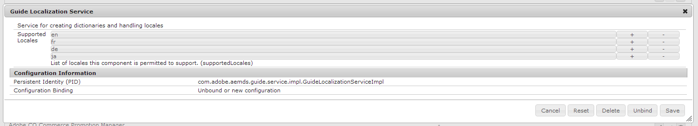

# Supporting new locales for adaptive forms localization {#supporting-new-locales-for-adaptive-forms-localization}

## About locale dictionaries {#about-locale-dictionaries}

The localization of adaptive forms relies on two types of locale dictionaries:

**Form-specific dictionary** Contains strings used in adaptive forms. For example, labels, field names, error messages, help descriptions, and so on. It is managed as a set of XLIFF files for each locale and you can access it at https://`<host>`:`<port>`/libs/cq/i18n/translator.html.

**Global dictionaries** There are two global dictionaries, managed as JSON objects, in AEM client library. These dictionaries contain default error messages, month names, currency symbols, date and time patterns, and so on. You can find these dictionaries in CRXDe Lite at /libs/fd/xfaforms/clientlibs/I18N. These locations contains separate folders for each locale. Because global dictionaries are usually not updated frequently, keeping separate JavaScript files for each locale enables browsers to cache them and reduce network bandwidth usage when accessing different adaptive forms on same server.

### How localization of adaptive form works {#how-localization-of-adaptive-form-works}

When an adaptive form is rendered, it identifies the requested locale by looking at the following parameters in the specified order:

* Request parameter `afAcceptLang`

  To override the browser locale of users, you can pass the `afAcceptLang` request parameter to force the locale. For example, the following URL will force to render the form in Japanese locale:
  
  `https://[*server*]:[*port*]/<*contextPath*>/<*formFolder*>/<*formName*>.html?wcmmode=disabled&afAcceptLang=ja`  

* The browser locale set for the user, which is specified in the request using the `Accept-Language` header.   

* Language setting of the user specified in AEM.

Once the locale is identified, the adaptive forms picks the form-specific dictionary. If the form-specific dictionary for the requested locale is not found, it uses the English (en) dictionary is used.

If a client library for the requested locale doesn't exist, it checks for a client library for the language code present in the locale. For example, if the requested locale is `en_ZA` (South African English) and the client library for `en_ZA` doesn't exist, the adaptive form will use the client library for `en` (English) language, if it exists. However, if none of them exist, the adaptive form uses the dictionary for `en` locale.

## Add localization support for non-supported locales {#add-localization-support-for-non-supported-locales}

AEM Forms currently supports localization of adaptive forms content in English (en), Spanish (es), French (fr), Italian (it), German (de), Japanese (ja), Portuguese-Brazilian (pt-br), Chinese- (zh-tn), Chinese-Taiwan (zh-tw), and Korean (ko-kr) locales.

To add support for a new locale at adaptive forms runtime:

1. [Add a locale to the GuideLocalizationService service](/help/forms/using/supporting-new-language-localization.md#p-add-a-locale-to-the-guide-localization-service-br-p)  

1. [Add XFA client library for a locale](/help/forms/using/supporting-new-language-localization.md#p-add-xfa-client-library-for-a-locale-br-p)  

1. [Add adaptive form client library for a locale](/help/forms/using/supporting-new-language-localization.md#p-add-adaptive-form-client-library-for-a-locale-br-p)
1. [Add locale support for the dictionary](/help/forms/using/supporting-new-language-localization.md#p-add-locale-support-for-the-dictionary-br-p)
1. [Restart the server](/help/forms/using/supporting-new-language-localization.md#p-restart-the-server-p)

### Add a locale to the Guide Localization service {#add-a-locale-to-the-guide-localization-service-br}

1. Go to `https://[server]:[port]/system/console/configMgr`.
1. Click to edit the **Guide Localization Service** component.
1. Add the locale you want to add to the list of supported locales.

 

### Add XFA client library for a locale {#add-xfa-client-library-for-a-locale-br}

Create a node of type `cq:ClientLibraryFolder` under `etc/<folderHierarchy>`, with category `xfaforms.I18N.<locale>`, and add the following files to the client library:

* **I18N.js** defining `xfalib.locale.Strings` for the `<locale>` as defined in `/etc/clientlibs/fd/xfaforms/I18N/ja/I18N`.

* **js.txt** containing the following:

```
/libs/fd/xfaforms/clientlibs/I18N/Namespace.js
I18N.js
/etc/clientlibs/fd/xfaforms/I18N/LogMessages.js
```

### Add adaptive form client library for a locale {#add-adaptive-form-client-library-for-a-locale-br}

Create a node of type `cq:ClientLibraryFolder` under `etc/<folderHierarchy>`, with category as `guides.I18N.<locale>` and and dependencies as `xfaforms.3rdparty`, `xfaforms.I18N.<locale>` and `guide.common`. ``

Add the following files to the client library:

* **i18n.js** defining `guidelib.i18n`, having patterns of "calendarSymbols", `datePatterns`, `timePatterns`, `dateTimeSymbols`, `numberPatterns`, `numberSymbols`, `currencySymbols`, `typefaces` for the `<locale>` as per the XFA specifications described in [Locale Set Specification](https://helpx.adobe.com/content/dam/Adobe/specs/xfa_spec_3_3.pdf). You can also see how it is defined for other supported locales in `/etc/clientlibs/fd/af/I18N/fr/javascript/i18n.js`.

* **LogMessages.js** defining `guidelib.i18n.strings` and `guidelib.i18n.LogMessages` for the `<locale>` as defined in `/etc/clientlibs/fd/af/I18N/fr/javascript/LogMessages.js`.

* **js.txt** containing the following:

```
i18n.js
LogMessages.js
```

### Add locale support for the dictionary {#add-locale-support-for-the-dictionary-br}

Perform this step only if the `<locale>` you are adding is not among `en`, `de`, `es`, `fr`, `it`, `pt-br`, `zh-tn`, `zh-tw`, `ja`, `ko-kr`.

1. Create an `nt:unstructured` node `languages` under `etc`, if not present already.

1. Add a multi-valued string property `languages` to the node, if not present already.
1. Add the `<locale>` default locale values `de`, `es`, `fr`, `it`, `pt-br`, `zh-tn`, `zh-tw`, `ja`, `ko-kr`, if not present already.

1. Add the `<locale>` to the values of the `languages` property of `/etc/languages`.

The `<locale>` will appear at `https://[server]:[port]/libs/cq/i18n/translator.html`.

### Restart the server {#restart-the-server}

Restart the AEM server for the added locale to come into effect.

## Sample libraries for adding support for Spanish {#sample-libraries-for-adding-support-for-spanish}

Sample client libraries for adding support for Spanish

[Get File](assets/sample.zip)
