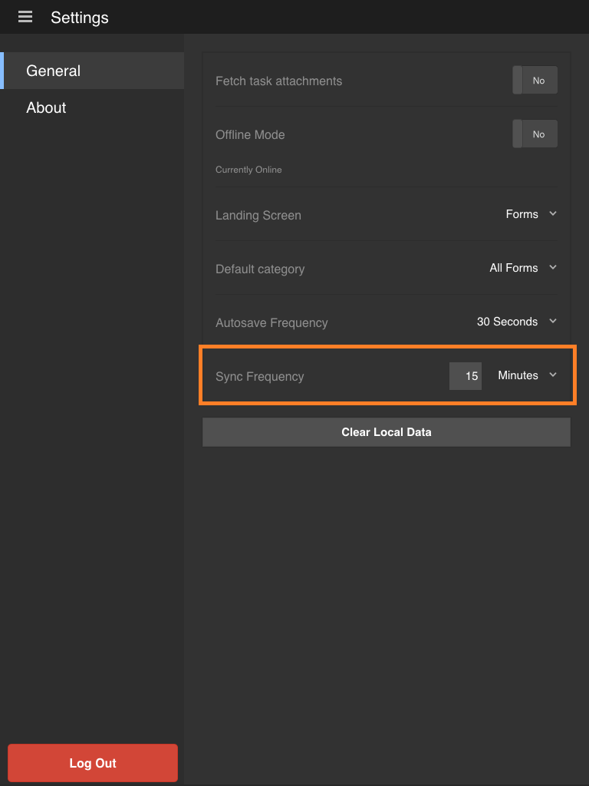

# Synchronizing the app{#synchronizing-the-app}

## Synchronizing the app {#synchronizing-the-app-1}

The forms in your app are downloaded from the AEM Forms server. The forms are downloaded under Tasks and Forms tabs. Drafts created from forms are downloaded in the drafts tab, and drafts created from tasks are downloaded in the tasks tab. For a standalone form on OSGi server, forms and drafts are downloaded in Forms and Draft tabs respectively.

When you complete and submit a form, the form is uploaded back to the AEM Forms server instantly if the app is online. The forms are fetched from the server when the app is synchronized. The drafts, however, are synced with the server instantly if the app is online.

When you are online with the AEM Forms server, by default, your app is synchronized every 15 minutes. However, you have the option to change the synchronization frequency. Alternatively, you can manually synchronize the app at any time.

**To synchronize the app manually**

Select the Synchronize button  at the lower-right corner of the home screen.

**To alter the synchronization frequency**

1. To go to the Setting screen, select the menu button at the upper-left corner of the Home screen, and then select **Settings**.
1. In the Settings screen, select the General tab.

   

1. On the Sync frequency option, select the value to the right of Sync frequency.
1. In the drop-down list, select the new synchronization frequency.

### Technical specifications {#technical-specifications}

* The main logic of submitting the offline app data to the AEM Forms server is included in runtime/offline/util/offline.js.
* In the .js, the call to the processOfflineSubmittedSavedTasks(...) function, sends the saved / submitted tasks to the server. It also handles any errors or conflicts in the sync process. If the submission of a task fails, the task on the app is marked as failed. In addition, the task remains in your Outbox.
* The syncSubmittedTask() and syncSavedTask() function perform operations on individual tasks.
* The call to the processOfflineSubmittedSavedTasks() function is initiated by the task list component after a user selects to synchronize offline state to the server or an automatic sync by the background thread.
