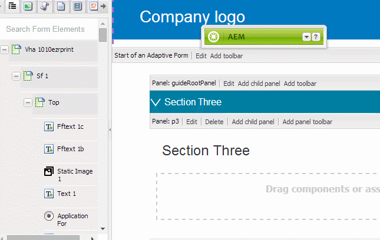
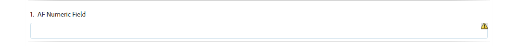

# Synchronizing Adaptive Forms with XFA Form Templates{#synchronizing-adaptive-forms-with-xfa-form-templates}

 Adobe recommends using the modern and extensible data capture [Core Components](https://experienceleague.adobe.com/docs/experience-manager-core-components/using/adaptive-forms/introduction.html) for [creating new Adaptive Forms](/help/forms/using/create-an-adaptive-form-core-components.md) or [adding Adaptive Forms to AEM Sites pages](/help/forms/using/create-or-add-an-adaptive-form-to-aem-sites-page.md). These components represent a significant advancement in Adaptive Forms creation, ensuring impressive user experiences. This article describes older approach to author Adaptive Forms using foundation components. 

## Introduction {#introduction}

You can create an Adaptive Form based on an XFA form template ( `*.XDP` file). This reuse lets you preserve your investment in existing XFA forms. For information on how to use an XFA form template for creating an adaptive form, [Create an Adaptive Form based on a template](../../forms/using/creating-adaptive-form.md#p-create-an-adaptive-form-based-on-an-xfa-form-template-p).

You can reuse fields from the XDP file in your adaptive form. These fields are referred to as binded fields. The properties of the binded fields (such as scripts, labels, and display format) are copied from the XDP file. You can also choose to override the value of some of these properties.

AEM Forms provides a way to help you keep the fields of the adaptive forms synchronized with any changes that are later made to the corresponding fields in the XDP file. This article explains how you can enable this synchronization.

In the AEM Forms authoring environment, you can drag fields from an XFA form (left) to an adaptive form (right)

## Prerequisites {#prerequisites}

To use the information in this article, a familiarity with the following areas is recommended:

* [Creating an adaptive form](../../forms/using/creating-adaptive-form.md)

* XFA (XML Forms Architecture)

To use the assets provides for the example in the article, download the sample package as explained in the next section, [Sample package](../../forms/using/synchronizing-adaptive-forms-xfa.md#p-sample-package-p).

## Sample package {#sample-package}

The article uses an example to demonstrate how to synchronize the adaptive form with an updated XFA form template. The assets used in the example are available in a package, which can be downloaded from the [Downloads](../../forms/using/synchronizing-adaptive-forms-xfa.md#p-downloads-p) section in this article.

After uploading the package, you can view these assets in the AEM Forms UI.

Install the package using the Package Manager: `https://<server>:<port>/crx/packmgr/index.jsp`

The package contains the following assets:

1. `sample-form.xdp`: The XFA form template used as an example

1. `sample-xfa-af`: The adaptive form based on the sample-form.xdp file. This adaptive form, however, does not include any fields. In the next step, you add content to this adaptive form.

### Add content to adaptive form {#add-content-to-adaptive-form-br}

1. Navigate to https://&lt;server&gt;:&lt;port&gt;/aem/forms.html. Enter your credentials if asked.
1. Open the sample-af-xfa for editing in author mode.
1. From the Content browser in the sidebar, choose Data Model Objects tab. Drag NumericField1 and TextField1 onto the Adaptive Form.
1. Change the Title of the NumericField1 from **Numeric Field** to **AF Numeric Field.**

>[!NOTE]
>
>In the preceding steps, you overwrote a property of a field in the XDP file. This property is, therefore, not synchronized if the corresponding property in the XDP file is edited later.

## Detecting changes in XDP file {#detecting-changes-in-xdp-file}

Whenever there is any change in an XDP file or a fragment, the AEM Forms UI flags all adaptive forms that are based on the XDP file or the fragment.

After updating an XDP file, you need to upload it again in the AEM Forms UI for the changes to be flagged.

As an example, let us update the `sample-form.xdp` file using the following steps:

1. Navigate to `https://<server>:<port>/projects.html.` Enter your credentials if prompted.
1. Click the Forms tab on the left.
1. Download the `sample-form.xdp` file on your local machine. The XDP file is downloaded as a `.zip` file, which can be extracted using any file decompression utility.

1. Open the `sample-form.xdp` file and change the title of the field TextField1 from **Text Field** to **My Text Field**.

1. Upload the `sample-form.xdp` file back into the AEM Forms UI.

If an XDP file gets updated, you see an icon in the editor, when you edit the adaptive forms based on the XDP file. This icon indicates that the adaptive form is out of sync with the XDP file. In the following image, see the icon next in the sidebar.

## Synchronizing adaptive forms with the latest XDP file {#synchronizing-adaptive-forms-with-the-latest-xdp-file}

When an adaptive form that is out of sync with the XDP file is opened for authoring the next time, the following message is displayed: **Schema/Form Template for the Adaptive Form has been updated. `Click Here` to rebase it with the new version.**

Clicking on the message synchronizes the fields in the adaptive form with the corresponding fields in the XDP file.

For the example used in this article, open `sample-xfa-af` in authoring mode. The message is displayed toward the bottom of the adaptive form.

### Updating the properties {#updating-the-properties}

All the properties that were copied from the XDP file to the adaptive form are updated except for the properties that were explicitly overridden in the adaptive form (from the Component Dialog) by the Author. The list of properties that have been updated is available in the server logs.

To update the properties in the example adaptive form, click the link (labeled `"Click Here"`) in the message. The title of TextField1 changes from **Text Field** to **My Text Field**.

>[!NOTE]
>
>The label AF Numeric Field did not get changed because you had overridden this property from the component properties dialog, as described in [Add content to adaptive forms](../../forms/using/synchronizing-adaptive-forms-xfa.md#p-add-content-to-adaptive-form-br-p).

### Adding new fields from XDP file to adaptive form &nbsp; {#adding-new-fields-from-xdp-file-to-adaptive-form-nbsp}

Any fields that are added later to the original XDP file appear in the Form Hierarchy tab and you can drag those new fields to the adaptive form.

You do not need to click the link in the error message to update the fields in the Form Hierarchy tab.

### Deleted fields in XDP file {#deleted-fields-in-xdp-file}

If a field that was earlier copied to an adaptive form is deleted from an XDP file, an error message is displayed in the authoring mode stating that the field does not exist in the XDP file. In such cases, manually delete the field from adaptive form or clear the `bindRef` property in the component dialog.

The following steps illustrate this use flow for the assets in the example used in this article:

1. Update the `sample-form.xdp` file and delete NumericField1.
1. Upload the `sample-form.xdp` file in the AEM Forms UI
1. Open the `sample-xfa-af` adaptive form for authoring. The following error message is displayed: Schema/Form Template for the Adaptive Form has been updated. `Click Here` to rebase it with the new version.

1. Click the link (labeled " `Click Here`") in the message. An error message is displayed noting that the field does not exist anymore in the XDP file.

The field that has been deleted is also marked with an icon to indicate an error in the field.

>[!NOTE]
>
>The fields in the adaptive form that have an incorrect binding (an invalid `bindRef` value in the edit dialog) are also considered as deleted fields. If the author does not fix these errors and publish the adaptive form, the field is treated as a normal unbound adaptive form field and is included in the unbound section of the output XML file.

## Downloads {#downloads}

Content-package for the example in this article

[Get File](assets/sample-xfa-af-sync-1.0.zip)
