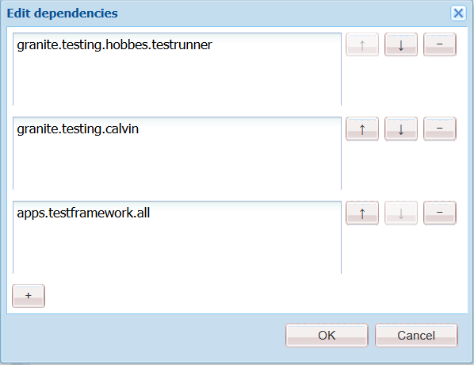
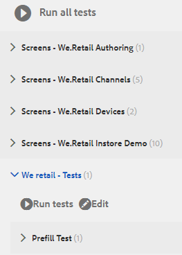

# Tutorial: Testing your adaptive form{#tutorial-testing-your-adaptive-form}

  

| This tutorial is a step in the [Create Your First Adaptive Form](https://helpx.adobe.com/experience-manager/6-3/forms/using/create-your-first-adaptive-form.html) series. It is recommended to follow the series in chronological sequence to understand, perform, and demonstrate the complete tutorial use case. |
|---|

After the adaptive form is ready, it is important to test your adaptive before rolling it out to end users. You can manually test (functional testing) every field or automate testing of your adaptive form. When you have multiple adaptive forms, manually testing every field of all the adaptive forms becomes a daunting task.

AEM Forms provide a testing framework, Calvin, to automate testing of your adaptive forms. Using the framework, you write and run UI tests directly in a web browser. The framework provides JavaScript APIs for creating tests. The automated testing allows you to test the prefill experience of an adaptive form, submit experience of an adaptive form, expression rules, from validations, lazy loading, and UI interactions. This tutorial walks you through the steps to create and run automated tests on an adaptive form. At the end of this tutorial, you will be able to:

* [Create a test suite for your adaptive form](../../forms/using/testing-your-adaptive-form.md#step-create-a-test-suite)
* [Create tests for your adaptive form](../../forms/using/testing-your-adaptive-form.md#step-create-a-test-case-to-prefill-values-in-an-adaptive-form)
* [Run test suite and tests created for your adaptive form](/content.md#main-pars_header_839411570)

## Step 1: Create a test suite {#step-create-a-test-suite}

Test suites have a collection of test cases. You can have multiple test suites. It is recommended to have a separate test suite for each form. To create a test suite:

1. Log to AEM Forms author instance in as an administrator. Open CRXDE Lite. You can tap AEM Logo &gt; **Tools **&gt; **General **&gt; **CRXDE Lite** or open the [https://localhost:4502/crx/de/index.jsp](/crx/de/index.jsp) URL in a browser to open CRXDE Lite.

1. Navigate to /etc/clientlibs in CRXDE Lite. Right-click the /etc/clientlibs subfolder and click **Create** &gt; **Create Node. **In the Name field type **WeRetailFormTestCases**. Select the type as **cq:ClientLibraryFolder** and click **OK**. It creates a node. You can use any name in place of WeRetailFormTestCases.
1. Add the following properties to the WeRetailFormTestCases node and tap **Save ALL**.

<table>
 <tbody> 
  <tr> 
   <td><strong>Property</strong></td> 
   <td><strong>Type</strong></td> 
   <td><strong>Multi</strong></td> 
   <td><strong>Value</strong></td> 
  </tr> 
  <tr> 
   <td>categories</td> 
   <td>String</td> 
   <td>Enabled</td> 
   <td> 
    <ul> 
     <li>granite.testing.hobbes.tests<br /> </li> 
     <li>granite.testing.calvin.tests</li> 
    </ul> </td> 
  </tr> 
  <tr> 
   <td>dependencies</td> 
   <td>String</td> 
   <td>Enabled</td> 
   <td> 
    <ul> 
     <li>granite.testing.hobbes.testrunner <br /> </li> 
     <li>granite.testing.calvin <br /> </li> 
     <li>apps.testframework.all</li> 
    </ul> </td> 
  </tr> 
 </tbody> 
</table>

   Ensure that each property is added to a separate box as displayed below:

   

1. Right-click the **[!UICONTROL WeRetailFormTestCases]**node click **Create** > **Create File. **In the Name field, type `js.txt` and click **OK**.
1. Open the js.txt file for editing, add the following code, and save the file:

   ```
   #base=. 
    init.js
   ```

1. Create a file, init.js,in the `WeRetailFormTestCases`node. Add the below code to the file and tap **[!UICONTROL Save All]**.

   ```
   (function(window, hobs) {
       'use strict';
       window.testsuites = window.testsuites || {};
     // Registering the test form suite to the sytem
     // If there are other forms, all registration should be done here
       window.testsuites.testForm3 = new hobs.TestSuite("We retail - Tests", {
           path: '/etc/clientlibs/WeRetailFormTestCases/init.js',
           register: true
       });
    // window.testsuites.testForm2 = new hobs.TestSuite("testForm2");
   }(window, window.hobs));
   ```

   The above code creates a test suite named **We retail - Tests**.

1. Open AEM Testing UI (AEM &gt; Tools &gt; Operations &gt; Testing). The test suite - **We retail - Tests** - is listed in the UI.

   

## Step 2: Create a test case to prefill values in an adaptive form {#step-create-a-test-case-to-prefill-values-in-an-adaptive-form}

A test case is a set of actions to test a specific functionality. For example, prefilling all the fields of a form and validating a few fields to ensure that correct values are entered.

An action is a specific activity on an adaptive form such as clicking a button. To create a test case and actions to validate user input for each adaptive form field:

1. In CRXDE lite, navigate to the `/content/forms/af/create-first-adaptive-form` folder. Right click the **[!UICONTROL create-first-adaptive-form]** folder node and click **[!UICONTROL Create]**> **[!UICONTROL  **Create File**]****. **In the Name field, type `prefill.xml` and click **[!UICONTROL OK]**. Add the following code to the file:

   ```xml
   <?xml version="1.0" encoding="UTF-8"?><afData>
     <afUnboundData>
       <data>
         <customer_ID>371767</customer_ID>
         <customer_Name>John Jacobs</customer_Name>
         <customer_Shipping_Address>1657 1657 Riverside Drive Redding</customer_Shipping_Address>
         <customer_State>California</customer_State>
         <customer_ZIPCode>096001</customer_ZIPCode>
        </data>
     </afUnboundData>
     <afBoundData>
       <data xmlns:xfa="https://www.xfa.org/schema/xfa-data/1.0/"/>
     </afBoundData>
   </afData>
   
   ```

1. Navigate to `/etc/clientlibs`. Right-click the `/etc/clientlibs` subfolder and click **[!UICONTROL Create]**> **[!UICONTROL Create Node]**.

   In the **[!UICONTROL Name]**field type `WeRetailFormTests`. Select the type as `cq:ClientLibraryFolder` and click **[!UICONTROL OK]**. 

1. Add the following properties to the **[!UICONTROL WeRetailFormTests]** node. 

<table>
 <tbody> 
  <tr> 
   <td><strong>Property</strong></td> 
   <td><strong>Type</strong></td> 
   <td><strong>Multi</strong></td> 
   <td><strong>Value</strong></td> 
  </tr> 
  <tr> 
   <td>categories</td> 
   <td>String</td> 
   <td>Enabled</td> 
   <td> 
    <ul> 
     <li>granite.testing.hobbes.tests<br /> </li> 
     <li>granite.testing.hobbes.tests.testForm</li> 
    </ul> </td> 
  </tr> 
  <tr> 
   <td>dependencies</td> 
   <td>String</td> 
   <td>Enabled</td> 
   <td> 
    <ul> 
     <li>granite.testing.calvin.tests</li> 
    </ul> </td> 
  </tr> 
 </tbody> 
</table>

1. Create a file, js.txt,in the **[!UICONTROL WeRetailFormTests]**node. Add the following to the file:

   ```shell
   #base=.
   prefillTest.js
   ```

   Click **[!UICONTROL Save All]**. 

1. Create a file, `prefillTest.js`,in the **[!UICONTROL WeRetailFormTests]**node. Add the below code to the file. The code creates a test case. The test case prefills all the fields of a form and validates some fields to ensure correct values are entered.

   ```
   (function (window, hobs) {
       'use strict';
   
       var ts = new hobs.TestSuite("Prefill Test", {
           path: '/etc/clientlibs/WeRetailFormTests/prefillTest.js',
           register: false
       })
   
       .addTestCase(new hobs.TestCase("Prefill Test")
           // navigate to the testForm which is to be test
           .navigateTo("/content/forms/af/create-first-adaptive-form/shipping-address-add-update-form.html?wcmmode=disabled&dataRef=crx:///content/forms/af/create-first-adaptive-form/prefill.xml")
           // check if adaptive form is loaded
           .asserts.isTrue(function () {
               return calvin.isFormLoaded()
           })
           .asserts.isTrue(function () {
               return calvin.model("customer_ID").value == 371767;
           })
           .asserts.isTrue(function () {
               return calvin.model("customer_ZIPCode").value == 96001;
           })
       );

       // register the test suite with testForm
       window.testsuites.testForm3.add(ts);
   
   }(window, window.hobs));
   
   ```

   The test case is created and ready to run. You can create test cases to validate various aspects of an adaptive form like checking execution of calculate script, validating patterns, and validating submit experience of an adaptive form. For information about various aspects of adaptive forms testing, see automate testing of adaptive forms.

## Step 3: Run all the tests in a suite or individual tests cases {#step-run-all-the-tests-in-a-suite-or-individual-tests-cases}

A test suite can have multiple test cases. You can run all the test cases in a test suite at once or individually. When you run a tests the icons indicate the results:

* A checkmark icon indicates a passed test: 

* An "X" icon indicates a failed test: 

1. Navigate to AEM icon > **[!UICONTROL Tools]**> **[!UICONTROL Operations]**> **[!UICONTROL Testing]**
1. To run all the tests of the Test Suite:

    1. In the Tests panel, tap **[!UICONTROL We retail - Tests (1).]**It The suite expands to display list of test.
    1. Tap the **[!UICONTROL Run tests]** button. The blank area on right side of screen is replaced with adaptive form as the test executes.

   

1. To run a single test from the Test Suite:

    1. In the Tests panel, tap **[!UICONTROL We retail - Tests (1)]**. It The suite expands to display list of test.
    1. Tap the **[!UICONTROL Prefill Test]** and tap the **[!UICONTROL Run tests]** button. The blank area on right side of screen is replaced with adaptive form as the test executes.

1. Tap the test name, Prefill test, to review the results of the Test Case. It opens the Result panel. Tap the name of your Test Case in the Result panel view all the details of the test.

   

Now the adaptive form is ready for publishing. 
