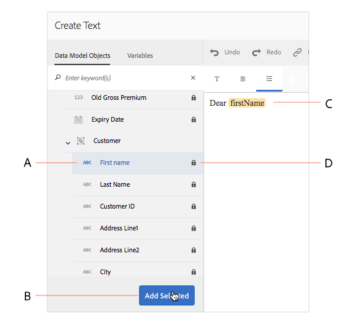
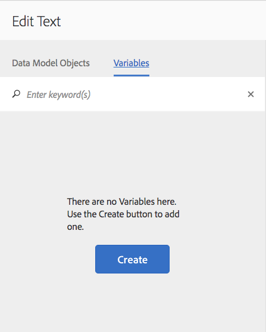
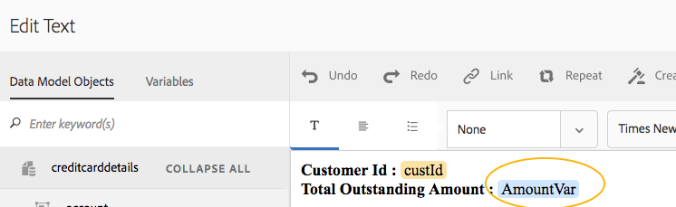
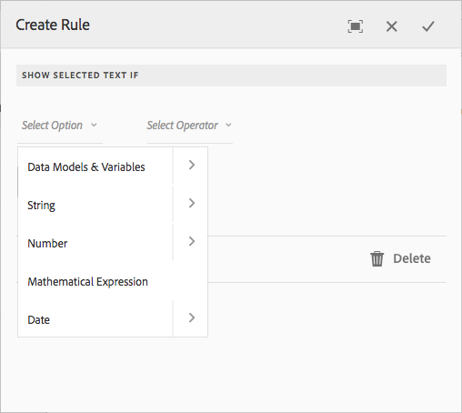
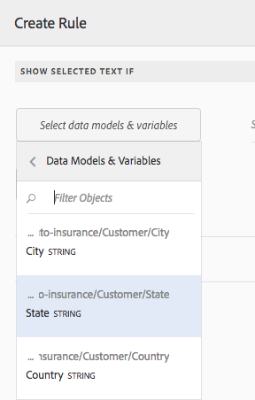
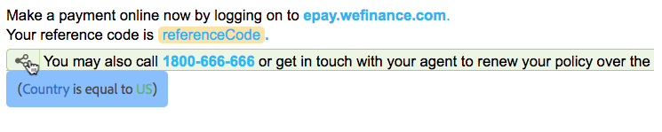
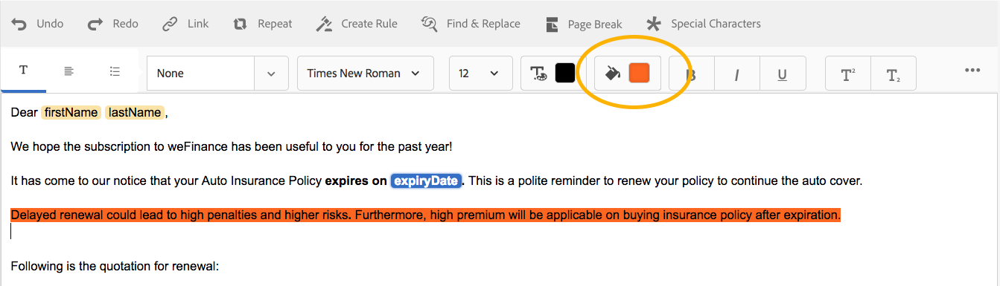
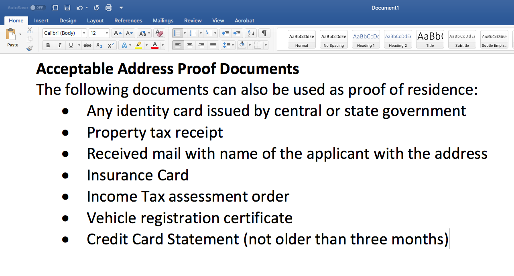
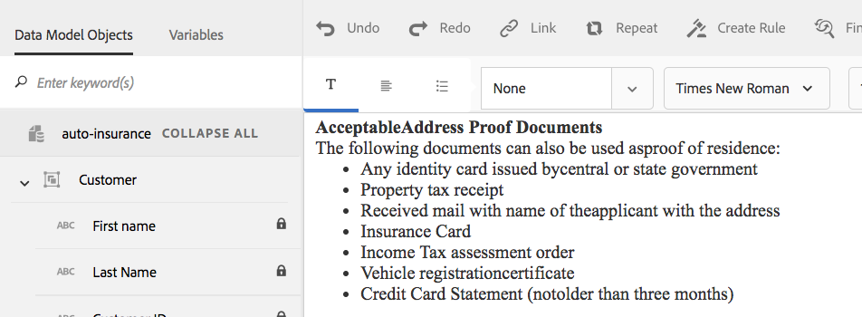
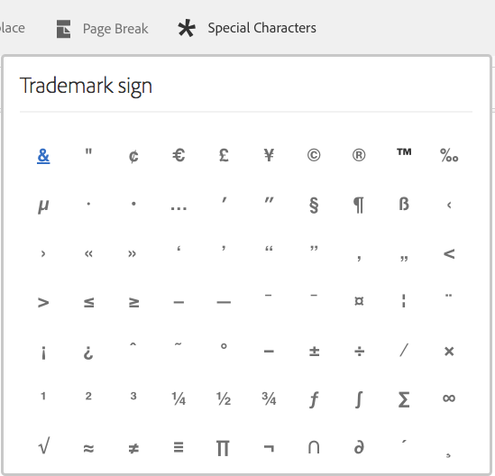

# Texts in Interactive Communications{#texts-in-interactive-communications}

## Overview {#overview}

A text document fragment consists of one or more paragraphs of text. A paragraph can be static or dynamic. A dynamic paragraph may contain form data model properties and variables. You can also apply rules and repeat within a text document fragment. For example, the customer name in a salutation could be a Form Data Model (FDM) property with its value made available at runtime. By changing these values, the same Interactive Communication can be used to prepare Interactive Communication for different customers using the Agent UI.

The text document fragment in Interactive Communication supports the following type of dynamic data:

* **Data model objects**: The data properties use a back end data source. 
* **Rule based content**: Parts of content in a text that appear or get hidden based on a rule. A rule could also be based on form data model properties and variables. 
* **Variables**: In text document fragment, variables are not bound to a backend data source. The agent fills in/selects values in variables or binds the variables to data sources while preparing the Interactive Communication for submitting it to a post process. 
* **Repeat**: You may have dynamic information in your Interactive Communication, such as transactions in a credit card statement, the number of occurrences of which may keep changing with each generated Interactive Communication. Using repeat, you can format and structure such dynamic information. For more information, see [Inline condition and repeat](https://helpx.adobe.com/experience-manager/6-3/forms/using/cm-inline-condition.html).

## Create text {#createtext}

1. Select **[!UICONTROL Forms]** > **[!UICONTROL Document Fragments]**. 
1. Select **[!UICONTROL Create]** > **[!UICONTROL Text]**. 
1. Specify the following information:

    * **[!UICONTROL Title]**: (Optional) Enter the title for the text document fragment. Titles do not need to be unique and can have special characters and non-English characters. Texts are referred by their titles (when available) such as in thumbnails and properties. 
    * **[!UICONTROL Name]**: The unique name for the text, within a folder. No two document fragments (text, condition, or list) in any state can exist with the same name in a folder. In the Name field, you can enter only English language characters, numbers, and hyphens. The Name field is automatically populated based on the Title field. The special characters, spaces, numbers, and non-English characters entered in the Title field are replaced with hyphens in the Name field. Although the value in the Title field is automatically copied to the Name, you can edit the value.  
    
    * **[!UICONTROL Description]**: Type a description of the text.
    * **[!UICONTROL Form Data Model]**: Optionally, select the Form Data Model radio button to create the text based on a form data model. When you select Form Data Model radio button, **[!UICONTROL Form Data Model]** field appears. Browse and select a form data model. While creating text and condition for an Interactive Communication, ensure that you use the same data model that you intend to use in the Interactive Communication. For more information on Form Data Model, see [Data Integration](/help/forms/using/data-integration.md). 
    
    * **[!UICONTROL Tags]**: Optionally, to create custom tag enter value in text field and press Enter. When you save this text, the newly added tags get created.

1. Select **[!UICONTROL Next]**.

   Create Text page appears. If you have chosen to create a form data model-based text, the form data model properties appear in the left pane. 

1. Type in the text and use the following options for formatting, conditionalizing, and inserting form data model properties and variables in your text:

    * [Form Data Model](#formdatamodel)
    * [Variables](#variables)
    * [Rule editor](#rules)
    * [Formatting options](#formatting)

        * [Copy paste formatted text from other applications](#paste)  
        
        * [Highlight parts of text](#highlight)

    * [Repeat](/help/forms/using/cm-inline-condition.md)
    * [Special characters](#special)
    * [Searching and replacing text](#searching)
    * [Keyboard shortcuts](/help/forms/using/keyboard-shortcuts.md)

   >[!NOTE]
   >
   >You can add Form Data Model elements, Data Dictionary elements, and variables using the @ symbol in the text editor. When you enter a string preceded by @ in the text editor, all the Data Model elements, Data Dictionary elements and variables are searched and elements or variables containing the searched string are displayed. You can navigate through the search results and select an element or variable. If there is no matching result, the *No matching results found* message is displayed.

1. Select **[!UICONTROL Save]**.

   The text is created. Now you can proceed to using the text as a building block while creating an Interactive Communication.

## Edit text {#edittext}

You can edit an existing text document fragment using the following steps. You can also choose to edit a text document fragment from within an Interactive Communication editor.

1. Select **[!UICONTROL Forms]** > **[!UICONTROL Document Fragments]**.
1. Navigate to a text document fragment and select it.
1. Select **[!UICONTROL Edit]**.
1. Make the required changes. For more information on options in text, see [Create text](#createtext).
1. Select **[!UICONTROL Save]** and then select **[!UICONTROL Close]**.

## Personalizing a text document fragment using form data model properties {#formdatamodel}

You can personalize text document fragments by inserting the form data model properties. By inserting form data model properties in text, you can fetch and populate recipient-specific data from the associated data source while previewing an Interactive Communication. For more information on form data model, see [AEM Forms Data Integration](/help/forms/using/data-integration.md).

If you have specified a form data model while creating a text, the properties in the form data model appear in the left pane of the text editor. The specified form data model should be same for the text document fragment and the Interactive Communication that includes it. 

* To insert a form data model property into text, place the cursor where you want to insert the property, then select the **[A]** property in the left pane by tapping on it, and select **[!UICONTROL [B] Add Selected]**. You can also just double-select the property to insert it at the **[C]** cursor position. Form data model properties are highlighted in a brownish background color.

Alternatively, you can search and add form data model property using the @ symbol in the text editor. Place the cursor where you want to insert the property. Type @ followed by the search string. The search operation is performed on all form data model properties and variables available in the document fragment. The properties or variables containing the search string are retrieved and displayed as a drop-down list. Navigate through the search results and click the property that you want to insert at the cursor location. Press Esc to hide the search results.

* To allow the agents to edit a form data model property's value in the agent UI while [Prepare and send Interactive Communication](/help/forms/using/prepare-send-interactive-communication.md) using the Agent UI, select the **[D]** lock icon for that property and ensure it is in an unlocked state. The default state of the property is locked and an agent cannot edit the property in the Agent UI.

You can also use form data model properties to construct rules for displaying or hiding parts of content. For more information, see [Create rules in text](#rules).

## Creating and using variables in a text document fragment {#variables}

Variables are placeholders that can be bound while creating an Interactive Communication. Variables can be bound to a form data model property or text fragment. Variables can also be left for the agent to fill.

You can use variables instead of form data model properties when:

* A text document fragment is to be used in multiple Interactive Communications where the binding needs to be different for different Interactive Communications.
* Text document fragment does not have a form data model at the time of its creation. You can insert variables and later bind them to the form data model properties at the time of creation of the Interactive Communication.
* You need to bind and retrieve text from a text document fragment. Only those text document fragments can be bound to variables should not have that have no variables within.

While creating or editing a text document fragment, you can create and insert variables. The variables you create appear in the Data tab of the Agent UI. The agent specifies the values for the variables while [Prepare and send Interactive Communication using the Agent UI](/help/forms/using/prepare-send-interactive-communication.md).

### Create variables {#createvariables}

1. In the left pane, select **[!UICONTROL Variables]**.

   The Variables pane appears. 

   

1. Select **[!UICONTROL Create]**.

   Create Variables pane appears. 

1. Enter the following information and select **[!UICONTROL Create]**:

    * **[!UICONTROL Name]** : Name of the variable.
    * **[!UICONTROL Description]** : Optionally enter a description about the variable. 
    * **[!UICONTROL Type]** : Select a type of the variable: String, Number, Boolean, or Date. 
    * **[!UICONTROL Allow Specific Values Only]** : For String and Number variables, you can ensure that the agent chooses from a specific set of values for a placeholder in the Agent UI. To specify the set of values, select this option and then specify comma-separated values that are allowed in the **[!UICONTROL Values]** field.

1. Select **[!UICONTROL Create]**.

   The variable is created and listed in the Variables pane.

1. To insert a variable in the text, place the cursor at the appropriate place, select the variable, and select **[!UICONTROL Add Selected]**.

   

   Variables are highlighted in light blue background color, while form data model properties are highlighted in a brownish color.

   Alternatively, you can search and add variables using the @ symbol in the text editor. Place the cursor where you want to insert the variable. Type @ followed by the search string. The search operation is performed on all form data model properties and variables available in the document fragment. The properties and variables containing the search string are retrieved and displayed as a drop-down list. Navigate through the search results and click the variable that you want to insert at the cursor location. Press Esc to hide the search results.

1. Select **[!UICONTROL Save]**.

## Create rules in text {#rules}

Using rule editor in a text, you can create rules to display or hide strings of text or pieces of content based on **preset conditions**. These conditions can be constructed based on:

* Strings
* Numbers
* Mathematical expression
* Dates
* Associated form data model's properties
* Any variables that you may have created in the text

### Create rules in text {#create-rules-in-text}

1. While creating or editing a text, select the text string, paragraph, or content that you want to conditionalize using the rule. 

   

1. Select **[!UICONTROL Create Rule]**.

   The Create Rule dialog appears. In addition to string, number, mathematical expression, and date, the following are also available in the Rule Editor for creating statements of the rules:

    * Associated form data model's properties
    * Any variables that you may have created

   Select the appropriate option to be evaluated. 

    

   >[!NOTE]
   >
   >Collection property is not supported for creating rules to conditionalize and display text.

1. Select the appropriate operator to evaluate the rule, such as Is Equal To, Contains, and Starts With. 

   

1. Insert the evaluating expression, value, data model property, or variable.

   

   Rule to display the selected text if the location of the recipient is US according to the source data of FDM

    * While creating or editing a rule, you can also select  (Resize) to expand the Create Rule/Edit Rule dialog. The expanded, full-window dialog lets you drag-and-drop form data model properties and variables to construct rules. Select Resize again to go back to the Create Rule dialog. 
    * You can also create multiple conditions in a rule. 
    * You can also create overlapping rules, in which a rule is applied to a part of a content that already has a rule applied.

1. Select **[!UICONTROL Done]**.

   The rule gets applied. The text or content to which the rule is applied is highlighted in green. When you hover over the left handle of the highlight, the applied rule appears.

   

   On clicking the left handle of the applied rule, you get the options to edit or remove the rule.

## Formatting text {#formatting}

While creating or editing text, the toolbar changes depending on the type of edits you choose to make: Paragraph, Alignment, or Listing:

Select type of toolbar: Paragraph, Alignment, or Listing

Font editing toolbar

Alignment toolbar

Listing toolbar

### Highlight/Emphasize parts of text {#highlight}

To highlight\emphasize parts of text in an editable document fragment, select the text and select Highlight Color.

You can either directly select a basic color `**[A]**` present in the Basic Colors palette or select **Select** after using the slider `**[B]**` to choose the appropriate shade of the color.

Optionally, you can also go to the Advanced tab to select the appropriate Hue, Lightness, and Saturation `**[C]**` to create the precise color and then select Select `**[D]**` to apply the color to highlight the text. 

 

### Paste formatted text {#paste}

To reuse one of more paragraphs of text that exist in another application, such as from Microsoft® Word or HTML pages, copy and paste the text into the text editor. The formatting of the copied text is retained in the text editor.

You can copy and paste one or more paragraphs of text in an editable text document fragment. For example, you may have an Microsoft® Word document with a bulleted list of acceptable proofs of residence such a following:

You can directly copy and paste the text from the Microsoft® Word document to an editable text document fragment. The formatting such as bulleted list, font, and text color is retained in the text document fragment.

>[!NOTE]
>
>The formatting of pasted text, however, has some [limitations](https://helpx.adobe.com/aem-forms/kb/cm-copy-paste-text-limitations.html).

## Insert special characters in text {#special}

If necessary, insert special characters in the document fragment. For example, you can use the Special Characters palette to insert:

* Currency symbols such as €,￥, and £
* Mathematical symbols such as ∑, √, ∂, and ^
* Punctuation symbols such as ‟ and "

Text editor has built in support for 210 special characters. The admin can [add support for more/custom special characters by customization](/help/forms/using/custom-special-characters.md).

## Searching and replacing text {#searching}

When working with text document fragments containing a large amount of text, you need to search for a specific text string. You may also need to replace a specific string of text with an alternative string.

The Find and Replace feature lets you search for (and replace) any string of text in a text document fragment. The feature also includes a powerful regular expression search.

1. Open a text document fragment for [editing](#edittext). 
1. Select **[!UICONTROL Find & Replace]**.  

1. Enter the text to search in the **[!UICONTROL Find]** text box and the new text (replacement text) in the **[!UICONTROL Replace]** text box and select **[!UICONTROL Replace]**.  

1. If the searched text is found, the text is replaced by the replacement text.

    * If another instance of the search text is found, that instance is highlighted in the text document fragment. If you select **[!UICONTROL Replace]** again, the highlighted instance is replaced and the cursor moves forward, if a third instance is found.
    * If another instance is not found, the Find & Replace dialog displays a message: Reached end of module.

   You can also select Replace all to replace all the matches in a one go.

   Find & Replace also includes a powerful regular expression search. To use regex in your search, select **[!UICONTROL Reg ex]** and then select **[!UICONTROL Find]** or **[!UICONTROL Replace]**.
