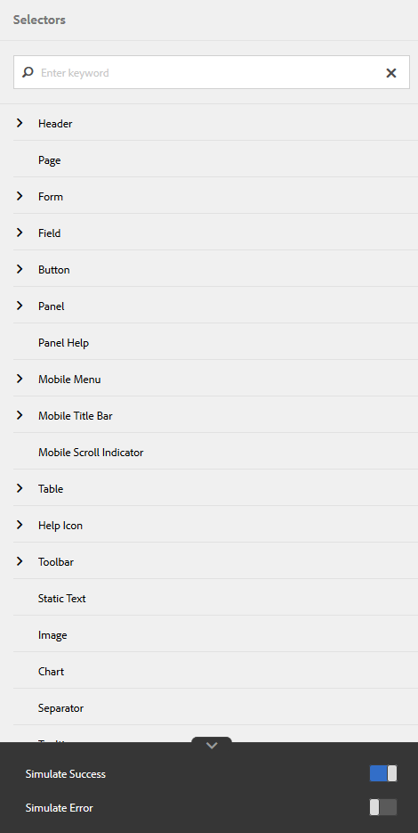
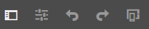
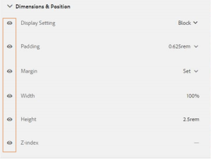

# Creating and using themes {#creating-and-using-themes}

 Adobe recommends using the modern and extensible data capture [Core Components](https://experienceleague.adobe.com/docs/experience-manager-core-components/using/adaptive-forms/introduction.html) for [creating new Adaptive Forms](/help/forms/using/create-an-adaptive-form-core-components.md) or [adding Adaptive Forms to AEM Sites pages](/help/forms/using/create-or-add-an-adaptive-form-to-aem-sites-page.md). These components represent a significant advancement in Adaptive Forms creation, ensuring impressive user experiences. This article describes older approach to author Adaptive Forms using foundation components. 

| Version | Article link |
| -------- | ---------------------------- |
| AEM as a Cloud Service |    [Click here](https://experienceleague.adobe.com/docs/experience-manager-cloud-service/content/forms/adaptive-forms-authoring/authoring-adaptive-forms-foundation-components/create-an-adaptive-form-on-forms-cs/themes.html)                  |
| AEM 6.5     | This article         |

## Introduction {#introduction}

You can create and apply themes to stylize an adaptive form or an interactive communication. A theme contains styling details for the components and panels. Styles include properties such as background colors, state colors, transparency, alignment, and size. When you apply a theme the specified style reflects on the corresponding components. Theme are managed independently without a reference to an adaptive form or intreactive comunication.

You can:

* Create a theme
* Edit and copy an existing theme
* Download and upload an existing theme to AEM Forms server
* Manage dependencies for a theme

## Creating, downloading, or uploading a theme {#creating-downloading-or-uploading-a-theme}

With AEM Forms, you can create, download, or upload themes. A theme is created like other assets such as forms, documents, and letters. The theme is saved as a separate entity, complete with meta-properties like forms. Themes being a separate entity allows reuse in multiple adaptive forms and intreactive communications. You can also move a theme to a different instance of AEM Forms and reuse it.

### Creating a theme {#creating-a-theme}

Perform the following steps to create a theme:

1. Click **Adobe Experience Manager**, click **Forms**, and then click **Themes**.

1. In the Themes page, click **Create &gt; Theme**.
   A wizard to create a theme is launched.

1. In the Basic tab of the Create Theme wizard, provide **Title** and **Name** of the theme. These are mandatory fields.

1. In the Advanced tab, you get two fields:

    * **Clientlib Location**: Location in the repository which stores the clientlibs for the theme.

    * **Clientlib Category**: Provides a text field to enter clientlib category name for the theme.

1. Click **Create** and then click **Edit** to open the theme in Theme Editor, or click **Done** to return to the themes page.

### Downloading a theme {#downloading-a-theme}

You can export themes as a zip file and use these in other projects or AEM instances. To download a theme:

1. Click **Adobe Experience Manager**, click **Forms**, and then click **Themes**.

1. In the Themes page, **Select** a theme, and click **Download**. A dialog box with the details of the theme is displayed.

1. Click **Download**. The theme is downloaded as a zip file.

>[!NOTE]
>
>If you download a theme that has an adaptive form associated to it and the associated adaptive form is based on a custom template, then also download the custom template. When you upload the downloaded theme and adaptive form to an AEM Forms server, then upload the related custom template also.

### Uploading a theme {#uploading-a-theme}

You can use created themes with styling presets on your project. You can import theme packages that others create by uploading them on your project.

To upload a theme:

1. Click **Adobe Experience Manager**, click **Forms**, and then click **Themes**.

1. In the Themes page, click **Create &gt; File Upload**.
1. In the File Upload prompt, browse and select a theme package on your computer and click **Upload**.
   The uploaded theme is available in the themes page.

## Metadata of a theme {#metadata-of-a-theme}

List of meta-properties of a theme (found in properties page of a theme).

<table>
 <tbody>
  <tr>
   <th>
<strong>ID</strong>
 
 
 </th>
   <th><strong>Name</strong></th>
   <th><strong>Can be edited</strong></th>
   <th><strong>Property Description</strong></th>
  </tr>
  <tr>
   <td>1.</td>
   <td>Title</td>
   <td>Yes</td>
   <td>Display name of the theme.</td>
  </tr>
  <tr>
   <td>2.</td>
   <td>Description</td>
   <td>Yes</td>
   <td>Description about the theme.</td>
  </tr>
  <tr>
   <td>3.</td>
   <td>Type</td>
   <td>No</td>
   <td>
    <ul>
     <li>Type of asset.</li>
     <li>Value is always Theme.</li>
    </ul> </td>
  </tr>
  <tr>
   <td>4.</td>
   <td>Created</td>
   <td>No</td>
   <td>Date of the theme creation</td>
  </tr>
  <tr>
   <td>5.</td>
   <td>Author Name</td>
   <td>Yes</td>
   <td>Author of the theme. Computed at the time of theme creation.</td>
  </tr>
  <tr>
   <td>6.</td>
   <td>Last Modification Date</td>
   <td>No</td>
   <td>Date when the theme is last modified.</td>
  </tr>
  <tr>
   <td>7.</td>
   <td>Status</td>
   <td>No</td>
   <td>Status of the theme (Modified/Published).</td>
  </tr>
  <tr>
   <td>8.</td>
   <td>Publish On Time</td>
   <td>Yes</td>
   <td>Time to automatically publish the theme.</td>
  </tr>
  <tr>
   <td>9.</td>
   <td>Publish Off Time</td>
   <td>Yes</td>
   <td>Time to automatically unpublish the theme.</td>
  </tr>
  <tr>
   <td>10.</td>
   <td>Tags</td>
   <td>Yes</td>
   <td>A label attached to the theme for identification used to improve searching.</td>
  </tr>
  <tr>
   <td>11.</td>
   <td>References</td>
   <td>Links</td>
   <td>
    <ul>
     <li>Contains 'Referred by' section. Lists forms that use the theme.</li>
     <li>Because the theme does not refer to any other asset, there is no 'Refers' section.</li>
    </ul> </td>
  </tr>
  <tr>
   <td>12.</td>
   <td>Clientlib Location</td>
   <td>Yes</td>
   <td>
    <ul>
     <li>The user-defined repository path within '/etc' where the clientlibs corresponding to this theme are stored.</li>
     <li>Default value - '/etc/clientlibs/fd/themes' + relative path of theme asset.</li>
     <li>If the location does not exist, the folder hierarchy is auto-generated.</li>
     <li>When this value is changed, the clientlib node structure is moved to the new location entered.  <em><strong>Note:</strong> If you change default clientlib location, in the CRXDE repository assign <code>crx:replicate</code>, <code>rep:write</code>, <code>rep:glob:*</code>, <code>rep:itemNames::</code> <code>js.txt</code>, <code>jcr:read</code> to <code>forms-users</code> and <code>crx:replicate</code>, <code>jcr:read</code> to <code>fd-service</code> in the new location. Also attach another ACL by adding <code>deny jcr:addChildNodes</code> for <code>forms-user</code></em></li>
    </ul> </td>
  </tr>
  <tr>
   <td>13.</td>
   <td>Clientlib Category Name</td>
   <td>Yes</td>
   <td>
    <ul>
     <li>The user-defined clientlib category name for this theme.</li>
     <li>An error is displayed if the name is already in use by some other existing theme.</li>
     <li>Default value - computed using theme location.</li>
     <li>When this value is changed, the category name is updated on the corresponding clientlib node. Updating Clientlib Category Name in the jsp files is not required because clientlib category name is used by reference.</li>
    </ul> </td>
  </tr>
 </tbody>
</table>

## About the Theme Editor {#about-the-theme-editor}

AEM Forms ships with Theme Editor. It is a business-user and web-designer/developer friendly interface that provides functionalities required to specify the styling of various adaptive form and interactive communication elements easily. When you create a theme, it is stored as a separate entity like forms, interactive communications, letters, document fragments, and data dictionaries.

The Theme Editor lets you customize styles of the components styled in a theme. You can customize how a form or intreactive communication looks on a device.

The Theme Editor is divided in two panels:

* **Canvas** - Appears on the right side. It shows a sample adaptive form or interactive communication in which all styling changes reflect instantly. You can also select objects directly from the canvas to look up styles associated with them, and to edit these styles. A device resolution ruler on the top governs the Canvas. Selecting a resolution breakpoint from the ruler shows the preview of the sample form or interactive communication for the respective resolution. Canvas is discussed in detail [below](../../forms/using/themes.md#using-canvas).

* **Sidebar**- Appears on the left side. It has the following items:

    * **Selector:** Shows the component selected for styling, and its properties that you can style. The selector represents all the components of a type. If you select a text box component in a theme for styling, all the text boxes in your form or interactive communication inherit the style. Selectors let you select a generic component or a specific component for styling. For example, a field component is a generic component, and a text box is a specific component.

      **Styling generic component:**
      A field can be a numeric box field, such as age, or a text box field, such as address.
      When you style a field, all the fields such as age, name, address are styled.

      **Styling specific component**:
      A specific component impacts objects of the specific category. When you style the numeric box component in the theme, only the numeric box object in inherit the style.

      For example, a text box field such as address is longer in length and a numeric box field such as age is shorter in length. You can select a numeric box field, reduce its length and apply to your form. Width of all numeric box fields is reduced in your form.

      When you customize all the field components with a specific background color, all the fields such as age, name, and address inherit the background color. When you select a numeric box, such as age, and reduce its width, width of all the numeric boxes such as age, number of people in a family is reduced. Width of text boxes is not changed.

    * **State:** Lets you customize styles of an object in a specific state. For example, you can specify how an object looks when it is in default, focus, disabled, hover, or error state.
    * **Property Categories:** Styling properties are divided in various categories. For example, Dimension & Position, Text, Background, Border, and Effects. Under each category, you provide styling information. For example, under Background, you can provide Background Color, and Image & Gradient.

    * **Advanced:** Lets you add custom CSS to an object, which overrides the properties visual controls define if there is an overlap.

    * **View CSS**: Lets you view CSS of the selected component

  Also, in the Sidebar, at the bottom an arrow is present. When you click the arrow, you get two more options: **Simulate Success** and **Simulate Error.** These options, along with the options described above are discussed in detail [below](../../forms/using/themes.md#using-rail).

 **A.** Sidebar **B.** Canvas

### Styling components {#styling-components}

You can use a theme in multiple adaptive forms and interactive communications, which imports the component formatting that you have specified in the theme. You can style various components such as titles, description, panels, fields, icons, and text boxes. Use widgets to configure component properties in a theme. Prior knowledge of CSS or LESS is not required but desired, though the CSS Overrides section lets you write CSS code or provide custom selectors. The CSS Overrides section appears when you select a component in the sidebar.

Options in sidebar that let you select and style different components.

Clicking edit button against a component in the sidebar selects the component in Canvas, and lets you style the component using options in the sidebar.

Certain components like text box, numeric box, radio button, and check box are categorized under generic components like Field. For example, you want to customize styling of radio buttons. To select radio buttons for styling, select **Field &gt; Widget &gt; Radio Button**.

Click **EXPAND ALL** in the sidebar to view, select, and style categorized components that are not visible upfront.

### Styling panel layouts {#styling-panel-layouts-br}

Themes in AEM Forms support styling of elements in the layout of panels in your forms and interactive communications. Styling of elements in out-of-the-box layouts and custom layouts is supported.

Out-of-the-box panels include:

* Tabs on left
* Tabs on top
* Accordion
* Responsive
* Wizard
* Mobile layout

    * Panel titles in header
    * Without panel titles in header

Selectors vary for each layout.
Styling custom layouts from the Theme Editor involves:

* Defining the components for a layout that can be styled, and CSS selectors for uniquely identifying these components
* Defining the CSS properties that can be applied on these components
* Define the styling for these components interactively from the user interface

### Different styles for different screen sizes {#different-styles-for-different-screen-sizes-br}

Desktop and mobile layouts can have slightly or entirely different styles. For mobile devices, tablet and phone share similar layouts except for component sizes.

Use Theme Editor breakpoints to define alternate styling for different screen sizes. You can select a base device or resolution on which you start building the theme, and the styling variations for other resolutions are automatically generated. You can explicitly modify the styling for all the resolutions.

>[!NOTE]
>
>The theme is first created using a form or interactive communication, and then applied on different forms or interactive communications. The breakpoints used in theme creation can be different from the form or interactive communication on which the theme is applied. The CSS media queries are based on the form or interactive communication used in theme creation, and not the form or interactive communication on which the theme is applied.

### Styling properties context changes in sidebar on selecting objects {#styling-properties-context-changes-in-sidebar-on-selecting-objects}

When you select a component in the Canvas, its styling properties are listed in the sidebar. Select the object type and its state, and then provide its styling.

### Recently used styles in Theme Editor {#recently-used-styles-in-theme-editor}

Theme editor caches upto 10 styles applied to a component. You can use the cached styles with other component of a theme. Recently used styles are available right below the selected component in sidebar as a list box. Initially, the recently-used styles list is empty.

As you style a component, the styles are cached and listed in the list box. In this example, the label of the text box is styled to change the font size and color. You can follow similar steps for choosing an image or changing colors to style a component. Observe how the style is cached and listed in the list box when the field label styling is changed.

In this example, style for the field label is changed, and when Responsive Panel Description is selected for style, a list entry is added in the asset library. The entry in the asset library can be used to change the style for Responsive Panel Description.

When a style is added in the asset library, it is available for other themes and in the [style mode](../../forms/using/inline-style-adaptive-forms.md) of the form editor or interactive communication editor UI. Similarly, when you use the style mode of the form editor or interactive communication editor UI to style a component, the style is cached and is available in themes.

The plus button against the asset library lets you permanently save the style with a name of that you provide. The plus button saves the style even if you do not click the Save button in the sidebar to apply the style to a component. The plus button to save a style for later use is not available in the style mode.

When you provide a custom name for a style, the style is tied to a theme and is no longer available to other themes. To delete a saved style:

1. On the CANVAS toolbar, click **Theme Options**  &gt; **Manage Styles**.
1. In the Manage Styles dialog, select a saved style, click **Delete**.

   

### Live preview, save, and discard changes {#live-preview-save-and-discard-changes}

Modifications made in the styling are instantly reflected in the form or interactive communication loaded in the Canvas. Live preview lets you interactively define and see the impact of the styling. When you change the styling of a component, the **Done** button is enabled in the sidebar. To retain changes, use the **Done** button.

>[!NOTE]
>
>When an invalid character is entered in a field, the field boundary color changes to red and an error message is displayed at the top-left corner of the screen. For example, if you enter alphabets in a textbox which accepts numeric characters as inputs, the input box boundary color changed to red. You cannot save such a theme without resolving the error displayed on the top.

### Theme with another adaptive form or interactive communication {#theme-with-another-adaptive-form-or-interactive-communication}

When you create a theme, it is created with a form that is shipped with the Theme Editor. You provide styling for components in this form. Instead of the form that is shipped with the Theme Editor, you can select a form or interactive communication of your choice to provide styling and preview its results.

To replace the current form or interactive communication in Theme Editor Canvas:

1. In the THEME EDITOR panel, click **Theme Options**  &gt; **Configure**.

1. In the General tab, browse and select a form or interactive communication for the **Adaptive Form/Document** field.

### Redo/Undo {#redo-undo}

You can undo or redo the undesired changes that occur accidentally. Use the redo/undo buttons in the Canvas.

Undo/redo buttons in Canvas

Redo/undo buttons appear when you style a component in the Theme Editor.

## Using the Theme Editor {#using-the-theme-editor}

The Theme Editor lets you edit a theme you created or uploaded. Navigate to **Forms & Documents &gt; Themes**, and select a theme and open it. The theme opens in the Theme Editor.

As discussed above, the Theme Editor has two panels: Sidebar and Canvas.

Customizing the success state styling of Text Box Widget component in Theme Editor. Component is selected in Canvas, and its state is selected in the sidebar. Styling options available in the sidebar are used to customize the look of a component.

### Using Canvas {#using-canvas}

The theme is either created using the out-of-the-box form, or using a form or interactive communication of your choice. The Canvas shows the preview of the form or interactive communication used for creating the theme with customizations specified in theme. The ruler above the form is used for determining the layout according to the size of the display of your device.

In the Canvas toolbar, you see:

* **Toggle Side Panel** : Lets you show or hide sidebar.
* **Theme Options** : Provides three options

    * Configure: Provides options to select the preview form or interactive communication, base clientlib, and Adobe Fonts configuration.
    * View Theme CSS: Generates CSS for the selected theme.
    * Manage Styles: Provides options to manage text and image styles
    * Help: Runs an image guided tour of the Theme Editor.

* **Emulator** : Emulates the look of your theme for different display sizes. A display size is treated as a breakpoint in the emulator. You can select a breakpoint and specify a style for it. For example, Desktop and Tablet are two breakpoints. You can specify different styles for each breakpoint.

When you select a component in the Canvas, you see the component toolbar on top of it. The component toolbar lets you select components, or switch to generic components. For example, you select a numeric text box in a panel. You see the following options in the component toolbar:

* **Numeric Box Widget**: Lets you select the component to customize its look in sidebar.
* **Field Widget**: Lets you select the generic component for styling. In this example, all text input components (text box/numeric box/numeric stepper/date input) are selected for styling.

* : Lets you switch to generic component for styling. If you select numeric box and select this icon, field component is selected. If you select field component and select this icon, panel is selected. If you keep tapping this icon for selection, you end up selecting the layout for styling.

>[!NOTE]
>
>The options available in the component toolbar vary based on the component you select.

Component toolbar on the numeric box in Canvas

### Using Sidebar {#using-rail}

The sidebar in theme editor provides options to customize styles for components in a theme, and use selectors. Selectors let you select a group of components or individual components, and you can search for selectors in the sidebar. You can write selectors for custom components.

When you select a component from the Canvas or selectors in sidebar, the sidebar shows all the options that let you customize styles for it.
Below are the options you see in the sidebar when you select a component:

* State
* Property sheet
* Simulate Error/Success

#### State {#state}

A state is an indicator of user interaction with a component. For example, when a user enters erroneus data in a text box, the state of the text box changes to an error state. Theme editor lets you specify styling for a particular state.

Options for customizing state styles vary for different components.

#### Property sheet {#property-sheet}

<table>
 <tbody>
  <tr>
   <td><strong>Property</strong></td>
   <td><strong>Use</strong></td>
  </tr>
  <tr>
   <td>
Dimensions &amp; Position
 </td>
   <td>
Lets you style alignment, size, positioning, and placing of components in the theme. 
 
Your options are display setting, padding, margin, width, height, and Z index.
 
You can also use the Layout mode to define the width of components using an easy drag-and-drop interface. For more information, see <a href="../../forms/using/resize-using-layout-mode.md">Use Layout mode to resize components</a>.
 </td>
  </tr>
  <tr>
   <td>
Text
 </td>
   <td>
Lets you customize the text styles in the component of the theme.
 
For example, you want to change how the text entered in the text box looks.
 
Your options are font family, weight, color, size, line height, text align, letterspacing, text indent, underline, italics, text transform, vertical align, baseline, and direction. 
 </td>
  </tr>
  <tr>
   <td>
Background 
 </td>
   <td>
Lets you fill the background of the component with an image or a color. 
 </td>
  </tr>
  <tr>
   <td>
Border
 </td>
   <td>
Lets you choose how the border your component looks. For example, you want the text box to have a deep red, thick border with a dotted line. 
 
Your options are width, style, radius, and color of the border.
 </td>
  </tr>
  <tr>
   <td>
Effects
 </td>
   <td>
Lets you add special effects to the components such as opacity, blend mode, and shadows. 
 </td>
  </tr>
  <tr>
   <td>
Advanced
 </td>
   <td>
Lets you add:

    <ul>
     <li>Properties for <code>::before</code> and <code>::after</code> pseudo elements to add content after or before default content in the selector, and style it.  See <a href="https://www.w3schools.com/css/css_pseudo_elements.asp" target="_blank">CSS Pseudo-elements</a>.</li>
     <li>Custom CSS code inline to a component and write custom selectors. </li>
    </ul> 
When you add a custom CSS code, it overrides the customization you added using the options in the sidebar. 
 </td>
  </tr>
 </tbody>
</table>

#### Simulate Error/Success {#simulate-error-success}

Simulate Error and Success options are available at the bottom of the sidebar. You can see them using a show/hide arrow visible at the bottom of the sidebar. Using Theme Editor, you can style various states of a component.

For example, you add a numeric field in your form, and you specify its styling in theme editor. When a user types an alphanumeric value in the field, you want the background color of the text box to change. You select the numeric field in the theme, and use the state option in the sidebar. You select the Error state in the sidebar, and change the background color to red. To preview the behavior, you can use the Simulate Error option available in the sidebar. Simulate Error and Success options are described in detail below:

* **Simulate Success**:
  Lets you see how a component looks if you specify its styling for success state. For example, in a form, customers set password. Users can set password according to guidelines you provide. When a user types a password following all the guidelines you provide, the text box turns green. When the text box turns green, it is in success state. You can specify styling for a component in success state, and simulate its appearance using the Simulate Success option.

* **Simulate Error**:
  Lets you see how a component looks if you specify its styling for error state. For example, in a form, customers set password. Users can set password according to guidelines you provide. When a user types a password which does not follow all the guidelines you provide, the text box turns red. When the text box turns red, it is in error state. You can specify styling for a component in error state, and simulate its appearance using the Simulate Error option.

### Styling a component {#styling-a-component}

For example, in your form, you have two types of text boxes: one that accepts numeric values only, and other that accepts alphanumeric values. You can customize styling for the text box that accepts numeric values only (a numeric box).

Perform the following steps to customize styling for a particular component (a numeric box in this example):

1. In the Theme Editor, select the numeric box in the Canvas.
1. When you select the numeric box, you can see the component toolbar with three options:

    * **Numeric Box Widget**
    * **Field Widget** 

1. Select **Numeric Box Widget**.
1. Sidebar title changes to Numeric Box Widget, and shows options to customize its look.
   Use **Dimension & Position** option in the sidebar to customize size of the component. Ensure that the State is **Default**.

Instead of selecting **Numeric Box Widget**, select **Field Widget** in the component toolbar, and perform the steps above. When you select dimensions for **Field Widget** option, all the text boxes except the numeric box have the same size.

### Styling fields for a given state {#styling-fields-given-state}

With component toolbar, you can also specify styling of components for its different states. For example, if a component is disabled, then it is in a disabled state. Commonly used states of a component that you can style in theme editor are: Default, Focus, Disabled, Error, Success, and Hover. You can select a component in the Canvas and use the State option in sidebar to customize its look.

Perform the following steps to customize styling for a component in a specific state:

1. Select a component in the Canvas, and select appropriate option from the component toolbar.
   Sidebar shows options to customize styling for the component.
1. Select a state in the sidebar. For example, Error state.
1. Use options such as **Border, Background** in the sidebar to customize how the component looks.
1. Use the **Simulate Error** option at the bottom of the sidebar to see how the styling looks in editing.

When you customize the styling of a component after specifying its state, the customization appears for the component only for the specified state. For example, if you customize styling for the component when hover state is selected. The customization appears for the component when you move your pointer over the component in the rendered form or interactive communication to which you apply the theme.

To simulate behavior of states other than error and success, use Preview mode. To use Preview mode, click **Preview** in the page toolbar.

### Styling layouts for smaller displays {#styling-layouts-for-smaller-displays}

Use ruler in Canvas to select breakpoints for devices with smaller displays. Click emulator  in Canvas to view ruler and breakpoints. The breakpoints let you preview a form or interactive communication for display sizes pertaining to different devices such as phones and tablets. Multiple display sizes are supported in Theme Editor.

To style components for different breakpoints:

1. In the Canvas, select a breakpoint above the ruler.
   A breakpoint represents a mobile device and its display size.
1. Use sidebar to customize styling of form or interactive communication components in the theme for the selected display size.
1. Ensure that the customization is saved.

You can style form or interactive communication components for multiple devices. Form and interactive communication components for desktops and mobile devices can have entirely different styles.

### Using web fonts in a theme {#using-web-fonts-in-a-theme}

You can now use fonts available in a web-service in an adaptive form or interactive communication. Out-of-the-box, [Adobe Fonts](https://fonts.adobe.com/), Adobe's web font service, is available as a configuration. To use Adobe Fonts, create a kit, add fonts in it, and obtain the Kit ID from [Adobe Fonts](https://fonts.adobe.com/).

Perform the following steps to configure Adobe Fonts in AEM:

1. In the author instance, click Adobe Experience Manager &gt; Tools  &gt; Deployment &gt; Cloud Services.
1. On the **Cloud Services** page, navigate to  and open the **Adobe Fonts** option. Open the configuration folder, and click **Create**. 
1. On the **Create Configuration** dialog, specify a title for the configuration and click **Create**.

   You are redirected to the configuration page.

1. In the Edit Component dialog that appears, provide your Kit ID and click **OK**.

Perform the following steps to configure a theme to use the Adobe Fonts configuration:

1. On the author instance, open a theme in the theme editor.
1. In the theme editor, navigate to **Theme Options**  &gt; **Configure**.
1. In **Adobe Fonts Configuration** field, select a kit, and click **Save**.

   Now, you can see the fonts are added in the font-family property of the theme.

### Listing and selecting fonts in theme editor {#listing-and-selecting-fonts-in-theme-editor}

You can use the theme configuration service to add more fonts to the theme editor. Perform the following steps to add fonts:

1. Log in to AEM Web Console with administrative privileges. URL for the AEM Web Console is `https://'[server]:[port]'/system/console/configMgr`.
1. Open **Adaptive Form Theme Configuration Service**.

   

1. Click +, specify the name of the font, and click **Save**. The font is added and available in theme editor.

#### Selecting fonts in theme editor {#selecting-fonts-in-theme-editor}

You can use the + button to add a font. When you add a font, it gets listed in the sidebar.

In addition to the theme configuration option, you can also add your font from the theme editor itself. Type the font you want to use in the font family field under sidebar and press the return key on your keyboard.

When you select a font, it is added under the font family list. You can use the Mask option in theme editor to disable or enable the listed fonts.

You can see the component font change.

The Font Family field supports multiple fonts. When you type a font, browser looks for it and applies it to the selected component. If the browser cannot find a font, it looks for a font that is next to it in the family. You can start with typing the specific font you are looking for. If you do not find the font you want to use, you can type a generic font in the family and use it.

#### Mask styles applied in theme editor {#mask-styles-applied-in-theme-editor}

You can mask styles applied in a theme. In the theme editor sidebar, you can use the icon to disable an applied style. For example, if you change dimensions of a component in a form or interactive communication, then you can use the mask button on the left of a property to disable it. When you save a theme, the selected masking options are retained.

The example below shows masked and unmasked styles in a theme.

## Applying a theme to a form or interactive communication {#applying-a-theme-to-a-form-or-interactive-communication-br}

To apply a theme to an adaptive form:

1. Open your form in edit mode. To open a form in edit mode, select a form and click **Open**.
1. In the edit mode, select a component, then click  &gt; **Adaptive Form Container**, and then click .

   You can edit properties of your form in the sidebar.

1. In the sidebar, click **Styling**.
1. Select your theme from the **Adaptive Form Theme** drop-down and click **Done** .

To apply a theme to an interactive communication:

1. Open your interactive communication in edit mode. To open a interactive communication in edit mode, select a form and click **Open**.
1. In the edit mode, select a component, then click  &gt;**Document Container**, and then click .

   You can edit properties of your form in the sidebar.

1. In the sidebar, under **Basic**, select your theme from the **Theme** drop-down and click **Done** 

### Change theme of a form at runtime {#change-theme-of-a-form-at-runtime}

A theme styles different components of a form. You can use the `themeOverride` property to dynamically change theme of a form. A typical URL of a form is:

`https://<server>:<port>/content/forms/af/test.html`

You can use the themeOverride parameter to apply a theme on the runtime.

`https://<server>:<port>/content/forms/af/test.html?themeOverride=/content/dam/formsanddocuments-themes/simpleEnrollmentTheme`

The `themeOverride` option lets you provide a path to a theme. It changes the theme of the form and refreshes the form with updated styles.

## Getting specific appearance using Themes {#specific-af-appearance}

With AEM Forms, along with default out-of-the-box canvas theme, there are many other themes. If you want to design your form or interactive communication using other themes, along with additional changes, copy the theme from Theme Library folder. Paste the copied themes outside the Theme Library folder, and edit the copied theme according to the changes you want.

To copy a theme, perform the following steps:

1. In authoring instance, navigate to **Adobe Experience Manager &gt; Forms &gt; Themes**.
1. Open the Theme Library folder.
1. In the Theme Library folder, hover pointer over the corresponding out-of-the-box theme and select **Copy**.
1. Paste the copied theme outside the Theme Library folder.
1. Customize the copied theme.

After you customize the theme, apply it to your form or interactive communication.

>[!NOTE]
>
>Do not modify the themes available in the Theme Library folder. This folder contains system themes. Any change you made to these themes are overwritten on installing a newer version or hot fix of AEM Forms.

## Impact on other adaptive form use cases {#impact-on-other-adaptive-form-use-cases}

* **Publish/unpublish a form:** On publishing a form, theme applied to is also published (if it is not already published)
* **Import/Export a form:** On importing or exporting a form, its associated theme is also automatically imported or exported.
* **References of a form:** The Refers section in form references contains an extra entry for the theme.
* **Last Modification time of a form:** Updated when the associated theme is changed.
* **A/B Testing:** You can apply a different theme to two versions of the form in A/B testing. The information of the two themes is individually stored on the two guide containers.

## CSS generation sequence {#css-generation-sequence}

When you select view CSS, Theme Editor collects all the styling information, and builds a CSS. It collects information in the following order:

1. Styling defined in the theme's base client library.
1. User defined styling, specified using the properties in the sidebar.
1. CSS style provided using CSS Override option.

For example, background color of a textbox is blue in the base client library. You change it to pink using the properties in the sidebar. When you generate CSS, you see background color of the text box as pink. After changing the background color using the properties, another author uses CSS override option to change the background color text box as white. When you generate CSS, you see background color as white in the generated CSS.

## Debugging styles {#debugging-styles}

When you specify styles for components in Theme Editor, a CSS is generated. When you style a generic component, multiple components included in it are also styled. For example, when you style a field, the tex box and label in it are also styled. When you style the text box within the field, it gets its own CSS. If you want to debug the CSS generated for the field and the component, Theme Editor provides options that let you view CSS.

You can see the generated CSS using the following options:

* **View CSS** option in the sidebar: When you select a component in the Theme, you can see the VIEW CSS option in the sidebar. It shows the generated CSS, including CSS for `::before` and `::after` pseudo elements.
* **View Theme CSS** option in the canvas toolbar: In the Canvas Toolbar, click  &gt; **View Theme CSS**. You can see the entire theme CSS generated from the properties you define in the Theme Editor.

## Troubleshooting, recommendations, and best practices {#troubleshooting-recommendations-and-best-practices}

* **Avoiding assets from another Theme**

  When you edit a theme, you can browse and add assets (such as images) from other themes. For example, you are editing the background of a page. For example, when you select **Page** &gt; **Background** &gt; **Add** &gt; **Image**, you see a dialog that lets you browse and add images in other theme.

* You can face issues with your current theme if an asset is added from another theme, and the other theme is moved or deleted. It is recommended that you avoid browsing and adding assets from other themes.
* **Using base clientlib, theme editor, and inline styling**

    * **Base clientlib**:

      Base client library contains styling information. To use styling information in client-side libraries in themes.

        1. Navigate to **Experience Manager &gt; Forms &gt; Themes**.
        1. In the Themes page, select a theme and click **View Properties**.
        1. In the Properties page that opens, click **Advanced**.
        1. In the Advanced tab, in the Clientlib Location field, browse and select the client-library you want to use.
        1. Click **Save**.

      The styling you specify in client library is imported in the theme that uses it. For example, you specify styling for text box, numeric box, and switch in the client library. When you import your client library in the theme, styling for text box, numeric box, and switch is imported. You can then style other components using theme editor.
      You can also create a theme, create copies of it, and then modify the styling provided in the copied themes for similar use-cases.
      See [Getting specific appearance using Themes](#specific-af-appearance)

    * **Theme Editor:**

      The Theme Editor lets you create themes to style your form or interactive communication. You can specify styling of components in a theme, that enable consistency in look and feel among multiple forms or interactive communications you develop. Specifying styling information in a theme, and then applying the theme to a form is recommended.

    * **Inline styling:**

      You can style components using the Style mode in form or interactive communication multichannel editor when you work with a form. Using style mode to change form component styling overrides the styling specified in the theme. If you want to change styling for certain components of a particular form, see [Inline styling of components](../../forms/using/inline-style-adaptive-forms.md).

* **Using client-side libraries**

  If you want to create client libraries to import styling information, see [Using Client Side Libraries](/help/sites-developing/clientlibs.md). After you create a client library, you can import it in your theme using the steps mentioned above.

* **Changing container panel layout width**

  Changing container panel layout width is not recommended. When you specify width of a container panel, it becomes static and does not adapt to different displays.

* **When to use form editor or theme editor for working with header and footer**

  Use theme editor if you want to style header and footer using styling options such as font style, background, and transparency.
  If you want to provide information such as a logo image, company name in header, and copyright information in the footer, use the form editor options.
