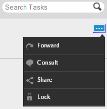
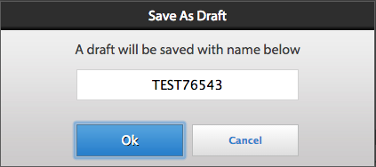
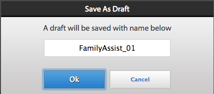
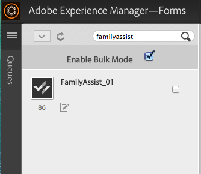
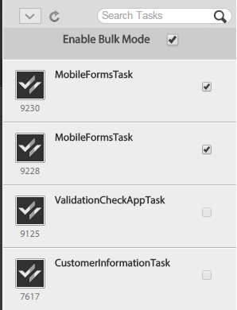
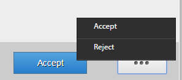

# Working with To-do lists{#working-with-to-do-lists}

When you view your To-do lists, you may see tasks from a business process that are assigned to you, or to any groups that you belong to, or are the shared tasks of other users. You can open, work on, and complete the tasks as required, such as approving or rejecting a request or adding more information. After you complete a task, it is sent to the next person in the business process,

## About To-do lists {#about-todo-lists}

AEM Forms workspace has the following three types of To-do lists:

* Individual lists, which contain tasks that are assigned directly to you.
* Group lists, which contain tasks that are assigned to a group. Any member of the group can open and complete the tasks. To open a task, a member of a group must claim the task first.
* Shared lists, which contain tasks that are assigned to a user who has shared their To-do list with you and possibly other users. Any of the users sharing a list can claim, open, and complete shared tasks.

You can perform some actions without opening the task by clicking the icons that appear when you hover the pointer over a task.

>[!NOTE]
>
>An exclamation icon indicates that the task is of high priority.

## Typical tasks {#typical-tasks}

When opening and working on a task, the tools that are available to you depend on the task. Different tasks require you to perform different actions and, for this reason, some tools may or may not be available to you. The typical tasks that you may receive are described below.

* **Provide information**: You receive a task that requires you to complete and submit a form.

* **Review information**: You receive a task that requires you to review the information and sign off on the content.

* **Multiuser review**: You receive a task at the same time other users receive the task. You and the other users must either provide information or review the content, or both. The following tools may be available with this type of task:

   * Viewing the instructions for the task
   * Viewing the completion status of all users who are assigned the task
   * Viewing the comments of all users who are assigned the task
   * Adding comments to the task yourself

Additional tools that may be available with any of the above tasks include the following:

* Forward
* Share
* Consult
* Return
* Notes
* Attachments

## Opening tasks {#opening-tasks}

You can open and lock tasks from your To-do list or claim and open tasks from a group or shared To-do list. When you open a task, it is displayed in the main pane. The other tasks are displayed in the task list next to the To-do list.

If a Task Summary URL exists, the Task Summary view opens by default, instead of the form associated with a task. Even when a user enables ‘Open the form in maximized mode' option in Assign Task, the form does not open in maximized mode.

>[!NOTE]
>
>When you open a task, depending on the task defaults, the associated form may display in full view.

### Open and lock a task from your list {#open-and-lock-a-task-from-your-list}

When you open a task from your To-do list, if your list is shared, you can lock the task to prevent another user who has access to your list from working on the task.

1. On the To-do page, in the left pane, select your individual To-do list. All your tasks are displayed in the middle pane.

   >[!NOTE]
   >
   >You can filter the tasks by selecting the process type within the To-do list. You can select your To-do list, to view all the tasks in the To-do list again.

1. If necessary, lock your task. To lock a task, click All Options icon on the task and select Lock. Hover the pointer on the task for the option to be available.

   >[!NOTE]
   >
   >You can also lock or unlock a task on any tab when the task is open.

   

   All Options menu on a task

1. Open the task by clicking it.

### Open and claim a task from a shared or group list {#open-and-claim-a-task-from-a-shared-or-group-list}

When you open and claim a task from a group or shared list, the task is moved from the group or shared list into your individual To-do list. Other users with access to the list are prevented from working on the task.

1. On the To-do page, in the left pane, select a group or shared To-do list. All the tasks are displayed in the middle pane.
1. Perform one of these steps:

    * To claim a task, without opening it, from a group or shared To-do list, click  **Claim** by hovering the pointer over the task. Alternatively, when task is open, the Claim button is available in the action bar below the task pane. Upon claiming, a task moves from the group or shared To-do list to your list.
    * To claim and open a task from a group or shared To-do list, click **Claim and open**.

## Working with tasks {#working-with-tasks}

After opening a task, the tabs that are displayed in the main pane and the tools that are available to you depend on the task. The tabs that you may see are described below:

* **Task Summary**: When a task opens, the Task Summary pane lets you show information about the task, if it exists, using a URL specified in the process at Assign Task step. Using Task Summary Pane additional and relevant information for a task can be displayed to add more value for the end-user of AEM Forms workspace. This tab is not available, if the Task Summary URL does not exist.

* **Details**: Provides some information about the current task and process that it belongs to.

* **Form**: Displays the form that is associated with the task. The form can be of many file types, including PDF, HTML, Guide, and SWF file. The form can look like a regular printable or web-based form or guide you through a series of wizard-style panels to gather information.

* **History**: Lists the tasks that are part of the process instance and the associated form, task assignments, and attachments for each task.

* **Attachments**: Displays existing attachments that are associated with the task and add attachments, if necessary.

* **Notes**: Displays the existing notes associated with the task and add notes, if necessary.

When working on a task, the tools you may see and actions you can take are described below.

### Forward, share, or consult a task {#forward-share-or-consult-on-a-task}

You can forward a task along with any notes or attachments to another user or share the task or consult the task with another user. If you change the form data that is associated with a task, save the form as a draft before you forward, share, or consult the task. Otherwise, the task is sent without the updated form. After you forward and share a task, the user who receives the task can claim and complete it or return it to you. If you consult a task, the user can only return the task to you.

1. If you change a form associated with a task that you want to keep, click **Save**. Save option is available in the action bar at the bottom of each tab. Otherwise, the task is sent without the updated form.

   >[!NOTE]
   >
   >The Save button is not available for some forms, depending on the task that you are working on.

1. On any tab, click one of these buttons:

    * **Forward**
    * **Share**
    * **Consult**

   >[!NOTE]
   >
   >Depending on the task, you may also be able to perform these actions from the To-do list without opening the task.

1. On the pop-up dialog window, search and select the name of the user to forward, share, or consult the task with.

### Return a task {#return-a-task}

1. On any tab, click **Return**. The task is returned to the To-do list of the user who previously forwarded the task to you, or shared or consulted the task with you.

### Take a task offline {#take-a-task-offline}

You may be allowed to work on a task offline and later submit its form from Adobe® Reader® or Adobe® Acrobat® Professional or Adobe® Acrobat® Standard. When the form is submitted, your email client is started with the appropriate server email address. You can then email the completed form to the server.

1. On any tab, click **Offline**.
1. Specify a filename to save the form under and click **Save**. The form that is associated with the task is saved locally and the task remains in your To-do list until the form is submitted.

### Work with attachments {#work-with-attachments}

You may be allowed to add, update, delete, or save any attachments locally.

**Add an attachment**

1. In the **Attachments** tab, Click **Browse** to select the file to attach.
1. Select the **Permissions** level for the attachment for other users who participate in the process. If you select **Read**, other users can save the file locally. If you select one of the edit permissions, other users can also upload a new file to replace your attachment.

   >[!NOTE]
   >
   >You can also add comments alongside your attachments.

1. Click **Upload**. The file is attached to the form.

**View an attachment**

1. On the **Attachments** tab, click the filename of the attachment to view.

**Save an attachment locally**

1. Click an attachment to open it. Save the open attachment locally.

**Update an attachment**

1. Click **Edit** for the attachment. Select the file to replace the existing attachment with, by clicking **Browse**.

**Delete an attachment**

1. Click **Delete** for an attachment.

### Save your work without completing the task {#save-your-work-without-completing-the-task}

1. On any tab, select **Save**.

   The Save As Draft dialog appears. The default name of the draft is the task name from the task template.

   

   >[!NOTE]
   >
   >You can configure workspace to periodically auto-save the information entered by a user as a draft. If auto-save is enabled and a user is working on a draft, the draft is saved periodically. If there is auto-save, the default name of the task is automatically taken.
   >
   >
   >For more information, see Save Draft Periodically in [Managing Preferences](/help/forms/using/getting-started-livecycle-html-workspace.md).

1. In the Save As Draft dialog, specify a unique name for the task and select **OK**.

   

   The draft is saved with the specified name. The task remains in your To-do list and any changes you made in the form are saved in the Drafts folder. Further, in your To-do list, you can search for the draft using the draft name to resume working on it.

   

## Completing tasks {#completing-tasks}

How you complete a task depends on the task itself and your role in the process. You may be asked to approve or deny a request, provide content, review and verify information, or indicate that you acted.

You can complete a task in various ways:

* Using the actions available in any of the tabs
* Using the actions built in the form itself
* From your To-do list, without opening the task

>[!NOTE]
>
>This option is available if `isMustOpenToComplete` field is not selected in the `Assign Task` step in Workbench, while designing a process.
  
* By email, if you receive email notifications

When you complete a task, depending on the task, a confirmation dialog box may appear reaffirming your action. For example, you may see a dialog that prompts you to attest to the validity of the information that you provided.

>[!NOTE]
>
>If you changed a task but are not ready to complete it, you can save your work as a draft by clicking Save and return to it later.

### Complete a task {#complete-a-task}

1. Perform one of the following steps:

    * Select the task and click the appropriate button for the next step required in the process at the bottom of the list.
    * If the form has no buttons and the Complete button in AEM Forms workspace is available, click **Complete**.
    * If the form has buttons and the Complete button in AEM Forms workspace is not available, click the appropriate button on the form for the next step required in the process.

   If the form has no buttons and the Complete button in AEM Forms workspace is not available, a message appears, indicating that the form cannot be submitted.

1. If a Confirmation dialog box appears, do one of these actions:

    * Click **OK** if you completed the task and are ready to sign off on it.
    * Click **Cancel** if you want to return to the task and are not ready to sign off on it.

>[!NOTE]
>
>You may see a Submit button inside HTML forms when Process Properties are used in a form. This button is not visible when the same form is rendered as PDF. To complete a task click the Submit button available at the bottom of the AEM Forms workspace, outside the form and not on the Submit button inside the form.

### Bulk approve tasks {#bulk-approve-tasks}

You can submit multiple tasks from your To Do list. Only tasks of the same process, with the same task names, and the same route options can be submitted together.

>[!NOTE]
>
>This option is available if isMustOpenToComplete field is not selected in the Assign Task step in Workbench, while designing a process.

1. On the To-do page, in the left pane, select your individual To-do list. All your tasks are displayed in the middle pane.
1. Select **Enable Bulk Mode**. Check boxes appear in front of the tasks in the list.

   >[!NOTE]
   >
   >This option is not available for tasks for which isMustOpenToComplete field is selected in the Assign Task step in Workbench, while designing a process. Checkboxes of such tasks in the TO-DO list remain disabled always.

1. Select tasks for bulk approval. Multiple tasks of the same process, with the same task names, and the same route options can be selected. Once you select one task for approval, only the tasks with the same process, with the same task names, and the same route options remain enabled. The rest are disabled.

   

1. Click the available Submit option. The selected tasks get submitted.

   

## Participating in tasks through email {#participating-in-tasks-through-email}

You can receive and complete tasks through email. Participating in tasks through emails eliminates having to routinely check your To-do list for new tasks or check the Tracking page for the status of a task.

First, set your AEM Forms workspace preferences to receive email notifications. AEM Forms workspace can send email notifications for tasks in your To-do list or any group To-do lists that you belong to. The administrator determines when email notification messages are sent and who receives them.

The email messages may contain a link that opens the task in AEM Forms workspace, an attachment of the form that is used for the task, or actions for completing the task through email. If a form is included in the email message, you can open the form and complete the task if the buttons for completing the task are built in the form. If actions for completing the task are included in the email message, you can complete the task by clicking the actions in the email or by replying to the email with the action typed as the first line in the body of the email.

>[!NOTE]
>
>* To configure the workspace to use the appropriate email templates, see the [AEM Forms JEE Administrator Guide](https://help.adobe.com/en_US/AEMForms/6.1/AdminHelp/).
>
>* If drafts are forwarded after submitting the task in the AEM Forms workspace, email notifications are sent. If drafts are forwarded from the startpoint of the AEM Forms workspace, no email notifications are sent.

When you complete a task through email, the task is removed from your To-do list in AEM Forms workspace.

>[!NOTE]
>
>If user is not logged in AEM Forms workspace in the browser and opens a link to a To-do task, the direct To-do link fails to open up and displays an exception. Log in the AEM Forms workspace before clicking links in the emails.

>[!NOTE]
>
>You cannot forward an email notification to assign a task to someone else. You can only forward tasks to other users from within AEM Forms workspace.

### Receive email notification messages {#receive-email-notification-messages}

1. Click **Preferences**.
1. In the **Notify Task Events via Email** list, select **Yes**.
1. To include the form and data with the email message, in the **Attach Forms in Email** list, select **Yes**.

## Participating in tasks through mobile devices {#participating-in-tasks-through-mobile-devices}

You can use AEM Forms workspace app to participate in tasks from your mobile device. Before installing the application, check with your systems administrator to ensure that your organization supports the use of AEM Forms workspace app.

## About deadlines and reminders {#about-deadlines-and-reminders}

A *deadline* determines the date and time that you must complete a task by. When a deadline passes, the server routes the task to the next step in the process (which can be another user’s To-do list) and then the deadline icon appears on the task. The deadline icon appears regardless of the rules that are associated with the process.

A *reminder* notifies you of a task that requires your attention. Reminders occur at a predetermined time and then at regular intervals until you complete the associated task. When you receive a reminder, the reminder icon appears on the task.

The business process determines the behavior and timing of deadlines and reminders. Not all processes have deadlines and reminders. The administrator specifies whether email notifications are sent for deadlines and reminders. You can set your preferences on whether to receive email notifications.

## Working with tasks from group and shared queues {#working-with-tasks-from-group-and-shared-queues}

All tasks that are assigned to you appear in your To-do list (queue).

Any group and shared To-do lists that you have access to also appear in the left pane on the To-do page. You can complete tasks from any To-do list that you have access to.

A group To-do list may have more than one member. An administrator sets up group To-do lists based on the specific requirements of your organization. Group To-do lists provide a way to distribute work among several people who share similar responsibilities.

For example, each member of your team processes loan application forms. All these tasks are sent to a group To-do list that every member of your group has access to. Each member of your group can access the tasks from that To-do list.

A shared To-do list appears when another user shares their To-do list with you, or explicitly shares a task with you. You can then view the tasks in that user’s To-do list and complete them on that user’s behalf. For example, if you are taking a vacation, you may choose to share your To-do list with a co-worker who completes your tasks while you are away.

>[!NOTE]
>
>You can also specify out-of-office settings to forward tasks to other users while you are away.

To work on a task from a group or shared To-do list, claim the task first. You then become the owner of the task until you complete it or forward it to another user.

### Sharing queues {#sharing-queues}

You can share your To-do list with another user, who can then view the new tasks in your To-do list and act upon them for you. If any tasks exist in your To-do list before you share your To-do list, the other user cannot view them. The user can view and claim only the tasks that arrive in your To-do list after you grant access to your To-do list.

Keep in mind that for a user to see a task in a shared queue, the process designer must enable the Add ACL for Shared Queue option on the Task Access Control List (ACL) tab of the User Service.

>[!NOTE]
>
>If you plan to be away from the office, you can also specify out-of-office settings to forward tasks to other users while you are away instead of sharing your entire To-do list.

**Share your queue**

1. In the **Queues** tab in the **Preferences** tab, click '+' icon for 'Users currently sharing my queue'.
1. Search and select the name of the user.
1. Click **Share** button, to share your Queue with the selected user.
1. Select the name of the user and click **Share**.

   >[!NOTE]
   >
   >You can remove a user from sharing your To-do list by click **X** icon at the end of the row in which the user is listed.

### Accessing other queues {#accessing-other-queues}

You can request access to another user’s To-do list to view and claim any new tasks in the user’s To-do list.

When you request access to another user’s To-do list, the user receives a task in their To-do list to either approve or deny your request. After the user completes the task, you receive a notification in your To-do list.

If you are granted access to another user’s To-do list, you cannot view any tasks that existed in the user’s To-do list before you were granted access. You can view only the tasks that arrive in the user’s To-do list after you are granted access to the To-do list.

**Access another queue**

1. In the **Preferences** tab, open the **Queues** tab.
1. Click '+' for the 'User queues that I have access to'. Search for the name of the user in the pop-up dialog.
1. Select the name of the user and click **Request**.

   >[!NOTE]
   >
   >You can remove your access to another To-do list by selecting the user name from the Users Queues That I have Access To list and clicking **X** at the end of the row mentioning the user's name. You cannot remove your access to another To-do list when the request to access the To-do list is still pending.

## Setting out-of-office preferences {#setting-out-of-office-preferences}

If you plan to be out of the office, you can specify what happens to tasks that are assigned to you for that period.

You have the option of specifying a start date and time and an end date and time for your out-of-office settings to be in effect. If you are in a different time zone from the server, the time zone used is that of the server.

You can set a default person to which all of your tasks are sent. You can also specify exceptions for tasks from specific processes to be sent to a different user or to remain in your To-do list until you return. If the designated person is also out of the office, the task goes to the user that they designated. If the task cannot be assigned to a user who is not out of the office, the task remains in your To-do list.

>[!NOTE]
>
>When you are out of the office, any tasks that were previously in your To-do list remain there and are not forwarded to other users.

### Set out-of-office preferences {#set-out-of-office-preferences}

1. Click **Preferences** and click **Out Of Office**.
1. To specify when you are out of the office, perform one of these steps:

    * To specify that you are out of the office now for an indefinite time period, in the **I am currently** list, select **Out of the Office** but do not add a date range.
    * To specify a start date and time that you are out of the office and click '+' for **Out of Office Schedule**. Use the calendar and time list to specify the start date and time. If you do not specify an end date and time, you are considered out of the office indefinitely from the start date and time until you change your preferences.

1. To specify how your tasks are to be handled by default, select one of these options from the **When Out of the Office: Default User for Out of Office tasks** list:

    * Select **Do not assign** to keep tasks in your To-do list until you return.
    * Select **Find User** to search for a user to assign your tasks to. When you select a user, you can also view their out-of-office schedule.

1. To set exceptions to the default, click + for **Process Exceptions**, select the process to create an exception for, and then select a different user or select **Do not assign** from the **is assigned to** list.

   >[!NOTE]
   >
   >The process designer may specify that tasks from some processes are always kept private and not forwarded to other users. This setting overrides any settings that you make.

1. When you finish setting preferences, click **Save**. If your settings indicate that you are currently out of the office, your changes take effect immediately. Otherwise, they take effect at the specified start date and time. If you log in while you are out of the office, you are not considered in the office until you change your settings.
